# Phase 1 Progress — Core Tenant + Auth + RBAC

**Reference Specification**: [2026-07-02-phase1-tenant-auth-rbac-design.md](file:///Users/amananku/Documents/jewellery_billing_app/jewellery-erp/docs/superpowers/specs/2026-07-02-phase1-tenant-auth-rbac-design.md)
**Status**: **100% Completed**

---

## 1. Implementation & Verification Status

```mermaid
flowchart TD
  classDef complete fill:#10b981,stroke:#047857,color:#fff;
  classDef pending fill:#f59e0b,stroke:#d97706,color:#fff;

  subgraph Slice_A ["(a) Tenant Context & Scoped Prisma Extension (100% Completed)"]
    A1["tenant-context.ts (AsyncLocalStorage)"]:::complete
    A2["db.ts (Prisma Interceptor & Anti-Spoofing)"]:::complete
    A3["with-tenant.ts (RSC/Action Wrapper)"]:::complete
    A4["session.ts (Super-Admin Session Mapping)"]:::complete
    A5["layout.tsx (Context Binding in App Layout)"]:::complete
    A6["tenant-scope.ts (Wrapper refactored to Extension)"]:::complete
  end

  subgraph Slice_B ["(b) Onboarding & Tenant Creation (100% Completed)"]
    B1["onboard.ts (Atomic Business Onboarding Transaction)"]:::complete
    B2["seed-tenant-roles.ts (Per-Tenant Role Seeding)"]:::complete
    B3["Registration Flow Integration (Lazy Onboarding)"]:::complete
  end

  subgraph Slice_C ["(c) RBAC Engine & Authorize (100% Completed)"]
    C1["permissions.ts (Permission Resolution with cache)"]:::complete
    C2["authorize.ts (Deny-by-default Guard)"]:::complete
    C3["entitlements.ts (Subscription/Plan Limit checks)"]:::complete
    C4["can.tsx (<Can> Server UI Gate Component)"]:::complete
    C5["app-sidebar.tsx (Sidebar Item Gating)"]:::complete
  end

  subgraph Slice_D ["(d) User Management & Invite UI (100% Completed)"]
    D1["Invitation Model Schema Migration"]:::complete
    D2["User Actions (Invite/Assign/Revoke/Deactivate)"]:::complete
    D3["settings/users/page.tsx (Members Settings UI)"]:::complete
    D4["invite/[token]/page.tsx (Accept Invitation Page)"]:::complete
    D5["select-tenant/page.tsx (Multi-Business Selection)"]:::complete
  end

  subgraph Slice_E ["(e) Testing & CI Gates (100% Completed)"]
    E1["Vitest Setup & Config"]:::complete
    E2["isolation.test.ts (Cross-Tenant Tests)"]:::complete
    E3["rbac.test.ts (RBAC/Authz Tests)"]:::complete
    E4["GitHub Actions CI Workflow"]:::complete
  end

  %% Interconnections
  Slice_A --> Slice_B
  Slice_B --> Slice_C
  Slice_C --> Slice_D
  Slice_D --> Slice_E
```

---

## 2. Completed Work Verification

All slices have been fully implemented, integrated, and verified to compile successfully:

### 1. Tenant Context & Scoped Prisma Extension (Slice A)
* **`lib/db/tenant-context.ts`**: Transparent propagation of context (`tenantId`, `userId`, `isSuperAdmin`) via `AsyncLocalStorage`.
* **`lib/db.ts`**: Query-level interceptor injecting `tenantId` on all model operations except `GLOBAL_MODELS`, and rejecting cross-tenant spoofs.
* **`lib/auth/with-tenant.ts`**: Wrapper ensuring session context is resolved for loader and server action database boundaries.

### 2. Onboarding & Tenant Creation (Slice B)
* **`lib/tenants/onboard.ts`**: Transaction-safe business setup creating the `User`, `Tenant`, `BusinessSetting`, seeding roles, creating active membership, and writing logs.
* **`lib/rbac/seed-tenant-roles.ts`**: Provisions the default five system roles (`Owner`, `Manager`, `Cashier`, `Inventory Manager`, `Accountant`) mapped to the database permissions.

### 3. RBAC Engine & Authorize Guard (Slice C)
* **`lib/rbac/permissions.ts`**: Resolves cached, request-scoped effective permissions.
* **`lib/rbac/authorize.ts`**: Strict deny-by-default guard validating session, permissions, and plan entitlements.
* **`lib/billing/entitlements.ts`**: Plan-limit entitlement checking (limits on invoice volume and users).
* **`components/rbac/can.tsx`**: Server component to conditionally render children based on permission checks.
* **`components/app/app-sidebar.tsx`**: Dynamic client-side links filtering based on user permissions synchronized via the Zustand store.

### 4. User Invites & Management (Slice D)
* **`prisma/schema.prisma`**: Schema updated with the `Invitation` model and migration script generated.
* **`app/(app)/settings/users/actions.ts`**: Actions for staff management (`inviteUser`, `acceptInvite`, `assignRole`, `revokeRole`, `deactivateMember`) incorporating **last-owner protection**.
* **`app/(app)/settings/users/page.tsx`**: Team and roles manager view.
* **`app/(auth)/invite/[token]/page.tsx`**: Acceptance page for pending invites.
* **`app/(auth)/select-tenant/page.tsx`**: Dynamic picker for multi-tenant users and onboarding form for new signups.

### 5. Testing & CI configuration (Slice E)
* **`vitest.config.ts`**: Vitest path and environment config.
* **`tests/isolation.test.ts`**: Confirms complete isolation between different tenants.
* **`tests/rbac.test.ts`**: Confirms permission checks, authorize guards, and last-owner protection.
* **`.github/workflows/ci.yml`**: Full compilation, linting, migration check, and test suite verification in GitHub Actions.
