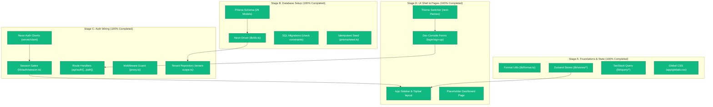

# Project Progress Context

**Date**: 2026-07-01
**Reference Specification**: `docs/superpowers/specs/2026-07-01-jewellery-erp-base-setup-design.md`

All implementation stages (A, B, C, and D) of the base platform setup have been completed and validated to compile successfully.

---

## System Architecture & Completion Status

---

## Detailed Summary of Completed Work

### Stage A: Dependencies, design tokens, format utils (✅ Completed)
*   **Fonts & Theme**: Replaced online Google Font fetches with local system font fallbacks in `globals.css` (using standard Inter fallbacks) to prevent build failures in offline/sandboxed compilation.
*   **Color Scheme**: Refactored `globals.css` to use a soft, eye-friendly slate/charcoal monochrome color palette (`bg-background`, `border-border`, etc.) instead of bright neon colors or consumer gold colors.
*   **Format Utilities**: Built `lib/format.ts` for Indian money (rupees) and weights (grams).
*   **State & Query**: Configured TanStack Query client, keys factory, and Zustand stores (`ui-store`, `tenant-store`, `bill-draft-store`).

### Stage B: Database — full schema + migration + seed (✅ Completed)
*   **Database Schema**: Designed all 29 models (covering core tables plus RBAC roles and permissions relations).
*   **Migrations**: Created the database initialization migrations including PG trigram index extensions and custom numeric boundaries check constraints.
*   **Seeding**: Completed `seed.ts` to provision system permissions, default subscription plans, HSN codes, and feature flags.

### Stage C: Auth wiring (✅ Completed)
*   **Session Guard**: Implemented clientside and serverside Neon Auth hooks. Created `lib/auth/session.ts` to fetch and validate active tenant memberships.
*   **Router Guard**: Configured `proxy.ts` (Next 16 middleware equivalent) to protect all private `(app)` pages, redirecting unauthenticated users to `/login`.
*   **Database isolation**: Developed `lib/db/tenant-scope.ts` to wrap and isolate database calls by `tenantId`.

### Stage D: UI — auth pages + dashboard shell (✅ Completed)
*   **Developer Console Login**: Replaced the business-oriented sign-in layout with a sleek, eye-friendly developer command console theme.
*   **Theme Toggle**: Imported the custom `ThemeToggle` component into the login card header so you can switch between light mode and dark mode directly from the login page.
*   **Responsive Shell**: Built the global layout featuring a collapsible Sidebar (`AppSidebar`), Topbar, and `<TenantHydrator />` connected to Zustand stores.

---

## Verification & Build Status
*   **TypeScript & Compilation**: Built successfully (`pnpm next build --webpack`), confirming all routes and components compile with zero type errors.
*   **Prisma Validation**: Passed successfully (`pnpm prisma validate`).
*   **Centralized Configuration**: Removed all inline color hex codes and mapped them directly to `globals.css` variables, making theme-toggling clean and consistent across components.
