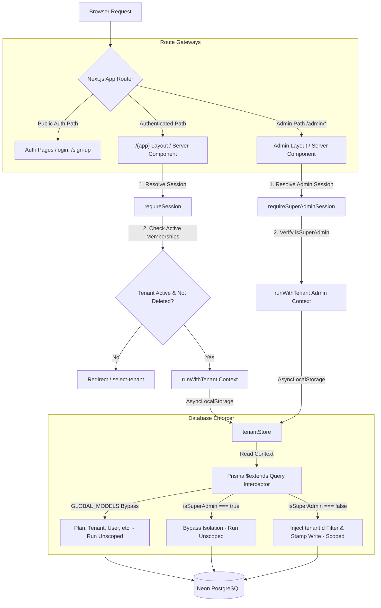

# Multi-Tenancy Architecture Guide

This guide explains the multi-tenancy model, request lifecycle, tenant isolation, deactivation hooks, and admin override operations implemented in the Jewellery ERP.

---

## 1. Tenancy Architecture Diagram

Below is the request-to-database flow showing how tenant context is resolved, bound, and enforced at the database layer:




---

## 2. Core Concepts

### A. Single-Database Shared-Schema Model
The ERP uses a **logical isolation** architecture where all tenants share the same PostgreSQL database and tables. 
- Scoped tables (e.g., `Invoice`, `Customer`, `Product`) contain a mandatory `tenantId` column.
- The database connection pool is handled serverless-style via `@neondatabase/serverless` and `@prisma/adapter-neon`.

### B. Query Interceptor & Context Propagation (`lib/db.ts`)
Isolation is enforced at the Prisma level using a query extension. It intercepts all operations:
1. **Reads** (`findMany`, `findFirst`, etc.): Automatically appends `where: { tenantId }` filters to query criteria.
2. **Writes** (`create`, `createMany`, `upsert`): Stamped with the active request's `tenantId`.
3. **Mismatches**: Mismatched or spoofed `tenantId` parameters passed by client actions are rejected with a hard error.
4. **Bypasses**:
   - **Global Models**: Core tables like `Plan`, `Permission`, `HsnCode`, `Tenant`, `User`, `UserTenantMembership`, `Role`, `UserRole`, `FeatureFlag`, and `AuditLog` are registered under `GLOBAL_MODELS` and bypass filter injections.
   - **Super Admin**: Database queries run inside a context where `isSuperAdmin` is `true` bypass tenant filters entirely, enabling global queries.

---

## 3. How to Set Up a Super Admin

Super Admins bypass tenant boundaries, enabling access to the Control Panel (`/admin`) and global database modifications.

To grant Super Admin privileges to a user account, run the following SQL statement in your Neon SQL Editor:

```sql
UPDATE "users" 
SET is_super_admin = true 
WHERE email = 'admin@yourdomain.com';
```

When this user signs in:
1. `requireSession()` resolves their session and retrieves `isSuperAdmin: true`.
2. The UI dropdown in the Topbar displays the **Admin Portal** link.
3. Accessing `/admin/*` routes will pass the `requireSuperAdminSession()` guard.

---

## 4. How to Onboard/Create a Business

The platform supports three distinct ways to onboard a new business tenant:

### A. Self-Service Signup (Public)
Any user visiting `/sign-up` can register their own account and create a business:
1. User inputs name, email, password, and business name.
2. Neon Auth registers the credentials.
3. The server action calls `onboardBusiness` in a database transaction, which:
   - Upserts the local `User` projection.
   - Creates a `Tenant` record and default `BusinessSetting`.
   - Seeds the 5 system Roles (`Business Owner`, `Manager`, `Cashier`, `Inventory Manager`, `Accountant`) and maps permissions.
   - Creates a `UserTenantMembership` and assigns the `Business Owner` role to the signup user.

### B. Administrative Provisioning (Admin Portal)
A Super Admin can register a business for someone else:
1. Go to `/admin/businesses/new`.
2. Enter the **Business Name**, **Owner Name**, **Owner Email**, and **Password** (or click *Generate Password*).
3. Clicking *Create & Launch Store* executes a server action:
   - Registers the credentials in Neon Auth via a direct server-to-server POST fetch to `${NEON_AUTH_BASE_URL}/sign-up/email`. (This creates the credentials securely without overwriting the admin's own session cookies).
   - Resolves the returned `authUserId` and invokes the database onboarding transaction (`onboardBusiness`).

### C. Developer Provisioning Script (CLI)
For debugging or local development seeding, developers can run the onboarding script directly:

```bash
# 1. Edit the config object at the top of scripts/create-business.ts with target values
# 2. Execute:
npx tsx scripts/create-business.ts
```

---

## 5. Tenant Deactivation & Cache Invalidation

Super Admins can deactivate a tenant from the business details panel (`/admin/businesses/[id]`). 

### How it Works Under the Hood:
1. **Deactivation Toggle**: The Super Admin clicks "Deactivate Business" on the management page, which sends a `PATCH` request setting `isActive` to `false` on the tenant record.
2. **Database Level**:
   - `Tenant.isActive` is set to `false`.
   - An `AuditLog` record is written to track the update action.
3. **Session Interception**:
   `requireSession` checks that the user's active tenant is active:
   ```typescript
   const memberships = await prisma.userTenantMembership.findMany({
     where: { 
       userId: user.id, 
       isActive: true,
       tenant: {
         isActive: true,
         deletedAt: null
       }
     }
   });
   ```
   Since the tenant is now inactive, the memberships query returns 0 rows. The server immediately redirects the user to `/select-tenant` or blocks access.
4. **Real-time Eviction via Cache Tags**:
   Next.js layout data queries are cached for performance and tagged with `tenant-[id]`. To prevent deactivated users from accessing cached routes, the deactivation handler triggers:
   ```typescript
   revalidateTag(`tenant-${tenantId}`);
   ```
   This clears the Next.js cache tag instantly. The very next route request or API request fetches fresh tenant status from the database, encounters the deactivation, and kicks the deactivated users out of the application.
