# 01 — Product Requirements Document

> **Product:** Jewellery ERP SaaS Platform
> **Document Owner:** Product Engineering
> **Status:** Baseline (Phase 1)
> **Last Updated:** 2026-07-01
> **Audience:** Product, Engineering, QA, Design, Founders

---

## Table of Contents

1. [Executive Summary](#1-executive-summary)
2. [Product Vision](#2-product-vision)
3. [Business Objectives & Success Metrics](#3-business-objectives--success-metrics)
4. [Scope](#4-scope)
5. [Assumptions & Constraints](#5-assumptions--constraints)
6. [Personas & Actors](#6-personas--actors)
7. [Multi-Tenant SaaS Model](#7-multi-tenant-saas-model)
8. [Subscription & Plan Concept](#8-subscription--plan-concept)
9. [Tenant Lifecycle Overview](#9-tenant-lifecycle-overview)
10. [Module Catalogue](#10-module-catalogue)
11. [Key User Flows](#11-key-user-flows)
12. [Sequence Diagrams](#12-sequence-diagrams)
13. [Global Acceptance Criteria](#13-global-acceptance-criteria)
14. [Non-Functional Requirements](#14-non-functional-requirements)
15. [Glossary of Indian Jewellery Terms](#15-glossary-of-indian-jewellery-terms)
16. [Future Enhancements](#16-future-enhancements)
17. [References](#17-references)

---

## 1. Executive Summary

The **Jewellery ERP SaaS Platform** is a cloud-native, multi-tenant Software-as-a-Service product purpose-built for the **Indian jewellery retail and wholesale industry**. It replaces the fragmented ecosystem of paper ledgers, spreadsheets, and single-machine desktop billing software with a unified, secure, web-first platform that manages the full operational lifecycle of a jewellery business: billing, GST-compliant invoicing, weight-based inventory, customer and supplier ledgers, employee access control, reporting, and analytics.

A **single deployment serves thousands of independent jewellery businesses (tenants)** with complete data isolation. Each tenant operates as if it owns a dedicated system, while a central **Super Admin** governs the entire platform — provisioning tenants, managing subscription plans, monitoring health, and enforcing platform-wide policy.

**Phase 1** delivers the **Next.js web application** only. All backend capabilities are exposed through **Next.js Route Handlers and Server Actions** within a single repository — there is no separate API server. The API surface is designed to be **client-agnostic and forward-compatible with a future Android application**, but the Android implementation is explicitly out of scope for Phase 1.

The platform is engineered around four non-negotiable principles: **single repository**, **multi-tenancy from day one**, **permission-based RBAC** (never hardcoded role logic), and **production-grade security, observability, and scalability**.

This document is the authoritative product specification. It defines *what* the product does and *why*. Companion documents define *how*:

- [System Architecture](02-System-Architecture.md)
- [Database Design](03-Database-Design.md)
- [Authentication & Security](04-Authentication-Security.md)
- [Multi-Tenancy](05-Multi-Tenancy.md)
- [RBAC & Permissions](06-RBAC-Permissions.md)
- [Frontend Specification](07-Frontend-Specification.md)
- [Backend & API Specification](08-Backend-API-Specification.md)
- [Billing Engine](09-Billing-Engine.md)
- [Inventory Management](10-Inventory-Management.md)
- [Development Roadmap](11-Development-Roadmap.md)
- [Coding Standards](12-Coding-Standards.md)

---

## 2. Product Vision

> **"Give every Indian jewellery business — from a single-counter family shop to a multi-branch retailer — an enterprise-grade, GST-ready, cloud operating system that is as trustworthy as their vault and as simple as their ledger."**

### 2.1 The Problem

The Indian jewellery sector (estimated at over ₹5 lakh crore annually) is largely digitised through:

- **Manual ledgers (bahi-khata)** — error-prone, non-auditable, lost to fire/theft.
- **Legacy single-PC desktop software** — no backups, no multi-user, no remote access, expensive AMC.
- **Generic billing apps** — no understanding of karat, purity, wastage, making charges, gold rate volatility, or hallmark/HSN compliance.
- **Spreadsheets** — no data isolation, no audit trail, no GST engine.

Jewellery billing is fundamentally different from retail billing: prices are computed from **live metal rates × net weight × purity**, plus **making charges** and **wastage**, minus **old-gold exchange**, with **GST** applied at jewellery-specific slabs and **HSN codes**. No mainstream SaaS handles this natively for India.

### 2.2 The Solution

A domain-specific, multi-tenant ERP delivered as a subscription SaaS that:

- Understands jewellery economics natively (karat, purity, wastage, making charges, hallmarking, HSN, GST).
- Is **cloud-native** — accessible from any browser, auto-backed-up, always current.
- Is **multi-tenant** — one platform, thousands of isolated businesses, one Super Admin.
- Is **compliance-first** — GST invoices, HSN codes, hallmark capture, audit logs.
- Is **role-secure** — fine-grained, permission-based access for owners, managers, cashiers, inventory managers, and accountants.

### 2.3 Product Pillars

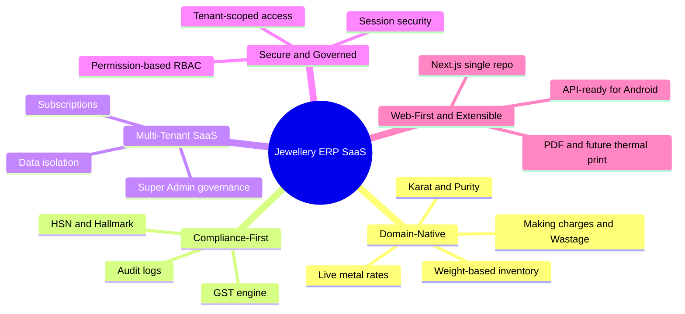

---

## 3. Business Objectives & Success Metrics

| # | Objective | Key Result / Metric (Phase 1 target) |
|---|-----------|--------------------------------------|
| BO-1 | Enable a jewellery business to go live quickly | Median tenant onboarding (signup → first invoice) **< 30 minutes** |
| BO-2 | Eliminate manual billing errors | **100%** of invoices computed by the Billing Engine; zero manual price arithmetic |
| BO-3 | Guarantee GST compliance | **100%** of tax invoices carry valid HSN, GSTIN, and correct CGST/SGST/IGST split |
| BO-4 | Guarantee tenant data isolation | **Zero** cross-tenant data leakage incidents |
| BO-5 | Support multi-user businesses securely | Every action authorised via **permission checks**; full audit trail coverage |
| BO-6 | Provide operational visibility | Owners can view daily sales, stock value, and outstanding dues on a live dashboard |
| BO-7 | Sustain a scalable SaaS business | Support **1,000+ active tenants** on shared infrastructure with p95 API latency **< 500 ms** |
| BO-8 | Minimise data loss risk | Automated DB backups; **RPO ≤ 24h**, **RTO ≤ 4h** |

---

## 4. Scope

### 4.1 In Scope (Phase 1)

| Area | In Scope |
|------|----------|
| Platform | Next.js (App Router) web application, single repository |
| Backend | Next.js Route Handlers + Server Actions (no separate API server) |
| Tenancy | Multi-tenant, shared PostgreSQL, tenant-aware app logic, complete isolation |
| Auth | Neon Auth (email/password, session management) |
| Authorization | Permission-based RBAC with 6 actor roles |
| Modules | Authentication, Super Admin Dashboard, Business Management, Subscription Management, User Management, Business Settings, Customer Management, Supplier Management, Inventory Management, Billing Engine, Invoice Templates, GST, Reports, Notifications, Audit Logs, Dashboard Analytics |
| Billing | GST-compliant jewellery invoices, weight/purity/making/wastage calculations, old-gold exchange |
| Invoices | Configurable invoice templates, PDF generation |
| Storage | Cloudflare R2 for documents/images/PDFs |
| Reporting | Sales, inventory, GST, customer/supplier ledger reports; Recharts dashboards |
| API design | Client-agnostic contracts, designed to support a future Android client |

### 4.2 Out of Scope (Phase 1)

| Excluded | Rationale / Deferred To |
|----------|-------------------------|
| **Android application implementation** | APIs are designed for it; the native app is a later phase |
| **AI features** (recommendations, forecasting, chat) | Post-core-stability phase |
| **Tally / accounting software integrations** | Requires stable core + export layer first |
| **Payment gateway implementation** (online collection) | Modeled in data, not integrated in Phase 1 |
| **Manufacturing / karigar job-work module** | Distinct domain; later phase |
| **Thermal printer hardware integration** | PDF now; thermal support later |
| **Native mobile offline mode** | Web-first; offline is a mobile concern |

### 4.3 Scope Diagram

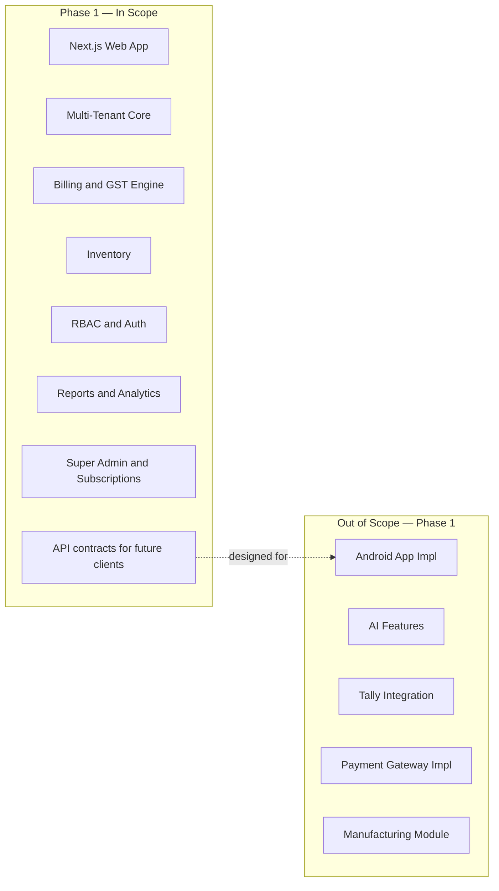

---

## 5. Assumptions & Constraints

### 5.1 Assumptions

- Tenants are **India-based** jewellery businesses transacting in **INR (₹)** and subject to **Indian GST**.
- Each tenant business has **one GSTIN per business entity** in Phase 1 (multi-GSTIN/multi-state deferred).
- Metal rates (gold/silver/platinum) are **entered/maintained per tenant** (manual or admin-set); live external rate feeds are a future enhancement.
- Users have **modern browsers** and **reliable internet**; the app is **online-first** (no offline mode in Phase 1).
- **Neon Auth** is the identity provider; the platform does not build its own password store.
- **Neon PostgreSQL** is the single shared database; isolation is enforced at the **application layer** via `tenantId` scoping (see [Multi-Tenancy](05-Multi-Tenancy.md)).
- Every business entity row carries a **`tenantId`**; the Super Admin is the only actor operating **above** tenant scope.

### 5.2 Constraints

| Constraint | Description |
|------------|-------------|
| Single repository | One Next.js project; no NestJS/Express/separate API server |
| Serverless deploy | Vercel serverless/edge runtime; stateless request handling |
| Shared DB | Single Neon PostgreSQL cluster; connection pooling required |
| Permission-based RBAC | No hardcoded `if role === 'X'` authorization; all checks against permissions |
| Currency | INR only in Phase 1 |
| Compliance | Indian GST rules; HSN codes; BIS hallmark capture |

---

## 6. Personas & Actors

The platform defines **six actors**. One (**Super Admin**) is a **platform operator** above tenant scope. The other five are **tenant users** whose access is governed by permission-based RBAC (see [RBAC & Permissions](06-RBAC-Permissions.md)).

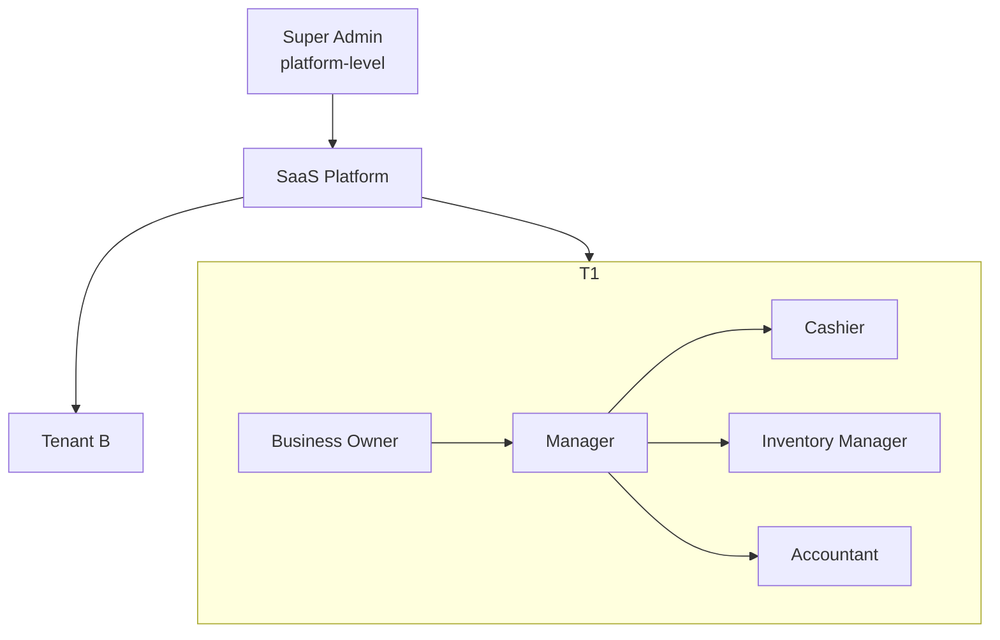

### 6.1 Persona Summary

| Persona | Scope | Primary Goal | Technical Savvy |
|---------|-------|--------------|-----------------|
| Super Admin | Platform | Operate the SaaS; govern tenants & plans | High |
| Business Owner | Tenant | Run and grow the jewellery business | Medium |
| Manager | Tenant | Oversee daily operations & staff | Medium |
| Cashier | Tenant | Bill customers fast and correctly | Low–Medium |
| Inventory Manager | Tenant | Keep stock accurate by weight & purity | Low–Medium |
| Accountant | Tenant | Ensure GST, ledgers, and reports are correct | Medium–High |

### 6.2 Super Admin

| Attribute | Detail |
|-----------|--------|
| **Scope** | Platform-wide (cross-tenant), operates above `tenantId` |
| **Responsibilities** | Provision/suspend/delete tenants; manage subscription plans & feature flags; monitor platform health & usage; handle billing/dunning; enforce policy; view platform analytics |
| **Permissions summary** | Full platform administration; **cannot** silently read tenant business content beyond what governance/audit permits (see restrictions) |
| **Key workflows** | Onboard a business, change a tenant plan, suspend for non-payment, view platform KPIs |
| **Restrictions** | Not a tenant user; **must not** create/edit invoices or inventory inside a tenant; sensitive tenant-data access is logged in [Audit Logs](#1015-audit-logs) |

### 6.3 Business Owner

| Attribute | Detail |
|-----------|--------|
| **Scope** | Single tenant (owner of the business) |
| **Responsibilities** | Configure business settings; invite/manage users & roles; manage subscription for their tenant; oversee all modules; view all reports |
| **Permissions summary** | Highest tenant-level permission set (effectively all tenant permissions), including User Management and Business Settings |
| **Key workflows** | Complete onboarding, add staff, set metal rates & tax config, review analytics |
| **Restrictions** | Cannot access other tenants; cannot perform Super Admin actions; bound by subscription plan limits |

### 6.4 Manager

| Attribute | Detail |
|-----------|--------|
| **Scope** | Single tenant |
| **Responsibilities** | Supervise daily operations; manage customers, suppliers, inventory, billing; oversee cashiers; run operational reports |
| **Permissions summary** | Broad operational permissions; typically **no** subscription/billing-plan control and limited user administration (as granted by Owner) |
| **Key workflows** | Approve discounts, resolve billing issues, monitor stock, run day-end reports |
| **Restrictions** | Cannot change subscription plan; cannot modify Business Owner account; role/permission edits limited to what Owner grants |

### 6.5 Cashier

| Attribute | Detail |
|-----------|--------|
| **Scope** | Single tenant, front-desk |
| **Responsibilities** | Create invoices; capture customers; take payments; handle old-gold exchange at billing; print/share invoices |
| **Permissions summary** | Billing create/read; customer create/read; limited inventory read; **no** settings, users, reports (unless granted) |
| **Key workflows** | Create GST invoice, apply making charges, record payment, print PDF |
| **Restrictions** | Cannot delete finalised invoices; cannot edit inventory master; cannot view profit/cost data or full reports; discounts above threshold require Manager approval |

### 6.6 Inventory Manager

| Attribute | Detail |
|-----------|--------|
| **Scope** | Single tenant, stock operations |
| **Responsibilities** | Add/edit inventory items; manage weight-based stock, purity, HSN, hallmark; receive supplier stock; run stock audits |
| **Permissions summary** | Full inventory CRUD; supplier read/create; **no** billing finalization, no settings, no user admin |
| **Key workflows** | Add item with weight & purity, receive stock from supplier, perform physical stock audit |
| **Restrictions** | Cannot create customer invoices; cannot change tax/business settings; cannot manage users |

### 6.7 Accountant

| Attribute | Detail |
|-----------|--------|
| **Scope** | Single tenant, finance |
| **Responsibilities** | Verify GST correctness; manage customer/supplier ledgers & payments; reconcile invoices; generate GST & financial reports |
| **Permissions summary** | Read across billing/inventory/customers/suppliers; full reports & GST; payment/ledger management; **no** inventory master edits or user admin |
| **Key workflows** | GST report generation, ledger reconciliation, outstanding dues follow-up |
| **Restrictions** | Cannot alter finalised invoice line items (only permitted adjustments/credit notes); cannot manage users or subscription |

### 6.8 Consolidated Permissions Matrix (Indicative)

> The matrix below is a **product-level default**. Actual grants are data-driven via [RBAC & Permissions](06-RBAC-Permissions.md); nothing is hardcoded to a role name.

| Capability | Super Admin | Owner | Manager | Cashier | Inventory Mgr | Accountant |
|------------|:-----------:|:-----:|:-------:|:-------:|:-------------:|:----------:|
| Manage tenants/plans (platform) | ✅ | ❌ | ❌ | ❌ | ❌ | ❌ |
| Business settings | ❌ | ✅ | ⚠️ | ❌ | ❌ | ❌ |
| User & role management | ❌ | ✅ | ⚠️ | ❌ | ❌ | ❌ |
| Subscription (tenant) | ❌ | ✅ | ❌ | ❌ | ❌ | ❌ |
| Create invoice | ❌ | ✅ | ✅ | ✅ | ❌ | ❌ |
| Void/credit note | ❌ | ✅ | ✅ | ❌ | ❌ | ⚠️ |
| Inventory CRUD | ❌ | ✅ | ✅ | ❌ | ✅ | ❌ |
| Customer CRUD | ❌ | ✅ | ✅ | ⚠️ | ❌ | ⚠️ |
| Supplier CRUD | ❌ | ✅ | ✅ | ❌ | ⚠️ | ⚠️ |
| GST & financial reports | ❌ | ✅ | ✅ | ❌ | ❌ | ✅ |
| Dashboard analytics | ❌ | ✅ | ✅ | ⚠️ | ⚠️ | ✅ |
| Audit logs (tenant) | ❌ | ✅ | ⚠️ | ❌ | ❌ | ⚠️ |

**Legend:** ✅ default allow · ⚠️ conditional/partial (grantable) · ❌ default deny

---

## 7. Multi-Tenant SaaS Model

The platform is **multi-tenant from day one**: one application instance and one shared PostgreSQL database serve many independent businesses, each fully isolated.

### 7.1 Model Overview

- **Shared database, shared schema** with a mandatory **`tenantId`** on every business entity.
- **Application-enforced isolation:** every query is scoped by the authenticated user's `tenantId`; there is no unscoped access path for tenant users.
- **Super Admin** operates above tenant scope for governance only.
- **Feature flags & plan limits** are evaluated per tenant based on the active subscription.

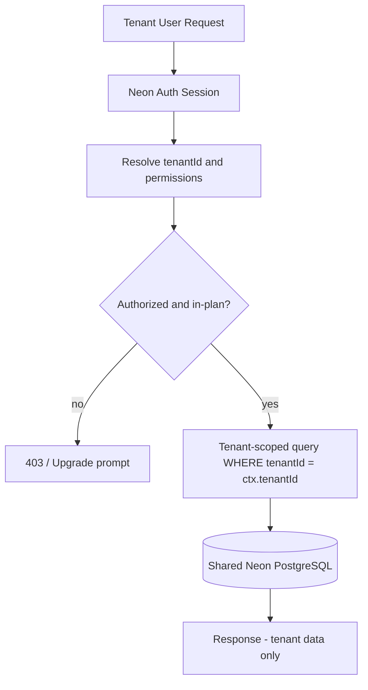

Detailed isolation strategy, connection pooling, and safeguards are specified in [Multi-Tenancy](05-Multi-Tenancy.md) and [Database Design](03-Database-Design.md).

### 7.2 Tenant Isolation Guarantees

| Guarantee | Mechanism |
|-----------|-----------|
| No cross-tenant reads | Every repository/query filters by `tenantId` from session context |
| No cross-tenant writes | `tenantId` injected server-side, never trusted from client input |
| Isolated storage | R2 object keys namespaced by tenant (e.g., `tenants/{tenantId}/...`) |
| Isolated audit | Audit log entries carry `tenantId`; tenant users see only their own |
| Plan enforcement | Middleware checks plan limits/feature flags per tenant |

---

## 8. Subscription & Plan Concept

Each tenant is associated with a **subscription** to a **plan**. Plans define **feature access** (feature flags) and **quantitative limits** (users, invoices/month, storage, etc.). See [Multi-Tenancy](05-Multi-Tenancy.md) and [Business Management](#102-business-management) / [Subscription Management](#104-subscription-management).

### 8.1 Illustrative Plans

| Plan | Users | Invoices/mo | Inventory items | Reports | Support | Notes |
|------|:-----:|:-----------:|:---------------:|---------|---------|-------|
| **Trial** | 2 | 50 | 100 | Basic | Community | Time-boxed (e.g., 14 days) |
| **Starter** | 3 | 500 | 1,000 | Standard | Email | Single branch |
| **Growth** | 10 | 5,000 | 10,000 | Advanced + GST | Priority | Multi-user |
| **Enterprise** | Custom | Custom | Custom | Full + exports | Dedicated | Negotiated |

> Exact plan definitions are configuration, not code — the Super Admin can create/adjust plans.

### 8.2 Subscription States

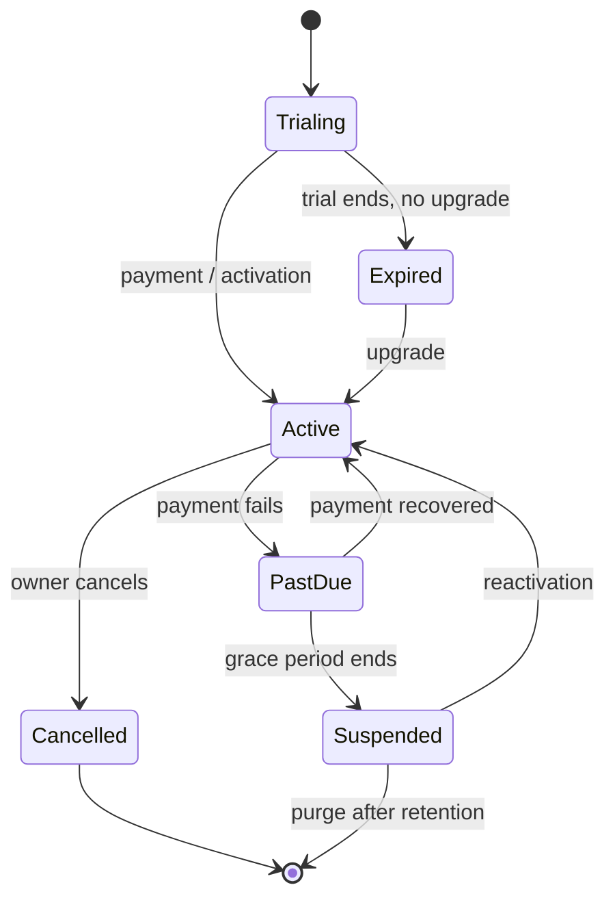

---

## 9. Tenant Lifecycle Overview

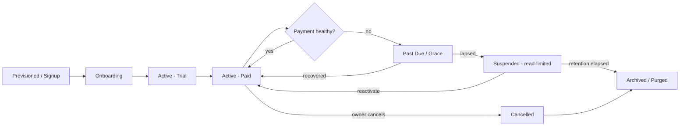

| Stage | Description | Key Actor |
|-------|-------------|-----------|
| Provisioned | Tenant record created (self-signup or Super Admin) | Super Admin / System |
| Onboarding | Business profile, settings, first user configured | Business Owner |
| Active–Trial | Full functionality within trial limits | Business Owner |
| Active–Paid | Subscription active within plan limits | Business Owner |
| Past Due / Grace | Payment failure; limited grace window | System / Super Admin |
| Suspended | Access restricted (often read-only) pending resolution | Super Admin |
| Cancelled | Owner-initiated termination | Business Owner |
| Archived / Purged | Data retained per policy, then purged | System |

---

## 10. Module Catalogue

Each module below follows a consistent structure: **Purpose · Features · Business Rules · UI Requirements · Backend Logic · API Requirements · Database Requirements · Acceptance Criteria · Edge Cases.** Backend items are implemented as **Route Handlers / Server Actions** (see [Backend & API Specification](08-Backend-API-Specification.md)); every data operation is **tenant-scoped** and **permission-checked**.

---

### 10.1 Authentication

**Purpose:** Securely authenticate users and establish a session carrying identity, `tenantId`, and permissions.

**Features:** Email/password sign-in via Neon Auth; session management; password reset; invite-based account activation; sign-out; session expiry/refresh.

**Business Rules:**
- A user belongs to exactly one tenant (Phase 1); Super Admin is platform-scoped.
- Authentication establishes **who**; authorization (RBAC) establishes **what** (see [RBAC](06-RBAC-Permissions.md)).
- Suspended tenants block user login (except Owner-limited flows per policy).

**UI Requirements:** Login page, forgot/reset-password, invite acceptance, session-expiry redirect, error/toast states.

**Backend Logic:** Delegate credential verification to Neon Auth; on success resolve `tenantId`, role, and effective permissions into a server-side session/context; guard all handlers.

**API Requirements:** Auth callback/route handlers; session introspection; sign-out; password-reset request/confirm. Contracts client-agnostic (future Android).

**Database Requirements:** `User` (linked to Neon Auth identity, `tenantId`, `role`/permission assignment), session references as required by Neon Auth. See [Database Design](03-Database-Design.md).

**Acceptance Criteria:**
- ✅ Valid credentials → authenticated session with correct `tenantId` and permissions.
- ✅ Invalid credentials → generic error, no user enumeration.
- ✅ Expired session → redirect to login; protected routes inaccessible.
- ✅ Password reset works end-to-end via secure token.

**Edge Cases:** Concurrent sessions; reset token reuse/expiry; login attempt on suspended tenant; invited-but-inactive user; email case-sensitivity.

---

### 10.2 Super Admin Dashboard

**Purpose:** Give platform operators central control and visibility over all tenants, plans, and platform health.

**Features:** Tenant list/search/filter; provision/suspend/reactivate/delete tenant; assign/change plan; view platform KPIs (tenants, MRR-proxy, active users, usage); impersonation-for-support (audited) if enabled; feature-flag management.

**Business Rules:**
- Only Super Admin can access; strictly above tenant scope.
- Destructive actions (suspend/delete) require confirmation and are audited.
- Support impersonation, if used, is time-boxed and logged.

**UI Requirements:** Tenant table with status badges; tenant detail drawer; plan assignment modal; platform analytics with Recharts; audit trail view.

**Backend Logic:** Cross-tenant admin handlers (guarded by Super Admin permission); aggregation queries for KPIs; lifecycle state transitions.

**API Requirements:** Admin tenant CRUD; plan assignment; platform metrics; feature-flag toggles.

**Database Requirements:** `Tenant`, `Plan`, `Subscription`, `FeatureFlag`, `AuditLog` (platform-scoped entries).

**Acceptance Criteria:**
- ✅ Super Admin sees all tenants; tenant users never see this area.
- ✅ Plan change reflects immediately in target tenant's limits/flags.
- ✅ Every suspend/delete/impersonate action produces an audit entry.

**Edge Cases:** Deleting a tenant with active data (soft-delete + retention); suspending during an in-flight invoice; concurrent admin edits; last Super Admin protection.

---

### 10.3 Business Management

**Purpose:** Represent and manage each tenant business entity and its profile.

**Features:** Create/edit business profile (legal name, trade name, address, GSTIN, PAN, contact, logo); branch metadata (single branch Phase 1); business status.

**Business Rules:**
- GSTIN format validated; PAN format validated.
- One primary business profile per tenant (Phase 1).
- Logo stored in R2 under tenant namespace.

**UI Requirements:** Business profile form; logo upload with preview; validation feedback.

**Backend Logic:** Tenant-scoped profile CRUD; file upload to R2; format validators.

**API Requirements:** Business profile read/update; logo upload (signed URL/handler).

**Database Requirements:** `Business`/`Tenant` profile fields, `GSTIN`, `PAN`, logo object key.

**Acceptance Criteria:**
- ✅ Owner can update profile; changes persist and appear on invoices.
- ✅ Invalid GSTIN/PAN rejected with clear messages.

**Edge Cases:** GSTIN change after invoices issued (historical invoices immutable); missing logo fallback; oversized logo upload.

---

### 10.4 Subscription Management

**Purpose:** Manage the tenant's plan, limits, feature access, and billing state (payment gateway impl out of scope).

**Features:** View current plan & usage; upgrade/downgrade (request); trial countdown; limit/quota indicators; invoice history for the subscription (platform billing); reactivation.

**Business Rules:**
- Enforce plan **limits** (users, invoices/month, items, storage) and **feature flags** at request time.
- Downgrade blocked if current usage exceeds target plan limits until reduced.
- Trial expiry transitions tenant per [subscription states](#82-subscription-states).
- Payment collection is **modeled but not integrated** in Phase 1.

**UI Requirements:** Plan card with usage meters; upgrade/downgrade flow; limit-reached prompts; billing history table.

**Backend Logic:** Plan resolution; quota computation; feature-flag evaluation middleware; state transitions.

**API Requirements:** Get subscription/usage; request plan change; feature-flag check endpoint.

**Database Requirements:** `Subscription`, `Plan`, `UsageCounter`, `FeatureFlag`.

**Acceptance Criteria:**
- ✅ Exceeding a hard limit blocks the action with an upgrade prompt.
- ✅ Feature not in plan is hidden/disabled and server-enforced.
- ✅ Trial expiry restricts access per policy.

**Edge Cases:** Usage spikes at boundary; mid-cycle plan change proration (deferred); clock/timezone for trial expiry; downgrade with over-limit data.

---

### 10.5 User Management

**Purpose:** Let a tenant manage its users and their role/permission assignments.

**Features:** Invite user by email; assign role/permission set; edit/deactivate/reactivate user; resend invite; view user list & last activity.

**Business Rules:**
- Bound by plan **user limit**.
- Permission-based assignment (roles are grouped permission sets), never hardcoded.
- At least one active Owner must remain per tenant.
- Only users with User-Management permission can manage users.

**UI Requirements:** User table; invite modal; role/permission selector; status toggles.

**Backend Logic:** Invite issuance (Neon Auth); assignment persistence; guard against removing last Owner; enforce user-count limit.

**API Requirements:** User CRUD; invite; role/permission assignment.

**Database Requirements:** `User`, `Role`, `Permission`, `UserRole`/assignment tables (see [RBAC](06-RBAC-Permissions.md)).

**Acceptance Criteria:**
- ✅ Invited user activates and receives correct permissions.
- ✅ Cannot exceed plan user limit.
- ✅ Cannot remove/deactivate the last Owner.

**Edge Cases:** Re-inviting an existing email; deactivating a user mid-session (session invalidation); permission change taking effect on next request; duplicate invites.

---

### 10.6 Business Settings

**Purpose:** Configure tenant-wide operational parameters used across modules.

**Features:** Metal rates (gold/silver/platinum by purity); default making-charge rules (% or flat, per-gram); default wastage %; GST/tax config (HSN defaults, tax slabs); invoice numbering scheme & prefix; currency/locale (INR); rounding rules; invoice template selection; terms & conditions text.

**Business Rules:**
- Metal rates drive Billing Engine calculations; changes apply to **new** invoices only.
- Invoice numbering must be **sequential and unique per tenant** (and per financial year if configured).
- Rounding applied consistently (e.g., round-off to nearest rupee).

**UI Requirements:** Settings sections (Rates, Charges, Tax, Invoice, Templates); form validation; effective-date note.

**Backend Logic:** Tenant-scoped settings store; validation; provide config to Billing Engine & Invoice generator.

**API Requirements:** Settings read/update; metal-rate update.

**Database Requirements:** `BusinessSettings`, `MetalRate`, `TaxConfig`, `InvoiceSequence`.

**Acceptance Criteria:**
- ✅ Updated metal rate reflects in next invoice's computation.
- ✅ Invoice numbers never duplicate within a tenant.
- ✅ Tax config produces correct GST split on invoices.

**Edge Cases:** Rate change during active billing session; financial-year rollover resetting sequence; concurrent settings edits; invalid tax slab.

---

### 10.7 Customer Management

**Purpose:** Maintain the tenant's customer master and ledger relationships.

**Features:** Create/edit/search customers (name, phone, email, address, GSTIN for B2B); customer ledger (dues/advances); purchase history; old-gold/exchange history; KYC fields where relevant.

**Business Rules:**
- Phone/GSTIN validated; duplicate detection by phone within tenant.
- Customer ledger updates from invoices and payments.
- B2B customers with GSTIN trigger IGST/CGST-SGST logic based on state.

**UI Requirements:** Customer list with search; customer profile with ledger & history tabs; quick-add during billing.

**Backend Logic:** Tenant-scoped CRUD; ledger aggregation; link to invoices/payments.

**API Requirements:** Customer CRUD; search/lookup; ledger read.

**Database Requirements:** `Customer`, `CustomerLedger`/transactions.

**Acceptance Criteria:**
- ✅ Customer creatable inline during invoicing.
- ✅ Ledger balance reflects invoices and payments accurately.

**Edge Cases:** Duplicate phone; customer with outstanding dues; GSTIN state mismatch; merging duplicate customers (deferred).

---

### 10.8 Supplier Management

**Purpose:** Maintain suppliers and inbound stock/purchase relationships.

**Features:** Create/edit/search suppliers; supplier ledger (payables); purchase/receipt history; link received stock to inventory.

**Business Rules:**
- Supplier ledger updates on stock receipt and payments.
- GSTIN captured for input-tax context.

**UI Requirements:** Supplier list; supplier profile with ledger & receipts; link to inventory intake.

**Backend Logic:** Tenant-scoped CRUD; payables aggregation; receipt-to-inventory linkage.

**API Requirements:** Supplier CRUD; ledger read; receipt linkage.

**Database Requirements:** `Supplier`, `SupplierLedger`, purchase/receipt records.

**Acceptance Criteria:**
- ✅ Receiving stock updates inventory and supplier payables.
- ✅ Supplier ledger accurate against receipts/payments.

**Edge Cases:** Partial receipts; returns to supplier; supplier with open payables at deactivation.

---

### 10.9 Inventory Management

**Purpose:** Manage jewellery stock with **weight-based**, purity-aware accounting. See [Inventory Management](10-Inventory-Management.md).

**Features:** Add/edit items (metal type, karat/purity, gross/net/stone weight, making-charge rule, HSN, hallmark/BIS details, tag/SKU, category); barcode/tag support; stock levels by weight & count; stock intake from suppliers; stock audit/physical verification; low-stock alerts; item images (R2).

**Business Rules:**
- Inventory tracked by **weight** (grams) and/or **piece count** depending on item type.
- **Net weight = gross weight − stone/other weight**; purity determines fine-metal content.
- Selling an item **decrements** stock; void/return **restores** it.
- Hallmark/HSN captured for compliance and invoicing.
- Every item carries `tenantId`.

**UI Requirements:** Item list with filters (metal, purity, category); item form with weight fields; image upload; stock-audit screen; low-stock indicators.

**Backend Logic:** Tenant-scoped CRUD; weight math; stock movement ledger; audit reconciliation; alert thresholds.

**API Requirements:** Inventory CRUD; stock movement; audit; image upload.

**Database Requirements:** `InventoryItem`, `StockMovement`, `Category`, `HallmarkInfo`, image keys.

**Acceptance Criteria:**
- ✅ Item creatable with valid weights & purity; net weight computed/validated.
- ✅ Billing an item reduces stock; void restores it.
- ✅ Stock audit records variance and adjusts stock with audit trail.

**Edge Cases:** Negative/zero net weight; over-selling beyond stock; concurrent edits to the same item; unit mismatch (grams vs pieces); item with stones vs pure metal.

---

### 10.10 Billing Engine

**Purpose:** Compute and generate **GST-compliant jewellery invoices** with correct price math. See [Billing Engine](09-Billing-Engine.md).

**Features:** Create invoice with multiple line items; per-line computation (metal value + making + wastage − discounts); old-gold/exchange deduction; GST computation (CGST/SGST/IGST) with HSN; round-off; payment capture (cash/card/UPI/split — modeled, gateway impl out of scope); invoice statuses (draft, finalised, paid, partially paid, void); credit notes/returns.

**Business Rules (core price formula per line):**

```
metal_value   = net_weight_g × rate_per_g(metal, purity)
making_charge = rule(% of metal_value | flat | per_gram × net_weight_g)
wastage_value = (wastage_% / 100) × metal_value        (if applicable)
stone_value   = stone_weight × stone_rate               (if applicable)
line_subtotal = metal_value + making_charge + wastage_value + stone_value
line_taxable  = line_subtotal − line_discount
gst           = line_taxable × gst_rate(HSN)            (split CGST/SGST or IGST)
line_total    = line_taxable + gst
```
```
invoice_taxable  = Σ line_taxable
invoice_gst      = Σ gst
old_gold_credit  = Σ exchanged old-gold value
invoice_total    = round(invoice_taxable + invoice_gst − old_gold_credit)
```

- **Intra-state → CGST + SGST**; **inter-state → IGST** (based on business vs customer state).
- Finalised invoices are **immutable**; corrections via **credit note/return**.
- Invoice number **sequential & unique per tenant**.
- Stock decremented on finalisation; restored on void/return.

**UI Requirements:** Fast billing screen (item search/scan, quantity/weight, live totals), customer quick-add, payment panel, print/share; draft save; discount field with approval gate.

**Backend Logic:** Deterministic calculation service using Business Settings (rates, charges, tax); atomic transaction (invoice + stock movement + ledger update); sequence generation; PDF trigger.

**API Requirements:** Create/finalise/void invoice; get invoice; list invoices; credit note; payment record.

**Database Requirements:** `Invoice`, `InvoiceLineItem`, `Payment`, `StockMovement`, `CustomerLedger`, `InvoiceSequence`.

**Acceptance Criteria:**
- ✅ Totals match the formula to the paise; round-off correct.
- ✅ Correct CGST/SGST vs IGST based on states.
- ✅ Finalising creates immutable invoice, decrements stock, updates ledger — atomically.
- ✅ Sequential unique invoice number generated.
- ✅ Old-gold exchange reduces payable correctly.

**Edge Cases:** Metal rate change mid-invoice; zero-stock item at finalisation; discount beyond permission threshold; partial payment; void after payment; concurrent finalisation racing the sequence; rounding at multiple lines; interstate GSTIN mismatch.

---

### 10.11 Invoice Templates

**Purpose:** Render invoices as branded, compliant PDFs (thermal printing future).

**Features:** Selectable templates; branding (logo, business details, GSTIN); GST breakup section; HSN/hallmark display; terms & signature; A4/receipt layout; PDF export to R2; share/print.

**Business Rules:**
- Template must display all legally required GST invoice fields.
- Historical invoices retain the template/data at time of issue.

**UI Requirements:** Template picker with preview; print/download/share actions.

**Backend Logic:** Server-side PDF generation from finalised invoice data; store in R2; return signed URL.

**API Requirements:** Generate/get invoice PDF; template selection (in settings).

**Database Requirements:** `InvoiceTemplate` config; PDF object key on `Invoice`.

**Acceptance Criteria:**
- ✅ Generated PDF contains all mandatory GST fields, HSN, and hallmark info.
- ✅ PDF stored and retrievable via secure URL.

**Edge Cases:** Very long item lists (pagination); missing logo; multi-page GST breakup; regeneration consistency.

---

### 10.12 GST

**Purpose:** Ensure tax correctness across billing and reporting.

**Features:** HSN-based tax rates; CGST/SGST/IGST computation; GSTIN capture/validation; GST summary per invoice; GST reports (output tax); place-of-supply logic.

**Business Rules:**
- Rate resolved by HSN/product config.
- Intra-state vs inter-state determines split.
- GSTIN format validated; place of supply derived from customer state.

**UI Requirements:** GST breakup on billing & invoice; GST report screens.

**Backend Logic:** Tax resolution service; aggregation for reports; validation utilities.

**API Requirements:** GST computation (internal); GST report endpoints.

**Database Requirements:** `TaxConfig`, `HSNCode`, tax fields on `InvoiceLineItem`/`Invoice`.

**Acceptance Criteria:**
- ✅ Correct rate and split per line and invoice.
- ✅ GST report totals reconcile with issued invoices.

**Edge Cases:** Rate change effective dates; mixed-HSN invoice; exempt/nil-rated items; rounding of tax; interstate B2C large-value rules (deferred nuance).

---

### 10.13 Reports

**Purpose:** Provide operational and financial insight.

**Features:** Sales reports (by day/period/user/item); inventory valuation & movement; GST reports; customer/supplier ledgers & outstanding; profitability (where permitted); export (CSV/PDF).

**Business Rules:**
- Reports strictly tenant-scoped and permission-gated (e.g., cost/profit hidden from Cashier).
- Date-range and filter support.

**UI Requirements:** Report list, filters, tables, charts (Recharts), export buttons.

**Backend Logic:** Aggregation queries; export generation; permission checks per report.

**API Requirements:** Report data endpoints; export endpoints.

**Database Requirements:** Read models/aggregations over core tables; optional materialized summaries.

**Acceptance Criteria:**
- ✅ Report figures reconcile with underlying invoices/stock.
- ✅ Unauthorised report data is inaccessible.

**Edge Cases:** Large date ranges (performance/pagination); timezone boundaries; concurrent data changes during export.

---

### 10.14 Notifications

**Purpose:** Inform users of important events.

**Features:** In-app notifications (low stock, payment due, subscription/trial expiry, invoice shared); email notifications for key events; notification centre; read/unread state.

**Business Rules:**
- Notifications tenant-scoped and permission-aware.
- Subscription/trial alerts target Owner.

**UI Requirements:** Bell/notification centre; toasts; email templates.

**Backend Logic:** Event emitters from modules; notification persistence; email dispatch (provider TBD).

**API Requirements:** List/mark-read notifications; preferences.

**Database Requirements:** `Notification`, `NotificationPreference`.

**Acceptance Criteria:**
- ✅ Low-stock and trial-expiry notifications fire correctly.
- ✅ Users see only their tenant's notifications.

**Edge Cases:** Notification storms (batching); email delivery failure/retry; stale notifications after data deletion.

---

### 10.15 Audit Logs

**Purpose:** Provide a tamper-evident trail of significant actions for security & compliance.

**Features:** Log create/update/delete/void/login/permission-change/plan-change/impersonation; actor, action, entity, before/after (where feasible), timestamp, IP; tenant-scoped viewing; Super Admin platform view.

**Business Rules:**
- Sensitive/destructive actions **must** be logged.
- Audit entries are **append-only** (no user edits/deletes).
- Every entry carries `tenantId` (or platform scope for admin actions).

**UI Requirements:** Audit log table with filters (actor, action, date, entity).

**Backend Logic:** Central audit writer invoked by modules/middleware; immutable store.

**API Requirements:** Query audit logs (tenant & platform scoped).

**Database Requirements:** `AuditLog` (append-only), indexed by tenant/date/entity.

**Acceptance Criteria:**
- ✅ Finalising/voiding an invoice, changing permissions, and plan changes all produce audit entries.
- ✅ Tenant users see only their tenant's audit entries.

**Edge Cases:** High-volume logging (async write); PII in audit payloads (minimisation); clock skew; retention limits.

---

### 10.16 Dashboard Analytics

**Purpose:** Give each role a relevant at-a-glance operational picture.

**Features:** Role-aware widgets — today's sales, invoices count, outstanding dues, stock value, low-stock, top items, GST payable, trial/subscription status; charts via Recharts; date filters.

**Business Rules:**
- Widgets respect permissions (Cashier sees limited set; Owner/Accountant see financials).
- Data strictly tenant-scoped.

**UI Requirements:** Responsive widget grid; charts; drill-down links.

**Backend Logic:** Aggregation endpoints; caching for hot metrics; permission filtering.

**API Requirements:** Dashboard metrics endpoints (role-aware).

**Database Requirements:** Aggregations over core tables; optional cached summaries.

**Acceptance Criteria:**
- ✅ Dashboard loads within performance budget and shows accurate, tenant-scoped data.
- ✅ Role-restricted widgets are hidden and server-enforced.

**Edge Cases:** Empty/new tenant (zero-state); very large datasets; timezone for "today"; cache staleness.

---

## 11. Key User Flows

### 11.1 Onboarding a Business

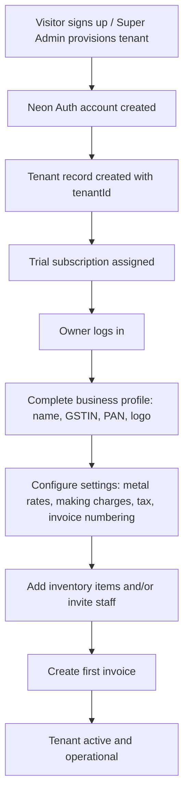

### 11.2 Creating a GST Invoice

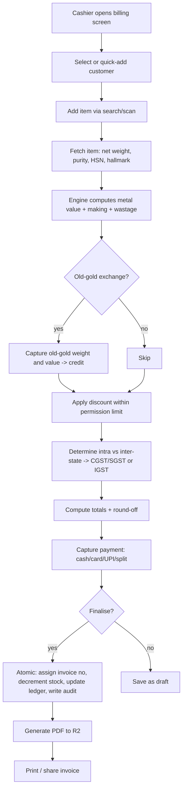

### 11.3 Subscription Lifecycle

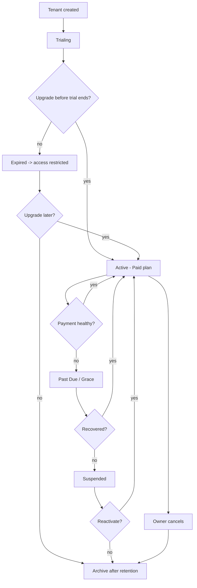

---

## 12. Sequence Diagrams

### 12.1 Login & Session Establishment

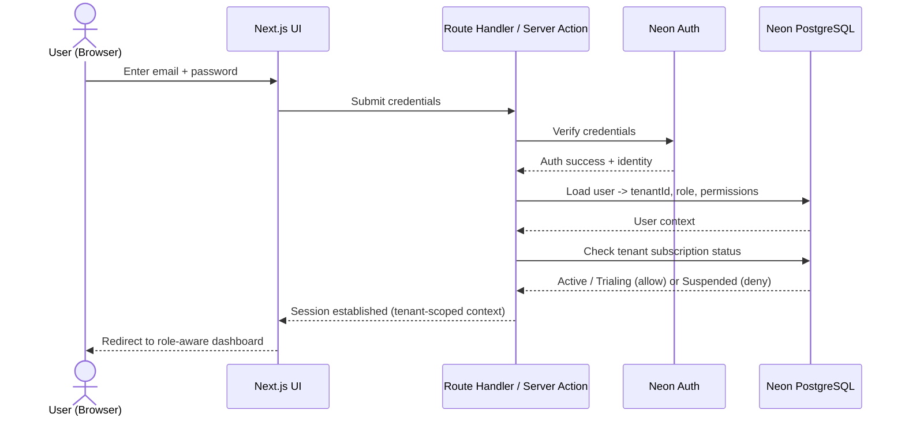

### 12.2 Invoice Creation & Finalisation

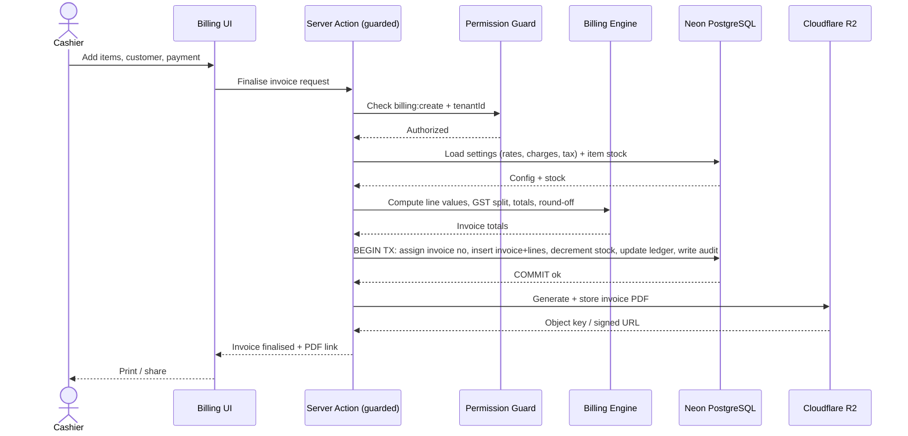

---

## 13. Global Acceptance Criteria

These apply to **every** module and feature.

| # | Global Criterion |
|---|------------------|
| G-1 | **Tenant isolation:** no request returns or mutates data outside the caller's `tenantId` (Super Admin excepted, audited). |
| G-2 | **Permission enforcement:** every mutating and sensitive read operation passes a server-side permission check; UI hiding is never the only control. |
| G-3 | **Plan enforcement:** actions exceeding plan limits/feature flags are blocked server-side with a clear upgrade path. |
| G-4 | **Auditability:** all destructive/sensitive actions produce append-only audit entries with actor, action, entity, timestamp. |
| G-5 | **Data integrity:** invoice + stock + ledger updates are atomic; no partial commits. |
| G-6 | **GST correctness:** every tax invoice has valid GSTIN, HSN, correct CGST/SGST/IGST split, and reconciles in reports. |
| G-7 | **Immutability:** finalised invoices are immutable; corrections via credit note/return only. |
| G-8 | **Validation:** all inputs validated with Zod on the server (and mirrored client-side); invalid input rejected with actionable messages. |
| G-9 | **Consistency of money math:** all monetary computations are deterministic and match specified formulas to the paise. |
| G-10 | **Observability:** errors are logged; key flows are traceable; no silent failures. |
| G-11 | **Accessibility & responsiveness:** core screens are keyboard-navigable and usable on tablet/desktop widths. |
| G-12 | **Security:** no secrets client-side; `tenantId` never trusted from client; least-privilege everywhere. |

---

## 14. Non-Functional Requirements

| Category | Requirement |
|----------|-------------|
| **Performance** | p95 API/action latency < 500 ms under nominal load; billing screen interactions feel instant (< 150 ms client feedback). |
| **Scalability** | Support 1,000+ active tenants on shared Neon PostgreSQL with connection pooling; stateless serverless handlers on Vercel. |
| **Availability** | Target ≥ 99.9% monthly; graceful degradation on dependency failure. |
| **Security** | Neon Auth; permission-based RBAC; tenant isolation; encrypted transport (TLS); secrets in env, never client. See [Authentication & Security](04-Authentication-Security.md). |
| **Data protection** | Automated backups; RPO ≤ 24h, RTO ≤ 4h; R2 objects tenant-namespaced with signed access. |
| **Compliance** | Indian GST invoice rules; HSN; BIS hallmark capture; audit retention. |
| **Reliability** | Atomic transactions for financial operations; idempotent invoice finalisation. |
| **Maintainability** | Single repo; typed end-to-end (TypeScript + Zod + Prisma); conventions per [Coding Standards](12-Coding-Standards.md). |
| **Usability** | Fast billing UX; role-aware dashboards; clear validation. |
| **Observability** | Structured logging, error tracking, key-metric dashboards. |
| **Portability (API)** | Client-agnostic contracts to support future Android client without redesign. |
| **Localization** | INR currency, Indian date/number formats; i18n-ready structure (English Phase 1). |

---

## 15. Glossary of Indian Jewellery Terms

| Term | Definition |
|------|------------|
| **Karat (K / kt)** | Measure of gold purity out of 24. 24K = pure gold; 22K ≈ 91.6% pure; 18K = 75% pure. Determines fine-gold content. |
| **Purity / Fineness** | Fraction of pure precious metal in an item (e.g., 22K gold = 0.916 / 916 fineness). Used to value the metal content. |
| **Gross Weight** | Total weight of the item including metal, stones, and any other components (grams). |
| **Net Weight** | Weight of the precious metal only = gross weight − stone/other weight. Basis for metal valuation. |
| **Stone Weight** | Weight attributable to gemstones/diamonds, deducted from gross to derive net metal weight; may be priced separately. |
| **Making Charges (MC)** | Labour/craftsmanship cost to convert raw metal into jewellery. Charged as % of metal value, flat amount, or per gram. |
| **Wastage** | Metal notionally lost during manufacturing, charged to the customer as a % of metal weight/value (a.k.a. "bhav" adjustment in some contexts). |
| **Metal Rate** | Prevailing price per gram of metal at a given purity (e.g., ₹/g for 22K gold), used to compute metal value. |
| **Old Gold Exchange** | Customer returns old jewellery; its assessed metal value is credited against a new purchase. |
| **HSN Code** | Harmonised System of Nomenclature code classifying goods for GST; jewellery has specific HSN codes driving tax rates. |
| **GST** | Goods and Services Tax. Intra-state = CGST + SGST; inter-state = IGST. Applied on the taxable value of the invoice. |
| **GSTIN** | GST Identification Number — 15-character tax registration ID of a business (and B2B customers). |
| **CGST / SGST / IGST** | Central GST, State GST (intra-state split), and Integrated GST (inter-state). |
| **Hallmark** | Official mark certifying the purity of precious metal jewellery. |
| **BIS** | Bureau of Indian Standards — the body that certifies/hallmarks gold jewellery purity in India (BIS hallmark). |
| **HUID** | Hallmark Unique Identification — a 6-digit alphanumeric ID on BIS-hallmarked jewellery. |
| **Fine Weight** | Pure-metal-equivalent weight = net weight × purity. |
| **Tunch / Touch** | Colloquial term for assayed purity of gold. |
| **Round-off** | Adjustment of the invoice total to the nearest rupee for cash convenience. |
| **Tag / SKU** | Unique identifier/label on a jewellery piece for tracking and billing. |

---

## 16. Future Enhancements

| # | Enhancement | Notes |
|---|-------------|-------|
| FE-1 | **Android application** | Native app on the Phase-1 API contracts. |
| FE-2 | **Live metal-rate feeds** | Auto-update gold/silver/platinum rates from market sources. |
| FE-3 | **Payment gateway integration** | Online collection (UPI/cards) with reconciliation. |
| FE-4 | **Tally / accounting exports** | Two-way sync or export to popular accounting tools. |
| FE-5 | **AI features** | Sales forecasting, reorder suggestions, anomaly detection, assistant. |
| FE-6 | **Manufacturing / karigar module** | Job-work issue/receipt, wastage reconciliation. |
| FE-7 | **Thermal printer support** | Direct receipt printing. |
| FE-8 | **Multi-branch & multi-GSTIN** | Multiple outlets/states per tenant. |
| FE-9 | **Offline mode (mobile)** | Resilient billing without connectivity. |
| FE-10 | **Advanced analytics & BI** | Cohort, margin, and inventory-turnover analytics. |
| FE-11 | **e-Invoicing & e-Way bill** | IRP/GSTN integration for applicable thresholds. |
| FE-12 | **Loyalty & schemes** | Gold-savings schemes, customer loyalty programs. |

---

## 17. References

### 17.1 Internal (Sibling Documents)

- [02 — System Architecture](02-System-Architecture.md)
- [03 — Database Design](03-Database-Design.md)
- [04 — Authentication & Security](04-Authentication-Security.md)
- [05 — Multi-Tenancy](05-Multi-Tenancy.md)
- [06 — RBAC & Permissions](06-RBAC-Permissions.md)
- [07 — Frontend Specification](07-Frontend-Specification.md)
- [08 — Backend & API Specification](08-Backend-API-Specification.md)
- [09 — Billing Engine](09-Billing-Engine.md)
- [10 — Inventory Management](10-Inventory-Management.md)
- [11 — Development Roadmap](11-Development-Roadmap.md)
- [12 — Coding Standards](12-Coding-Standards.md)

### 17.2 External

- Next.js App Router — https://nextjs.org/docs
- Prisma ORM — https://www.prisma.io/docs
- Neon (PostgreSQL & Auth) — https://neon.tech/docs
- TanStack Query — https://tanstack.com/query
- Zod — https://zod.dev
- shadcn/ui — https://ui.shadcn.com
- Recharts — https://recharts.org
- Cloudflare R2 — https://developers.cloudflare.com/r2
- GST (CBIC) — https://www.gst.gov.in
- Bureau of Indian Standards (BIS Hallmarking) — https://www.bis.gov.in
- HSN Codes (CBIC) — https://cbic-gst.gov.in

---

*End of Document — 01 Product Requirements Document.*
