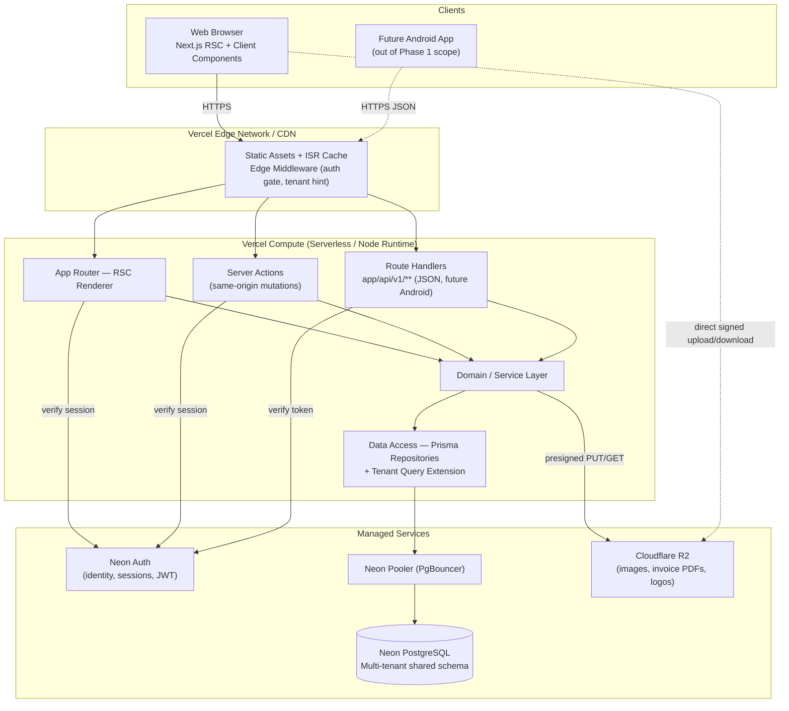
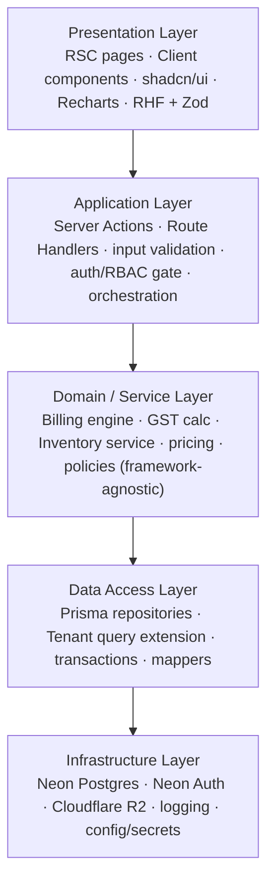
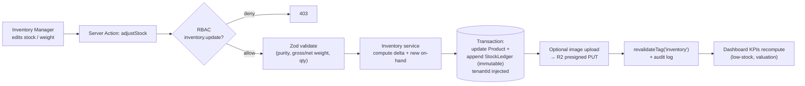
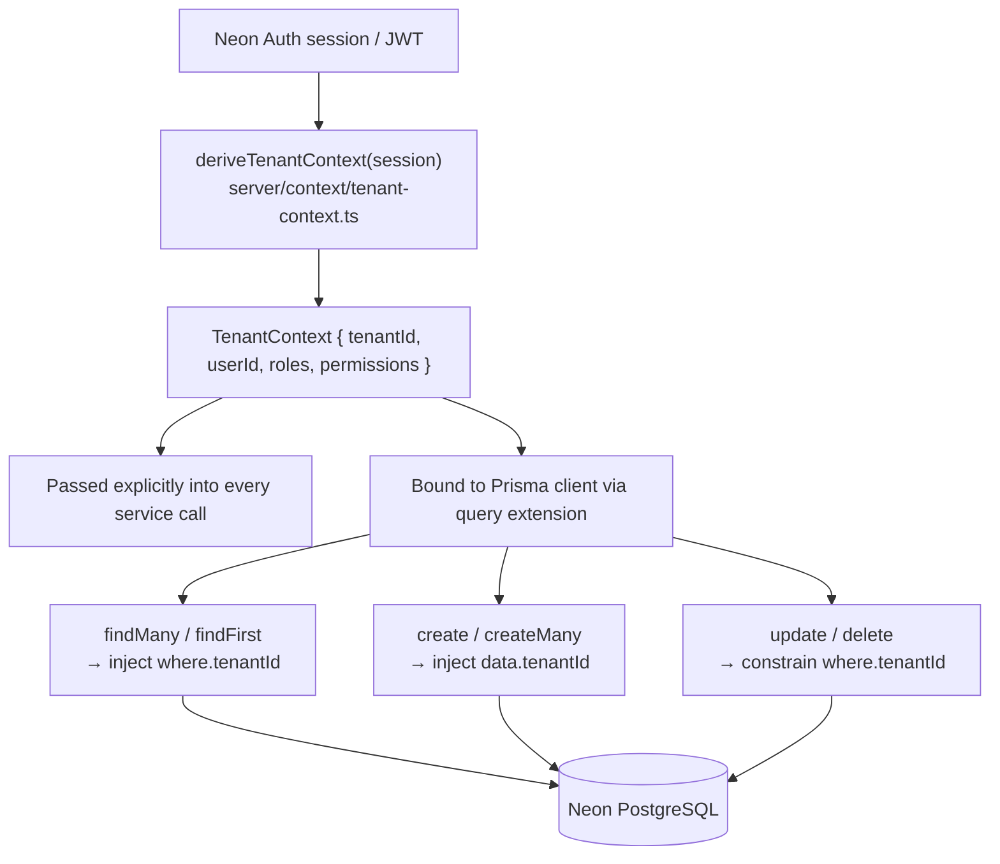
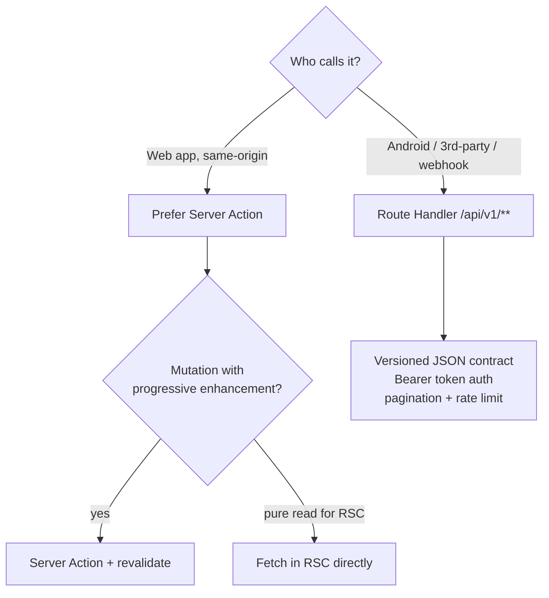
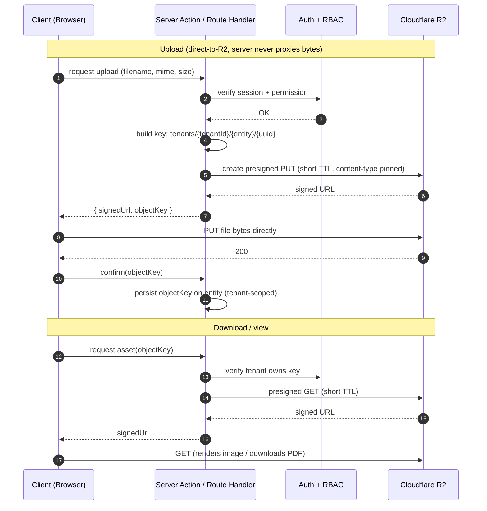
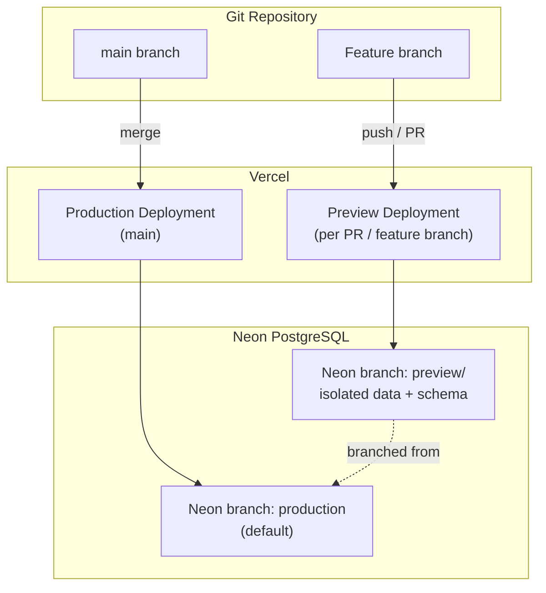

# 02 — System Architecture

> Engineering specification for the runtime, application, and deployment architecture of the Jewellery ERP SaaS Platform.
> **Status:** Baseline (Phase 1) · **Owner:** Platform Engineering · **Last reviewed:** 2026-07-01

---

## 1. Executive Summary

The Jewellery ERP SaaS Platform is a **cloud-native, multi-tenant** application that serves thousands of Indian jewellery businesses from a single deployed codebase. This document defines the **system architecture**: the runtime topology, the layering of concerns inside one Next.js repository, how requests flow from browser to database, how tenant isolation is enforced at every layer, and how the system is deployed, scaled, and observed on Vercel + Neon + Cloudflare R2.

The architecture deliberately favours **operational simplicity**: a **single Next.js (App Router) repository** hosts both UI and backend logic. There is **no separate API server** (no NestJS/Express). Backend behaviour is delivered through two first-class primitives:

- **Server Actions** — the default path for authenticated, same-origin mutations invoked directly from React Server Components (RSC) and client components.
- **Route Handlers** (`app/api/**`) — versioned HTTP/JSON endpoints designed for **future Android/native clients** and third-party integrations (implementation of those clients is out of Phase 1 scope).

Data is persisted in **Neon PostgreSQL** (serverless Postgres with branching + pooled connections) via **Prisma**, with a **tenant-aware query extension** guaranteeing that every business query is scoped to the caller's `tenantId`. Authentication and identity are provided by **Neon Auth**. Binary assets (product images, generated invoice PDFs, business logos) live in **Cloudflare R2** and are accessed via **short-lived signed URLs**. The whole system is deployed to **Vercel** (edge network + serverless/Node runtimes) with **preview and production** environments mapped to **Neon database branches**.

This document is the architectural contract referenced by all downstream specs. Detailed data models, security controls, and module behaviours live in their dedicated sibling documents (see [§16 References](#16-references)).

---

## 2. Scope

### 2.1 In Scope

| Area | Covered here |
|------|--------------|
| High-level runtime topology | Client, Vercel edge/serverless, Neon Auth, Neon PostgreSQL, Cloudflare R2, CDN |
| Layered application architecture | Presentation, application, domain/service, data access, infrastructure |
| Repository / folder organisation | `app/`, `server/`, `lib/`, `db/`, `components/` in one Next.js project |
| Request lifecycles | Server Action mutation; Route Handler API call (future Android) |
| Data flow | Billing operation; inventory update |
| Multi-tenancy resolution | Tenant context derivation from session + injection into every query (Prisma extension/middleware) |
| Caching & rendering | TanStack Query cache, Next.js server cache, revalidation, RSC vs client, Server Action vs Route Handler |
| Storage architecture | Cloudflare R2 signed uploads/downloads |
| Deployment topology | Vercel preview/prod, Neon branching, environment/secrets config |
| Cross-cutting (brief) | Observability, logging, error boundaries, scalability, availability, connection pooling |

### 2.2 Out of Scope (delegated to sibling docs or Phase 2+)

- Field-level data model, constraints, indexes, migrations → [03 — Database Design](./03-Database-Design.md).
- Threat model, session hardening, encryption specifics → [04 — Authentication & Security](./04-Authentication-Security.md).
- Tenant lifecycle, subscription gating, feature flags → [05 — Multi-Tenancy](./05-Multi-Tenancy.md).
- Endpoint contracts and action signatures → [08 — Backend & API Specification](./08-Backend-API-Specification.md).
- Deep NFR/observability engineering (SLOs, tracing spans, alerting) → NFR/roadmap docs; only architectural posture is described here.
- Android app implementation, AI features, Tally integrations, payment gateway, manufacturing module — **out of Phase 1**.

---

## 3. Assumptions

| # | Assumption | Rationale / Impact |
|---|-----------|--------------------|
| A1 | One Next.js repo hosts UI + backend | No separate API service to deploy, scale, or secure. |
| A2 | Every business entity carries a non-null `tenantId` | Enables shared-schema multi-tenancy with app-enforced isolation. |
| A3 | Neon Auth is the sole identity provider in Phase 1 | Sessions/JWT come from Neon Auth; app derives tenant + roles from it. |
| A4 | Vercel serverless functions are **stateless & short-lived** | Requires pooled DB connections (PgBouncer) and no in-process session state. |
| A5 | Neon supports database **branching** | Each environment (prod/preview) maps to a branch for isolated data. |
| A6 | R2 is S3-API compatible | Standard AWS SDK v3 + presigned URL patterns apply. |
| A7 | Traffic is predominantly **read-heavy dashboards + transactional billing bursts** | Drives caching strategy and connection pooling sizing. |
| A8 | GST/currency logic is INR-centric, server-authoritative | All money math executes server-side; clients never compute totals of record. |
| A9 | Route Handlers exist now but are consumed by web via Server Actions | API surface is forward-designed for Android without being the web hot path. |

---

## 4. High-Level Architecture

### 4.1 Runtime Topology



### 4.2 Component Responsibilities

| Component | Responsibility | Notes |
|-----------|----------------|-------|
| **Web Browser** | Renders RSC payload; runs client components (forms, charts); holds TanStack Query cache | Never trusted for authorization or money math. |
| **Vercel Edge / CDN** | TLS termination, static/ISR asset delivery, edge middleware for auth redirect & tenant hint | Middleware runs on Edge runtime; heavy logic stays in Node functions. |
| **App Router (RSC)** | Server-render pages, fetch tenant-scoped data at request time | Reads flow through service → repository. |
| **Server Actions** | Handle mutations from web with progressive enhancement | Default write path in Phase 1. |
| **Route Handlers** | Expose versioned JSON API (`/api/v1/**`) | Forward-designed for Android; consistent contract in [08](./08-Backend-API-Specification.md). |
| **Domain / Service Layer** | Business rules (billing math, GST, inventory adjustments, RBAC checks) | Pure, framework-agnostic, unit-testable. |
| **Prisma Repositories** | Encapsulate persistence; apply tenant scoping via query extension | No raw Prisma calls outside repositories. |
| **Neon Auth** | Identity, session/JWT issuance, user ↔ tenant membership source | See [04](./04-Authentication-Security.md). |
| **Neon PostgreSQL + Pooler** | Durable multi-tenant store; PgBouncer pooling for serverless | Pooled connection string for app; direct string for migrations. |
| **Cloudflare R2** | Object storage for binaries; presigned URL access | No public buckets; time-boxed signed URLs only. |

---

## 5. Layered Architecture

The single repository is organised into **five logical layers**. Dependencies flow **downward only** — presentation depends on application, application on domain, domain on data access, data access on infrastructure. Lower layers never import upper layers.



### 5.1 Layer Contracts

| Layer | Inputs | Outputs | May depend on | Must NOT do |
|-------|--------|---------|---------------|-------------|
| Presentation | Props, user events | Rendered UI, action invocations | Application | Query DB directly; compute authoritative totals |
| Application | Raw request/form data, session | Validated commands, HTTP/action responses | Domain, validation, auth | Contain business math; call Prisma directly |
| Domain / Service | Typed commands + tenant context | Domain results, domain errors | Data access interfaces | Know about HTTP, React, or Prisma types |
| Data Access | Repository method calls + tenant context | Domain entities | Infra (Prisma client) | Contain business rules |
| Infrastructure | Config, connection strings | Clients, adapters | External services | Leak vendor types upward |

### 5.2 Folder Structure (single Next.js repo)

```
jewellery-erp/
├── app/                              # Presentation + Application entrypoints (App Router)
│   ├── (marketing)/                  # Public routes
│   ├── (app)/                        # Authenticated tenant app (route group)
│   │   ├── layout.tsx                # Resolves session → tenant context (RSC)
│   │   ├── dashboard/page.tsx        # RSC page
│   │   ├── billing/
│   │   │   ├── page.tsx              # RSC list/read
│   │   │   └── actions.ts            # "use server" — billing Server Actions
│   │   ├── inventory/
│   │   │   ├── page.tsx
│   │   │   └── actions.ts
│   │   └── ...                       # customers/, suppliers/, reports/, settings/
│   ├── (super-admin)/                # Super Admin console (cross-tenant, guarded)
│   ├── api/                          # Application: Route Handlers (future Android)
│   │   └── v1/
│   │       ├── invoices/route.ts
│   │       ├── inventory/route.ts
│   │       └── uploads/route.ts      # issues R2 presigned URLs
│   ├── error.tsx                     # Route-segment error boundary
│   └── global-error.tsx              # Root error boundary
│
├── server/                          # Application + Domain (server-only code)
│   ├── auth/
│   │   ├── session.ts                # getSession(), requireSession()
│   │   └── rbac.ts                   # can(permission), assertPermission()
│   ├── context/
│   │   └── tenant-context.ts         # deriveTenantContext(session)
│   ├── services/                     # Domain / Service layer
│   │   ├── billing/
│   │   │   ├── billing.service.ts    # invoice lifecycle, orchestration
│   │   │   ├── gst.ts                # CGST/SGST/IGST calc (pure)
│   │   │   └── pricing.ts            # metal rate × weight, making charges (pure)
│   │   ├── inventory/inventory.service.ts
│   │   └── ...
│   └── validation/                   # Zod schemas shared by actions + handlers
│
├── db/                              # Data Access + Infrastructure (Prisma)
│   ├── schema.prisma                 # Models (all tenant-scoped entities carry tenantId)
│   ├── client.ts                     # PrismaClient singleton + tenant query extension
│   ├── repositories/
│   │   ├── invoice.repository.ts
│   │   ├── inventory.repository.ts
│   │   └── ...
│   └── migrations/
│
├── lib/                             # Cross-cutting utilities (framework-light)
│   ├── r2.ts                         # R2/S3 client + presign helpers
│   ├── query-client.ts               # TanStack Query defaults
│   ├── logger.ts                     # structured logger
│   ├── errors.ts                     # AppError taxonomy
│   └── config/env.ts                 # Zod-validated env loader
│
├── components/                      # Presentation (reusable UI)
│   ├── ui/                           # shadcn/ui primitives
│   ├── forms/                        # RHF + Zod form components
│   └── charts/                       # Recharts wrappers
│
├── middleware.ts                    # Edge: auth redirect + tenant hint header
└── ...                              # config: next.config, tailwind, tsconfig, env
```

> **Rule of thumb:** `app/` wires HTTP/React to `server/services`. All persistence lives behind `db/repositories`. Money, GST, and inventory math live in `server/services` and are **pure and unit-testable** with no Next.js or Prisma imports.

---

## 6. Request Lifecycles

### 6.1 Server Action Mutation (web hot path — create invoice)

```mermaid
sequenceDiagram
    autonumber
    participant U as User (Browser)
    participant C as Client Component (RHF + Zod)
    participant M as Edge Middleware
    participant SA as Server Action ("use server")
    participant AUTH as Neon Auth
    participant RBAC as RBAC Guard
    participant SVC as Billing Service (Domain)
    participant REPO as Invoice Repository
    participant EXT as Prisma Tenant Extension
    participant PG as Neon PostgreSQL

    U->>C: Submit invoice form
    C->>C: Client-side Zod validation (UX)
    C->>M: POST (Server Action RPC, same-origin)
    M->>M: Verify session cookie; attach tenant hint
    M->>SA: Forward request
    SA->>AUTH: getSession()
    AUTH-->>SA: { userId, tenantId, roles }
    SA->>SA: Server-side Zod re-validation (authoritative)
    SA->>RBAC: assertPermission("invoice.create")
    RBAC-->>SA: OK
    SA->>SVC: createInvoice(cmd, tenantContext)
    SVC->>SVC: price(items) + computeGST() [pure]
    SVC->>REPO: persist(invoice, lines) [transaction]
    REPO->>EXT: prisma.invoice.create(...)
    EXT->>EXT: inject tenantId into write/where
    EXT->>PG: INSERT (pooled connection)
    PG-->>EXT: rows
    EXT-->>REPO: entity
    REPO-->>SVC: Invoice
    SVC-->>SA: InvoiceResult
    SA->>SA: revalidatePath("/billing")
    SA-->>C: typed result (success | field errors)
    C-->>U: Optimistic UI reconciled; toast
```

**Key properties:** validation and authorization run **server-side regardless of client checks**; the tenant is derived from the session, never from client input; `revalidatePath`/`revalidateTag` refreshes affected RSC data.

### 6.2 Route Handler API Call (future Android — list invoices)

```mermaid
sequenceDiagram
    autonumber
    participant AND as Android Client (future)
    participant M as Edge Middleware
    participant RH as Route Handler /api/v1/invoices
    participant AUTH as Neon Auth
    participant RBAC as RBAC Guard
    participant SVC as Billing Service
    participant REPO as Invoice Repository
    participant EXT as Prisma Tenant Extension
    participant PG as Neon PostgreSQL

    AND->>M: GET /api/v1/invoices (Bearer JWT)
    M->>RH: Forward
    RH->>AUTH: verifyToken(Authorization)
    AUTH-->>RH: { userId, tenantId, roles } | 401
    RH->>RH: Validate query params (Zod)
    RH->>RBAC: assertPermission("invoice.read")
    RBAC-->>RH: OK | 403
    RH->>SVC: listInvoices(filter, tenantContext)
    SVC->>REPO: find(filter, page)
    REPO->>EXT: prisma.invoice.findMany(...)
    EXT->>EXT: force where.tenantId = ctx.tenantId
    EXT->>PG: SELECT (pooled)
    PG-->>EXT: rows
    EXT-->>REPO: entities
    REPO-->>SVC: Invoice[]
    SVC-->>RH: page result
    RH-->>AND: 200 JSON { data, pagination }
```

**Route Handlers share the exact same service + repository + tenant-extension stack as Server Actions** — only the transport and auth token format differ. This guarantees identical business behaviour across web and future Android.

---

## 7. Data Flow

### 7.1 Billing Operation (end-to-end)

```mermaid
flowchart LR
    A["Cashier selects items<br/>+ live metal rate"] --> B["Server Action: createInvoice"]
    B --> C{"Auth + RBAC<br/>invoice.create?"}
    C -->|deny| X["403 / field error"]
    C -->|allow| D["Pricing service<br/>weight × rate + making + wastage"]
    D --> E["GST service<br/>intra-state CGST+SGST /<br/>inter-state IGST"]
    E --> F["Inventory service<br/>reserve/decrement stock"]
    F --> G[("DB transaction:<br/>Invoice + Lines + StockLedger<br/>tenantId injected")]
    G --> H["Generate invoice PDF"]
    H --> I["Upload PDF → R2<br/>(presigned PUT)"]
    I --> J["Persist R2 object key<br/>on invoice row"]
    J --> K["revalidateTag('invoices')<br/>+ audit log entry"]
    K --> L["UI: printable invoice<br/>+ signed download URL"]
```



Authoritative pricing and GST math run in the **domain layer** ([09 — Billing Engine](./09-Billing-Engine.md)); stock movement is atomic with invoice creation in **one DB transaction** to prevent oversell.

### 7.2 Inventory Update (stock adjustment)



Every change appends an **immutable stock ledger** row rather than mutating history, preserving auditability ([10 — Inventory Management](./10-Inventory-Management.md), [Audit Logs](./01-Product-Requirements-Document.md)).

---

## 8. Multi-Tenancy Resolution (architectural)

Phase 1 uses a **shared PostgreSQL schema** with **application-enforced isolation**. Every tenant-owned row carries a non-null `tenantId`. Isolation is enforced centrally so no feature developer can accidentally leak cross-tenant data.

### 8.1 Tenant Context Derivation & Injection



### 8.2 Enforcement Mechanism

- **Source of truth:** `tenantId` is read **only** from the verified Neon Auth session/JWT — never from request body, query string, or headers supplied by the client.
- **Tenant-scoped Prisma client:** repositories obtain a client bound to the request's `TenantContext` through a **Prisma Client Extension** (`$extends` with a `query` hook; conceptually the successor to Prisma middleware). The extension automatically:
  - injects `where: { tenantId }` on all reads (`findMany`, `findFirst`, `findUnique*`, `count`, `aggregate`),
  - stamps `data.tenantId` on all writes (`create`, `createMany`, `upsert`),
  - constrains `update`/`updateMany`/`delete`/`deleteMany` with `tenantId`.
- **Model allowlist:** the extension recognises which models are tenant-scoped vs global (e.g., `Tenant`, `Plan`, `Permission`). Global/Super-Admin models are queried through a separate, explicitly-privileged client path.
- **Defence in depth:** unique constraints and indexes are `(tenantId, ...)` composite ([03](./03-Database-Design.md)); Super Admin cross-tenant access uses a distinct, audited code path in `app/(super-admin)/`.

Full lifecycle, subscription gating, and feature flags: [05 — Multi-Tenancy](./05-Multi-Tenancy.md).

---

## 9. Caching, Rendering & Execution-Model Strategy

### 9.1 Two Cache Planes

| Plane | Technology | Scope | Invalidation |
|-------|-----------|-------|--------------|
| **Server data cache** | Next.js `fetch`/`unstable_cache` + tags | Per deployment, shared across users of a tenant where safe | `revalidateTag` / `revalidatePath` after mutations |
| **Client query cache** | TanStack Query | Per browser session | `queryClient.invalidateQueries` after Server Action success |

> Tenant-sensitive data is cached with **tenant-qualified tags** (e.g., `` `invoices:${tenantId}` ``) so revalidation never crosses tenants and cache reads are never shared between tenants.

### 9.2 Rendering Strategy — RSC vs Client Components

| Use RSC (default) | Use Client Component |
|-------------------|----------------------|
| Data-heavy reads (dashboards, lists, reports) | Interactive forms (RHF + Zod) |
| Server-only secrets/DB access | Charts (Recharts) & live UI state |
| SEO/marketing pages | Optimistic UI, toasts, modals |
| Reduced client JS payload | Anything using browser APIs/hooks |

Pattern: **RSC fetches and passes data down; small `"use client"` islands** handle interactivity. TanStack Query hydrates from RSC-provided initial data to avoid double-fetching.

### 9.3 Server Actions vs Route Handlers — decision matrix



| Dimension | Server Action | Route Handler |
|-----------|---------------|---------------|
| Primary consumer | Web (RSC/client) | Future Android, integrations, webhooks |
| Auth | Session cookie | Bearer JWT / API token |
| Contract stability | Internal, may evolve freely | **Versioned & stable** (`/api/v1`) |
| Response shape | Typed result to React | Explicit JSON envelope |
| Best for | Form mutations, invalidations | Public read/write API, machine clients |

Both converge on the same service + repository + tenant extension. Endpoint/action contracts: [08 — Backend & API Specification](./08-Backend-API-Specification.md).

---

## 10. File & Storage Architecture (Cloudflare R2)

R2 stores **product images, generated invoice PDFs, and business logos/branding**. Buckets are **private**; access is exclusively via **short-lived presigned URLs** using the S3-compatible API.



**Storage rules**

| Rule | Detail |
|------|--------|
| Key namespacing | `tenants/{tenantId}/{entity}/{uuid}.{ext}` — tenant prefix on every object |
| Access | Presigned URLs only; no public bucket, no long-lived links |
| Validation | Content-type and max size pinned in the signature; server validates before issuing |
| Ownership check | Download signing verifies the requesting tenant owns the key prefix |
| Direct transfer | Bytes flow **browser ↔ R2**, keeping serverless functions light |

---

## 11. Environment, Configuration & Secrets

| Concern | Approach |
|---------|----------|
| Config loading | `lib/config/env.ts` validates all env vars with **Zod at boot**; fail fast on missing/invalid. |
| Secrets storage | **Vercel Environment Variables** per environment (Development / Preview / Production); never committed. |
| DB connection strings | **Pooled** string (`...-pooler...`, PgBouncer) for the app runtime; **direct** string for Prisma migrations. |
| Auth secrets | Neon Auth keys/JWKS via env; rotated per [04](./04-Authentication-Security.md). |
| R2 credentials | R2 access key/secret + account/bucket via env; scoped tokens. |
| Client vs server env | Only `NEXT_PUBLIC_*` is exposed to the browser; all secrets are server-only. |

Representative variables (names illustrative; see [08](./08-Backend-API-Specification.md)):

```
DATABASE_URL              # pooled (PgBouncer) — app runtime
DIRECT_URL                # direct — prisma migrate/introspect
NEON_AUTH_*               # Neon Auth config / JWKS
R2_ACCOUNT_ID / R2_ACCESS_KEY_ID / R2_SECRET_ACCESS_KEY / R2_BUCKET
NEXT_PUBLIC_APP_URL       # client-safe
```

---

## 12. Deployment Topology (Vercel + Neon Branching)



| Environment | Trigger | Compute | Database | Purpose |
|-------------|---------|---------|----------|---------|
| **Preview** | Every PR / non-main push | Vercel Preview | Ephemeral Neon branch (branched from prod schema) | Isolated review with realistic data, zero risk to prod |
| **Production** | Merge to `main` | Vercel Production | Neon production branch | Live tenant traffic |

- **Runtimes:** middleware on Edge runtime; Server Actions, Route Handlers, and RSC data fetching on the Node.js serverless runtime (Prisma requires Node).
- **Migrations:** applied via CI/deploy step using `DIRECT_URL`; forward-only, reviewed per [03](./03-Database-Design.md).
- **Neon branching** gives each preview its own schema+data copy, enabling safe migration testing before prod.

---

## 13. Observability, Logging & Error Handling (architectural posture)

> Deep NFR treatment (SLOs, distributed tracing, alerting) is delegated to the NFR/roadmap docs. This section fixes the **architecture-level posture** only.

| Concern | Architectural posture |
|---------|-----------------------|
| **Structured logging** | `lib/logger.ts` emits JSON logs with correlation fields (`requestId`, `tenantId`, `userId`, `route`) — **never PII or secrets**. Ingested via Vercel log drains. |
| **Error taxonomy** | `lib/errors.ts` defines `AppError` subtypes (`ValidationError`, `AuthError`, `ForbiddenError`, `NotFoundError`, `ConflictError`, `DomainError`). Application layer maps them to action results / HTTP status. |
| **React error boundaries** | `app/error.tsx` (segment) + `app/global-error.tsx` (root) catch render/runtime errors and show safe fallbacks without leaking internals. |
| **Server Action failures** | Return typed field/form errors for expected failures; unexpected errors are logged with `requestId` and surfaced as generic messages. |
| **Audit trail** | Security/business-relevant mutations append immutable audit records (tenant-scoped) — distinct from operational logs. |
| **Metrics** | Vercel Analytics + platform metrics for latency/error rate; app-level counters emitted via logs for dashboards. |

---

## 14. Scalability & Availability

| Dimension | Design response |
|-----------|-----------------|
| **Serverless connection storms** | App connects through the **Neon pooler (PgBouncer)** using the pooled connection string; migrations use the direct string. This prevents connection exhaustion from many concurrent short-lived Vercel functions. |
| **Prisma + PgBouncer** | Prisma is configured for transaction-mode pooling (pooled `DATABASE_URL`), with `DIRECT_URL` reserved for migration/introspection. |
| **Elastic compute** | Vercel serverless functions scale horizontally per request; no sticky/in-process state (stateless functions per assumption A4). |
| **Read scaling** | Heavy read dashboards leverage Next.js server cache + tenant-tagged revalidation; Neon **read replicas** are a Phase 2 lever for report-heavy workloads. |
| **Autoscaling & scale-to-zero** | Neon autoscales compute and can scale to zero on idle branches (esp. previews), controlling cost. |
| **Availability** | Managed SLAs from Vercel (edge/compute), Neon (Postgres), Cloudflare R2 (storage). No single self-managed server to fail. |
| **Global latency** | Static/ISR assets served from Vercel's edge CDN; dynamic compute in the primary region close to Neon to minimise DB round-trips. |
| **Bulk/burst billing** | Atomic transactions + optimistic UI keep transactional bursts (e.g., festival sales) correct and responsive. |

---

## 15. Acceptance Criteria

| ID | Criterion | Verification |
|----|-----------|--------------|
| AC-1 | System runs as a **single Next.js repo** with no separate API server. | Architecture review; repo has no `NestJS/Express` service. |
| AC-2 | Every tenant-scoped query is filtered by `tenantId` **derived from session**, enforced centrally. | Code review of Prisma tenant extension; negative test proving cross-tenant reads return empty. |
| AC-3 | Web mutations use **Server Actions**; a **versioned `/api/v1` Route Handler** surface exists for future Android. | Presence of `actions.ts` + `app/api/v1/**`; both hit the same service layer. |
| AC-4 | Business logic (pricing, GST, inventory) lives in **framework-agnostic services**, unit-tested without Next.js/Prisma. | Service unit tests pass with no framework imports. |
| AC-5 | Billing creation and stock movement are **atomic** (single transaction). | Integration test: failed line rolls back invoice + ledger. |
| AC-6 | R2 objects are **private**, accessed only via **short-lived presigned URLs** keyed by tenant prefix. | Attempt anonymous GET → denied; signed URL works and expires. |
| AC-7 | App uses **pooled Neon connection**; migrations use **direct** connection. | Env inspection; load test shows no connection exhaustion. |
| AC-8 | **Preview** deployments map to isolated **Neon branches**; prod maps to production branch. | Vercel + Neon config; PR preview writes never touch prod data. |
| AC-9 | Caching is **tenant-qualified**; revalidation after mutation refreshes correct data with no cross-tenant leakage. | Test: two tenants' caches are independent; post-mutation revalidation observed. |
| AC-10 | Root and segment **error boundaries** exist and hide internal errors. | Force an error; safe fallback shown; internals only in logs with `requestId`. |
| AC-11 | Config is **Zod-validated at boot**; missing secrets fail fast. | Remove a var → startup fails with clear message. |

---

## 16. Future Enhancements

| Theme | Enhancement | Phase |
|-------|-------------|-------|
| Native clients | Ship Android app against the existing `/api/v1` Route Handlers. | 2 |
| Read scaling | Introduce **Neon read replicas** for reporting/analytics workloads. | 2 |
| Isolation upgrade | Optionally add PostgreSQL **Row-Level Security (RLS)** as defence-in-depth atop app-level scoping. | 2 |
| Rendering | Selective **PPR / streaming** for large dashboards. | 2 |
| Observability | Full **distributed tracing** (OpenTelemetry) + SLO-based alerting. | 2 |
| Printing | **Thermal printer** support and print-service integration. | 2 |
| Events | Async event bus (queue) for notifications, exports, and heavy PDF batches. | 2/3 |
| Integrations | Tally/accounting sync, payment gateway, AI-assisted insights. | 3 (currently out of scope) |
| Edge data | Move select read paths closer to users via edge-compatible data access. | 3 |

---

## 17. References

### Internal (sibling documents)

- [01 — Product Requirements Document](./01-Product-Requirements-Document.md)
- [03 — Database Design](./03-Database-Design.md)
- [04 — Authentication & Security](./04-Authentication-Security.md)
- [05 — Multi-Tenancy](./05-Multi-Tenancy.md)
- [06 — RBAC & Permissions](./06-RBAC-Permissions.md)
- [07 — Frontend Specification](./07-Frontend-Specification.md)
- [08 — Backend & API Specification](./08-Backend-API-Specification.md)
- [09 — Billing Engine](./09-Billing-Engine.md)
- [10 — Inventory Management](./10-Inventory-Management.md)
- [11 — Development Roadmap](./11-Development-Roadmap.md)
- [12 — Coding Standards](./12-Coding-Standards.md)
- [Documentation Index](../README.md)

### External (technology)

- Next.js App Router — Server Components, Server Actions, Route Handlers, caching & revalidation.
- Prisma — Client Extensions (`$extends` query hooks) and connection management with PgBouncer.
- Neon PostgreSQL — serverless Postgres, connection pooling, database branching, autoscaling, read replicas.
- Neon Auth — identity, sessions, and JWT verification.
- Vercel — serverless/edge runtimes, environments (preview/production), environment variables.
- Cloudflare R2 — S3-compatible object storage and presigned URLs.
- TanStack Query — client-side data caching and invalidation.
- Zod — schema validation for inputs and configuration.
```
