`# 03 — Database Design

> **Product:** Jewellery ERP SaaS Platform — cloud-native, multi-tenant SaaS for Indian jewellery businesses.
> **Phase:** 1 (Next.js web only).
> **Stack:** Next.js (App Router) + TypeScript · Prisma ORM · Neon PostgreSQL · Neon Auth · Vercel · Cloudflare R2.
> **Document status:** Production spec · Version 1.0 · Last updated 2026-07-01.

**Sibling documents**
- [01 — Product Overview](./01-Product-Overview.md)
- [02 — System Architecture](./02-System-Architecture.md)
- **03 — Database Design** *(this document)*
- [04 — Authentication & RBAC](./04-Authentication-and-RBAC.md)
- [05 — Multi-Tenancy Strategy](./05-Multi-Tenancy-Strategy.md)
- [06 — Billing Engine & GST](./06-Billing-Engine-and-GST.md)
- [07 — Inventory Management](./07-Inventory-Management.md)
- [08 — API Design](./08-API-Design.md)
- [09 — Reporting & Analytics](./09-Reporting-and-Analytics.md)
- [10 — Audit, Notifications & Observability](./10-Audit-Notifications-Observability.md)

---

## 1. Executive Summary

This document specifies the complete relational data model for the Jewellery ERP SaaS Platform. It defines the physical schema hosted on **Neon PostgreSQL**, managed through **Prisma Migrate**, and consumed by Next.js Route Handlers and Server Actions.

The design is **multi-tenant from day one** using a **shared-database, shared-schema** model with strict application-enforced isolation: every tenant-scoped table carries a non-null `tenant_id`, and every query executed by application code is tenant-filtered. Defense-in-depth is layered via foreign keys, composite indexes leading with `tenant_id`, unique constraints scoped per tenant, and check constraints on all monetary and weight fields. PostgreSQL **Row-Level Security (RLS)** is documented as a future hardening layer.

The domain is jewellery-specific: inventory is **weight-based** with purity/karat semantics (grams to milligram precision), pricing is driven by **daily metal rates** (gold/silver/platinum), and billing is **GST-compliant** for the Indian market (HSN codes, CGST/SGST/IGST). All financial values use `Decimal` with fixed scale to eliminate floating-point error; all weights use `Decimal(12,3)` grams.

Key design pillars:

| Pillar | Approach |
| --- | --- |
| Tenancy | `tenant_id` on every business table; per-tenant unique keys; composite indexes leading with `tenant_id`. |
| Precision | Money = `Decimal(14,2)` / rates = `Decimal(14,4)`; weight = `Decimal(12,3)` grams; purity = `Decimal(6,3)`. |
| Integrity | FKs everywhere, check constraints for positivity, enum types for domain values. |
| Auditability | Immutable `audit_logs` with actor, tenant, action, before/after JSON. |
| Soft delete | Nullable `deleted_at`, partial indexes, Prisma-level global filtering. |
| Evolvability | Prisma Migrate + Neon branch-per-environment; deterministic seed for plans/permissions. |

---

## 2. Scope

**In scope**
- Logical and physical schema for all Phase 1 modules: Authentication, Super Admin, Business Management, Subscription Management, User Management, Business Settings, Customer & Supplier Management, Inventory, Billing Engine, Invoice Templates, GST, Reports (read models), Notifications, Audit Logs, Dashboard Analytics.
- Naming conventions, entity catalog, ERD, per-entity column tables, relationships, constraints, indexing, soft-delete, audit, tenant isolation, migration & seed strategy, representative Prisma schema.

**Out of scope (covered elsewhere)**
- Auth token/session mechanics and RBAC evaluation logic → [04 — Authentication & RBAC](./04-Authentication-and-RBAC.md).
- Runtime tenant-resolution middleware and RLS rollout plan → [05 — Multi-Tenancy Strategy](./05-Multi-Tenancy-Strategy.md).
- Tax computation algorithms and invoice numbering rules → [06 — Billing Engine & GST](./06-Billing-Engine-and-GST.md).
- API contracts and pagination → [08 — API Design](./08-API-Design.md).

---

## 3. Assumptions

1. **Single logical database** on Neon PostgreSQL 16+, one Prisma schema, one migration history.
2. **Neon Auth** owns identity (users, credentials, sessions). Our `users` table stores an application projection keyed by the Neon Auth subject (`auth_user_id`) plus app-level attributes (roles, tenant membership). See [04](./04-Authentication-and-RBAC.md).
3. A **Tenant == a Business** (jewellery shop / firm). A single Neon Auth user may belong to multiple tenants (multi-membership) through `user_tenant_memberships`.
4. All identifiers are **CUID2** strings generated by the application (`cuid()` default via Prisma). Rationale in §4.
5. Currency is **INR**; multi-currency is a future enhancement. All money columns store INR.
6. All timestamps are stored in **UTC** as `timestamptz`; display localization is a presentation concern.
7. Neon connection pooling (PgBouncer, transaction mode) is used from Vercel serverless; Prisma uses the pooled URL for runtime and the direct URL for migrations.
8. Soft delete is the default for business entities; hard delete is reserved for GDPR/DPDP erasure workflows and orphaned staging rows.

---

## 4. Naming Conventions

| Concern | Convention | Justification |
| --- | --- | --- |
| Table names | `snake_case`, **plural** (`invoices`, `inventory_items`) | Plural reads naturally as a collection; industry-common (Rails/Laravel); avoids reserved-word collisions (`user` → `users`). |
| Column names | `snake_case` (`unit_price`, `created_at`) | Postgres folds unquoted identifiers to lower-case; snake_case avoids quoting. |
| Prisma models | `PascalCase` singular (`Invoice`) mapped via `@@map("invoices")` | Idiomatic Prisma/TypeScript on the app side; explicit `@map`/`@@map` keeps DB snake_case. |
| Primary key | `id` — CUID2 string (`@id @default(cuid())`) | Collision-resistant, URL-safe, monotonic-ish, non-enumerable (unlike serial), generated app-side (no round-trip). Preferred over UUIDv4 for shorter, sortable-friendly, index-locality-better keys. |
| Foreign keys | `<entity>_id` (`tenant_id`, `customer_id`) | Predictable, self-documenting join columns. |
| Tenant scope | `tenant_id` (non-null) on **every** tenant-owned table | Enables uniform isolation, composite indexing, and future RLS. |
| Timestamps | `created_at`, `updated_at` (`timestamptz`), `deleted_at` (nullable) | Audit baseline; `updated_at` maintained via Prisma `@updatedAt`. |
| Booleans | `is_active`, `is_default` | Positive phrasing, `is_` prefix. |
| Enums | Postgres native enum types, `snake_case` values (`invoice_type`) | Type safety at DB and Prisma level; cheaper than lookup tables for stable domains. |
| Money | `Decimal(14,2)` | Exact decimal arithmetic; supports up to 999,999,999,999.99. |
| Rates | `Decimal(14,4)` | Metal rates & unit prices need 4dp precision (per-gram rates). |
| Weight | `Decimal(12,3)` grams | Milligram precision, standard jewellery weighing granularity. |
| Purity | `Decimal(6,3)` (fineness, e.g. 916.000) + `karat` smallint | Represents both fineness (per-mille) and karat. |
| JSON | `jsonb` columns for flexible/audit payloads | Indexable, queryable, compact. |

> **UUID note:** where an external system mandates UUID (e.g. Neon Auth subject), we store it as a `String`/`uuid`-typed column but do not use it as our surrogate PK. Internal PKs remain CUID2 for consistency.

---

## 5. Entity Catalog (by Module)

| Module | Entities |
| --- | --- |
| **Platform / Super Admin** | `plans`, `feature_flags` |
| **Business Management** | `tenants` (Business), `business_settings` |
| **Subscription Management** | `subscriptions`, `subscription_invoices` *(platform billing — distinct from tenant sales invoices)* |
| **Authentication & RBAC** | `users`, `user_tenant_memberships`, `roles`, `permissions`, `role_permissions`, `user_roles` |
| **Customer & Supplier** | `customers`, `suppliers` |
| **Inventory** | `product_categories`, `products`, `inventory_items`, `stock_movements`, `stock_adjustments`, `stock_transfers` |
| **Pricing** | `metal_rates` |
| **Billing / GST** | `invoices`, `invoice_line_items`, `payments`, `tax_rates`, `hsn_codes`, `invoice_templates` |
| **Cross-cutting** | `notifications`, `audit_logs`, `file_assets` |

**Enums**

| Enum type | Values |
| --- | --- |
| `invoice_type` | `sales`, `purchase`, `quotation`, `estimate`, `return`, `exchange`, `repair` |
| `invoice_status` | `draft`, `issued`, `partially_paid`, `paid`, `cancelled`, `void` |
| `payment_method` | `cash`, `card`, `upi`, `bank_transfer`, `cheque`, `store_credit`, `gold_exchange` |
| `payment_status` | `pending`, `completed`, `failed`, `refunded` |
| `metal_type` | `gold`, `silver`, `platinum`, `diamond`, `other` |
| `stock_movement_type` | `purchase_in`, `sale_out`, `adjustment_in`, `adjustment_out`, `transfer_in`, `transfer_out`, `return_in`, `return_out` |
| `subscription_status` | `trialing`, `active`, `past_due`, `cancelled`, `expired` |
| `notification_channel` | `in_app`, `email`, `sms`, `whatsapp` |
| `notification_status` | `pending`, `sent`, `read`, `failed` |
| `gst_tax_kind` | `cgst`, `sgst`, `igst`, `cess`, `exempt` |
| `audit_action` | `create`, `update`, `delete`, `soft_delete`, `restore`, `login`, `logout`, `export` |

---

## 6. Entity Relationship Diagram (Core)

```mermaid
erDiagram
    TENANTS ||--o{ USER_TENANT_MEMBERSHIPS : "has members"
    USERS ||--o{ USER_TENANT_MEMBERSHIPS : "belongs to"
    TENANTS ||--|| BUSINESS_SETTINGS : "configures"
    TENANTS ||--o{ SUBSCRIPTIONS : "subscribes"
    PLANS ||--o{ SUBSCRIPTIONS : "offered as"

    TENANTS ||--o{ ROLES : "defines"
    ROLES ||--o{ ROLE_PERMISSIONS : "grants"
    PERMISSIONS ||--o{ ROLE_PERMISSIONS : "granted by"
    ROLES ||--o{ USER_ROLES : "assigned via"
    USER_TENANT_MEMBERSHIPS ||--o{ USER_ROLES : "carries"

    TENANTS ||--o{ CUSTOMERS : "owns"
    TENANTS ||--o{ SUPPLIERS : "owns"
    TENANTS ||--o{ PRODUCT_CATEGORIES : "owns"
    PRODUCT_CATEGORIES ||--o{ PRODUCTS : "classifies"
    PRODUCT_CATEGORIES ||--o{ PRODUCT_CATEGORIES : "parent of"
    TENANTS ||--o{ PRODUCTS : "owns"
    PRODUCTS ||--o{ INVENTORY_ITEMS : "stocked as"
    HSN_CODES ||--o{ PRODUCTS : "classified by"

    INVENTORY_ITEMS ||--o{ STOCK_MOVEMENTS : "moves"
    STOCK_ADJUSTMENTS ||--o{ STOCK_MOVEMENTS : "produces"
    STOCK_TRANSFERS ||--o{ STOCK_MOVEMENTS : "produces"
    SUPPLIERS ||--o{ INVENTORY_ITEMS : "supplies"

    TENANTS ||--o{ INVOICES : "issues"
    CUSTOMERS ||--o{ INVOICES : "billed on"
    SUPPLIERS ||--o{ INVOICES : "purchased from"
    INVOICES ||--o{ INVOICE_LINE_ITEMS : "contains"
    PRODUCTS ||--o{ INVOICE_LINE_ITEMS : "referenced by"
    INVENTORY_ITEMS ||--o{ INVOICE_LINE_ITEMS : "sold as"
    INVOICES ||--o{ PAYMENTS : "settled by"
    INVOICE_TEMPLATES ||--o{ INVOICES : "rendered with"

    HSN_CODES ||--o{ TAX_RATES : "taxed at"
    TAX_RATES ||--o{ INVOICE_LINE_ITEMS : "applied to"
    METAL_RATES ||--o{ INVOICE_LINE_ITEMS : "priced by"

    TENANTS ||--o{ NOTIFICATIONS : "receives"
    TENANTS ||--o{ AUDIT_LOGS : "recorded for"
    TENANTS ||--o{ FILE_ASSETS : "stores"
    USERS ||--o{ AUDIT_LOGS : "acts in"

    TENANTS {
        string id PK
        string name
        string slug UK
        string gstin
        timestamptz created_at
    }
    USERS {
        string id PK
        string auth_user_id UK
        string email UK
        boolean is_super_admin
    }
    USER_TENANT_MEMBERSHIPS {
        string id PK
        string tenant_id FK
        string user_id FK
        boolean is_active
    }
    PLANS {
        string id PK
        string code UK
        decimal price_monthly
    }
    SUBSCRIPTIONS {
        string id PK
        string tenant_id FK
        string plan_id FK
        string status
    }
    ROLES {
        string id PK
        string tenant_id FK
        string name
    }
    PERMISSIONS {
        string id PK
        string key UK
    }
    ROLE_PERMISSIONS {
        string role_id FK
        string permission_id FK
    }
    USER_ROLES {
        string membership_id FK
        string role_id FK
    }
    CUSTOMERS {
        string id PK
        string tenant_id FK
        string name
        string phone
    }
    SUPPLIERS {
        string id PK
        string tenant_id FK
        string name
    }
    PRODUCT_CATEGORIES {
        string id PK
        string tenant_id FK
        string parent_id FK
        string name
    }
    PRODUCTS {
        string id PK
        string tenant_id FK
        string category_id FK
        string hsn_code_id FK
        string metal_type
    }
    INVENTORY_ITEMS {
        string id PK
        string tenant_id FK
        string product_id FK
        decimal gross_weight
        decimal net_weight
        decimal purity_fineness
        smallint karat
    }
    STOCK_MOVEMENTS {
        string id PK
        string tenant_id FK
        string inventory_item_id FK
        string type
        decimal weight
    }
    STOCK_ADJUSTMENTS {
        string id PK
        string tenant_id FK
        string reason
    }
    STOCK_TRANSFERS {
        string id PK
        string tenant_id FK
        string from_location
        string to_location
    }
    INVOICES {
        string id PK
        string tenant_id FK
        string customer_id FK
        string invoice_number
        string type
        decimal grand_total
    }
    INVOICE_LINE_ITEMS {
        string id PK
        string tenant_id FK
        string invoice_id FK
        string product_id FK
        decimal net_weight
        decimal line_total
    }
    PAYMENTS {
        string id PK
        string tenant_id FK
        string invoice_id FK
        decimal amount
        string method
    }
    TAX_RATES {
        string id PK
        string tenant_id FK
        string hsn_code_id FK
        decimal rate_percent
    }
    HSN_CODES {
        string id PK
        string code UK
        decimal default_gst_percent
    }
    METAL_RATES {
        string id PK
        string tenant_id FK
        string metal_type
        date rate_date
        decimal rate_per_gram
    }
    BUSINESS_SETTINGS {
        string id PK
        string tenant_id FK
        string base_currency
    }
    INVOICE_TEMPLATES {
        string id PK
        string tenant_id FK
        jsonb layout
    }
    NOTIFICATIONS {
        string id PK
        string tenant_id FK
        string channel
        string status
    }
    AUDIT_LOGS {
        string id PK
        string tenant_id FK
        string actor_user_id FK
        string action
        jsonb before
        jsonb after
    }
    FILE_ASSETS {
        string id PK
        string tenant_id FK
        string r2_key UK
        string content_type
    }
    FEATURE_FLAGS {
        string id PK
        string key UK
        boolean is_enabled
    }
```



---

## 7. Entity Column Specifications

Conventions for every table below: `id` is the CUID2 PK; `created_at timestamptz NOT NULL DEFAULT now()`; `updated_at timestamptz NOT NULL` (Prisma `@updatedAt`); `deleted_at timestamptz NULL` on soft-deletable entities. These common columns are omitted from tables to reduce noise except where semantics differ.

### 7.1 `tenants` (Business)

| Column | Type | Nullable | Default | Description |
| --- | --- | --- | --- | --- |
| id | text (cuid) | no | cuid() | PK |
| name | text | no | — | Legal / display business name |
| slug | text | no | — | URL-safe tenant handle |
| gstin | varchar(15) | yes | — | GST Identification Number |
| pan | varchar(10) | yes | — | PAN |
| contact_email | text | yes | — | Primary contact email |
| contact_phone | varchar(20) | yes | — | Primary phone |
| address_json | jsonb | yes | — | Structured address |
| logo_asset_id | text | yes | — | FK → `file_assets.id` |
| is_active | boolean | no | true | Tenant enabled flag |
| onboarded_at | timestamptz | yes | — | Onboarding completion time |

- **PK:** `id` · **Unique:** `slug`; `gstin` (partial, where not null)
- **Indexes:** `(is_active)`, `(deleted_at)` partial
- **FK:** `logo_asset_id → file_assets.id` (ON DELETE SET NULL)

### 7.2 `plans`

| Column | Type | Nullable | Default | Description |
| --- | --- | --- | --- | --- |
| id | text | no | cuid() | PK |
| code | text | no | — | Machine code (`free`, `growth`, `enterprise`) |
| name | text | no | — | Display name |
| price_monthly | Decimal(14,2) | no | 0 | Monthly INR price |
| price_yearly | Decimal(14,2) | no | 0 | Annual INR price |
| max_users | int | yes | — | Seat cap (null = unlimited) |
| max_invoices_monthly | int | yes | — | Invoice cap |
| features | jsonb | no | '{}' | Feature entitlements |
| is_active | boolean | no | true | Sellable flag |

- **PK:** `id` · **Unique:** `code`

### 7.3 `subscriptions`

| Column | Type | Nullable | Default | Description |
| --- | --- | --- | --- | --- |
| id | text | no | cuid() | PK |
| tenant_id | text | no | — | FK → tenants |
| plan_id | text | no | — | FK → plans |
| status | subscription_status | no | 'trialing' | Lifecycle state |
| billing_cycle | text | no | 'monthly' | `monthly`/`yearly` |
| current_period_start | timestamptz | no | now() | Period start |
| current_period_end | timestamptz | no | — | Period end |
| trial_ends_at | timestamptz | yes | — | Trial expiry |
| cancel_at_period_end | boolean | no | false | Scheduled cancel |
| external_ref | text | yes | — | Payment gateway subscription id |

- **PK:** `id` · **FK:** `tenant_id`, `plan_id`
- **Unique:** partial unique `(tenant_id)` WHERE `status IN ('trialing','active','past_due')` — at most one live subscription per tenant
- **Indexes:** `(tenant_id, status)`, `(current_period_end)`

### 7.4 `users`

| Column | Type | Nullable | Default | Description |
| --- | --- | --- | --- | --- |
| id | text | no | cuid() | PK (app projection) |
| auth_user_id | text | no | — | Neon Auth subject (external identity) |
| email | citext | no | — | Login email |
| full_name | text | yes | — | Display name |
| phone | varchar(20) | yes | — | Contact |
| avatar_asset_id | text | yes | — | FK → file_assets |
| is_super_admin | boolean | no | false | Platform-level god flag |
| last_login_at | timestamptz | yes | — | Last successful login |

- **PK:** `id` · **Unique:** `auth_user_id`, `email`
- **Note:** `users` is **not** tenant-scoped (a user can span tenants); tenant linkage lives in `user_tenant_memberships`.

### 7.5 `user_tenant_memberships`

| Column | Type | Nullable | Default | Description |
| --- | --- | --- | --- | --- |
| id | text | no | cuid() | PK |
| tenant_id | text | no | — | FK → tenants |
| user_id | text | no | — | FK → users |
| is_active | boolean | no | true | Membership enabled |
| invited_at | timestamptz | yes | — | Invite time |
| joined_at | timestamptz | yes | — | Acceptance time |

- **PK:** `id` · **FK:** `tenant_id`, `user_id`
- **Unique:** `(tenant_id, user_id)`
- **Indexes:** `(user_id)`, `(tenant_id, is_active)`

### 7.6 `roles`, `permissions`, `role_permissions`, `user_roles`

**`roles`** (tenant-scoped; system roles seeded per tenant)

| Column | Type | Nullable | Default | Description |
| --- | --- | --- | --- | --- |
| id | text | no | cuid() | PK |
| tenant_id | text | no | — | FK → tenants |
| name | text | no | — | e.g. Business Owner, Cashier |
| description | text | yes | — | Human description |
| is_system | boolean | no | false | Non-deletable built-in role |

- **Unique:** `(tenant_id, name)` · **Index:** `(tenant_id)`

**`permissions`** (global catalog, not tenant-scoped)

| Column | Type | Nullable | Default | Description |
| --- | --- | --- | --- | --- |
| id | text | no | cuid() | PK |
| key | text | no | — | e.g. `invoice.create`, `inventory.adjust` |
| module | text | no | — | Grouping module |
| description | text | yes | — | Description |

- **Unique:** `key`

**`role_permissions`** (join)

| Column | Type | Nullable | Default | Description |
| --- | --- | --- | --- | --- |
| role_id | text | no | — | FK → roles |
| permission_id | text | no | — | FK → permissions |

- **PK:** composite `(role_id, permission_id)` · **Index:** `(permission_id)`

**`user_roles`** (join membership↔role)

| Column | Type | Nullable | Default | Description |
| --- | --- | --- | --- | --- |
| membership_id | text | no | — | FK → user_tenant_memberships |
| role_id | text | no | — | FK → roles |

- **PK:** composite `(membership_id, role_id)` · **Index:** `(role_id)`

See [04 — Authentication & RBAC](./04-Authentication-and-RBAC.md) for evaluation semantics.

### 7.7 `business_settings`

| Column | Type | Nullable | Default | Description |
| --- | --- | --- | --- | --- |
| id | text | no | cuid() | PK |
| tenant_id | text | no | — | FK → tenants (1:1) |
| base_currency | char(3) | no | 'INR' | ISO currency |
| default_gst_rate | Decimal(5,2) | no | 3.00 | Default GST % for jewellery |
| gst_registered | boolean | no | true | Composition/registered flag |
| making_charge_mode | text | no | 'per_gram' | `per_gram`/`percentage`/`flat` |
| default_making_charge | Decimal(14,4) | no | 0 | Default making charge |
| invoice_prefix | text | no | 'INV' | Invoice number prefix |
| invoice_next_seq | bigint | no | 1 | Next invoice sequence |
| financial_year_start_month | smallint | no | 4 | FY start (Apr = 4) |
| default_template_id | text | yes | — | FK → invoice_templates |
| settings_json | jsonb | no | '{}' | Misc flexible settings |

- **Unique:** `(tenant_id)` · **FK:** `tenant_id`, `default_template_id`

### 7.8 `customers`

| Column | Type | Nullable | Default | Description |
| --- | --- | --- | --- | --- |
| id | text | no | cuid() | PK |
| tenant_id | text | no | — | FK → tenants |
| name | text | no | — | Customer name |
| phone | varchar(20) | yes | — | Primary phone |
| email | citext | yes | — | Email |
| gstin | varchar(15) | yes | — | For B2B invoices |
| address_json | jsonb | yes | — | Address |
| loyalty_points | int | no | 0 | Loyalty balance |
| opening_balance | Decimal(14,2) | no | 0 | Ledger opening balance |
| notes | text | yes | — | Free notes |

- **PK:** `id` · **FK:** `tenant_id`
- **Unique:** `(tenant_id, phone)` partial WHERE phone NOT NULL
- **Indexes:** `(tenant_id, name)`, `(tenant_id, deleted_at)`, GIN trigram on `name` for search

### 7.9 `suppliers`

| Column | Type | Nullable | Default | Description |
| --- | --- | --- | --- | --- |
| id | text | no | cuid() | PK |
| tenant_id | text | no | — | FK → tenants |
| name | text | no | — | Supplier / vendor name |
| phone | varchar(20) | yes | — | Phone |
| email | citext | yes | — | Email |
| gstin | varchar(15) | yes | — | Supplier GSTIN |
| address_json | jsonb | yes | — | Address |
| opening_balance | Decimal(14,2) | no | 0 | Payable opening balance |

- **PK:** `id` · **FK:** `tenant_id` · **Index:** `(tenant_id, name)`

### 7.10 `product_categories`

| Column | Type | Nullable | Default | Description |
| --- | --- | --- | --- | --- |
| id | text | no | cuid() | PK |
| tenant_id | text | no | — | FK → tenants |
| parent_id | text | yes | — | Self-FK (hierarchy) |
| name | text | no | — | e.g. Rings, Necklaces |
| metal_type | metal_type | yes | — | Default metal |

- **Unique:** `(tenant_id, parent_id, name)` · **FK:** `parent_id → product_categories.id`

### 7.11 `products`

| Column | Type | Nullable | Default | Description |
| --- | --- | --- | --- | --- |
| id | text | no | cuid() | PK |
| tenant_id | text | no | — | FK → tenants |
| category_id | text | yes | — | FK → product_categories |
| hsn_code_id | text | yes | — | FK → hsn_codes |
| sku | text | no | — | Stock keeping unit |
| name | text | no | — | Product name |
| metal_type | metal_type | no | 'gold' | Primary metal |
| default_purity_fineness | Decimal(6,3) | yes | — | Default fineness (e.g. 916.000) |
| default_karat | smallint | yes | — | Default karat (22, 18…) |
| making_charge_mode | text | yes | — | Override making charge mode |
| making_charge_value | Decimal(14,4) | yes | — | Making charge value |
| is_active | boolean | no | true | Sellable flag |

- **PK:** `id` · **FK:** `tenant_id`, `category_id`, `hsn_code_id`
- **Unique:** `(tenant_id, sku)`
- **Indexes:** `(tenant_id, category_id)`, `(tenant_id, metal_type)`, `(tenant_id, is_active, deleted_at)`
- **Check:** `default_karat BETWEEN 1 AND 24`; `default_purity_fineness > 0`

### 7.12 `inventory_items` (weight-based)

| Column | Type | Nullable | Default | Description |
| --- | --- | --- | --- | --- |
| id | text | no | cuid() | PK |
| tenant_id | text | no | — | FK → tenants |
| product_id | text | no | — | FK → products |
| supplier_id | text | yes | — | FK → suppliers (source) |
| tag_number | text | yes | — | Physical tag / barcode |
| gross_weight | Decimal(12,3) | no | 0 | Gross weight (g) |
| net_weight | Decimal(12,3) | no | 0 | Metal net weight (g) |
| stone_weight | Decimal(12,3) | no | 0 | Stone/gem weight (g) |
| wastage_percent | Decimal(6,3) | no | 0 | Wastage % |
| purity_fineness | Decimal(6,3) | no | — | Fineness per-mille |
| karat | smallint | yes | — | Karat |
| quantity | int | no | 1 | Count (for counted pieces) |
| location | text | yes | — | Shelf / branch location |
| cost_price | Decimal(14,2) | no | 0 | Purchase cost |
| status | text | no | 'in_stock' | `in_stock`/`sold`/`reserved`/`melted` |

- **PK:** `id` · **FK:** `tenant_id`, `product_id`, `supplier_id`
- **Unique:** `(tenant_id, tag_number)` partial WHERE tag_number NOT NULL
- **Indexes:** `(tenant_id, product_id)`, `(tenant_id, status)`, `(tenant_id, location)`, `(tenant_id, deleted_at)`
- **Check:** `gross_weight >= 0`, `net_weight >= 0`, `stone_weight >= 0`, `net_weight <= gross_weight`, `karat BETWEEN 1 AND 24`, `quantity >= 0`

### 7.13 `stock_movements`

| Column | Type | Nullable | Default | Description |
| --- | --- | --- | --- | --- |
| id | text | no | cuid() | PK |
| tenant_id | text | no | — | FK → tenants |
| inventory_item_id | text | no | — | FK → inventory_items |
| type | stock_movement_type | no | — | Movement kind |
| weight | Decimal(12,3) | no | 0 | Signed by type magnitude (g) |
| quantity | int | no | 0 | Count delta |
| reference_type | text | yes | — | `invoice`/`adjustment`/`transfer` |
| reference_id | text | yes | — | Polymorphic reference id |
| adjustment_id | text | yes | — | FK → stock_adjustments |
| transfer_id | text | yes | — | FK → stock_transfers |
| balance_after_weight | Decimal(12,3) | yes | — | Running weight balance |
| occurred_at | timestamptz | no | now() | Business event time |

- **PK:** `id` · **FK:** `tenant_id`, `inventory_item_id`, `adjustment_id`, `transfer_id`
- **Indexes:** `(tenant_id, inventory_item_id, occurred_at)`, `(tenant_id, type, occurred_at)`, `(reference_type, reference_id)`
- **Check:** `weight >= 0` (direction encoded in `type`)

### 7.14 `stock_adjustments`

| Column | Type | Nullable | Default | Description |
| --- | --- | --- | --- | --- |
| id | text | no | cuid() | PK |
| tenant_id | text | no | — | FK → tenants |
| reason | text | no | — | e.g. `wastage`, `count_correction`, `damage` |
| notes | text | yes | — | Detail |
| adjusted_by | text | yes | — | FK → users |
| approved_by | text | yes | — | FK → users |
| status | text | no | 'posted' | `draft`/`posted`/`reversed` |

- **PK:** `id` · **FK:** `tenant_id`, `adjusted_by`, `approved_by` · **Index:** `(tenant_id, created_at)`

### 7.15 `stock_transfers`

| Column | Type | Nullable | Default | Description |
| --- | --- | --- | --- | --- |
| id | text | no | cuid() | PK |
| tenant_id | text | no | — | FK → tenants |
| from_location | text | no | — | Source location |
| to_location | text | no | — | Destination location |
| status | text | no | 'in_transit' | `in_transit`/`received`/`cancelled` |
| dispatched_by | text | yes | — | FK → users |
| received_by | text | yes | — | FK → users |
| dispatched_at | timestamptz | yes | — | Dispatch time |
| received_at | timestamptz | yes | — | Receipt time |

- **PK:** `id` · **FK:** `tenant_id`, `dispatched_by`, `received_by` · **Index:** `(tenant_id, status)`

### 7.16 `hsn_codes`

| Column | Type | Nullable | Default | Description |
| --- | --- | --- | --- | --- |
| id | text | no | cuid() | PK |
| code | varchar(8) | no | — | HSN code (e.g. 7113) |
| description | text | yes | — | Description |
| default_gst_percent | Decimal(5,2) | no | 3.00 | Default combined GST % |

- **Unique:** `code` (global catalog; tenants reference)

### 7.17 `tax_rates` (GST config)

| Column | Type | Nullable | Default | Description |
| --- | --- | --- | --- | --- |
| id | text | no | cuid() | PK |
| tenant_id | text | no | — | FK → tenants |
| hsn_code_id | text | yes | — | FK → hsn_codes |
| name | text | no | — | e.g. "GST 3% Jewellery" |
| kind | gst_tax_kind | no | — | cgst/sgst/igst/cess/exempt |
| rate_percent | Decimal(5,2) | no | 0 | Rate percentage |
| effective_from | date | no | — | Validity start |
| effective_to | date | yes | — | Validity end |
| is_active | boolean | no | true | Active flag |

- **PK:** `id` · **FK:** `tenant_id`, `hsn_code_id`
- **Indexes:** `(tenant_id, hsn_code_id, effective_from)`
- **Check:** `rate_percent >= 0`

### 7.18 `metal_rates` (daily rates)

| Column | Type | Nullable | Default | Description |
| --- | --- | --- | --- | --- |
| id | text | no | cuid() | PK |
| tenant_id | text | no | — | FK → tenants |
| metal_type | metal_type | no | — | gold/silver/platinum |
| purity_fineness | Decimal(6,3) | yes | — | Fineness this rate applies to (e.g. 916) |
| rate_date | date | no | — | Effective date |
| rate_per_gram | Decimal(14,4) | no | — | Rate per gram (INR) |
| source | text | yes | — | `manual`/`api` |

- **PK:** `id` · **FK:** `tenant_id`
- **Unique:** `(tenant_id, metal_type, purity_fineness, rate_date)`
- **Indexes:** `(tenant_id, metal_type, rate_date DESC)`
- **Check:** `rate_per_gram > 0`

### 7.19 `invoices`

| Column | Type | Nullable | Default | Description |
| --- | --- | --- | --- | --- |
| id | text | no | cuid() | PK |
| tenant_id | text | no | — | FK → tenants |
| invoice_number | text | no | — | Human invoice no. (per-tenant unique) |
| type | invoice_type | no | 'sales' | Document type |
| status | invoice_status | no | 'draft' | Lifecycle |
| customer_id | text | yes | — | FK → customers (sales) |
| supplier_id | text | yes | — | FK → suppliers (purchase) |
| template_id | text | yes | — | FK → invoice_templates |
| related_invoice_id | text | yes | — | FK → invoices (return/exchange link) |
| invoice_date | date | no | now() | Document date |
| due_date | date | yes | — | Payment due |
| place_of_supply | varchar(2) | yes | — | State code for GST |
| is_igst | boolean | no | false | Inter-state flag |
| subtotal | Decimal(14,2) | no | 0 | Pre-tax total |
| making_charges_total | Decimal(14,2) | no | 0 | Making charges |
| discount_total | Decimal(14,2) | no | 0 | Discounts |
| cgst_total | Decimal(14,2) | no | 0 | CGST |
| sgst_total | Decimal(14,2) | no | 0 | SGST |
| igst_total | Decimal(14,2) | no | 0 | IGST |
| round_off | Decimal(14,2) | no | 0 | Rounding adjustment |
| grand_total | Decimal(14,2) | no | 0 | Payable total |
| amount_paid | Decimal(14,2) | no | 0 | Sum of payments |
| balance_due | Decimal(14,2) | no | 0 | Outstanding |
| notes | text | yes | — | Remarks |
| issued_by | text | yes | — | FK → users |

- **PK:** `id` · **FK:** `tenant_id`, `customer_id`, `supplier_id`, `template_id`, `related_invoice_id`, `issued_by`
- **Unique:** `(tenant_id, invoice_number)` — invoice number unique per tenant
- **Indexes:** `(tenant_id, invoice_date)`, `(tenant_id, type, status)`, `(tenant_id, customer_id)`, `(tenant_id, status, due_date)`, `(tenant_id, invoice_number)`
- **Check:** `grand_total >= 0`, `amount_paid >= 0`, `subtotal >= 0`

### 7.20 `invoice_line_items`

| Column | Type | Nullable | Default | Description |
| --- | --- | --- | --- | --- |
| id | text | no | cuid() | PK |
| tenant_id | text | no | — | FK → tenants (denormalized for isolation) |
| invoice_id | text | no | — | FK → invoices |
| product_id | text | yes | — | FK → products |
| inventory_item_id | text | yes | — | FK → inventory_items |
| hsn_code_id | text | yes | — | FK → hsn_codes |
| metal_rate_id | text | yes | — | FK → metal_rates (rate applied) |
| tax_rate_id | text | yes | — | FK → tax_rates |
| description | text | no | — | Line description |
| metal_type | metal_type | yes | — | Metal |
| purity_fineness | Decimal(6,3) | yes | — | Fineness |
| karat | smallint | yes | — | Karat |
| gross_weight | Decimal(12,3) | no | 0 | Gross weight (g) |
| net_weight | Decimal(12,3) | no | 0 | Net weight (g) |
| quantity | int | no | 1 | Count |
| rate_per_gram | Decimal(14,4) | no | 0 | Applied metal rate |
| metal_value | Decimal(14,2) | no | 0 | net_weight × rate |
| making_charge | Decimal(14,2) | no | 0 | Making charge |
| stone_charge | Decimal(14,2) | no | 0 | Stone value |
| discount | Decimal(14,2) | no | 0 | Line discount |
| taxable_value | Decimal(14,2) | no | 0 | Pre-tax line value |
| cgst_amount | Decimal(14,2) | no | 0 | CGST |
| sgst_amount | Decimal(14,2) | no | 0 | SGST |
| igst_amount | Decimal(14,2) | no | 0 | IGST |
| line_total | Decimal(14,2) | no | 0 | Line grand total |

- **PK:** `id` · **FK:** all listed
- **Indexes:** `(tenant_id, invoice_id)`, `(tenant_id, product_id)`
- **Check:** `gross_weight >= 0`, `net_weight >= 0`, `net_weight <= gross_weight`, `quantity > 0`, `line_total >= 0`, `karat BETWEEN 1 AND 24`

### 7.21 `payments`

| Column | Type | Nullable | Default | Description |
| --- | --- | --- | --- | --- |
| id | text | no | cuid() | PK |
| tenant_id | text | no | — | FK → tenants |
| invoice_id | text | yes | — | FK → invoices |
| customer_id | text | yes | — | FK → customers (advance/on-account) |
| amount | Decimal(14,2) | no | — | Payment amount |
| method | payment_method | no | — | Payment channel |
| status | payment_status | no | 'completed' | Status |
| reference_no | text | yes | — | Txn/cheque reference |
| exchange_metal_weight | Decimal(12,3) | yes | — | Old-gold exchange weight (g) |
| exchange_metal_value | Decimal(14,2) | yes | — | Old-gold value |
| paid_at | timestamptz | no | now() | Payment time |
| received_by | text | yes | — | FK → users |

- **PK:** `id` · **FK:** `tenant_id`, `invoice_id`, `customer_id`, `received_by`
- **Indexes:** `(tenant_id, invoice_id)`, `(tenant_id, paid_at)`, `(tenant_id, method)`
- **Check:** `amount > 0`

### 7.22 `invoice_templates`

| Column | Type | Nullable | Default | Description |
| --- | --- | --- | --- | --- |
| id | text | no | cuid() | PK |
| tenant_id | text | no | — | FK → tenants |
| name | text | no | — | Template name |
| type | invoice_type | yes | — | Applicable doc type |
| layout | jsonb | no | '{}' | Layout definition |
| is_default | boolean | no | false | Default per tenant/type |

- **Unique:** `(tenant_id, name)`; partial unique `(tenant_id, type)` WHERE `is_default`

### 7.23 `notifications`

| Column | Type | Nullable | Default | Description |
| --- | --- | --- | --- | --- |
| id | text | no | cuid() | PK |
| tenant_id | text | no | — | FK → tenants |
| user_id | text | yes | — | FK → users (recipient) |
| channel | notification_channel | no | 'in_app' | Delivery channel |
| status | notification_status | no | 'pending' | Delivery status |
| category | text | no | — | e.g. `low_stock`, `payment_due` |
| title | text | no | — | Title |
| body | text | yes | — | Body |
| payload | jsonb | yes | — | Structured data |
| read_at | timestamptz | yes | — | Read time |
| sent_at | timestamptz | yes | — | Sent time |

- **PK:** `id` · **FK:** `tenant_id`, `user_id`
- **Indexes:** `(tenant_id, user_id, status)`, `(tenant_id, created_at)`

### 7.24 `audit_logs`

| Column | Type | Nullable | Default | Description |
| --- | --- | --- | --- | --- |
| id | text | no | cuid() | PK |
| tenant_id | text | yes | — | FK → tenants (null for platform events) |
| actor_user_id | text | yes | — | FK → users (null for system) |
| action | audit_action | no | — | Action kind |
| entity_type | text | no | — | e.g. `invoice`, `product` |
| entity_id | text | yes | — | Affected row id |
| before | jsonb | yes | — | Prior state snapshot |
| after | jsonb | yes | — | New state snapshot |
| ip_address | inet | yes | — | Actor IP |
| user_agent | text | yes | — | Client UA |
| request_id | text | yes | — | Correlation id |
| occurred_at | timestamptz | no | now() | Event time |

- **PK:** `id` · **FK:** `tenant_id`, `actor_user_id`
- **Indexes:** `(tenant_id, occurred_at DESC)`, `(tenant_id, entity_type, entity_id)`, `(actor_user_id, occurred_at)`
- **Immutability:** append-only; no `updated_at`/`deleted_at`. Enforced by app + revoked UPDATE/DELETE grants (see [10](./10-Audit-Notifications-Observability.md)).

### 7.25 `file_assets` (Cloudflare R2)

| Column | Type | Nullable | Default | Description |
| --- | --- | --- | --- | --- |
| id | text | no | cuid() | PK |
| tenant_id | text | yes | — | FK → tenants (null = platform asset) |
| r2_bucket | text | no | — | R2 bucket name |
| r2_key | text | no | — | Object key |
| content_type | text | no | — | MIME type |
| size_bytes | bigint | yes | — | Object size |
| checksum | text | yes | — | SHA-256/ETag |
| uploaded_by | text | yes | — | FK → users |
| purpose | text | yes | — | e.g. `product_image`, `logo`, `invoice_pdf` |

- **PK:** `id` · **FK:** `tenant_id`, `uploaded_by`
- **Unique:** `(r2_bucket, r2_key)`
- **Indexes:** `(tenant_id, purpose)`

### 7.26 `feature_flags`

| Column | Type | Nullable | Default | Description |
| --- | --- | --- | --- | --- |
| id | text | no | cuid() | PK |
| key | text | no | — | Flag key |
| description | text | yes | — | Description |
| is_enabled | boolean | no | false | Global default |
| tenant_id | text | yes | — | FK → tenants (null = global flag) |
| rollout_json | jsonb | yes | — | Percentage/targeting rules |

- **Unique:** `(key, tenant_id)` (allows global + per-tenant override) · **Index:** `(tenant_id)`

---

## 8. Relationships & Cardinality Summary

| Parent | Child | Cardinality | On Delete | Notes |
| --- | --- | --- | --- | --- |
| tenants | user_tenant_memberships | 1 : N | Cascade | Members of a business |
| users | user_tenant_memberships | 1 : N | Cascade | User multi-tenancy |
| tenants | business_settings | 1 : 1 | Cascade | One settings row |
| tenants | subscriptions | 1 : N | Restrict | One active at a time |
| plans | subscriptions | 1 : N | Restrict | Plan catalog |
| tenants | roles | 1 : N | Cascade | Tenant-defined roles |
| roles | role_permissions | 1 : N | Cascade | Permission grants |
| permissions | role_permissions | 1 : N | Restrict | Global permission catalog |
| user_tenant_memberships | user_roles | 1 : N | Cascade | Role assignments |
| roles | user_roles | 1 : N | Cascade | — |
| tenants | customers / suppliers | 1 : N | Cascade | Master data |
| product_categories | product_categories | 1 : N | Restrict | Self-referential hierarchy |
| product_categories | products | 1 : N | Set Null | Classification |
| products | inventory_items | 1 : N | Restrict | Physical stock |
| hsn_codes | products | 1 : N | Set Null | Tax classification |
| inventory_items | stock_movements | 1 : N | Cascade | Ledger of movements |
| stock_adjustments | stock_movements | 1 : N | Set Null | Adjustment-sourced |
| stock_transfers | stock_movements | 1 : N | Set Null | Transfer-sourced |
| suppliers | inventory_items | 1 : N | Set Null | Sourcing |
| tenants | invoices | 1 : N | Restrict | Financial documents |
| customers | invoices | 1 : N | Restrict | Sales bills |
| suppliers | invoices | 1 : N | Restrict | Purchase bills |
| invoices | invoice_line_items | 1 : N | Cascade | Line detail |
| invoices | invoices (self) | 1 : N | Set Null | Return/exchange linkage |
| products | invoice_line_items | 1 : N | Set Null | Product reference |
| inventory_items | invoice_line_items | 1 : N | Set Null | Item sold |
| invoices | payments | 1 : N | Cascade | Settlements |
| invoice_templates | invoices | 1 : N | Set Null | Rendering |
| hsn_codes | tax_rates | 1 : N | Set Null | GST mapping |
| tax_rates | invoice_line_items | 1 : N | Set Null | Applied tax |
| metal_rates | invoice_line_items | 1 : N | Set Null | Applied rate |
| tenants | notifications / audit_logs / file_assets | 1 : N | Cascade / Set Null | Cross-cutting |

---

## 9. Constraints

### 9.1 Foreign Keys
- Every `*_id` column references its parent with an explicit FK. Cross-tenant FK integrity is additionally guarded at the app layer (all writes assert `parent.tenant_id == row.tenant_id`).
- `ON DELETE` behavior follows §8. Financial rows (invoices, payments) use **Restrict** to prevent silent loss; master-data references use **Set Null**; owned collections use **Cascade**.

### 9.2 Unique Constraints (tenant-scoped)
| Table | Unique Key | Purpose |
| --- | --- | --- |
| invoices | `(tenant_id, invoice_number)` | Invoice number unique **per tenant** |
| products | `(tenant_id, sku)` | SKU unique per tenant |
| customers | `(tenant_id, phone)` (partial) | Dedupe customers |
| inventory_items | `(tenant_id, tag_number)` (partial) | Physical tag uniqueness |
| metal_rates | `(tenant_id, metal_type, purity_fineness, rate_date)` | One rate per metal/purity/day |
| roles | `(tenant_id, name)` | Role name uniqueness |
| user_tenant_memberships | `(tenant_id, user_id)` | One membership per user/tenant |
| business_settings | `(tenant_id)` | 1:1 settings |
| subscriptions | `(tenant_id)` partial WHERE live | One live subscription |

### 9.3 Check Constraints
| Table | Check |
| --- | --- |
| inventory_items | `gross_weight >= 0`, `net_weight >= 0`, `stone_weight >= 0`, `net_weight <= gross_weight`, `quantity >= 0`, `karat BETWEEN 1 AND 24` |
| invoice_line_items | `gross_weight >= 0`, `net_weight >= 0`, `net_weight <= gross_weight`, `quantity > 0`, `line_total >= 0` |
| invoices | `grand_total >= 0`, `amount_paid >= 0`, `subtotal >= 0`, `balance_due >= 0` |
| payments | `amount > 0` |
| metal_rates | `rate_per_gram > 0` |
| tax_rates | `rate_percent >= 0` |
| products | `default_purity_fineness > 0`, `default_karat BETWEEN 1 AND 24` |

---

## 10. Indexing Strategy

**Principles**
1. **Tenant-leading composites.** Every index on a tenant-scoped table begins with `tenant_id`, so a single index serves both isolation filtering and the secondary predicate. Example: `(tenant_id, invoice_date)`.
2. **Search.** Trigram GIN indexes on `customers.name`, `suppliers.name`, `products.name` for `ILIKE` search (`pg_trgm`).
3. **Filter/sort.** Status/type filters use composites like `invoices(tenant_id, type, status)` and `inventory_items(tenant_id, status)`.
4. **Lookups.** `invoices(tenant_id, invoice_number)` supports exact invoice retrieval; `metal_rates(tenant_id, metal_type, rate_date DESC)` gets the latest rate in one seek.
5. **Date-range reporting.** `(tenant_id, invoice_date)`, `(tenant_id, paid_at)`, `(tenant_id, occurred_at)` support BETWEEN scans for reports (see [09](./09-Reporting-and-Analytics.md)).
6. **Foreign-key children.** Index every FK column that is queried (e.g. `invoice_line_items(tenant_id, invoice_id)`).
7. **Partial indexes** exclude soft-deleted rows: `WHERE deleted_at IS NULL` on hot query paths.

**Representative index list**

| Index | Type | Query served |
| --- | --- | --- |
| `invoices(tenant_id, invoice_number)` UNIQUE | B-tree | Number lookup / uniqueness |
| `invoices(tenant_id, invoice_date)` | B-tree | Date-range reporting |
| `invoices(tenant_id, type, status)` | B-tree | Dashboards, filters |
| `invoices(tenant_id, status, due_date) WHERE deleted_at IS NULL` | Partial | Receivables aging |
| `invoice_line_items(tenant_id, invoice_id)` | B-tree | Invoice detail load |
| `payments(tenant_id, paid_at)` | B-tree | Collection reports |
| `inventory_items(tenant_id, status) WHERE deleted_at IS NULL` | Partial | Stock list |
| `metal_rates(tenant_id, metal_type, rate_date DESC)` | B-tree | Latest rate |
| `customers USING gin (name gin_trgm_ops)` | GIN | Fuzzy search |
| `audit_logs(tenant_id, occurred_at DESC)` | B-tree | Audit timeline |
| `stock_movements(tenant_id, inventory_item_id, occurred_at)` | B-tree | Item ledger |

---

## 11. Soft Delete Strategy

- **Mechanism:** nullable `deleted_at timestamptz`. A non-null value marks the row deleted; the row is retained for audit/history and referential integrity.
- **Applies to:** business master + document entities (`customers`, `suppliers`, `products`, `inventory_items`, `invoices`, `roles`, `product_categories`, `invoice_templates`, `tenants`). **Not** applied to immutable ledgers (`stock_movements`, `audit_logs`, `payments`) — those are append-only.
- **Query filtering (Prisma):** all reads default to `where: { deletedAt: null }`. Centralize via a Prisma **Client Extension** (`$allModels.$queryExtension`) or a repository layer that injects `deletedAt: null` and `tenantId` on every query — avoiding accidental leakage of deleted or cross-tenant rows.
- **Partial indexes:** hot indexes carry `WHERE deleted_at IS NULL` so they stay small and skip tombstones.
- **Unique + soft delete:** per-tenant unique constraints (e.g. `sku`) are expressed as **partial unique indexes** `WHERE deleted_at IS NULL`, allowing a new active row to reuse a deleted row's natural key.
- **Restore:** set `deleted_at = NULL` (audited as `restore`).
- **Hard delete:** reserved for DPDP/GDPR erasure and staging cleanup; executed via explicit admin workflow with cascade review.

```ts
// Prisma Client extension: enforce tenant + soft-delete on reads (illustrative)
const scoped = prisma.$extends({
  query: {
    $allModels: {
      async findMany({ args, query }) {
        args.where = { ...args.where, deletedAt: null, tenantId: ctx.tenantId };
        return query(args);
      },
    },
  },
});
```

---

## 12. Audit Strategy

- **Store:** `audit_logs` (append-only). Every state-changing operation records `action`, `entity_type`, `entity_id`, `actor_user_id`, `tenant_id`, `before`/`after` JSON snapshots, plus request metadata (`ip_address`, `user_agent`, `request_id`).
- **What is logged:** create/update/delete/soft_delete/restore on all business entities; auth events (login/logout); data exports; permission/role changes; subscription changes; metal-rate edits.
- **Before/after diff:** the app captures the row state pre- and post-mutation as `jsonb`. For updates, only changed fields need be persisted (a normalized diff) while `before`/`after` hold full snapshots for high-value entities (invoices, payments).
- **Actor & tenant:** always attached from the request context (Neon Auth subject → `users.id`, resolved `tenant_id`). System/cron actions log `actor_user_id = NULL` with `request_id` for correlation.
- **Immutability:** DB grants revoke UPDATE/DELETE on `audit_logs` for the app role; retention/partitioning covered in §16 and [10](./10-Audit-Notifications-Observability.md).
- **Instrumentation:** emitted from a shared Server Action/Route Handler wrapper so audit is not per-call bespoke.

---

## 13. Multi-Tenant Data Isolation (DB Level)

- **Shared DB, shared schema** with `tenant_id` on **every** tenant-scoped table (non-null). This is the single source of isolation truth.
- **Defense-in-depth layers:**
  1. **Application:** a mandatory tenant-resolution layer sets `ctx.tenantId`; the Prisma extension/repository injects `tenantId` into every `where`/`data`. No raw query bypasses this layer.
  2. **Schema:** composite PK-adjacent uniqueness and FKs scoped so natural keys never collide across tenants.
  3. **Denormalized `tenant_id`** on child tables (e.g. `invoice_line_items`) so isolation filtering never depends on a join.
  4. **Indexing:** tenant-leading composites make tenant filters cheap and enable future RLS predicates.
- **Cross-tenant write guard:** on insert/update, assert every referenced parent shares the same `tenant_id`.
- **Future — RLS:** enable PostgreSQL Row-Level Security with `USING (tenant_id = current_setting('app.tenant_id')::text)` policies, setting `app.tenant_id` per transaction. This makes isolation enforced by the database even if app code has a bug. Rollout and connection-pooling implications are detailed in [05 — Multi-Tenancy Strategy](./05-Multi-Tenancy-Strategy.md).

---

## 14. Migration Strategy (Prisma Migrate + Neon)

- **Source of truth:** `schema.prisma`; migrations in `prisma/migrations/` committed to git.
- **Dev loop:** `prisma migrate dev` against a **Neon dev branch** — generates + applies migrations, regenerates client. Each developer/PR can use an isolated Neon branch (copy-on-write of prod schema/data) for realistic testing.
- **CI/Preview:** Vercel preview deployments point at ephemeral **Neon branches**; `prisma migrate deploy` runs in the build/release step (never `migrate dev` in CI).
- **Production:** `prisma migrate deploy` applies pending migrations idempotently. Migrations use the **direct (non-pooled)** Neon connection; runtime uses the **pooled** URL.
- **Connection URLs:** `DATABASE_URL` (pooled, runtime), `DIRECT_URL` (direct, migrations) — configured via `datasource db { url = env("DATABASE_URL"); directUrl = env("DIRECT_URL") }`.
- **Zero-downtime discipline:** expand/contract pattern (add nullable column → backfill → enforce → drop old) for breaking changes; never destructive in a single deploy.
- **Environment topology:** one Neon project; branches `production`, `staging`, `preview/*`, `dev/*`. Neon branching gives isolated, resettable environments with prod-like data.

**Seed strategy** (`prisma/seed.ts`, deterministic + idempotent via `upsert`):
- **Global catalogs:** `permissions` (full key list), `plans` (free/growth/enterprise), `hsn_codes` (jewellery HSN like 7113/7114), baseline `feature_flags`.
- **Per-tenant provisioning** (on business onboarding, not global seed): system `roles` (Business Owner, Manager, Cashier, Inventory Manager, Accountant) with `role_permissions`, a `business_settings` row, and a default `invoice_template`.
- Idempotency: all seed writes use `upsert` keyed on natural keys so re-running is safe across branches.

---

## 15. Representative Prisma Schema Excerpt

```prisma
// schema.prisma (excerpt — key models)

datasource db {
  provider  = "postgresql"
  url       = env("DATABASE_URL")   // pooled (runtime)
  directUrl = env("DIRECT_URL")     // direct  (migrations)
}

generator client {
  provider        = "prisma-client-js"
  previewFeatures = ["postgresqlExtensions"]
}

enum InvoiceType {
  sales
  purchase
  quotation
  estimate
  return
  exchange
  repair
}

enum InvoiceStatus {
  draft
  issued
  partially_paid
  paid
  cancelled
  void
}

enum MetalType {
  gold
  silver
  platinum
  diamond
  other
}

model Tenant {
  id           String   @id @default(cuid())
  name         String
  slug         String   @unique
  gstin        String?  @db.VarChar(15)
  pan          String?  @db.VarChar(10)
  isActive     Boolean  @default(true) @map("is_active")
  createdAt    DateTime @default(now()) @map("created_at") @db.Timestamptz
  updatedAt    DateTime @updatedAt @map("updated_at") @db.Timestamptz
  deletedAt    DateTime? @map("deleted_at") @db.Timestamptz

  settings     BusinessSetting?
  memberships  UserTenantMembership[]
  roles        Role[]
  products     Product[]
  invoices     Invoice[]

  @@index([isActive])
  @@map("tenants")
}

model User {
  id           String   @id @default(cuid())
  authUserId   String   @unique @map("auth_user_id")     // Neon Auth subject
  email        String   @unique
  fullName     String?  @map("full_name")
  isSuperAdmin Boolean  @default(false) @map("is_super_admin")
  createdAt    DateTime @default(now()) @map("created_at") @db.Timestamptz
  updatedAt    DateTime @updatedAt @map("updated_at") @db.Timestamptz

  memberships  UserTenantMembership[]
  auditLogs    AuditLog[]

  @@map("users")
}

model UserTenantMembership {
  id        String   @id @default(cuid())
  tenantId  String   @map("tenant_id")
  userId    String   @map("user_id")
  isActive  Boolean  @default(true) @map("is_active")
  createdAt DateTime @default(now()) @map("created_at") @db.Timestamptz
  updatedAt DateTime @updatedAt @map("updated_at") @db.Timestamptz

  tenant    Tenant   @relation(fields: [tenantId], references: [id], onDelete: Cascade)
  user      User     @relation(fields: [userId], references: [id], onDelete: Cascade)
  userRoles UserRole[]

  @@unique([tenantId, userId])
  @@index([userId])
  @@index([tenantId, isActive])
  @@map("user_tenant_memberships")
}

model Role {
  id          String   @id @default(cuid())
  tenantId    String   @map("tenant_id")
  name        String
  isSystem    Boolean  @default(false) @map("is_system")
  createdAt   DateTime @default(now()) @map("created_at") @db.Timestamptz
  updatedAt   DateTime @updatedAt @map("updated_at") @db.Timestamptz

  tenant      Tenant   @relation(fields: [tenantId], references: [id], onDelete: Cascade)
  permissions RolePermission[]
  userRoles   UserRole[]

  @@unique([tenantId, name])
  @@index([tenantId])
  @@map("roles")
}

model Permission {
  id          String   @id @default(cuid())
  key         String   @unique     // e.g. "invoice.create"
  module      String
  description String?
  roles       RolePermission[]

  @@map("permissions")
}

model RolePermission {
  roleId       String     @map("role_id")
  permissionId String     @map("permission_id")
  role         Role       @relation(fields: [roleId], references: [id], onDelete: Cascade)
  permission   Permission @relation(fields: [permissionId], references: [id], onDelete: Cascade)

  @@id([roleId, permissionId])
  @@index([permissionId])
  @@map("role_permissions")
}

model UserRole {
  membershipId String @map("membership_id")
  roleId       String @map("role_id")
  membership   UserTenantMembership @relation(fields: [membershipId], references: [id], onDelete: Cascade)
  role         Role                 @relation(fields: [roleId], references: [id], onDelete: Cascade)

  @@id([membershipId, roleId])
  @@index([roleId])
  @@map("user_roles")
}

model Product {
  id            String   @id @default(cuid())
  tenantId      String   @map("tenant_id")
  categoryId    String?  @map("category_id")
  hsnCodeId     String?  @map("hsn_code_id")
  sku           String
  name          String
  metalType     MetalType @default(gold) @map("metal_type")
  defaultPurity Decimal? @map("default_purity_fineness") @db.Decimal(6, 3)
  defaultKarat  Int?     @map("default_karat") @db.SmallInt
  isActive      Boolean  @default(true) @map("is_active")
  createdAt     DateTime @default(now()) @map("created_at") @db.Timestamptz
  updatedAt     DateTime @updatedAt @map("updated_at") @db.Timestamptz
  deletedAt     DateTime? @map("deleted_at") @db.Timestamptz

  tenant        Tenant   @relation(fields: [tenantId], references: [id], onDelete: Cascade)
  inventory     InventoryItem[]
  lineItems     InvoiceLineItem[]

  @@unique([tenantId, sku])
  @@index([tenantId, categoryId])
  @@index([tenantId, metalType])
  @@index([tenantId, isActive])
  @@map("products")
}

model InventoryItem {
  id             String   @id @default(cuid())
  tenantId       String   @map("tenant_id")
  productId      String   @map("product_id")
  supplierId     String?  @map("supplier_id")
  tagNumber      String?  @map("tag_number")
  grossWeight    Decimal  @default(0) @map("gross_weight") @db.Decimal(12, 3)
  netWeight      Decimal  @default(0) @map("net_weight")   @db.Decimal(12, 3)
  stoneWeight    Decimal  @default(0) @map("stone_weight") @db.Decimal(12, 3)
  purityFineness Decimal  @map("purity_fineness") @db.Decimal(6, 3)
  karat          Int?     @db.SmallInt
  quantity       Int      @default(1)
  costPrice      Decimal  @default(0) @map("cost_price") @db.Decimal(14, 2)
  status         String   @default("in_stock")
  createdAt      DateTime @default(now()) @map("created_at") @db.Timestamptz
  updatedAt      DateTime @updatedAt @map("updated_at") @db.Timestamptz
  deletedAt      DateTime? @map("deleted_at") @db.Timestamptz

  product        Product  @relation(fields: [productId], references: [id], onDelete: Restrict)

  @@unique([tenantId, tagNumber])
  @@index([tenantId, productId])
  @@index([tenantId, status])
  @@map("inventory_items")
}

model Invoice {
  id            String   @id @default(cuid())
  tenantId      String   @map("tenant_id")
  invoiceNumber String   @map("invoice_number")
  type          InvoiceType   @default(sales)
  status        InvoiceStatus @default(draft)
  customerId    String?  @map("customer_id")
  supplierId    String?  @map("supplier_id")
  invoiceDate   DateTime @default(now()) @map("invoice_date") @db.Date
  dueDate       DateTime? @map("due_date") @db.Date
  isIgst        Boolean  @default(false) @map("is_igst")
  subtotal      Decimal  @default(0) @db.Decimal(14, 2)
  cgstTotal     Decimal  @default(0) @map("cgst_total") @db.Decimal(14, 2)
  sgstTotal     Decimal  @default(0) @map("sgst_total") @db.Decimal(14, 2)
  igstTotal     Decimal  @default(0) @map("igst_total") @db.Decimal(14, 2)
  grandTotal    Decimal  @default(0) @map("grand_total") @db.Decimal(14, 2)
  amountPaid    Decimal  @default(0) @map("amount_paid") @db.Decimal(14, 2)
  balanceDue    Decimal  @default(0) @map("balance_due") @db.Decimal(14, 2)
  createdAt     DateTime @default(now()) @map("created_at") @db.Timestamptz
  updatedAt     DateTime @updatedAt @map("updated_at") @db.Timestamptz
  deletedAt     DateTime? @map("deleted_at") @db.Timestamptz

  tenant        Tenant   @relation(fields: [tenantId], references: [id], onDelete: Restrict)
  lineItems     InvoiceLineItem[]
  payments      Payment[]

  @@unique([tenantId, invoiceNumber])
  @@index([tenantId, invoiceDate])
  @@index([tenantId, type, status])
  @@index([tenantId, customerId])
  @@map("invoices")
}

model InvoiceLineItem {
  id             String   @id @default(cuid())
  tenantId       String   @map("tenant_id")
  invoiceId      String   @map("invoice_id")
  productId      String?  @map("product_id")
  description    String
  metalType      MetalType? @map("metal_type")
  purityFineness Decimal? @map("purity_fineness") @db.Decimal(6, 3)
  karat          Int?     @db.SmallInt
  grossWeight    Decimal  @default(0) @map("gross_weight") @db.Decimal(12, 3)
  netWeight      Decimal  @default(0) @map("net_weight")   @db.Decimal(12, 3)
  quantity       Int      @default(1)
  ratePerGram    Decimal  @default(0) @map("rate_per_gram") @db.Decimal(14, 4)
  makingCharge   Decimal  @default(0) @map("making_charge") @db.Decimal(14, 2)
  taxableValue   Decimal  @default(0) @map("taxable_value") @db.Decimal(14, 2)
  lineTotal      Decimal  @default(0) @map("line_total")    @db.Decimal(14, 2)

  invoice        Invoice  @relation(fields: [invoiceId], references: [id], onDelete: Cascade)
  product        Product? @relation(fields: [productId], references: [id], onDelete: SetNull)

  @@index([tenantId, invoiceId])
  @@index([tenantId, productId])
  @@map("invoice_line_items")
}

model Payment {
  id         String   @id @default(cuid())
  tenantId   String   @map("tenant_id")
  invoiceId  String?  @map("invoice_id")
  amount     Decimal  @db.Decimal(14, 2)
  method     String
  paidAt     DateTime @default(now()) @map("paid_at") @db.Timestamptz
  createdAt  DateTime @default(now()) @map("created_at") @db.Timestamptz

  invoice    Invoice? @relation(fields: [invoiceId], references: [id], onDelete: Cascade)

  @@index([tenantId, invoiceId])
  @@index([tenantId, paidAt])
  @@map("payments")
}

model AuditLog {
  id           String   @id @default(cuid())
  tenantId     String?  @map("tenant_id")
  actorUserId  String?  @map("actor_user_id")
  action       String
  entityType   String   @map("entity_type")
  entityId     String?  @map("entity_id")
  before       Json?
  after        Json?
  occurredAt   DateTime @default(now()) @map("occurred_at") @db.Timestamptz

  actor        User?    @relation(fields: [actorUserId], references: [id], onDelete: SetNull)

  @@index([tenantId, occurredAt])
  @@index([tenantId, entityType, entityId])
  @@map("audit_logs")
}
```

> Check constraints (positive weights/amounts, `net_weight <= gross_weight`) and partial/trigram indexes are not expressible in the Prisma DSL; they are added via `migration.sql` edits inside the generated migration (or `prisma db execute`).

---

## 16. Acceptance Criteria

| # | Criterion |
| --- | --- |
| AC-1 | Every tenant-scoped table has a non-null `tenant_id` and at least one composite index leading with `tenant_id`. |
| AC-2 | `invoices` enforces `UNIQUE(tenant_id, invoice_number)`; inserting a duplicate number within a tenant fails; the same number in another tenant succeeds. |
| AC-3 | All monetary columns are `Decimal(14,2)`/`Decimal(14,4)`; all weights are `Decimal(12,3)`; no `float`/`double` in financial or weight fields. |
| AC-4 | Check constraints reject negative weights/amounts and rows where `net_weight > gross_weight`. |
| AC-5 | Soft delete: querying via the standard repository never returns rows where `deleted_at IS NOT NULL`; partial unique indexes allow key reuse after soft delete. |
| AC-6 | Every state-changing operation writes an `audit_logs` row with actor, tenant, action, and before/after JSON. |
| AC-7 | `prisma migrate deploy` applies cleanly on a fresh Neon branch; `prisma migrate dev` is never run in CI/prod. |
| AC-8 | Seed is idempotent: running twice yields identical `permissions`, `plans`, `hsn_codes`, and `feature_flags` (no duplicates). |
| AC-9 | All enums (`invoice_type`, etc.) contain exactly the specified values and are used by their respective columns. |
| AC-10 | Cross-tenant referential integrity holds: no child row can reference a parent with a different `tenant_id`. |
| AC-11 | Metal rates enforce one rate per `(tenant_id, metal_type, purity_fineness, rate_date)`; latest-rate lookup uses the descending date index. |
| AC-12 | `file_assets` enforces `UNIQUE(r2_bucket, r2_key)` and links to R2 objects. |

---

## 17. Future Enhancements

1. **Row-Level Security (RLS):** enable per-table policies keyed on `current_setting('app.tenant_id')` for DB-enforced isolation; see [05](./05-Multi-Tenancy-Strategy.md).
2. **Invoice partitioning:** partition `invoices` and `invoice_line_items` by tenant and/or `invoice_date` range (declarative partitioning) as data grows, improving pruning for reporting.
3. **Read replicas:** route heavy reporting/analytics queries to Neon read replicas to isolate OLAP load from OLTP.
4. **Audit log archival & partitioning:** time-partition `audit_logs`, ship cold partitions to R2 (Parquet) with retention policy.
5. **Materialized views** for dashboard aggregates (daily sales, stock valuation) with scheduled refresh.
6. **Multi-currency** support (currency column + FX rate table) beyond INR.
7. **Ledger tables** (double-entry customer/supplier ledgers) for accounting-grade balances.
8. **CDC / event streaming** (logical replication) to feed a warehouse for advanced analytics.
9. **Full-text search** via Postgres `tsvector` or external search for product/customer discovery.

---

## 18. References

- [01 — Product Overview](./01-Product-Overview.md)
- [02 — System Architecture](./02-System-Architecture.md)
- [04 — Authentication & RBAC](./04-Authentication-and-RBAC.md)
- [05 — Multi-Tenancy Strategy](./05-Multi-Tenancy-Strategy.md)
- [06 — Billing Engine & GST](./06-Billing-Engine-and-GST.md)
- [07 — Inventory Management](./07-Inventory-Management.md)
- [08 — API Design](./08-API-Design.md)
- [09 — Reporting & Analytics](./09-Reporting-and-Analytics.md)
- [10 — Audit, Notifications & Observability](./10-Audit-Notifications-Observability.md)
- Prisma ORM — Schema, Migrate, Client Extensions: https://www.prisma.io/docs
- Neon — Branching, Connection Pooling, Read Replicas: https://neon.tech/docs
- PostgreSQL 16 — Row Security, Partitioning, Indexes: https://www.postgresql.org/docs/16/
- CBIC — GST HSN classification for jewellery (Chapter 71): https://cbic-gst.gov.in
