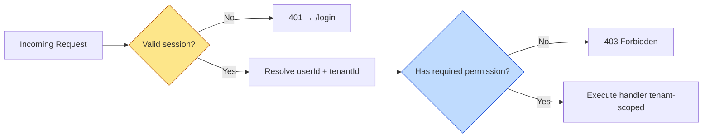
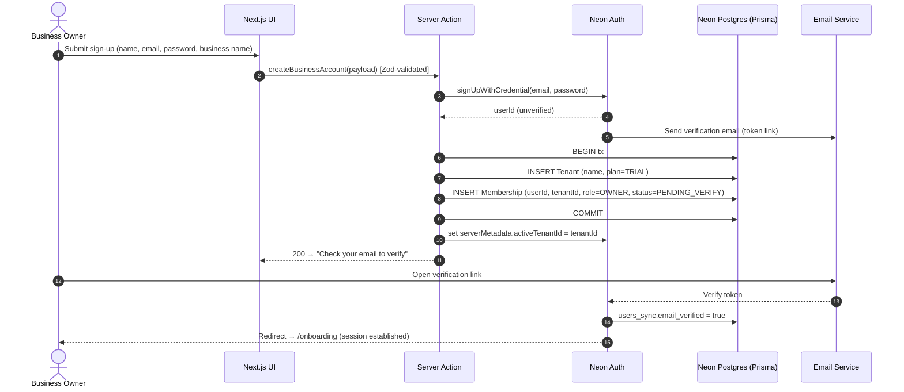
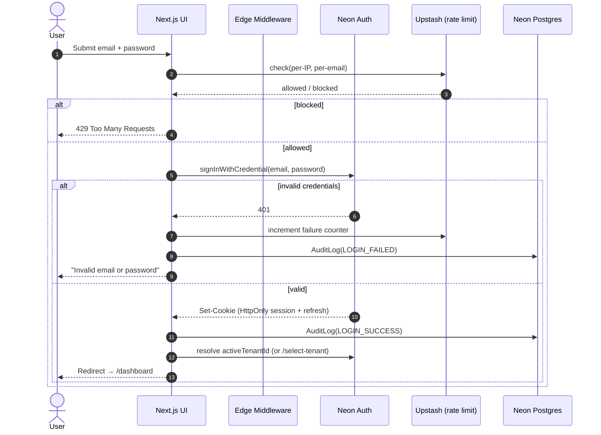
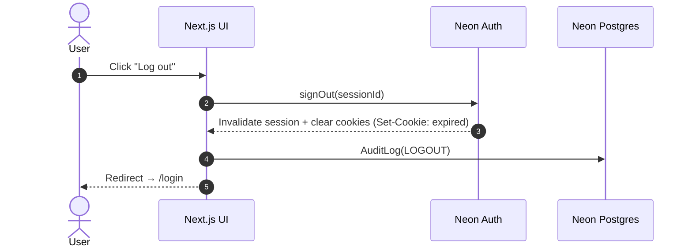
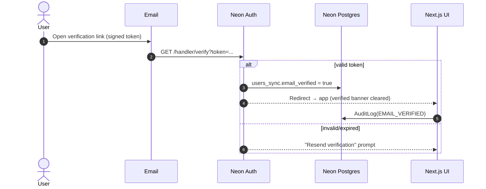
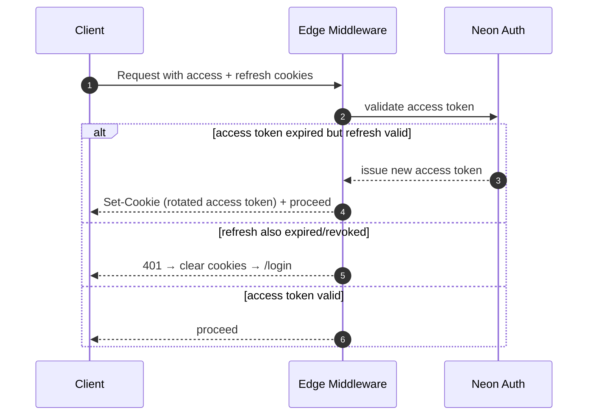
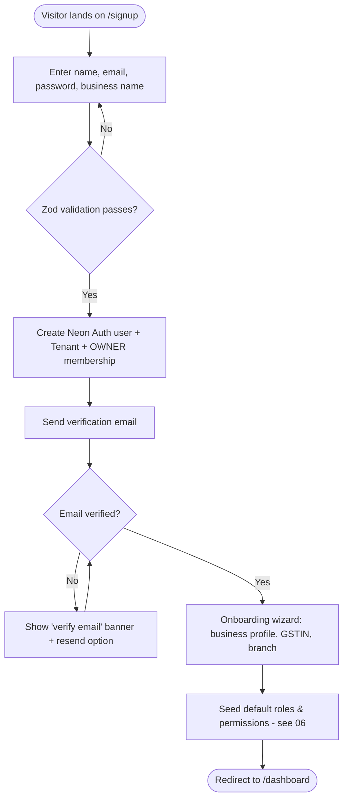
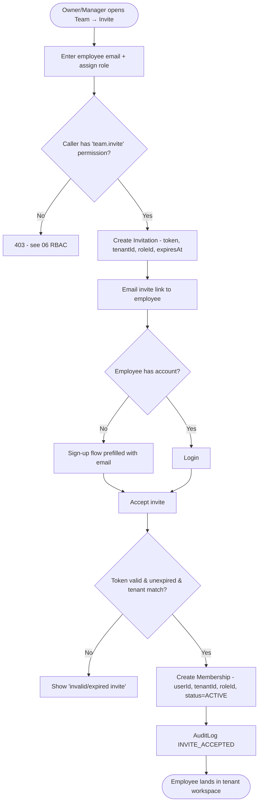
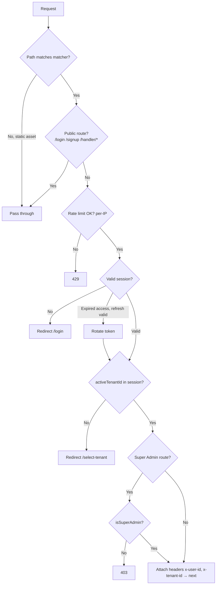

# 04 — Authentication & Security

> Engineering specification for identity, session management, and platform hardening of the Jewellery ERP SaaS Platform.
> Part of the [Engineering Documentation](../README.md) set.

---

## 1. Executive Summary

This document specifies **how users prove who they are (Authentication)** and how the platform is **hardened against attack**. It is the security backbone of a multi-tenant SaaS serving thousands of independent Indian jewellery businesses on a **shared Neon PostgreSQL** database, deployed on **Vercel** with **Next.js App Router**.

Authentication is delivered by **Neon Auth** — a first-party identity layer for Neon Postgres that provisions users, issues sessions, and synchronises the identity record into our own `neon_auth.users_sync` table so it can be joined to tenant data via Prisma. Authorization (what an authenticated user is *allowed* to do) is deliberately **out of scope here** and is specified in [06 — RBAC & Permissions](./06-RBAC-Permissions.md).

The security model assumes a hostile internet: every request is untrusted until a valid session is resolved, every session is bound to exactly one tenant, and every data access is tenant-scoped at the application layer. The document provides authentication flows (as Mermaid sequence diagrams), onboarding/invitation user flows, a middleware strategy that resolves tenant context from the session, a full **threat model with mitigations**, secure file-upload rules for **Cloudflare R2**, secrets management, audit logging of security events, security headers/CSP, an acceptance checklist, and an **OWASP Top 10 mapping**.

### Key Decisions

| Decision | Choice | Rationale |
|----------|--------|-----------|
| Identity provider | Neon Auth | Native to Neon Postgres; users are queryable from our DB, simplifying tenant joins |
| Session transport | HttpOnly, Secure, SameSite cookies | No token in JS → immune to XSS token theft |
| Route protection | Next.js Middleware (edge) + server-side re-check | Defence in depth; middleware is a gate, not the only guard |
| Tenant resolution | Derived from session server-side, never from client input | Prevents tenant spoofing / IDOR |
| Mutations | Server Actions + Route Handlers with Zod validation | CSRF-safe by default, mass-assignment-safe via whitelisting |
| Rate limiting | Upstash Redis via edge middleware | Serverless-friendly, per-IP + per-tenant |
| File storage | Private Cloudflare R2 buckets + presigned URLs | No public objects; time-boxed, scoped access |

---

## 2. Scope

### In Scope

- Neon Auth integration in the Next.js App Router (login, logout, password reset, email verification, sessions).
- Server-side retrieval of the authenticated user and injection of **tenant context**.
- Session lifecycle: cookies, expiry, refresh, revocation, concurrent sessions.
- Middleware strategy for route protection and tenant resolution.
- Threat model and mitigations: CSRF, XSS, SQL injection, rate limiting, brute force/account lockout, IDOR/tenant-scoping, mass assignment.
- Secure file uploads to Cloudflare R2.
- Secrets management and the API-auth model for future Android clients.
- Audit logging of **security events** and security headers/CSP/HSTS.

### Out of Scope

- **Authorization / RBAC / permission checks** → [06 — RBAC & Permissions](./06-RBAC-Permissions.md).
- Tenant lifecycle, subscriptions, feature flags → [05 — Multi-Tenancy](./05-Multi-Tenancy.md).
- Database schema for `User`, `Tenant`, `AuditLog`, `Membership` → [03 — Database Design](./03-Database-Design.md).
- Endpoint contracts and server-action signatures → [08 — Backend & API Specification](./08-Backend-API-Specification.md).
- Payment/gateway security, AI features, Android app implementation (Phase 1 out of scope per [README](../README.md)).

---

## 3. Assumptions

1. All traffic is served over **HTTPS**; Vercel terminates TLS and HSTS is enabled at the edge.
2. **Neon Auth** is the single source of truth for credentials; the platform never stores raw passwords. Password hashing, salting, and reset-token generation are handled by Neon Auth.
3. The `neon_auth.users_sync` table is available in the same Neon project/branch and readable by Prisma.
4. Every application user belongs to **exactly one active tenant per session** (a user with access to multiple businesses selects a tenant at login; the selection is bound into the session — see [05](./05-Multi-Tenancy.md)).
5. **Super Admin** is a platform-level actor whose sessions are *not* tenant-scoped and are gated by an additional guard.
6. Secrets live only in **Vercel Environment Variables** and are never bundled into client JavaScript.
7. Upstash Redis (or an equivalent edge-compatible store) is provisioned for rate limiting and lockout counters.
8. Cloudflare R2 buckets are **private**; objects are never served directly to the public.

---

## 4. Authentication vs Authorization

These are two distinct concerns. Conflating them is a common source of security bugs, so the platform keeps them in separate layers and separate documents.

| Aspect | Authentication (this doc) | Authorization (06 — RBAC) |
|--------|---------------------------|---------------------------|
| Question answered | "Who are you?" | "What are you allowed to do?" |
| Owner | Neon Auth + session middleware | RBAC permission engine |
| Failure response | `401 Unauthorized` → redirect to `/login` | `403 Forbidden` |
| Data produced | `userId`, `sessionId`, `tenantId` | `Permission[]` for the session |
| When evaluated | Edge middleware + server entry | Inside each server action / route handler |



The yellow gate (authN) is specified here. The blue gate (authZ) is specified in [06 — RBAC & Permissions](./06-RBAC-Permissions.md). **A request must pass authN before authZ is ever evaluated.**

---

## 5. Neon Auth Integration (Next.js App Router)

### 5.1 What Neon Auth Provides

Neon Auth is an identity layer bundled with Neon Postgres. It provides:

- **Hosted auth primitives**: sign-up, login, logout, password reset, email verification, and OAuth (future) — with UI components and server helpers for Next.js.
- **Session issuance**: cookie-based sessions with short-lived access tokens and refresh tokens managed by the SDK.
- **User synchronisation**: authenticated identities are mirrored into the `neon_auth.users_sync` table in our database, so a user row is **joinable to tenant data** in Prisma without a network hop to an external IdP.
- **Secure credential handling**: hashing, salting, reset-token issuance, and email delivery are handled internally — the application never sees a raw password.

### 5.2 Integration Surface

| Concern | Mechanism | Location |
|---------|-----------|----------|
| SDK config | `stackServerApp` / Neon Auth server client | `lib/auth/server.ts` |
| Client provider | `<StackProvider>` wrapper | `app/layout.tsx` |
| Auth handler routes | Catch-all handler for auth callbacks | `app/handler/[...stack]/route.ts` |
| Server user access | `getUser()` server helper | Server Components, Actions, Route Handlers |
| Route gating | Session read | `middleware.ts` |
| Env | Publishable + secret keys | Vercel env vars (§13) |

### 5.3 Obtaining the Authenticated User Server-Side

The platform **never trusts client-provided identity**. In every server context we resolve the user from the session cookie via the Neon Auth server client, then derive the tenant.

```ts
// lib/auth/session.ts
import { stackServerApp } from "@/lib/auth/server";
import { prisma } from "@/lib/db";
import { redirect } from "next/navigation";

/** Resolves the authenticated user + active tenant, or redirects to login. */
export async function requireSession() {
  const user = await stackServerApp.getUser();      // reads session cookie server-side
  if (!user) redirect("/login");

  // Active tenant is bound into the session at login (see §6, §7).
  const tenantId = user.serverMetadata?.activeTenantId as string | undefined;
  if (!tenantId) redirect("/select-tenant");

  // Confirm the user is an active member of that tenant (defence in depth).
  const membership = await prisma.membership.findFirst({
    where: { userId: user.id, tenantId, status: "ACTIVE" },
    select: { id: true, roleId: true },
  });
  if (!membership) redirect("/select-tenant");

  return { userId: user.id, tenantId, membershipId: membership.id };
}
```

> **Rule:** `tenantId` is **only** ever read from the resolved session/membership — never from a request body, query string, header, or path parameter. This single rule closes the largest class of multi-tenant IDOR bugs (§9.6).

### 5.4 Injecting Tenant Context

Every data-access call receives `tenantId` from `requireSession()` and passes it into a Prisma `where` clause. A thin repository layer enforces this so individual features cannot forget it.

```ts
// lib/db/tenant-scope.ts
export function tenantScoped(tenantId: string) {
  return {
    invoice: {
      list: () => prisma.invoice.findMany({ where: { tenantId } }),
      byId: (id: string) =>
        prisma.invoice.findFirst({ where: { id, tenantId } }), // id AND tenantId
    },
    // ...other repositories
  };
}
```

See [05 — Multi-Tenancy](./05-Multi-Tenancy.md) for the full tenant-context propagation model and [03 — Database Design](./03-Database-Design.md) for the `tenantId` columns and composite indexes.

---

## 6. Authentication Flows (Sequence Diagrams)

### 6.1 Sign-Up & Business Onboarding



### 6.2 Login



### 6.3 Logout



### 6.4 Password Reset

```mermaid
sequenceDiagram
    autonumber
    actor U as User
    participant UI as Next.js UI
    participant NA as Neon Auth
    participant Mail as Email Service
    participant DB as Neon Postgres

    U->>UI: "Forgot password" → enter email
    UI->>NA: sendPasswordResetEmail(email)
    NA->>Mail: Email with single-use, time-boxed reset token
    Note over NA,Mail: Response is identical whether or not the email exists (no user enumeration)
    Mail-->>U: Reset link
    U->>UI: Open link → enter new password
    UI->>NA: resetPassword(token, newPassword)
    alt token valid & unexpired
        NA-->>UI: Password updated; revoke all existing sessions
        UI->>DB: AuditLog(PASSWORD_RESET)
        UI-->>U: Redirect → /login
    else invalid/expired
        NA-->>UI: 400
        UI-->>U: "Link expired, request a new one"
    end
```

### 6.5 Email Verification



### 6.6 Session Refresh



---

## 7. User Flows (Flowcharts)

### 7.1 Onboarding a New Business Owner



### 7.2 Inviting Employees



---

## 8. Middleware Strategy

`middleware.ts` runs on the Vercel Edge for **every matched request**. It is the platform's first gate: it validates the session, refreshes tokens when needed, and resolves tenant context before a route renders. It is a **gate, not the only guard** — server actions and route handlers re-verify session, tenant, and permissions (defence in depth), because middleware can be bypassed by misconfiguration and does not run for direct server-action invocation paths.



```ts
// middleware.ts
import { NextResponse, type NextRequest } from "next/server";
import { stackServerApp } from "@/lib/auth/server";
import { ratelimit } from "@/lib/security/ratelimit";

const PUBLIC = [/^\/login/, /^\/signup/, /^\/handler\//, /^\/reset-password/];

export async function middleware(req: NextRequest) {
  const { pathname } = req.nextUrl;
  if (PUBLIC.some((re) => re.test(pathname))) return NextResponse.next();

  const ip = req.headers.get("x-forwarded-for") ?? "anon";
  const { success } = await ratelimit.limit(`mw:${ip}`);
  if (!success) return new NextResponse("Too Many Requests", { status: 429 });

  const user = await stackServerApp.getUser({ tokenStore: req });
  if (!user) return NextResponse.redirect(new URL("/login", req.url));

  const tenantId = user.serverMetadata?.activeTenantId as string | undefined;
  if (!tenantId) return NextResponse.redirect(new URL("/select-tenant", req.url));

  // Tenant context passed downstream via request headers (read-only signal).
  const res = NextResponse.next();
  res.headers.set("x-user-id", user.id);
  res.headers.set("x-tenant-id", tenantId);
  return res;
}

export const config = {
  matcher: ["/((?!_next/static|_next/image|favicon.ico|.*\\.(?:svg|png|jpg)).*)"],
};
```

> The `x-tenant-id` header is a **convenience signal only**. Server actions and route handlers still call `requireSession()` (§5.3) and re-resolve tenant from the session — never trusting the header, which a proxy could forge.

---

## 9. Threat Model & Mitigations

Threats are enumerated per category with concrete mitigations. Each maps to OWASP in §17.

### 9.1 CSRF (Cross-Site Request Forgery)

| Item | Detail |
|------|--------|
| Threat | Attacker's site triggers an authenticated state-changing request using the victim's cookies |
| Attack surface | Any mutation (create invoice, change role, delete product) |
| Mitigations | (1) **Next.js Server Actions** are POST-only with a built-in origin/action-id check that rejects cross-origin invocations. (2) Session cookies set **`SameSite=Lax`** (Strict for admin routes) so cross-site sub-requests omit them. (3) Route Handlers that mutate require an **Origin/Host match** check and, for non-idempotent verbs, a CSRF token bound to the session. (4) No state change on `GET`. |
| Residual risk | Low — SameSite + server-action origin checks are layered |
| Verification | Attempt cross-origin POST → expect rejection; automated test in CI |

### 9.2 XSS (Cross-Site Scripting)

| Item | Detail |
|------|--------|
| Threat | Injected script executes in a victim's browser, stealing data or acting as the user |
| Attack surface | Rich-text fields (product notes, customer remarks), rendered user content, invoice comments |
| Mitigations | (1) **React auto-escapes** all interpolated values. (2) `dangerouslySetInnerHTML` is banned by lint rule; where rich text is required, sanitise with **DOMPurify** on the server before persistence and again on render. (3) **Content-Security-Policy** (§16) blocks inline scripts and restricts sources. (4) Session token is **HttpOnly** → not readable by any script even if XSS occurs. (5) File names/paths sanitised before display. |
| Residual risk | Low |
| Verification | CSP report-only in staging; XSS payload fuzz tests on rich fields |

### 9.3 SQL Injection

| Item | Detail |
|------|--------|
| Threat | Malicious input alters a SQL query |
| Attack surface | Any DB query with user input |
| Mitigations | (1) **Prisma Client** parameterises all queries — no string concatenation. (2) `$queryRawUnsafe` is **banned**; only `$queryRaw` tagged templates (parameterised) are allowed, gated by review. (3) Zod validation coerces/limits input shapes before they reach the ORM. |
| Residual risk | Very low |
| Verification | Static scan for `Unsafe` raw calls in CI; injection payload tests on search endpoints |

### 9.4 Rate Limiting

| Item | Detail |
|------|--------|
| Threat | Credential stuffing, scraping, resource exhaustion (DoS) |
| Attack surface | `/login`, `/signup`, password reset, all API/route handlers |
| Mitigations | (1) **Upstash Redis** sliding-window limiter invoked from **edge middleware**. (2) **Per-IP** global limit + **per-tenant** limit + **per-email** limit on auth endpoints. (3) Stricter budgets on auth (`5/min/email`, `20/min/IP`) than on read APIs. (4) `429` with `Retry-After`. |
| Residual risk | Medium (distributed botnets) — layered with WAF/Vercel firewall |
| Verification | Load test confirms 429 thresholds; per-tenant isolation confirmed |

### 9.5 Brute Force / Account Lockout

| Item | Detail |
|------|--------|
| Threat | Repeated password guessing against a single account |
| Attack surface | `/login`, password reset |
| Mitigations | (1) Failure counter per email in Upstash; **progressive delay** then temporary lockout after N failures (e.g., 10 in 15 min). (2) Lockout window with exponential backoff. (3) Generic error message (no "user not found" vs "wrong password"). (4) `AuditLog(LOGIN_FAILED)` for alerting. (5) Future: CAPTCHA on repeated failures, 2FA (§15). |
| Residual risk | Low–medium |
| Verification | Simulated brute force triggers lockout; legitimate user recovery path works |

### 9.6 IDOR / Tenant-Scoping Enforcement

| Item | Detail |
|------|--------|
| Threat | User accesses another tenant's or user's record by manipulating an ID |
| Attack surface | Every resource endpoint that takes an `id` |
| Mitigations | (1) **`tenantId` always derived from the session**, never from client input (§5.3). (2) Every read/write filters on **`{ id, tenantId }` together** via the tenant-scoped repository (§5.4). (3) Cross-tenant access returns `404` (not `403`) to avoid confirming existence. (4) Composite DB indexes `(tenantId, id)` enforce the pattern — see [03](./03-Database-Design.md). (5) Future defence-in-depth: Postgres **RLS** (§15). |
| Residual risk | Low |
| Verification | Automated test: user A cannot fetch user B's/another tenant's invoice by ID |

### 9.7 Mass Assignment

| Item | Detail |
|------|--------|
| Threat | Client sends extra fields (`role`, `tenantId`, `isSuperAdmin`) to escalate privilege |
| Attack surface | Any create/update action |
| Mitigations | (1) **Zod schemas whitelist** exactly the accepted fields; unknown keys are **stripped** (`.strict()` / explicit `.pick`). (2) Server sets sensitive fields (`tenantId`, `roleId`, `createdBy`) from the session, never from payload. (3) Prisma `data` object built from the parsed, whitelisted result only. |
| Residual risk | Very low |
| Verification | Test: sending `isSuperAdmin: true` in a profile update is ignored |

```ts
// Mass-assignment safe update
const UpdateCustomer = z.object({
  name: z.string().min(1).max(120),
  phone: z.string().regex(/^\+?[0-9]{10,13}$/),
  notes: z.string().max(2000).optional(),
}).strict(); // unknown keys rejected

export async function updateCustomer(id: string, input: unknown) {
  const { tenantId } = await requireSession();          // server-derived
  const data = UpdateCustomer.parse(input);             // whitelist
  return prisma.customer.update({
    where: { id, tenantId },                            // tenant-scoped
    data,                                                // no tenantId/role from client
  });
}
```

---

## 10. Session Management

### 10.1 Cookie Attributes

| Attribute | Value | Purpose |
|-----------|-------|---------|
| `HttpOnly` | `true` | Cookie invisible to JavaScript → immune to XSS token theft |
| `Secure` | `true` | Sent only over HTTPS |
| `SameSite` | `Lax` (app), `Strict` (super-admin) | Blocks cross-site CSRF while allowing top-level navigation |
| `Path` | `/` | Scope to the app |
| `Domain` | app apex/subdomain | Bound to our host only |
| `Max-Age` | access ~15 min; refresh ~7–30 days | Short access token limits theft window |

### 10.2 Expiry, Refresh, Revocation

| Concern | Policy |
|---------|--------|
| Access token TTL | Short (~15 min); silently rotated by middleware on expiry (§6.6) |
| Refresh token TTL | Longer (7–30 days), **rotated on use** (refresh-token rotation) |
| Idle timeout | Session ends after configurable inactivity |
| Absolute timeout | Hard cap regardless of activity |
| Revocation | Logout, password reset, and role/permission change **invalidate sessions**; admin can force-revoke a user's sessions |
| Reuse detection | A replayed (already-rotated) refresh token revokes the whole session family |

### 10.3 Concurrent Sessions

| Item | Policy |
|------|--------|
| Multiple devices | Allowed by default (owner on desktop + mobile web) |
| Session registry | Active sessions listed in user security settings (device, IP, last-seen) |
| Selective revoke | User can revoke an individual session; admin can revoke all for a member |
| Tenant switch | Switching active tenant re-binds `activeTenantId` and is audit-logged |
| Sensitive change | Password/2FA change revokes **all other** sessions |

---

## 11. Secure File Uploads to Cloudflare R2

Files (product images, logos, KYC scans, invoice attachments) are stored in **private R2 buckets**. Clients never receive bucket credentials and never write to R2 directly with long-lived keys — uploads use short-lived **presigned URLs** issued by the server after validation.

```mermaid
sequenceDiagram
    autonumber
    actor U as User
    participant UI as Client
    participant SA as Server Action
    participant R2 as Cloudflare R2

    U->>UI: Select file
    UI->>SA: requestUpload(filename, contentType, size)
    SA->>SA: Validate: session, tenant, MIME allowlist, size cap
    SA->>SA: Build scoped key: tenants/{tenantId}/{resource}/{uuid}.{ext}
    SA->>R2: Create presigned PUT URL (short TTL, content-type + length pinned)
    R2-->>SA: Presigned URL
    SA-->>UI: { url, key }
    UI->>R2: PUT file directly (matches pinned type/length)
    R2-->>UI: 200
    UI->>SA: confirmUpload(key)
    SA->>SA: Re-verify object metadata (size, content-type); enqueue AV/MIME scan
    SA->>R2: (on scan pass) keep; (on fail) delete
    Note over SA: Read access later via short-lived presigned GET URL only
```

### 11.1 Upload Security Rules

| Control | Rule |
|---------|------|
| Buckets | **Private**; no public read; no public bucket policy |
| Access | Time-boxed **presigned URLs** (PUT to upload, GET to view), short TTL |
| Path scoping | Key prefix `tenants/{tenantId}/...` — a tenant can never address another tenant's path (server builds the key from session `tenantId`) |
| Content-type | **Allowlist** (`image/png`, `image/jpeg`, `image/webp`, `application/pdf`); presigned URL pins `Content-Type` so the client cannot deviate |
| Size | Max size enforced in presign (`Content-Length` range) and re-checked on confirm |
| MIME sniffing | Server verifies **magic bytes** match declared type (defeats renamed executables) |
| Virus scan | Async AV/mime scan on confirm; quarantine/delete on failure before the object is referenced |
| Filenames | Never trust client name for storage key; store as UUID; sanitise original name for display only |
| Serving | Files streamed via a server route that issues a presigned GET after an authZ check (see [06](./06-RBAC-Permissions.md)) |

---

## 12. API Authentication for Future Android Clients

Phase 1 is web-only, but APIs are designed to be reused by a future Android app ([README](../README.md)).

| Concern | Web (Phase 1) | Android (Future) |
|---------|---------------|------------------|
| Transport | HttpOnly cookies | **Bearer token** in `Authorization` header |
| Token issue | Neon Auth session on login | Neon Auth token exchange endpoint |
| Refresh | Cookie rotation | Refresh-token grant returning new bearer |
| CSRF | SameSite + server-action checks | N/A (no ambient cookies) — but strict origin/audience validation |
| Tenant | `activeTenantId` in session | `tenantId` claim bound at login, server re-validates membership |
| Revocation | Same session registry (§10) applies to both channels |

> The **same tenant-scoping and permission checks** run regardless of channel: the auth layer resolves `userId` + `tenantId` from either a cookie session or a validated bearer token, then hands off to the identical server logic. See [08 — Backend & API Specification](./08-Backend-API-Specification.md).

---

## 13. Secrets Management

| Rule | Detail |
|------|--------|
| Storage | All secrets in **Vercel Environment Variables**, scoped per environment (Production/Preview/Development) |
| Client exposure | Only `NEXT_PUBLIC_*` vars reach the browser bundle; **no** secret key is ever prefixed `NEXT_PUBLIC_` |
| Server-only | `NEON_AUTH_SECRET`, `DATABASE_URL`, `R2_ACCESS_KEY_ID`, `R2_SECRET_ACCESS_KEY`, `UPSTASH_REDIS_REST_TOKEN` are server-only |
| Local dev | `.env.local` is git-ignored; a committed `.env.example` documents keys without values |
| Rotation | Documented rotation runbook; rotate on staff offboarding and on suspected compromise; Neon/R2 keys rotated on a schedule |
| Least privilege | R2 keys scoped to specific buckets; DB connection uses least-privilege role |
| Leak detection | Secret-scanning in CI on every push |

### 13.1 Environment Variable Reference

| Variable | Scope | Purpose |
|----------|-------|---------|
| `DATABASE_URL` | Server | Neon Postgres (pooled) connection |
| `DIRECT_URL` | Server | Direct connection for Prisma migrations |
| `NEXT_PUBLIC_STACK_PROJECT_ID` | Client | Neon Auth project (public) |
| `NEXT_PUBLIC_STACK_PUBLISHABLE_CLIENT_KEY` | Client | Neon Auth publishable key (public) |
| `STACK_SECRET_SERVER_KEY` | Server | Neon Auth server secret |
| `R2_ACCOUNT_ID` / `R2_ACCESS_KEY_ID` / `R2_SECRET_ACCESS_KEY` | Server | Cloudflare R2 access |
| `R2_BUCKET` | Server | Private bucket name |
| `UPSTASH_REDIS_REST_URL` / `UPSTASH_REDIS_REST_TOKEN` | Server | Rate limiting + lockout store |

---

## 14. Audit Logging of Security Events

Security-relevant events are written to an append-only `AuditLog` table (schema in [03 — Database Design](./03-Database-Design.md)) and are surfaced to Business Owners/Super Admin. **Permission-change events** are co-owned with [06 — RBAC & Permissions](./06-RBAC-Permissions.md).

| Event | Trigger | Fields captured |
|-------|---------|-----------------|
| `LOGIN_SUCCESS` | Valid login | userId, tenantId, ip, userAgent, at |
| `LOGIN_FAILED` | Bad credentials | email (hashed), ip, userAgent, at |
| `LOGOUT` | Sign-out | userId, sessionId, at |
| `PASSWORD_RESET` | Reset completed | userId, ip, at |
| `EMAIL_VERIFIED` | Verification link | userId, at |
| `SESSION_REVOKED` | Manual/admin revoke | userId, sessionId, actorId, at |
| `INVITE_SENT` / `INVITE_ACCEPTED` | Employee onboarding | actorId, targetEmail, roleId, tenantId, at |
| `PERMISSION_CHANGED` | Role/permission edit → **see [06](./06-RBAC-Permissions.md)** | actorId, targetUserId, before, after, at |
| `TENANT_SWITCHED` | Active tenant change | userId, fromTenantId, toTenantId, at |
| `UPLOAD_REJECTED` | AV/MIME/size failure | userId, tenantId, key, reason, at |

Properties: **append-only**, tenant-scoped, PII-minimised (emails hashed on failure), immutable (no update/delete via app), and retained per policy. Anomalies (spikes in `LOGIN_FAILED`) feed alerting.

---

## 15. Security Headers, CSP, HTTPS/HSTS

Set globally via `next.config.js` headers / middleware.

| Header | Value (baseline) | Purpose |
|--------|------------------|---------|
| `Strict-Transport-Security` | `max-age=63072000; includeSubDomains; preload` | Force HTTPS (HSTS) |
| `Content-Security-Policy` | see below | Mitigate XSS / injection |
| `X-Content-Type-Options` | `nosniff` | Block MIME sniffing |
| `X-Frame-Options` | `DENY` | Anti-clickjacking (+ CSP `frame-ancestors`) |
| `Referrer-Policy` | `strict-origin-when-cross-origin` | Limit referrer leakage |
| `Permissions-Policy` | `camera=(), microphone=(), geolocation=()` | Disable unused APIs |
| `X-DNS-Prefetch-Control` | `off` | Reduce info leakage |

### 15.1 CSP Example

```
Content-Security-Policy:
  default-src 'self';
  script-src 'self' 'nonce-{RANDOM}';
  style-src 'self' 'unsafe-inline';
  img-src 'self' data: https://*.r2.cloudflarestorage.com;
  connect-src 'self' https://*.neon.tech https://*.upstash.io;
  font-src 'self';
  object-src 'none';
  base-uri 'self';
  form-action 'self';
  frame-ancestors 'none';
  upgrade-insecure-requests;
```

> Use a per-request **nonce** for inline scripts (Next.js supports nonce injection) rather than `unsafe-inline` on `script-src`. Roll out CSP in **Report-Only** mode first, collect violations, then enforce.

---

## 16. Acceptance Criteria — Security Checklist

| # | Criterion | Must hold |
|---|-----------|-----------|
| 1 | All routes except public allowlist require a valid session | ✅ |
| 2 | `tenantId` is never read from client input | ✅ |
| 3 | Every tenant-scoped query filters on `{ id, tenantId }` | ✅ |
| 4 | Session cookies are `HttpOnly` + `Secure` + `SameSite` | ✅ |
| 5 | Password reset revokes all existing sessions | ✅ |
| 6 | Login/reset are rate-limited per IP, email, and tenant | ✅ |
| 7 | Account lockout triggers after repeated failures | ✅ |
| 8 | No `$queryRawUnsafe` / no string-built SQL in codebase | ✅ |
| 9 | All mutations validate input with a strict Zod schema | ✅ |
| 10 | `dangerouslySetInnerHTML` only with server-side sanitisation | ✅ |
| 11 | CSP, HSTS, and core security headers present on all responses | ✅ |
| 12 | R2 buckets private; uploads via presigned URLs only | ✅ |
| 13 | Upload content-type/size/magic-byte validated; AV scan on confirm | ✅ |
| 14 | No secret is exposed via `NEXT_PUBLIC_*` | ✅ |
| 15 | Security events written to append-only audit log | ✅ |
| 16 | Cross-tenant access returns 404 and is logged | ✅ |
| 17 | Automated tests cover CSRF, IDOR, mass-assignment, rate limits | ✅ |

---

## 17. Future Enhancements

| Enhancement | Description |
|-------------|-------------|
| **2FA / MFA** | TOTP and email/SMS OTP as a second factor; enforced for Owner/Super Admin |
| **WebAuthn / Passkeys** | Phishing-resistant passwordless login |
| **SSO** | SAML/OIDC for enterprise jewellery chains (Google/Microsoft) |
| **Postgres RLS** | Row-Level Security as a second tenant-isolation layer beneath application scoping |
| **Anomaly detection** | ML-based impossible-travel / velocity alerts on login patterns |
| **Device trust** | Remembered-device fingerprinting to reduce MFA friction |
| **Secrets vault** | Move to a dedicated vault (e.g., Infisical/Doppler) with automated rotation |
| **WAF/Bot management** | Cloudflare/Vercel WAF rules and managed bot mitigation |

---

## 18. References

### 18.1 OWASP Top 10 (2021) Mapping

| OWASP Category | Where addressed |
|----------------|-----------------|
| A01 Broken Access Control | §9.6 IDOR/tenant-scoping; §8 middleware; [06 RBAC](./06-RBAC-Permissions.md) |
| A02 Cryptographic Failures | §10 cookies (Secure/HttpOnly); §15 HSTS; Neon Auth hashing |
| A03 Injection | §9.3 SQLi (Prisma); §9.2 XSS (CSP/escaping) |
| A04 Insecure Design | §4 authN/authZ separation; §9 threat model |
| A05 Security Misconfiguration | §15 headers/CSP; §13 secrets |
| A06 Vulnerable Components | CI dependency scanning; pinned versions ([12](./12-Coding-Standards.md)) |
| A07 Identification & Auth Failures | §5–§6 Neon Auth; §9.5 lockout; §10 sessions |
| A08 Software & Data Integrity | §11 upload validation/AV; §13 secret integrity |
| A09 Logging & Monitoring | §14 audit logging + alerting |
| A10 SSRF | §11 presigned URLs; strict `connect-src` CSP; no user-controlled server fetch |

### 18.2 Sibling Documents

- [01 — Product Requirements Document](./01-Product-Requirements-Document.md)
- [02 — System Architecture](./02-System-Architecture.md)
- [03 — Database Design](./03-Database-Design.md) — `User`, `Tenant`, `Membership`, `AuditLog` schemas
- [05 — Multi-Tenancy](./05-Multi-Tenancy.md) — tenant lifecycle & context propagation
- [06 — RBAC & Permissions](./06-RBAC-Permissions.md) — **Authorization** (the other half of access control)
- [08 — Backend & API Specification](./08-Backend-API-Specification.md) — endpoint contracts
- [12 — Coding Standards](./12-Coding-Standards.md) — lint rules enforcing these controls

### 18.3 External

- OWASP Top 10 (2021) — https://owasp.org/Top10/
- OWASP ASVS — Application Security Verification Standard
- OWASP Cheat Sheets — Session Management, CSRF, XSS Prevention, File Upload
- Neon Auth documentation — https://neon.tech/docs/neon-auth/overview
- Next.js — Middleware, Server Actions, Security headers
- MDN — `SameSite` cookies, Content-Security-Policy, Strict-Transport-Security

---

*This document specifies Authentication and platform Security only. For Authorization (roles, permissions, access decisions), see [06 — RBAC & Permissions](./06-RBAC-Permissions.md).*
