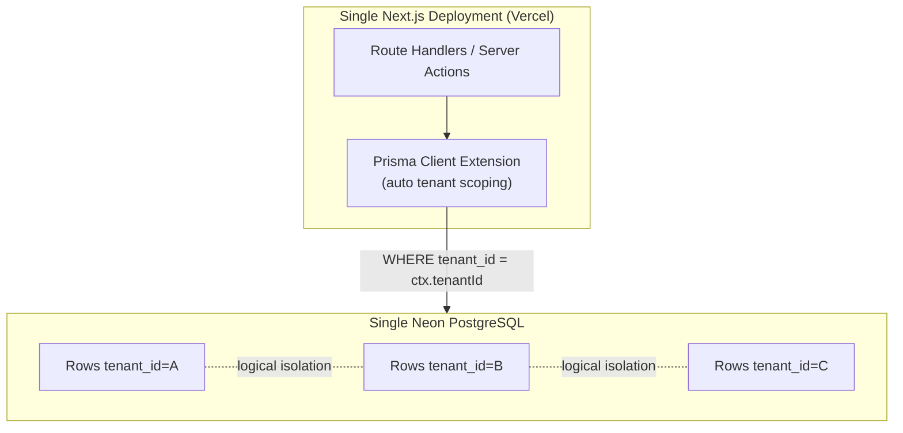
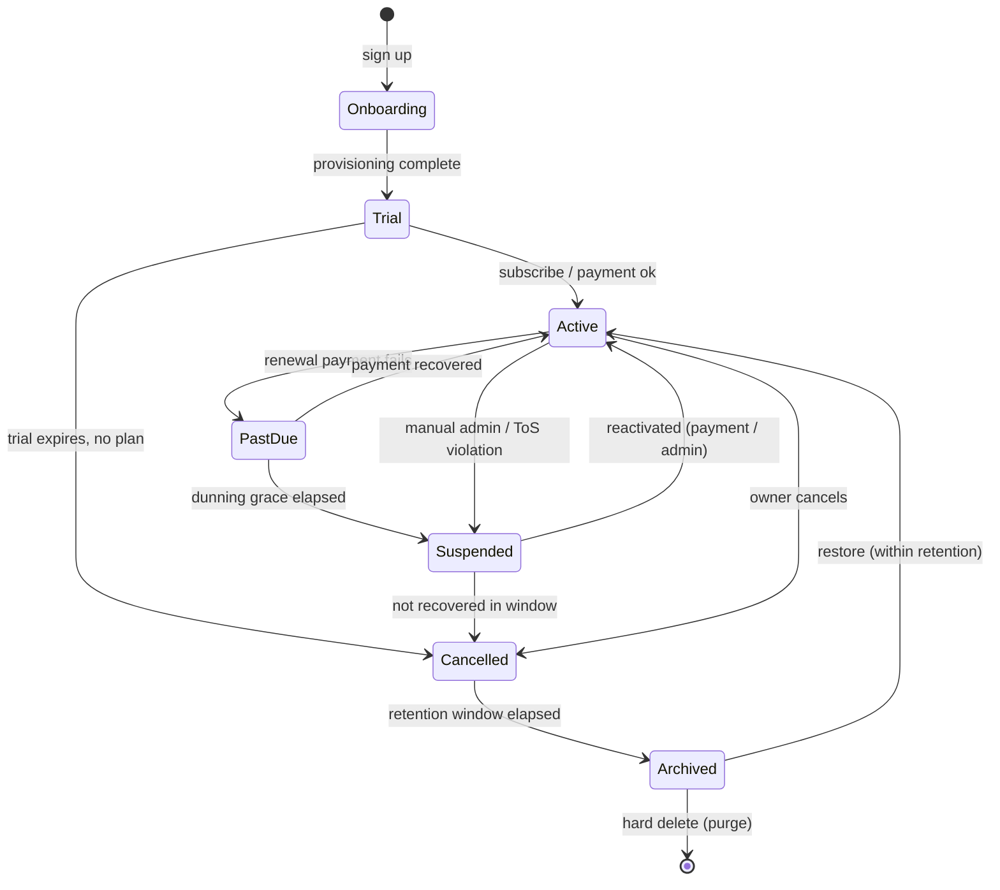
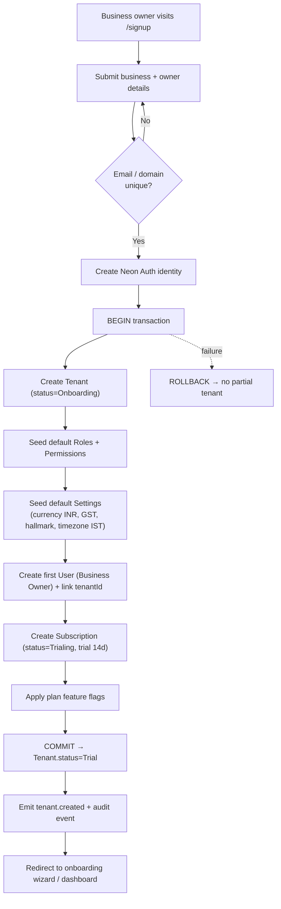
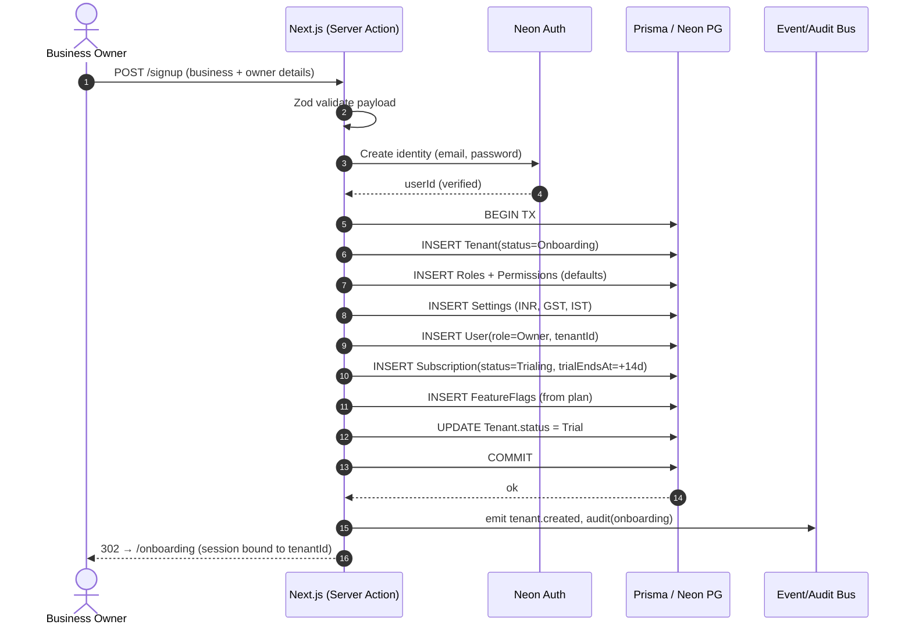
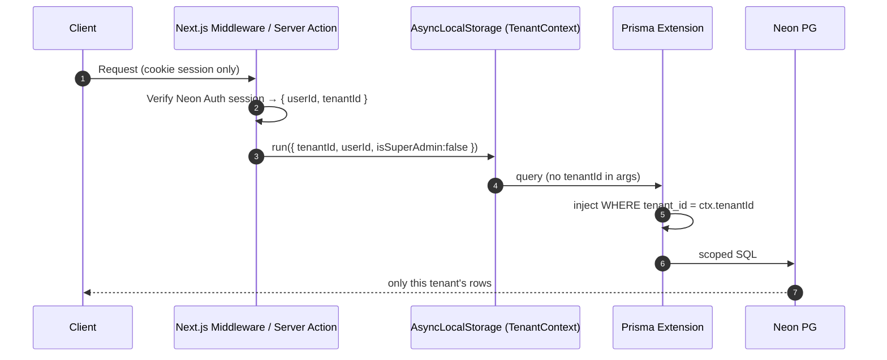
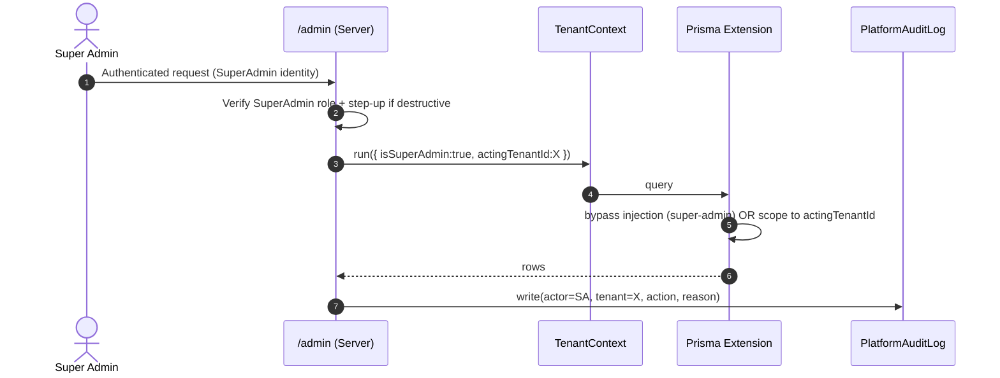
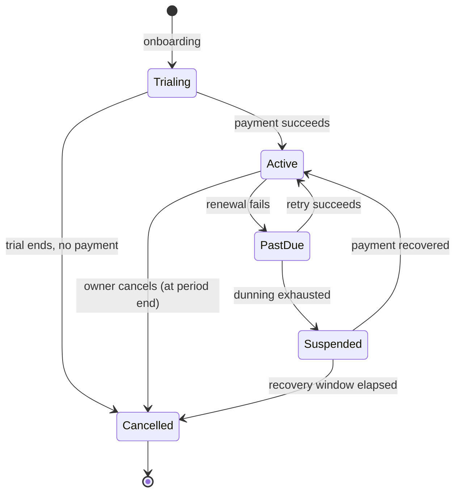
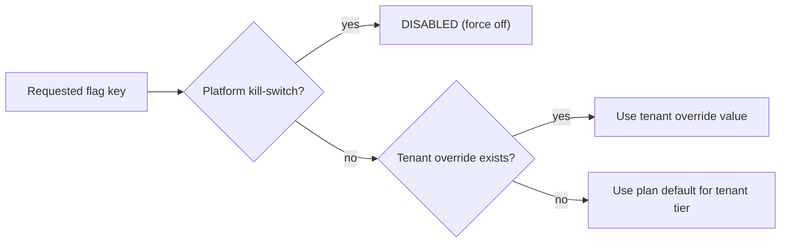
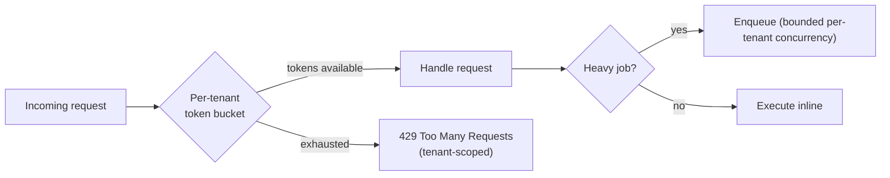

# 05 — Multi-Tenancy

> **Product:** Jewellery ERP SaaS Platform — cloud-native, multi-tenant SaaS for Indian jewellery businesses.
> **Phase:** Phase 1 (Next.js web only).
> **Status:** Engineering Specification — Approved for Implementation.
> **Owners:** Platform Engineering.
> **Related docs:** [01 — Architecture](./01-Architecture.md) · [02 — Auth](./02-Authentication.md) · [03 — RBAC & Data Model](./03-RBAC-Data-Model.md) · [04 — Platform, Observability & Rate Limiting](./04-Platform-Observability.md) · [06 — Billing & Payments](./06-Billing-Payments.md)

---

## 1. Executive Summary

Multi-tenancy is the foundational architectural property of this platform: a **single application deployment and a single PostgreSQL database serve many independent jewellery businesses (tenants) with complete logical data isolation**. Every business record — invoices, inventory items, customers, karigar (artisan) ledgers, payments — is stamped with a `tenantId`, and the application layer guarantees that no request can ever read or mutate data belonging to a tenant other than the one bound to the authenticated session.

We adopt the **shared database, shared schema, discriminator column (`tenant_id`)** model. This maximises operational simplicity, cost efficiency, and horizontal scalability across a long tail of small-to-medium Indian jewellery retailers, while isolation is enforced *in depth* through a Prisma Client extension, server-derived tenant context, tenant-scoped unique constraints, and automated cross-tenant leakage tests. Isolation is never delegated to the client.

This document specifies the tenancy model and its justification, the tenant and subscription lifecycles, the onboarding flow, the isolation enforcement mechanism (with representative TypeScript), super-admin cross-tenant access, plan-limit and feature-flag enforcement, audit and data-lifecycle strategy (including India's DPDP Act), noisy-neighbour fairness, acceptance criteria, and future enhancements.

---

## 2. Scope

### In Scope
- Tenancy model selection and justification (shared DB / shared schema / `tenant_id`).
- Tenant lifecycle state machine (signup → trial → active → past_due → suspended → cancelled → archived/deleted).
- Onboarding: tenant provisioning, seeding of default roles/permissions/settings, trial start, first admin user creation.
- Tenant isolation enforcement architecture (Prisma extension, server-side tenant context, defense-in-depth).
- Super Admin cross-tenant access (explicit, audited admin context).
- Subscription lifecycle, plans, and plan-limit enforcement (users, invoices/month, storage).
- Feature flags: per-plan defaults and per-tenant overrides.
- Audit strategy for tenant/subscription events.
- Data lifecycle: export, read-only suspension, deletion/retention, GDPR/DPDP considerations.
- Noisy-neighbour fairness and per-tenant rate limits.

### Out of Scope
- **Payment gateway implementation** (Razorpay/Stripe integration, webhooks, reconciliation) — only the *model and hooks* are specified here. See [06 — Billing & Payments](./06-Billing-Payments.md).
- Row-Level Security (RLS) enforcement at the Postgres layer (future enhancement — see §16).
- Per-tenant dedicated databases / region pinning (future enhancement — see §16).
- Detailed RBAC permission matrix (owned by [03 — RBAC & Data Model](./03-RBAC-Data-Model.md)).

---

## 3. Assumptions

| # | Assumption |
|---|-----------|
| A1 | Authentication is handled by **Neon Auth**; every authenticated request yields a verified user identity server-side. See [02 — Auth](./02-Authentication.md). |
| A2 | A single **Neon PostgreSQL** database backs all tenants in Phase 1; **Prisma** is the sole ORM/data-access path. Raw SQL is prohibited outside audited migrations. |
| A3 | All data access occurs server-side (Route Handlers / Server Actions). The browser never holds a database connection or a service-role credential. |
| A4 | A user belongs to exactly **one tenant** in Phase 1 (multi-tenant membership for accountants/franchises is a future enhancement). |
| A5 | `tenantId` is a UUID (`cuid`/`uuid`) and is **immutable** for the life of a record. |
| A6 | The Super Admin is a platform-level identity **not** attached to any tenant; cross-tenant access is an explicit, audited operation. |
| A7 | Deployment is on **Vercel**; object storage is **Cloudflare R2** with tenant-prefixed keys. |
| A8 | Indian data-protection law (**DPDP Act 2023**) governs personal data of tenant staff and end customers. |

---

## 4. Tenancy Model

### 4.1 Chosen Model — Shared DB, Shared Schema, `tenant_id` Discriminator

Every tenant-scoped table carries a non-null `tenant_id` foreign key referencing `Tenant.id`. All queries are transparently filtered by the current tenant context. This is the standard "pool" model for high-density B2B SaaS.



### 4.2 Justification vs Alternatives

| Criterion | **Shared DB + Shared Schema (`tenant_id`)** ✅ chosen | Schema-per-Tenant | Database-per-Tenant |
|-----------|:--:|:--:|:--:|
| **Isolation** | Logical (app-enforced; RLS-ready) | Strong (namespace) | Strongest (physical) |
| **Infra cost / tenant** | Lowest (shared pool) | Medium | Highest |
| **Operational overhead** | Lowest — one migration, one backup, one connection pool | High — N schemas to migrate & monitor | Very high — N DBs to provision/patch/back up |
| **Provisioning speed** | Instant (INSERT a row) | Slow (DDL per tenant) | Slowest (DB provisioning) |
| **Scale — many small tenants** | Excellent (thousands of tenants) | Degrades (schema/catalog bloat, migration fan-out) | Poor (connection & cost explosion) |
| **Scale — one huge tenant** | Needs sharding/partitioning | Good | Excellent |
| **Cross-tenant analytics** | Trivial (single query) | Hard (UNION across schemas) | Hardest (federation) |
| **Blast radius of a bug** | Higher — requires disciplined enforcement | Contained | Fully contained |
| **Noisy neighbour** | Requires app-level fairness (§14) | Partial | Fully isolated |

**Decision rationale.** The target market is a long tail of independent Indian jewellery shops — many tenants, each with modest data volume. The pool model gives near-zero marginal provisioning cost, single-migration operations, and simple cross-tenant platform analytics. The principal weakness — reliance on the application for isolation — is mitigated by defense-in-depth (§7) and a forward path to Postgres **Row-Level Security** and **per-tenant databases for large tenants** (§16). This yields the best cost/scale profile for Phase 1 without foreclosing stronger isolation later.

---

## 5. Tenant Lifecycle

### 5.1 State Diagram



### 5.2 State Table

| State | Description | Allowed Transitions | System Effects |
|-------|-------------|---------------------|----------------|
| **Onboarding** | Tenant record created; provisioning in progress. | → Trial | No login until seeding completes; not yet billable. |
| **Trial** | Fully functional; time-boxed (default 14 days). | → Active, → Cancelled | Full read/write; trial banner; plan limits = trial plan. |
| **Active** | Paid, in good standing. | → PastDue, → Suspended, → Cancelled | Full access per plan limits and feature flags. |
| **PastDue** | Renewal payment failed; in dunning grace (default 7 days). | → Active, → Suspended | Full access retained; persistent payment-required warning; retries scheduled. |
| **Suspended** | Access frozen (non-payment / violation). | → Active, → Cancelled | **Read-only** access; writes blocked (HTTP 402/403); exports still allowed. |
| **Cancelled** | Subscription terminated (voluntary or terminal dunning). | → Archived | Login disabled for staff; data retained for retention window; export available on request. |
| **Archived** | Soft-deleted; excluded from all normal queries. | → Active (restore), → *(purge)* | Data retained but inaccessible; scheduled for hard delete after retention. |
| **Deleted (purged)** | Hard-deleted per retention/DPDP erasure. | — (terminal) | All PII purged; only anonymised audit/financial-compliance records retained. |

State is stored on `Tenant.status`; every transition is written to the audit log (§12) with actor, reason, and timestamp.

---

## 6. Onboarding Flow

### 6.1 Flowchart



### 6.2 Sequence Diagram



**Atomicity.** Tenant, roles, settings, first user, and subscription are created in a **single transaction**. Any failure rolls back completely — no orphaned tenant, no half-seeded state. The tenant only becomes `Trial` (and loginable) after commit.

---

## 7. Tenant Isolation Strategy (In Depth)

Isolation is enforced by **five layered controls**; each is independently sufficient to prevent a class of leak, and together they provide defense in depth.

### 7.1 Layer 1 — `tenant_id` on Every Tenant-Scoped Table
Every business entity (`Invoice`, `Customer`, `Product`, `StockItem`, `Payment`, `LedgerEntry`, `Role`, `Setting`, …) has a non-null `tenantId`. Platform-global tables (`Tenant`, `Plan`, `SuperAdmin`, `AuditLog` for platform events) are the only exceptions.

### 7.2 Layer 2 — Server-Derived Tenant Context (Never Trust the Client)
`tenantId` is resolved **server-side** from the Neon Auth session on every request and placed into an `AsyncLocalStorage` request context. **The client never supplies `tenantId`**; any `tenantId` in a request body is ignored and flagged.



### 7.3 Layer 3 — Prisma Client Extension (Auto-Scoping)
A Prisma Client extension intercepts **all** model operations: it **injects** `tenantId` into `where` on reads/updates/deletes and **sets** `tenantId` on writes, using the server context. Application code never writes `where: { tenantId }` by hand, eliminating the most common human-error leak.

```ts
// lib/db/tenant-context.ts
import { AsyncLocalStorage } from "node:async_hooks";

export interface TenantContext {
  tenantId: string;
  userId: string;
  isSuperAdmin: boolean;
}

export const tenantStore = new AsyncLocalStorage<TenantContext>();

export function getTenantContext(): TenantContext {
  const ctx = tenantStore.getStore();
  if (!ctx) throw new Error("No tenant context bound to this request");
  return ctx;
}
```

```ts
// lib/db/prisma.ts
import { PrismaClient } from "@prisma/client";
import { getTenantContext } from "./tenant-context";

// Models that are platform-global and must NOT be tenant-scoped.
const GLOBAL_MODELS = new Set(["Tenant", "Plan", "SuperAdmin", "PlatformAuditLog"]);

// Write ops that must stamp tenantId.
const WRITE_OPS = new Set(["create", "createMany", "upsert"]);
// Ops whose `where` must be tenant-filtered.
const FILTER_OPS = new Set([
  "findFirst", "findMany", "findUnique", "update", "updateMany",
  "delete", "deleteMany", "count", "aggregate", "groupBy",
]);

const base = new PrismaClient();

export const prisma = base.$extends({
  query: {
    $allModels: {
      async $allOperations({ model, operation, args, query }) {
        // Platform-global models are exempt.
        if (!model || GLOBAL_MODELS.has(model)) return query(args);

        const { tenantId, isSuperAdmin } = getTenantContext();

        // Super Admin uses an explicit, audited path (see §8) — bypass here
        // only when an explicit cross-tenant admin context is active.
        if (isSuperAdmin) return query(args);

        const a: any = args ?? {};

        // Defense in depth: reject any client-supplied tenantId mismatch.
        if (a?.where?.tenantId && a.where.tenantId !== tenantId) {
          throw new Error("Cross-tenant access denied");
        }
        if (a?.data?.tenantId && a.data.tenantId !== tenantId) {
          throw new Error("Cross-tenant write denied");
        }

        // Inject tenant filter on reads/updates/deletes.
        if (FILTER_OPS.has(operation)) {
          a.where = { ...(a.where ?? {}), tenantId };
        }

        // Stamp tenantId on writes.
        if (WRITE_OPS.has(operation)) {
          if (operation === "createMany") {
            a.data = (Array.isArray(a.data) ? a.data : [a.data]).map(
              (d: any) => ({ ...d, tenantId })
            );
          } else if (operation === "upsert") {
            a.create = { ...(a.create ?? {}), tenantId };
            a.update = { ...(a.update ?? {}) };
            a.where = { ...(a.where ?? {}), tenantId };
          } else {
            a.data = { ...(a.data ?? {}), tenantId };
          }
        }

        return query(a);
      },
    },
  },
});
```

> `findUnique` with the injected `tenantId` may require a compound unique key (see §7.4). Where a bare primary-key lookup is unavoidable, route it through `findFirst` so the tenant filter composes with `AND`.

### 7.4 Layer 4 — Tenant-Scoped Unique Constraints
Uniqueness that is "per tenant" (e.g., invoice number, SKU, GSTIN alias) must be enforced by **compound unique indexes** including `tenantId`, never by a global unique column:

```prisma
model Invoice {
  id        String @id @default(cuid())
  tenantId  String
  number    String
  // ...
  @@unique([tenantId, number])   // invoice numbers unique WITHIN a tenant
  @@index([tenantId, createdAt])
}
```

### 7.5 Layer 5 — Automated Cross-Tenant Leakage Tests
CI runs a suite that seeds ≥2 tenants and asserts, for every tenant-scoped model, that Tenant A's context can never read/update/delete Tenant B's rows, that missing context throws, and that a spoofed `tenantId` in args is rejected. See acceptance checklist (§15).

---

## 8. Super Admin Cross-Tenant Access

The Super Admin (platform owner) operates **outside** any tenant and must occasionally read across or act on a tenant (support, migrations, forensic audit). This bypass is **explicit, scoped, and fully audited** — never implicit.

- **Explicit context.** A separate entry path (`/admin`, authenticated as a `SuperAdmin` identity) constructs a context with `isSuperAdmin: true`. Only in this context does the Prisma extension skip tenant injection.
- **Scoped, not blanket.** Cross-tenant actions target an explicit `tenantId` chosen by the admin; the admin session records *which* tenant is being impersonated/inspected. "Act as tenant X" binds a normal tenant context (so the same isolation rules apply) rather than a global bypass.
- **Audited.** Every super-admin read/write of tenant data emits a `PlatformAuditLog` entry (actor = super-admin id, target tenant, action, before/after where applicable, reason, request id). See [03 — RBAC & Data Model](./03-RBAC-Data-Model.md) and [04 — Platform & Observability](./04-Platform-Observability.md).
- **Least privilege.** Destructive cross-tenant operations require step-up (re-auth) and are gated behind a dedicated permission.



---

## 9. Subscription Lifecycle & Plans

### 9.1 Data Model (reference)

```prisma
model Plan {
  id            String   @id @default(cuid())
  tier          PlanTier // FREE_TRIAL | STARTER | GROWTH | ENTERPRISE
  name          String
  priceMonthly  Int      // in paise (INR); 0 for trial
  priceYearly   Int
  maxUsers      Int
  maxInvoices   Int      // per month; -1 = unlimited
  maxStorageMb  Int
  featureFlags  Json     // default flags for this tier
  subscriptions Subscription[]
}

model Subscription {
  id           String   @id @default(cuid())
  tenantId     String   @unique
  planId       String
  status       SubStatus // TRIALING | ACTIVE | PAST_DUE | SUSPENDED | CANCELLED
  currentStart DateTime
  currentEnd   DateTime
  trialEndsAt  DateTime?
  cancelAt     DateTime?
  // Payment-gateway hooks (impl out of scope — see doc 06)
  gatewayCustomerId String?
  gatewaySubId      String?
  tenant       Tenant  @relation(fields: [tenantId], references: [id])
  plan         Plan    @relation(fields: [planId], references: [id])
}
```

### 9.2 Subscription State Diagram



> Subscription status drives — but is distinct from — `Tenant.status` (§5). A webhook from the payment gateway (out of scope; see [06 — Billing & Payments](./06-Billing-Payments.md)) transitions subscription status; a reconciler propagates the corresponding tenant-status effect (e.g., `PastDue`→`Suspended` makes the tenant read-only).

### 9.3 Plan Tiers → Feature Flags / Limits

| Capability / Limit | Free Trial | Starter | Growth | Enterprise |
|--------------------|:---:|:---:|:---:|:---:|
| Price (₹/mo) | 0 (14 days) | 999 | 2,499 | Custom |
| Max users | 3 | 5 | 20 | Unlimited |
| Invoices / month | 100 | 500 | 5,000 | Unlimited (fair use) |
| Storage | 500 MB | 2 GB | 20 GB | Custom |
| GST invoicing | ✅ | ✅ | ✅ | ✅ |
| Inventory + hallmark tracking | ✅ | ✅ | ✅ | ✅ |
| Karigar / artisan ledger | ✅ | ✅ | ✅ | ✅ |
| Multi-branch | ❌ | ❌ | ✅ | ✅ |
| Advanced analytics / reports | ❌ | Basic | ✅ | ✅ |
| API access | ❌ | ❌ | ✅ | ✅ |
| Priority support / SLA | ❌ | ❌ | ❌ | ✅ |
| Per-tenant DB (future) | ❌ | ❌ | ❌ | ✅ |

### 9.4 Plan-Limit Enforcement

Limits are enforced **at the write path**, server-side, before the mutation commits:

| Limit | Enforcement point | Behaviour on breach |
|-------|-------------------|---------------------|
| Max users | Invite/create user server action | Block with upgrade prompt (HTTP 402) |
| Invoices/month | Invoice create action; counter keyed `(tenantId, YYYY-MM)` | Block further creation; suggest upgrade |
| Storage (MB) | R2 upload pre-check + async usage tally | Block upload when over quota |
| Feature gates | Flag check (§10) in UI + API | Hide UI + reject API 403 `feature_disabled` |

Usage counters are maintained per tenant and evaluated against the tenant's current `Plan`. Suspended tenants are forced read-only regardless of plan.

---

## 10. Feature Flags

Feature availability = **per-plan defaults** overlaid with **per-tenant overrides**. This lets us (a) ship a capability to a whole tier, and (b) enable/disable a flag for a single tenant (early access, incident kill-switch, bespoke enterprise deal).

### 10.1 Model (reference — see [03 — RBAC & Data Model](./03-RBAC-Data-Model.md))

```prisma
model FeatureFlag {
  id        String  @id @default(cuid())
  tenantId  String            // per-tenant override row
  key       String            // e.g. "multi_branch", "api_access"
  enabled   Boolean
  source    FlagSource        // PLAN_DEFAULT | TENANT_OVERRIDE | PLATFORM_KILL
  @@unique([tenantId, key])
  @@index([tenantId])
}
```

### 10.2 Resolution Order



Precedence: **Platform kill-switch → Tenant override → Plan default**. Flags are resolved once per request, cached in the request context, and exposed to both the UI (to hide/disable controls) and the API (to reject disabled features with `403 feature_disabled`). UI gating is a UX affordance only — the **API check is authoritative**.

---

## 11. (reserved)

---

## 12. Audit Strategy for Tenant & Subscription Events

All lifecycle and billing state changes are auditable. Audit records are **append-only** and tenant-scoped (plus a platform stream for super-admin actions). Detailed audit schema and retention live in [03 — RBAC & Data Model](./03-RBAC-Data-Model.md) and [04 — Platform & Observability](./04-Platform-Observability.md).

| Event | Emitted when | Key fields |
|-------|-------------|-----------|
| `tenant.created` | Onboarding commit | tenantId, ownerUserId, plan |
| `tenant.status_changed` | Any §5 transition | from, to, reason, actor |
| `subscription.status_changed` | Any §9 transition | from, to, gatewaySubId |
| `subscription.plan_changed` | Upgrade/downgrade | oldPlan, newPlan, effectiveAt |
| `feature_flag.changed` | Override/kill-switch set | key, enabled, source, actor |
| `tenant.suspended` / `tenant.reactivated` | Read-only toggle | reason, actor |
| `tenant.exported` | Data export produced | requestedBy, artifactUri |
| `tenant.deleted` | Hard purge | retentionPolicy, purgedAt |
| `superadmin.cross_tenant_access` | Any super-admin tenant op | actor, targetTenant, action, reason |

Every entry carries `actorId`, `tenantId` (or `targetTenantId`), `requestId`, `ip`, `timestamp`, and immutable before/after where applicable.

---

## 13. Data Lifecycle & Compliance (GDPR / DPDP)

### 13.1 Lifecycle Operations

| Operation | Trigger | Behaviour |
|-----------|---------|-----------|
| **Export** | Owner request or pre-cancellation | Full tenant dataset exported (JSON/CSV + R2 artifacts) to a signed, time-limited URL. Audited (`tenant.exported`). |
| **Suspension (read-only)** | `Suspended` state (§5) | All write paths blocked (402/403); reads and exports permitted; scheduled jobs paused. |
| **Cancellation** | Owner or terminal dunning | Staff logins disabled; data retained during retention window; export available on request. |
| **Deletion / Retention** | Retention window elapses (default 30 days post-cancel) or explicit erasure request | Personal data purged/anonymised; financial records required by Indian tax law retained in anonymised form for statutory period. Audited (`tenant.deleted`). |

### 13.2 DPDP Act 2023 (India) & GDPR Considerations
- **Data Principal rights.** Support access, correction, and **erasure** requests for personal data of tenant staff and end customers; erasure honoured within the deletion path above, subject to statutory financial-record retention.
- **Purpose limitation & minimisation.** Only data necessary for billing and ERP operation is collected; `tenant_id` scoping ensures processing stays within tenant boundary.
- **Data Fiduciary / Processor.** The platform is a **Data Processor** for tenant business data (tenant is Fiduciary) and a **Fiduciary** for platform account data.
- **Localisation & transfer.** Region pinning for Indian data residency is a future enhancement (§16); R2 bucket region is documented per compliance posture.
- **Breach notification & audit.** All access to personal data is auditable (§12); the audit trail supports breach investigation and regulator reporting.
- **Consent & children's data.** Consent capture for end-customer marketing data is deferred to product but modelled as a per-record flag.

---

## 14. Noisy-Neighbour Fairness & Per-Tenant Rate Limits

Because tenants share a database and compute pool, one tenant must not degrade others.

- **Per-tenant rate limits.** API and write throughput are limited per `tenantId` (token-bucket keyed by tenant), independent of per-user limits. Detailed limiter config lives in [04 — Platform & Observability](./04-Platform-Observability.md).
- **Query fairness.** Expensive reports run through bounded, per-tenant concurrency; heavy exports are queued and rate-limited.
- **Connection pooling.** Neon's pooled connections are shared; no single tenant can exhaust the pool because work is bounded per tenant.
- **Fair-use on "unlimited" tiers.** Enterprise "unlimited" invoices are subject to documented fair-use thresholds that trigger review rather than hard blocks.
- **Isolation of failures.** A tenant hitting a limit receives `429`/`402`; other tenants are unaffected.



---

## 15. Acceptance Criteria — Isolation Test Checklist

A build is releasable only if **all** of the following pass in CI:

- [ ] **AC-1** Every tenant-scoped Prisma model has a non-null `tenantId` column and at least one `tenantId`-prefixed index. (Schema lint.)
- [ ] **AC-2** With Tenant A context, no `find*`/`count`/`aggregate` returns any row where `tenantId = B`.
- [ ] **AC-3** With Tenant A context, `update`/`delete` targeting a Tenant B primary key affects **0 rows** (or throws).
- [ ] **AC-4** A request body containing an explicit `tenantId` different from the session tenant is **rejected** (never honoured).
- [ ] **AC-5** Missing tenant context (no session) causes data access to **throw**, never to run unscoped.
- [ ] **AC-6** All "per-tenant unique" fields use compound `@@unique([tenantId, …])`; global uniqueness is not used for tenant data. (Schema lint.)
- [ ] **AC-7** Writes (`create`/`createMany`/`upsert`) always stamp the session `tenantId`; a create cannot persist another tenant's id.
- [ ] **AC-8** Super-admin cross-tenant access requires `isSuperAdmin` context **and** emits a `superadmin.cross_tenant_access` audit entry.
- [ ] **AC-9** Onboarding is atomic: an induced failure mid-seed leaves **no** partial tenant.
- [ ] **AC-10** Plan-limit breaches (users, invoices/month, storage) are blocked server-side with the correct status code.
- [ ] **AC-11** Feature-flag resolution honours precedence (kill-switch > tenant override > plan default) and the API rejects disabled features even if UI is bypassed.
- [ ] **AC-12** A `Suspended` tenant is fully read-only: all write paths return 402/403; reads/exports succeed.
- [ ] **AC-13** Cross-tenant leakage test exists for **each** tenant-scoped model (not a sampled subset).
- [ ] **AC-14** Deletion path purges/anonymises PII and preserves statutorily required financial records.

---

## 16. Future Enhancements

| # | Enhancement | Rationale |
|---|-------------|-----------|
| F1 | **Postgres Row-Level Security (RLS)** | Enforce `tenant_id` at the database layer as a second wall behind the Prisma extension; set `app.tenant_id` per connection/transaction. |
| F2 | **Per-tenant database for large/Enterprise tenants** | Physically isolate and independently scale the largest tenants; hybrid pool + silo model. |
| F3 | **Region pinning / data residency** | Pin Indian-resident tenants to an India region for DPDP localisation; per-tenant R2 bucket region. |
| F4 | **Multi-tenant user membership** | Allow accountants/franchise operators to belong to several tenants with a tenant switcher. |
| F5 | **Automated dunning + payment gateway** | Full Razorpay/Stripe integration and webhook-driven subscription transitions (see [06 — Billing & Payments](./06-Billing-Payments.md)). |
| F6 | **Table partitioning by `tenant_id`** | Partition hot tables to preserve performance as the pool grows to thousands of tenants. |
| F7 | **Tenant-level encryption keys (BYOK)** | Per-tenant KMS keys for envelope encryption of sensitive fields, for enterprise compliance. |

---

## 17. References

- [01 — Architecture](./01-Architecture.md)
- [02 — Authentication (Neon Auth)](./02-Authentication.md)
- [03 — RBAC & Data Model](./03-RBAC-Data-Model.md)
- [04 — Platform, Observability & Rate Limiting](./04-Platform-Observability.md)
- [06 — Billing & Payments](./06-Billing-Payments.md)
- Prisma Client Extensions — https://www.prisma.io/docs/orm/prisma-client/client-extensions
- Neon Postgres & Neon Auth — https://neon.tech/docs
- PostgreSQL Row-Level Security — https://www.postgresql.org/docs/current/ddl-rowsecurity.html
- Digital Personal Data Protection Act, 2023 (India) — https://www.meity.gov.in/data-protection-framework
- SaaS Tenancy Models (Microsoft guidance) — https://learn.microsoft.com/azure/architecture/guide/multitenant/considerations/tenancy-models

---

*End of 05 — Multi-Tenancy.*
