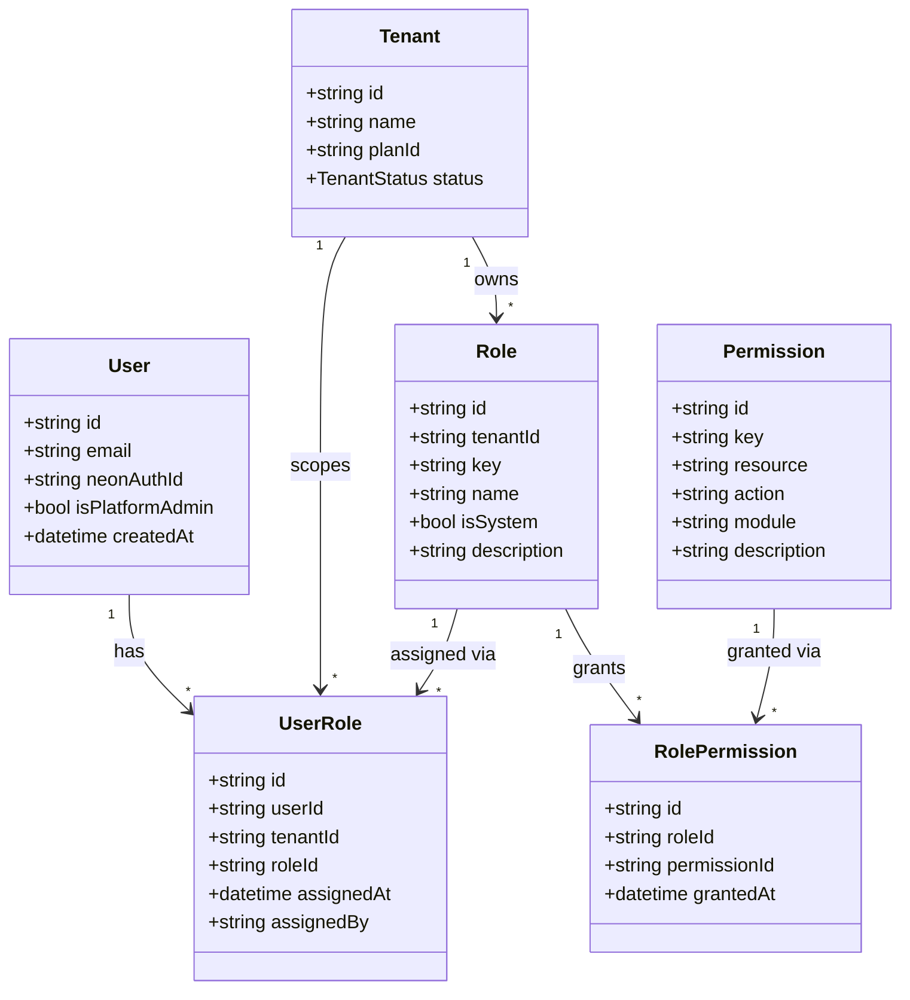
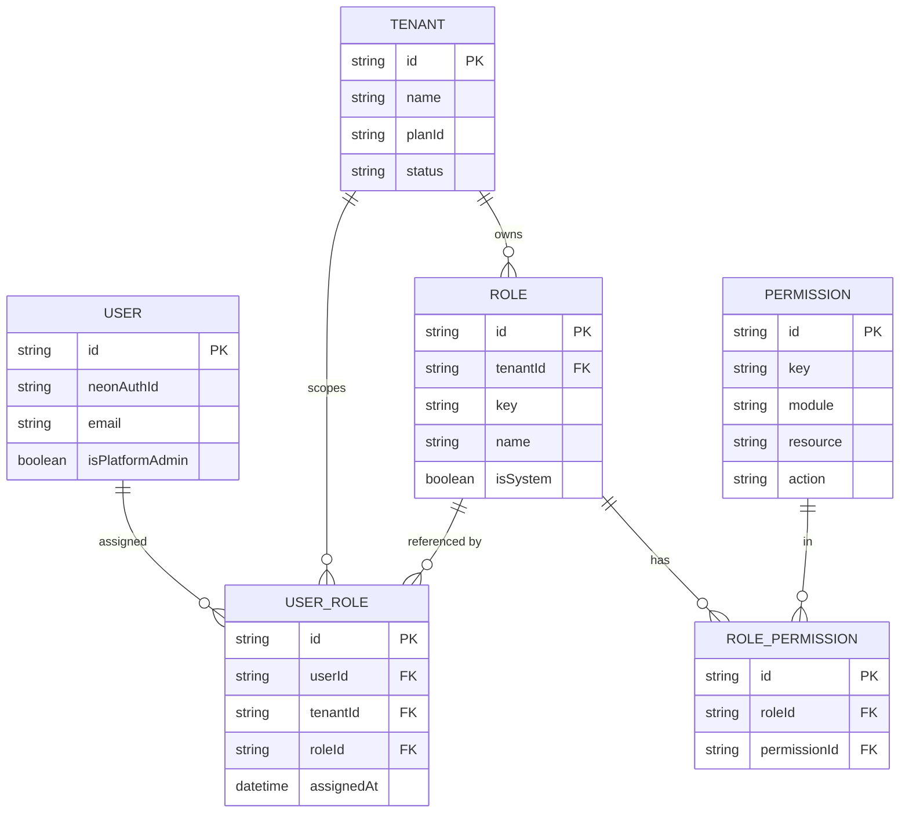
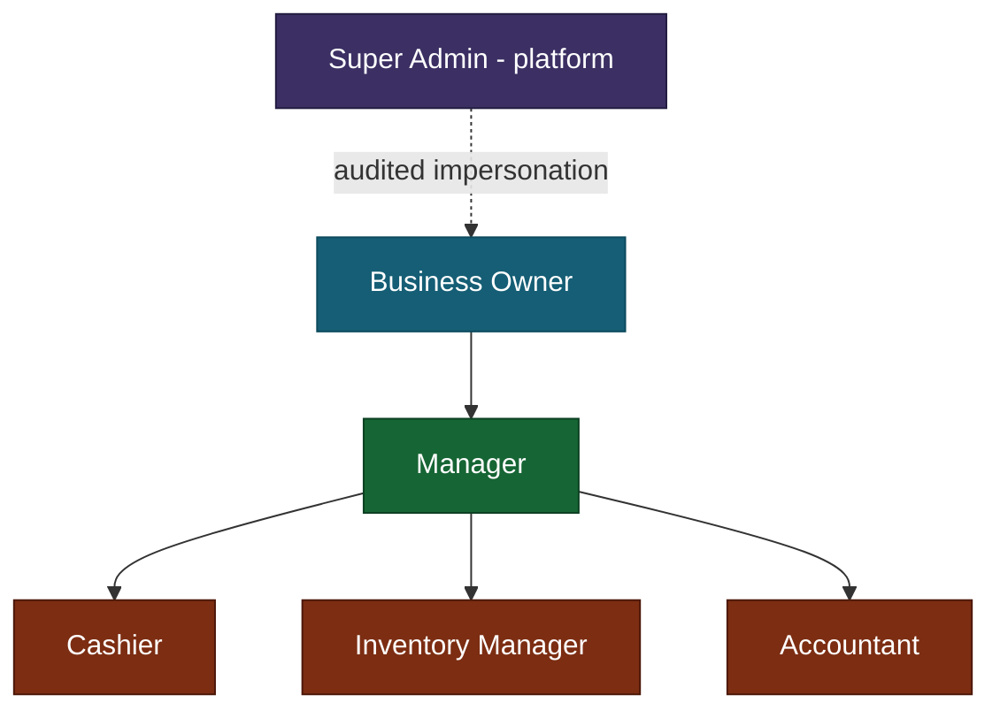
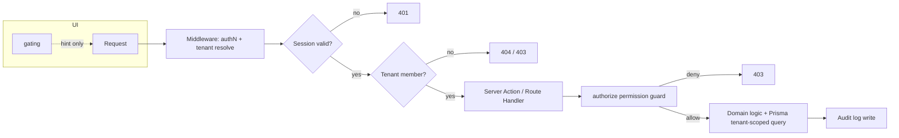
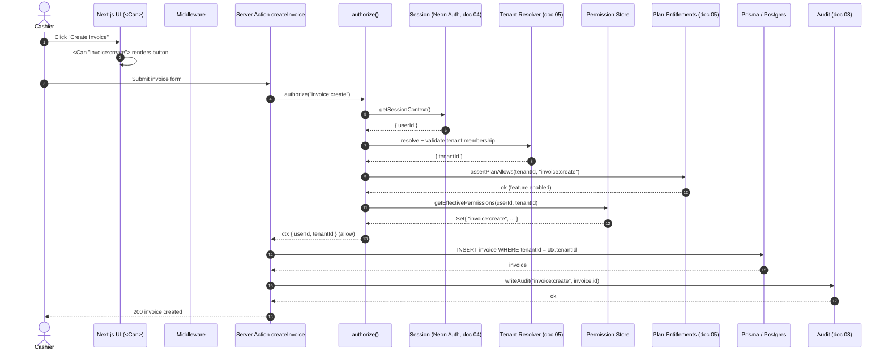

# 06 — RBAC & Permissions

> **Document status:** Production spec · **Phase:** 1 (Next.js web only) · **Owner:** Platform / Security Engineering
> **Related docs:** [`04-Authentication.md`](./04-Authentication.md) · [`05-Multi-Tenancy.md`](./05-Multi-Tenancy.md) · [`03-Audit-Logs.md`](./03-Audit-Logs.md)

---

## 1. Executive Summary

The Jewellery ERP SaaS platform is a multi-tenant system serving Indian jewellery businesses. Every tenant (a jewellery business) has its own users, roles, inventory, billing, and financial data. Authorization is the layer that decides **what an authenticated principal is allowed to do inside a resolved tenant context**.

This document specifies a **permission-based Role-Based Access Control (RBAC)** model:

- **Users** are granted **Roles** (scoped per tenant).
- **Roles** are *bags of* **Permissions**.
- **Permissions** are fine-grained, expressed as `resource:action` (e.g. `invoice:create`).
- **Permissions are never hardcoded into roles in application code.** Roles and permissions live in the database, are **seedable** for defaults, and are **customizable per tenant**.

The design intent is **deny-by-default**: no permission → no access. Every mutation and every sensitive read is gated by an explicit permission check that runs **after** the tenant scope is resolved (see [`05-Multi-Tenancy.md`](./05-Multi-Tenancy.md)) and **after** authentication succeeds (see [`04-Authentication.md`](./04-Authentication.md)).

This separation matters:

| Concern | Answers | Owned by | Doc |
|---|---|---|---|
| Authentication (authN) | *Who are you?* | Neon Auth | [`04-Authentication.md`](./04-Authentication.md) |
| Tenant scoping | *Which business are you acting inside?* | Tenant resolver / middleware | [`05-Multi-Tenancy.md`](./05-Multi-Tenancy.md) |
| Authorization (authZ) | *Are you allowed to do this here?* | RBAC engine (this doc) | 06 |

A request is only allowed when **all three** pass: valid session **AND** a resolved tenant the user belongs to **AND** the required permission present in the user's effective permission set for that tenant.

---

## 2. Scope

**In scope**

- The RBAC data model: `User`, `Role`, `Permission`, `UserRole`, `RolePermission` and their relationships.
- The `resource:action` permission naming convention.
- A comprehensive permission catalogue covering every core module.
- The six default actor roles and the default permission matrix.
- Role hierarchy and the (additive) inheritance model.
- Enforcement strategy across Server Actions, Route Handlers, middleware, and UI gating.
- The reusable `authorize(permission)` guard and the `<Can>` UI component.
- Custom (tenant-defined) roles and their constraints.
- Per-actor restriction tables (what each role **cannot** do).
- Auditing of role/permission changes.
- Acceptance criteria, edge cases, and future enhancements.

**Out of scope (covered elsewhere or later)**

- Login, session issuance, MFA, password policy → [`04-Authentication.md`](./04-Authentication.md).
- Tenant resolution, row-level tenant isolation, connection scoping → [`05-Multi-Tenancy.md`](./05-Multi-Tenancy.md).
- The audit log storage schema and immutability guarantees → [`03-Audit-Logs.md`](./03-Audit-Logs.md).
- Attribute-Based Access Control (ABAC) and field-level permissions → §14 Future Enhancements.

---

## 3. Assumptions

1. **Neon Auth** provides an authenticated identity (a stable `userId`) before any authorization logic runs.
2. Every domain row carries a `tenantId`; the tenant context is resolved and validated upstream (see [`05-Multi-Tenancy.md`](./05-Multi-Tenancy.md)) before RBAC executes.
3. A single user may belong to **multiple tenants**, with **different roles per tenant**. Role assignment is therefore always `(userId, tenantId, roleId)`.
4. **Super Admin** is a *platform-level* actor operating cross-tenant; it is modeled distinctly from tenant-scoped roles (see §7).
5. Roles and permissions are stored in PostgreSQL (via Prisma) and seeded on tenant provisioning. Defaults are cloned per tenant so an owner can customize without affecting other tenants.
6. Permission checks are **synchronous against a per-request cached permission set** — the effective permissions for `(userId, tenantId)` are loaded once per request.
7. Plan/subscription entitlements (feature flags) can *further* restrict permissions; a granted permission may still be blocked if the tenant's plan does not include the feature (see §13 and [`05-Multi-Tenancy.md`](./05-Multi-Tenancy.md)).
8. All validation of inputs uses **Zod**; RBAC is orthogonal to and runs alongside input validation.

---

## 4. RBAC Model

### 4.1 Conceptual model

- A **Permission** is an atomic capability: `resource:action`.
- A **Role** is a named collection of permissions, scoped to a tenant (system roles are cloned per tenant on provisioning).
- A **User** receives one or more roles **per tenant** via `UserRole`.
- A user's **effective permission set** for a tenant = the union of the permissions of all roles assigned to that user in that tenant (additive — see §8).



### 4.2 Entity-relationship view



### 4.3 Prisma schema (representative)

```prisma
model User {
  id             String     @id @default(cuid())
  neonAuthId     String     @unique
  email          String     @unique
  isPlatformAdmin Boolean   @default(false) // Super Admin flag
  userRoles      UserRole[]
  createdAt      DateTime   @default(now())
}

model Role {
  id          String           @id @default(cuid())
  tenantId    String           // system roles are cloned per tenant
  key         String           // e.g. "owner", "manager"
  name        String
  description String?
  isSystem    Boolean          @default(false) // system roles cannot be edited/deleted
  permissions RolePermission[]
  userRoles   UserRole[]
  tenant      Tenant           @relation(fields: [tenantId], references: [id])

  @@unique([tenantId, key])
  @@index([tenantId])
}

model Permission {
  id          String           @id @default(cuid())
  key         String           @unique // "invoice:create"
  module      String           // "Billing Engine"
  resource    String           // "invoice"
  action      String           // "create"
  description String
  roles       RolePermission[]
}

model UserRole {
  id         String   @id @default(cuid())
  userId     String
  tenantId   String
  roleId     String
  assignedBy String?
  assignedAt DateTime @default(now())
  user       User     @relation(fields: [userId], references: [id])
  role       Role     @relation(fields: [roleId], references: [id])

  @@unique([userId, tenantId, roleId])
  @@index([userId, tenantId])
}

model RolePermission {
  id           String     @id @default(cuid())
  roleId       String
  permissionId String
  grantedAt    DateTime   @default(now())
  role         Role       @relation(fields: [roleId], references: [id])
  permission   Permission @relation(fields: [permissionId], references: [id])

  @@unique([roleId, permissionId])
  @@index([roleId])
}
```

---

## 5. Permission Naming Convention

**Format:** `resource:action` — lowercase, colon-separated, singular resource nouns.

- **resource** — the domain object or capability (`invoice`, `inventory`, `customer`, `report`, `user`, `subscription`, `tenant`).
- **action** — the verb (`create`, `read`, `update`, `delete`, `export`, `manage`, plus domain-specific verbs like `cancel`, `adjust`, `refund`, `void`, `approve`).

**Conventions**

| Rule | Example |
|---|---|
| Singular resource nouns | `customer:read`, not `customers:read` |
| Colon separator, no spaces | `report:export` |
| `manage` implies full lifecycle (C/R/U/D + config) for that resource | `subscription:manage` |
| Domain verbs for non-CRUD operations | `invoice:cancel`, `inventory:adjust`, `payment:refund` |
| Platform-level resources are namespaced by their object | `tenant:manage`, `plan:manage` |
| Wildcards are **not** stored in DB; `*` is only an in-memory shorthand for the platform Super Admin | `*:*` (implicit, never persisted) |

> **Design rule:** `manage` is a *coarse* superset used for configuration-heavy resources (subscription, settings, tenant). Fine-grained CRUD verbs are preferred for high-traffic transactional resources (invoice, inventory, customer) so tenants can compose least-privilege custom roles.

---

## 6. Permission Catalogue

The catalogue below is the canonical seed list. Columns `BO / MG / CA / IM / AC` denote whether the default role receives the permission: **Business Owner, Manager, Cashier, Inventory Manager, Accountant**. Super Admin is platform-level and is covered separately in §7 (it does **not** appear in tenant-scoped catalogues).

Legend: ● = granted by default · ○ = not granted by default.

### 6.1 Authentication & Session (module: Authentication)

| Permission key | Description | BO | MG | CA | IM | AC |
|---|---|:--:|:--:|:--:|:--:|:--:|
| `session:read` | View own active sessions | ● | ● | ● | ● | ● |
| `session:revoke` | Revoke own other sessions | ● | ● | ● | ● | ● |
| `mfa:manage` | Enroll/reset own MFA factors | ● | ● | ● | ● | ● |

### 6.2 Super Admin Dashboard (module: Super Admin) — *platform-level*

| Permission key | Description | BO | MG | CA | IM | AC |
|---|---|:--:|:--:|:--:|:--:|:--:|
| `platform:dashboard:read` | View cross-tenant platform dashboard | ○ | ○ | ○ | ○ | ○ |
| `tenant:manage` | Create/suspend/delete tenants | ○ | ○ | ○ | ○ | ○ |
| `tenant:read` | View any tenant metadata | ○ | ○ | ○ | ○ | ○ |
| `plan:manage` | Define subscription plans & feature flags | ○ | ○ | ○ | ○ | ○ |
| `impersonation:start` | Impersonate a tenant user (audited) | ○ | ○ | ○ | ○ | ○ |
| `platform:audit:read` | Read cross-tenant audit logs | ○ | ○ | ○ | ○ | ○ |

> All rows above are **Super Admin only**. They are never granted to tenant-scoped roles.

### 6.3 Business Management (module: Business Management)

| Permission key | Description | BO | MG | CA | IM | AC |
|---|---|:--:|:--:|:--:|:--:|:--:|
| `business:read` | View business profile | ● | ● | ● | ● | ● |
| `business:update` | Edit business profile (GSTIN, address, logo) | ● | ○ | ○ | ○ | ○ |
| `branch:create` | Create a branch/outlet | ● | ○ | ○ | ○ | ○ |
| `branch:read` | View branches | ● | ● | ● | ● | ● |
| `branch:update` | Edit branch details | ● | ● | ○ | ○ | ○ |
| `branch:delete` | Remove a branch | ● | ○ | ○ | ○ | ○ |

### 6.4 Subscription Management (module: Subscription Management)

| Permission key | Description | BO | MG | CA | IM | AC |
|---|---|:--:|:--:|:--:|:--:|:--:|
| `subscription:read` | View current plan, usage, invoices | ● | ● | ○ | ○ | ● |
| `subscription:manage` | Upgrade/downgrade/cancel plan, update billing | ● | ○ | ○ | ○ | ○ |
| `billing:payment-method:manage` | Manage payment methods for the subscription | ● | ○ | ○ | ○ | ○ |

### 6.5 User Management (module: User Management)

| Permission key | Description | BO | MG | CA | IM | AC |
|---|---|:--:|:--:|:--:|:--:|:--:|
| `user:read` | View users in the tenant | ● | ● | ○ | ○ | ○ |
| `user:invite` | Invite a new user to the tenant | ● | ● | ○ | ○ | ○ |
| `user:update` | Edit a user's profile within tenant | ● | ● | ○ | ○ | ○ |
| `user:deactivate` | Deactivate/remove a user from tenant | ● | ○ | ○ | ○ | ○ |
| `role:read` | View roles and their permissions | ● | ● | ○ | ○ | ○ |
| `role:create` | Create a custom role | ● | ○ | ○ | ○ | ○ |
| `role:update` | Edit a custom role's permissions | ● | ○ | ○ | ○ | ○ |
| `role:delete` | Delete a custom role | ● | ○ | ○ | ○ | ○ |
| `role:assign` | Assign/unassign roles to users | ● | ○ | ○ | ○ | ○ |

### 6.6 Business Settings (module: Business Settings)

| Permission key | Description | BO | MG | CA | IM | AC |
|---|---|:--:|:--:|:--:|:--:|:--:|
| `settings:read` | View business settings | ● | ● | ● | ● | ● |
| `settings:update` | Edit general settings (currency, rounding, units) | ● | ● | ○ | ○ | ○ |
| `settings:tax:update` | Configure GST/tax settings | ● | ○ | ○ | ○ | ● |
| `settings:template:manage` | Manage invoice templates | ● | ● | ○ | ○ | ○ |
| `settings:metal-rate:update` | Update daily gold/silver rates | ● | ● | ○ | ● | ○ |

### 6.7 Customer Management (module: Customer Management)

| Permission key | Description | BO | MG | CA | IM | AC |
|---|---|:--:|:--:|:--:|:--:|:--:|
| `customer:create` | Add a customer | ● | ● | ● | ○ | ○ |
| `customer:read` | View customers | ● | ● | ● | ○ | ● |
| `customer:update` | Edit customer details | ● | ● | ● | ○ | ○ |
| `customer:delete` | Delete a customer | ● | ● | ○ | ○ | ○ |
| `customer:export` | Export customer data | ● | ● | ○ | ○ | ● |
| `customer:ledger:read` | View a customer's ledger/balance | ● | ● | ● | ○ | ● |

### 6.8 Supplier Management (module: Supplier Management)

| Permission key | Description | BO | MG | CA | IM | AC |
|---|---|:--:|:--:|:--:|:--:|:--:|
| `supplier:create` | Add a supplier | ● | ● | ○ | ● | ○ |
| `supplier:read` | View suppliers | ● | ● | ○ | ● | ● |
| `supplier:update` | Edit supplier details | ● | ● | ○ | ● | ○ |
| `supplier:delete` | Delete a supplier | ● | ○ | ○ | ○ | ○ |
| `supplier:export` | Export supplier data | ● | ● | ○ | ● | ● |
| `supplier:ledger:read` | View supplier payables ledger | ● | ● | ○ | ● | ● |

### 6.9 Inventory Management (module: Inventory Management)

| Permission key | Description | BO | MG | CA | IM | AC |
|---|---|:--:|:--:|:--:|:--:|:--:|
| `inventory:create` | Add stock items / SKUs | ● | ● | ○ | ● | ○ |
| `inventory:read` | View inventory | ● | ● | ● | ● | ● |
| `inventory:update` | Edit item attributes (purity, weight, making) | ● | ● | ○ | ● | ○ |
| `inventory:delete` | Remove an item | ● | ○ | ○ | ● | ○ |
| `inventory:adjust` | Stock adjustment (loss/gain/reconcile) | ● | ● | ○ | ● | ○ |
| `inventory:transfer` | Transfer stock between branches | ● | ● | ○ | ● | ○ |
| `inventory:valuation:read` | View stock valuation | ● | ● | ○ | ● | ● |
| `inventory:export` | Export inventory data | ● | ● | ○ | ● | ● |

### 6.10 Billing Engine (module: Billing Engine)

| Permission key | Description | BO | MG | CA | IM | AC |
|---|---|:--:|:--:|:--:|:--:|:--:|
| `invoice:create` | Create/issue an invoice | ● | ● | ● | ○ | ○ |
| `invoice:read` | View invoices | ● | ● | ● | ○ | ● |
| `invoice:update` | Edit a draft invoice | ● | ● | ● | ○ | ○ |
| `invoice:cancel` | Cancel/void an issued invoice | ● | ● | ○ | ○ | ● |
| `invoice:refund` | Issue a refund / credit note | ● | ● | ○ | ○ | ● |
| `invoice:discount:apply` | Apply discount beyond standard limit | ● | ● | ○ | ○ | ○ |
| `invoice:export` | Export / bulk-download invoices | ● | ● | ○ | ○ | ● |
| `payment:record` | Record a payment against an invoice | ● | ● | ● | ○ | ● |
| `payment:refund` | Refund a recorded payment | ● | ● | ○ | ○ | ● |
| `estimate:create` | Create a quotation/estimate | ● | ● | ● | ○ | ○ |
| `estimate:convert` | Convert estimate to invoice | ● | ● | ● | ○ | ○ |

### 6.11 Invoice Templates (module: Invoice Templates)

| Permission key | Description | BO | MG | CA | IM | AC |
|---|---|:--:|:--:|:--:|:--:|:--:|
| `template:read` | View invoice templates | ● | ● | ● | ○ | ● |
| `template:create` | Create a template | ● | ● | ○ | ○ | ○ |
| `template:update` | Edit a template | ● | ● | ○ | ○ | ○ |
| `template:delete` | Delete a template | ● | ○ | ○ | ○ | ○ |
| `template:set-default` | Set the tenant default template | ● | ● | ○ | ○ | ○ |

### 6.12 GST (module: GST)

| Permission key | Description | BO | MG | CA | IM | AC |
|---|---|:--:|:--:|:--:|:--:|:--:|
| `gst:read` | View GST configuration & rates | ● | ● | ● | ○ | ● |
| `gst:configure` | Configure HSN codes, tax slabs | ● | ○ | ○ | ○ | ● |
| `gst:return:generate` | Generate GSTR-1/GSTR-3B data | ● | ○ | ○ | ○ | ● |
| `gst:return:export` | Export GST returns (JSON/CSV) | ● | ○ | ○ | ○ | ● |

### 6.13 Reports (module: Reports)

| Permission key | Description | BO | MG | CA | IM | AC |
|---|---|:--:|:--:|:--:|:--:|:--:|
| `report:sales:read` | View sales reports | ● | ● | ○ | ○ | ● |
| `report:inventory:read` | View inventory reports | ● | ● | ○ | ● | ● |
| `report:financial:read` | View P&L, ledgers, tax reports | ● | ○ | ○ | ○ | ● |
| `report:export` | Export any permitted report | ● | ● | ○ | ● | ● |

### 6.14 Notifications (module: Notifications)

| Permission key | Description | BO | MG | CA | IM | AC |
|---|---|:--:|:--:|:--:|:--:|:--:|
| `notification:read` | View own notifications | ● | ● | ● | ● | ● |
| `notification:configure` | Configure tenant notification rules/channels | ● | ● | ○ | ○ | ○ |

### 6.15 Audit Logs (module: Audit Logs)

| Permission key | Description | BO | MG | CA | IM | AC |
|---|---|:--:|:--:|:--:|:--:|:--:|
| `audit:read` | View tenant audit logs | ● | ● | ○ | ○ | ● |
| `audit:export` | Export tenant audit logs | ● | ○ | ○ | ○ | ● |

### 6.16 Dashboard Analytics (module: Dashboard Analytics)

| Permission key | Description | BO | MG | CA | IM | AC |
|---|---|:--:|:--:|:--:|:--:|:--:|
| `dashboard:read` | View tenant dashboard | ● | ● | ● | ● | ● |
| `dashboard:financial:read` | View financial widgets (revenue, margin) | ● | ● | ○ | ○ | ● |
| `analytics:export` | Export dashboard analytics | ● | ● | ○ | ○ | ● |

---

## 7. Default Roles & Permission Matrix

### 7.1 The six actors

| Role | Key | Scope | Summary |
|---|---|---|---|
| Super Admin | `super_admin` | **Platform** (cross-tenant) | Operates the SaaS itself: tenants, plans, platform audit. Not a member of any tenant's business data by default. |
| Business Owner | `owner` | Tenant | Full control of one tenant, including users, roles, subscription, settings. |
| Manager | `manager` | Tenant | Day-to-day operations: billing, inventory, customers, reports. Cannot manage subscription or delete the business. |
| Cashier | `cashier` | Tenant | Point-of-sale: create invoices, record payments, manage customers. Read-only elsewhere. |
| Inventory Manager | `inventory_manager` | Tenant | Stock lifecycle, suppliers, valuation, metal rates. |
| Accountant | `accountant` | Tenant | Financials, GST, ledgers, reports, refunds/cancellations. |

> **Super Admin** is modeled via the `User.isPlatformAdmin` flag plus a platform role holding the §6.2 permissions. It bypasses tenant-scoped role resolution and instead resolves against platform permissions. Its access to *tenant business data* is only via **audited impersonation** (`impersonation:start`), never implicit.

### 7.2 Condensed CRUD matrix (tenant-scoped roles)

`C`reate · `R`ead · `U`pdate · `D`elete · `X`=export · `M`=manage. ✔ = has, — = none, ▲ = partial/conditional.

| Module | BO | MG | CA | IM | AC |
|---|---|---|---|---|---|
| Business Management | CRUD | R,U▲ | R | R | R |
| Subscription | R,M | R | — | — | R |
| User & Roles | CRUD,M | R,U,invite | — | — | — |
| Business Settings | CRUD | R,U▲ | R | R,U▲ | R,U▲ |
| Customer Mgmt | CRUD,X | CRUD,X | C,R,U | R | R,X |
| Supplier Mgmt | CRUD,X | CRU,X | — | CRU,X | R,X |
| Inventory Mgmt | CRUD,X | CRU,adjust,X | R | CRUD,adjust,X | R,X |
| Billing Engine | CRUD,X | CRU,cancel,X | C,R,U,pay | — | R,cancel,refund,X |
| Invoice Templates | CRUD | CRU | R | — | R |
| GST | R,config,gen,X | R | R | — | R,config,gen,X |
| Reports | R(all),X | R(sales,inv),X | — | R(inv),X | R(all),X |
| Notifications | R,config | R,config | R | R | R |
| Audit Logs | R,X | R | — | — | R,X |
| Dashboard Analytics | R(all),X | R(all),X | R | R | R(fin),X |

> This matrix is the **seed default**. Because roles are DB-backed and cloneable, a Business Owner can diverge from it per tenant (see §11).

---

## 8. Role Hierarchy & Permission Inheritance

### 8.1 Hierarchy



### 8.2 Inheritance model

The platform uses an **additive, permission-union model** — it does **not** rely on implicit "a parent role automatically owns all child permissions" logic at runtime. Instead:

1. **Effective permissions are always the explicit union of the permissions attached to a user's assigned roles.** There is no runtime tree-walk that grants a Manager a Cashier's permission unless those permissions are actually attached to the Manager role.
2. The hierarchy is expressed **at seed time**: the seeder composes higher roles as a superset. `manager` is seeded with (Cashier ∪ Inventory Manager ∪ Accountant operational permissions) minus destructive/owner-only ones; `owner` is seeded with the full tenant catalogue.
3. **Why not runtime inheritance?** Storing the resolved permission set explicitly keeps checks O(1), makes custom roles safe (a tenant can freely subtract permissions from a role without fighting an inheritance chain), and keeps the audit trail exact (a role's permissions are literally what the DB says).
4. **Multiple roles are additive.** If a user holds both `cashier` and `accountant`, the effective set is the union of both. There is no negative/deny permission in Phase 1 — the model is **grant-only, deny-by-default** (deny wins only in the sense that absence = denial).

> **Summary:** Hierarchy is a *design/seed convention*, not a runtime privilege-escalation mechanism. Effective access = union of granted permissions across assigned roles, further intersected with plan entitlements (§13).

---

## 9. Access Control Strategy & Enforcement

### 9.1 Where checks happen (defense in depth)



| Layer | Responsibility | Enforcement strength |
|---|---|---|
| **Middleware** | Reject unauthenticated requests; resolve & validate tenant membership | Coarse gate |
| **Server Actions** | `authorize(permission)` before any mutation | **Authoritative** |
| **Route Handlers** | `authorize(permission)` before reads/writes exposed over HTTP | **Authoritative** |
| **Prisma query layer** | Every query carries `tenantId` (see 05) | Data isolation |
| **UI (`<Can>`)** | Hide/disable controls the user cannot use | **Cosmetic only — never trusted** |
| **Audit** | Record every permission-gated mutation (see 03) | Forensic |

> **Golden rule:** the UI gate is a UX convenience. Authorization is enforced **server-side, deny-by-default**. Never rely on hidden buttons for security.

### 9.2 Permission check helper

```typescript
// lib/authz/permissions.ts
import { cache } from "react";
import { prisma } from "@/lib/db";

/**
 * Loads the effective permission set for (userId, tenantId), once per request.
 * Super Admins short-circuit to the platform permission set.
 */
export const getEffectivePermissions = cache(
  async (userId: string, tenantId: string): Promise<Set<string>> => {
    const user = await prisma.user.findUnique({
      where: { id: userId },
      select: { isPlatformAdmin: true },
    });

    if (user?.isPlatformAdmin) {
      // Platform permissions only; tenant business data requires impersonation.
      const platformPerms = await prisma.permission.findMany({
        where: { module: { in: ["Super Admin", "Authentication"] } },
        select: { key: true },
      });
      return new Set(platformPerms.map((p) => p.key));
    }

    const rows = await prisma.rolePermission.findMany({
      where: {
        role: {
          tenantId,
          userRoles: { some: { userId, tenantId } },
        },
      },
      select: { permission: { select: { key: true } } },
    });

    return new Set(rows.map((r) => r.permission.key));
  }
);

export async function hasPermission(
  ctx: { userId: string; tenantId: string },
  permission: string
): Promise<boolean> {
  const perms = await getEffectivePermissions(ctx.userId, ctx.tenantId);
  return perms.has(permission);
}
```

### 9.3 The `authorize()` guard (deny-by-default)

```typescript
// lib/authz/authorize.ts
import { getSessionContext } from "@/lib/auth/session"; // from doc 04
import { assertPlanAllows } from "@/lib/billing/entitlements"; // from doc 05
import { hasPermission } from "./permissions";

export class AuthorizationError extends Error {
  constructor(public permission: string) {
    super(`Forbidden: missing permission "${permission}"`);
    this.name = "AuthorizationError";
  }
}

/**
 * Deny-by-default guard. Resolves session + tenant, checks the permission,
 * and intersects with the tenant's plan entitlements (feature flags).
 * Returns the trusted context on success; throws otherwise.
 */
export async function authorize(permission: string) {
  const ctx = await getSessionContext(); // { userId, tenantId } — throws if unauth
  if (!ctx?.userId || !ctx?.tenantId) {
    throw new AuthorizationError(permission);
  }

  // Plan-gated permissions: a granted perm can still be blocked by the plan.
  await assertPlanAllows(ctx.tenantId, permission); // throws PlanRestrictionError

  const allowed = await hasPermission(ctx, permission);
  if (!allowed) throw new AuthorizationError(permission);

  return ctx; // trusted { userId, tenantId, ... }
}
```

### 9.4 Server Action guard usage

```typescript
// app/(tenant)/billing/actions.ts
"use server";

import { z } from "zod";
import { authorize } from "@/lib/authz/authorize";
import { prisma } from "@/lib/db";
import { writeAudit } from "@/lib/audit"; // from doc 03

const CreateInvoiceInput = z.object({
  customerId: z.string().cuid(),
  lines: z.array(z.object({
    sku: z.string(),
    grossWeight: z.number().positive(),
    purity: z.number(),
    makingCharge: z.number().nonnegative(),
  })).min(1),
});

export async function createInvoice(raw: unknown) {
  // 1. Deny-by-default authorization (session + tenant + permission + plan)
  const ctx = await authorize("invoice:create");

  // 2. Validate input
  const input = CreateInvoiceInput.parse(raw);

  // 3. Tenant-scoped mutation (tenantId always applied — see doc 05)
  const invoice = await prisma.invoice.create({
    data: { tenantId: ctx.tenantId, createdBy: ctx.userId, ...toInvoice(input) },
  });

  // 4. Audit (see doc 03)
  await writeAudit({
    tenantId: ctx.tenantId,
    actorId: ctx.userId,
    action: "invoice:create",
    entity: "invoice",
    entityId: invoice.id,
  });

  return invoice;
}
```

### 9.5 Route Handler usage

```typescript
// app/api/reports/sales/route.ts
import { authorize, AuthorizationError } from "@/lib/authz/authorize";
import { NextResponse } from "next/server";

export async function GET() {
  try {
    const ctx = await authorize("report:sales:read");
    const data = await getSalesReport(ctx.tenantId);
    return NextResponse.json(data);
  } catch (e) {
    if (e instanceof AuthorizationError) {
      return NextResponse.json({ error: "forbidden" }, { status: 403 });
    }
    throw e;
  }
}
```

### 9.6 UI gating: `<Can>` component

```tsx
// components/authz/Can.tsx  (Server Component)
import { getSessionContext } from "@/lib/auth/session";
import { getEffectivePermissions } from "@/lib/authz/permissions";

export async function Can({
  permission,
  children,
  fallback = null,
}: {
  permission: string | string[];
  children: React.ReactNode;
  fallback?: React.ReactNode;
}) {
  const ctx = await getSessionContext();
  if (!ctx) return <>{fallback}</>;

  const perms = await getEffectivePermissions(ctx.userId, ctx.tenantId);
  const required = Array.isArray(permission) ? permission : [permission];
  const allowed = required.every((p) => perms.has(p)); // AND semantics

  return <>{allowed ? children : fallback}</>;
}
```

```tsx
// Usage — cosmetic gating only; server still enforces on submit.
<Can permission="invoice:cancel">
  <CancelInvoiceButton invoiceId={invoice.id} />
</Can>
```

---

## 10. Sequence: Authorized Mutation (Cashier creates an invoice)



If any step fails — no session (401), not a tenant member (403/404), plan disallows (402/403), or permission missing (403) — the action throws **before** any write, and nothing is persisted.

---

## 11. Custom Roles per Tenant

A **Business Owner** (holding `role:create`/`role:update`/`role:delete`) can define custom roles from the permission catalogue.

### 11.1 Capabilities

- Create a named role (e.g. "Front Desk", "Senior Cashier").
- Attach any subset of permissions the owner **themselves possess**.
- Assign the role to users via `role:assign`.
- Clone a system role as a starting point (system role stays intact).

### 11.2 Constraints (enforced server-side)

| Constraint | Rule | Rationale |
|---|---|---|
| **No privilege escalation** | An actor cannot grant a permission they do not themselves hold. | Prevents a Manager (if delegated `role:create`) from minting an owner-equivalent role. |
| **System roles are immutable** | Roles with `isSystem = true` cannot be edited or deleted. | Guarantees a safe default baseline always exists. |
| **Custom roles are tenant-scoped** | A custom role's `tenantId` is fixed to the creator's tenant. | Multi-tenant isolation (doc 05). |
| **Catalogue-bound** | Only permissions that exist in the seed catalogue may be attached. | Prevents fabricated/unknown permission keys. |
| **Plan-bound** | Permissions gated by a plan the tenant lacks are hidden/blocked. | Consistent with entitlement model (§13). |
| **Assignable-perms subset** | The UI only lists permissions in the actor's effective set. | Least-privilege delegation. |

```typescript
// lib/authz/customRoles.ts (guard excerpt)
export async function createCustomRole(input: { name: string; permissionKeys: string[] }) {
  const ctx = await authorize("role:create");
  const actorPerms = await getEffectivePermissions(ctx.userId, ctx.tenantId);

  // No privilege escalation: cannot grant what you don't have.
  const escalation = input.permissionKeys.filter((k) => !actorPerms.has(k));
  if (escalation.length > 0) {
    throw new AuthorizationError(escalation[0]); // 403, cannot exceed own perms
  }

  return prisma.role.create({
    data: {
      tenantId: ctx.tenantId,
      key: slugify(input.name),
      name: input.name,
      isSystem: false,
      permissions: {
        create: await toRolePermissionRows(input.permissionKeys),
      },
    },
  });
}
```

---

## 12. Per-Actor Restrictions (What Each Role CANNOT Do)

| Actor | Cannot do |
|---|---|
| **Super Admin** | Read or mutate tenant *business* data (invoices, customers, inventory) without an **audited impersonation** session; cannot silently act inside a tenant. |
| **Business Owner** | Access other tenants; perform platform operations (`tenant:manage`, `plan:manage`); edit `isSystem` roles' definitions; remove themselves if they are the **last owner** (§13). |
| **Manager** | Manage subscription/billing (`subscription:manage`); delete the business/branches at will (`business:update`, `branch:delete` withheld); manage roles (`role:create/update/delete/assign`); configure GST/tax core settings; export/read tenant audit exports. |
| **Cashier** | Cancel/void or refund invoices; delete customers; touch inventory beyond read; manage suppliers; view financial reports/dashboards; manage users, roles, settings, subscription, GST, audit. |
| **Inventory Manager** | Create/edit/cancel invoices or record payments; manage customers (write); manage users/roles/subscription; configure GST; view financial reports. |
| **Accountant** | Create/edit stock items or adjust inventory; issue new sales invoices (can cancel/refund and view); manage users/roles; manage subscription; edit business profile/branches. |

> These are the **default** withholdings. A Business Owner may explicitly grant additional permissions via custom roles (§11), subject to the no-escalation constraint.

---

## 13. Edge Cases & Safeguards

| # | Case | Behaviour |
|---|---|---|
| 1 | **Last owner protection** | The system refuses to deactivate/remove or downgrade the **last user holding the `owner` role** in a tenant. `user:deactivate` and `role:assign` guards check the count of active owners and reject if it would drop to zero. |
| 2 | **Permission revocation mid-session** | Because `getEffectivePermissions` is loaded **per request** (React `cache` is request-scoped), a revoked permission takes effect on the **next request/action** — no stale in-session privilege. No long-lived cached grant. |
| 3 | **Plan-gated permissions (feature flags)** | Even a granted permission is blocked if the tenant's plan lacks the feature. `assertPlanAllows` runs inside `authorize()`. Downgrading a plan effectively removes access without editing roles. See [`05-Multi-Tenancy.md`](./05-Multi-Tenancy.md). |
| 4 | **Multiple roles** | Effective set = union of all assigned roles' permissions (additive, §8). |
| 5 | **Orphaned custom role** | Deleting a custom role unassigns it from users atomically; users retain access only via their remaining roles. |
| 6 | **Super Admin impersonation** | Impersonation issues a scoped, time-boxed, fully-audited session; every action is tagged with both the real admin identity and the impersonated user (doc 03/04). |
| 7 | **Unknown permission key** | `authorize("does:notexist")` is deny-by-default → 403. Catalogue-bound custom roles cannot introduce unknown keys. |
| 8 | **Cross-tenant leakage attempt** | Even with a valid permission, a query is tenant-scoped; acting on another tenant's row returns not-found (doc 05). |

---

## 14. Auditing of Permission & Role Changes

Every authorization-relevant change is written to the audit log (schema and immutability in [`03-Audit-Logs.md`](./03-Audit-Logs.md); actor identity from [`04-Authentication.md`](./04-Authentication.md)):

| Audited action | `action` key | Captured detail |
|---|---|---|
| Role created | `role:create` | roleId, name, permission keys |
| Role permissions changed | `role:update` | roleId, added[], removed[] |
| Role deleted | `role:delete` | roleId, affected userIds |
| Role assigned to user | `role:assign` | userId, roleId, assignedBy |
| Role unassigned | `role:unassign` | userId, roleId |
| User invited / deactivated | `user:invite` / `user:deactivate` | targetUserId, roles |
| Plan change affecting perms | `subscription:manage` | old plan, new plan, feature delta |
| Impersonation start/stop | `impersonation:start` | adminId, targetUserId, tenantId, expiry |

All permission-gated **mutations** (not just RBAC changes) also emit an audit record from within the Server Action / Route Handler, as shown in §9.4.

---

## 15. Acceptance Criteria

1. **Deny-by-default:** any Server Action or Route Handler without a passing `authorize()` call is inaccessible; a missing/unknown permission yields `403`.
2. **Tenant + permission composition:** access requires valid session **AND** tenant membership **AND** the permission in the effective set — verified by tests for each combination.
3. **Seed correctness:** a freshly provisioned tenant has the six default roles with exactly the §7 matrix permissions; system roles have `isSystem = true`.
4. **No hardcoded permissions:** grep of the codebase shows no role→permission mapping literals outside the DB seed; all runtime checks read from the permission store.
5. **Custom roles:** an owner can create a role, attach a subset of their own permissions, assign it, and see it enforced; attaching a permission the owner lacks is rejected (`403`).
6. **System role immutability:** attempts to edit/delete an `isSystem` role are rejected.
7. **Last owner protection:** removing/downgrading the final owner is rejected.
8. **Revocation latency:** a permission revoked between two requests is not honored on the second request.
9. **Plan gating:** a permission present in a role but absent from the plan is denied via `assertPlanAllows`.
10. **UI parity:** `<Can>` hides controls the user cannot use, but server enforcement blocks a forged submit for the same permission.
11. **Auditability:** every role/permission change and every permission-gated mutation produces an audit record with actor, tenant, action, and target.
12. **Super Admin isolation:** a Super Admin cannot read tenant business data without an audited impersonation session.

---

## 16. Future Enhancements

| Theme | Description |
|---|---|
| **ABAC** | Attribute-Based Access Control: conditions on attributes (e.g. `invoice:cancel` only within 24h, or only for invoices at the user's own branch). Layer conditions on top of `resource:action`. |
| **Field-level permissions** | Restrict visibility/editability of individual fields (e.g. hide cost price from Cashiers) beyond row-level access. |
| **Permission groups / bundles** | Named bundles (e.g. "POS Bundle") to simplify custom-role composition in the UI. |
| **Deny/negative permissions** | Explicit deny entries that override grants for exception cases. |
| **Time-boxed / just-in-time roles** | Temporary elevation with automatic expiry and mandatory justification. |
| **Delegated administration** | Scoped admin (e.g. branch-level admin) able to manage roles only within a branch. |
| **Policy-as-code** | Externalize rules to a policy engine (e.g. OPA/Cedar) for cross-service reuse. |
| **Permission usage analytics** | Detect unused permissions per tenant to recommend least-privilege tightening. |

---

## 17. References

- [`03-Audit-Logs.md`](./03-Audit-Logs.md) — audit schema, immutability, actor tagging.
- [`04-Authentication.md`](./04-Authentication.md) — authN, sessions, Neon Auth, authN vs authZ boundary.
- [`05-Multi-Tenancy.md`](./05-Multi-Tenancy.md) — tenant resolution, row-level isolation, plan entitlements / feature flags.
- OWASP Access Control Cheat Sheet — deny-by-default, server-side enforcement principles.
- NIST RBAC model (INCITS 359) — roles, permissions, sessions, hierarchies.
- Prisma & Next.js App Router (Server Actions, Route Handlers) documentation.
