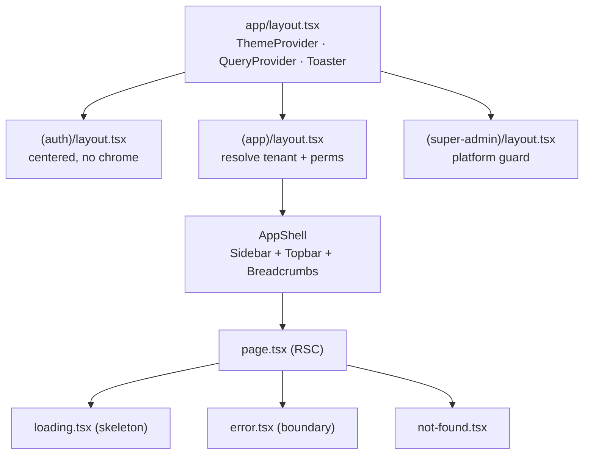
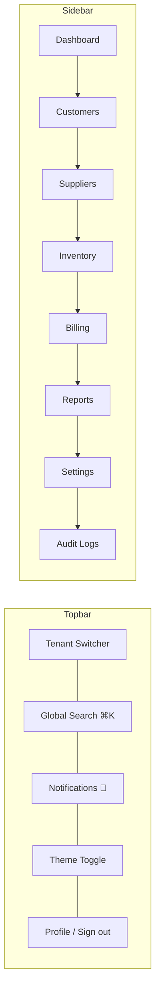
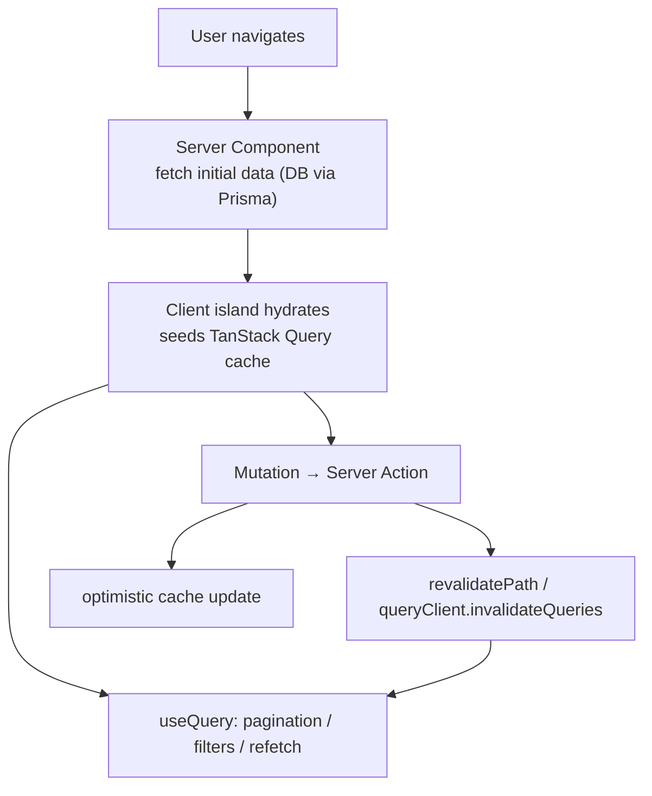
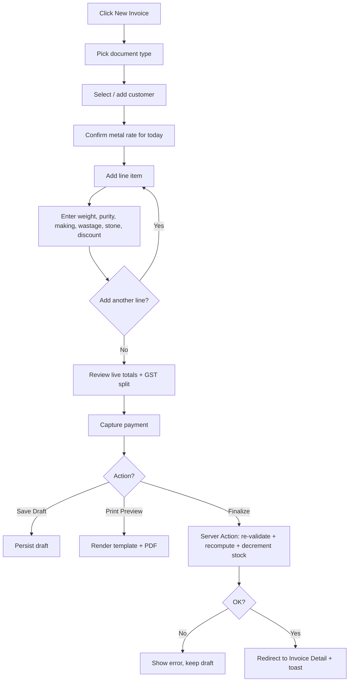
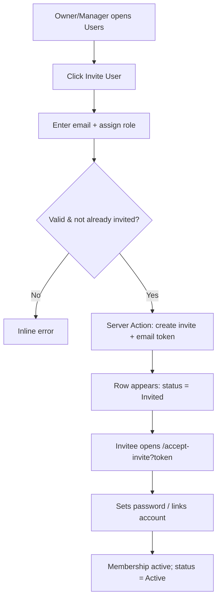
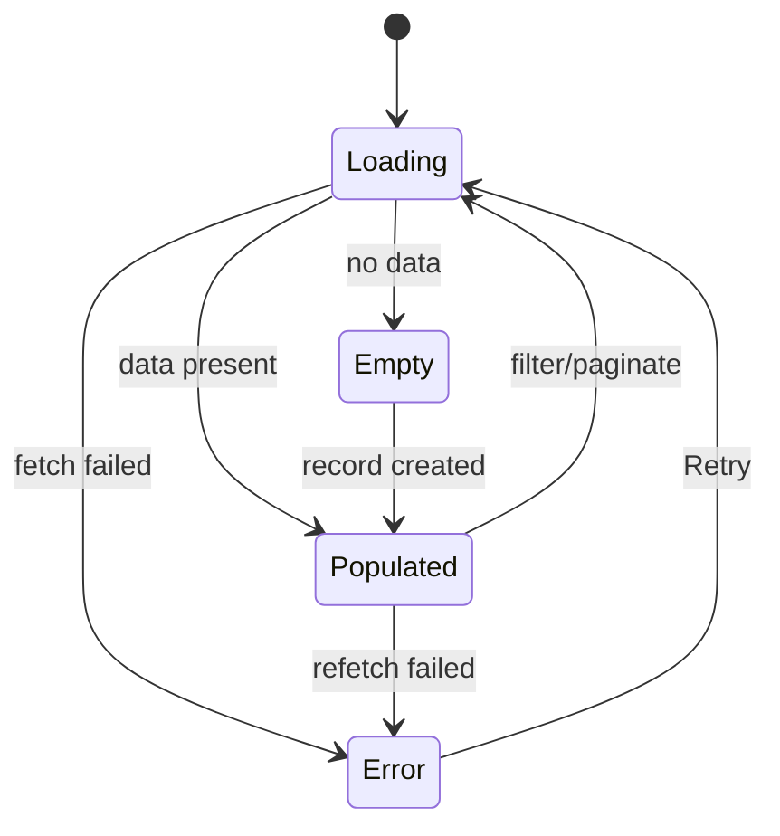

# 07 — Frontend Specification

> **Document status:** Production spec · **Phase:** 1 (Next.js web only) · **Owner:** Frontend / Web Platform Engineering
> **Related docs:** [`01-Product-Requirements-Document.md`](./01-Product-Requirements-Document.md) · [`02-System-Architecture.md`](./02-System-Architecture.md) · [`03-Database-Design.md`](./03-Database-Design.md) · [`04-Authentication-Security.md`](./04-Authentication-Security.md) · [`05-Multi-Tenancy.md`](./05-Multi-Tenancy.md) · [`06-RBAC-Permissions.md`](./06-RBAC-Permissions.md)

---

## 1. Executive Summary

This document is the **single source of truth for the web front end** of the Jewellery ERP SaaS platform. It specifies the design system, the Next.js **App Router** structure, global navigation, data-fetching and mutation patterns, form architecture, and a **page-by-page catalogue of every screen** across every module — auth, super-admin console, tenant application, billing engine, inventory, reports, and settings.

The front end is built with **Next.js (App Router) + TypeScript**, styled with **Tailwind CSS** and **shadcn/ui**, with **React Hook Form + Zod** for forms, **TanStack Query** for client-side server state, **Server Actions + Route Handlers** for mutations, **Recharts** for analytics, and deployment on **Vercel**. It is a **multi-tenant** product: every screen resolves a tenant context and **gates UI by permission** (see [`06-RBAC-Permissions.md`](./06-RBAC-Permissions.md)). It is built for **Indian jewellery businesses**, so first-class support for **INR currency, the Indian lakh/crore number system, GST, gold/silver purity (karat/fineness), and weight-based pricing** is non-negotiable.

The guiding front-end principles:

1. **Server-first rendering.** Default to React Server Components (RSC); promote to Client Components only for interactivity.
2. **Permission-gated UI.** The UI never renders an action the user cannot perform. The server still re-checks — the UI gate is UX, not security.
3. **Tenant-aware everything.** Every data read/write is scoped to the active tenant; the UI exposes a tenant switcher for multi-business users.
4. **One design language.** All screens compose the same tokens, primitives, and state conventions (empty / loading / error) so the product feels coherent.
5. **Accessible & localizable.** WCAG 2.1 AA baseline; English now, Hindi/regional-ready via an i18n-clean component layer.

---

## 2. Scope

**In scope**

- Design system: Tailwind + shadcn/ui usage, theming (light/dark), typography, color tokens, spacing scale, INR/lakh–crore formatting, responsive breakpoints, accessibility standards.
- App Router structure: route groups `(auth)`, `(app)` (tenant), `(super-admin)`; layouts; RSC vs Client guidance; `loading.tsx` / `error.tsx` / `not-found.tsx` conventions.
- Global navigation: sidebar, topbar, tenant switcher, permission-gated menus, breadcrumbs.
- Data fetching & mutation patterns: RSC initial load, TanStack Query on the client, Server Actions for writes, optimistic updates, cache-invalidation keys.
- Forms: React Hook Form + Zod resolver, reusable field components, validation UX.
- **A complete page-by-page catalogue** of every screen in every module.
- Reusable component inventory.
- Global empty / error / loading conventions.
- Key user-flow diagrams.
- Accessibility, i18n readiness, performance.
- Acceptance criteria, future enhancements, references.

**Out of scope (covered elsewhere or later)**

- API contracts, Route Handler internals, and Server Action business logic → [`02-System-Architecture.md`](./02-System-Architecture.md).
- Data schema and Prisma models → [`03-Database-Design.md`](./03-Database-Design.md).
- Auth flows, session issuance, MFA → [`04-Authentication-Security.md`](./04-Authentication-Security.md).
- Tenant resolution & isolation internals → [`05-Multi-Tenancy.md`](./05-Multi-Tenancy.md).
- The permission catalogue and enforcement → [`06-RBAC-Permissions.md`](./06-RBAC-Permissions.md).
- Native mobile apps and offline/thermal printing → §22 Future Enhancements.

---

## 3. Assumptions

1. **Neon Auth** provides an authenticated `userId`; the front end reads session state via server helpers and a client `useSession()` shim.
2. The **tenant context** is resolved server-side (middleware/layout) before any tenant page renders; the active tenant is available to both RSC and Client components.
3. The **effective permission set** for `(userId, tenantId)` is loaded once per request and exposed to the UI for gating via `<Can>` / `PermissionGate`.
4. All money is stored server-side as **integer minor units (paise)** and formatted for display only; the UI never does lossy float math on currency.
5. Weights are stored as **decimals in grams** with a fixed precision (3 decimal places); purity as karat (`22K`) or fineness (`916`).
6. **shadcn/ui** components are vendored into the repo (`components/ui/*`) and themed via CSS variables, not consumed as an external design dependency.
7. The app targets **evergreen browsers** (last 2 versions of Chrome, Edge, Safari, Firefox) and is **responsive down to 360px** (counter tablets and phones are common at jewellery POS counters).
8. English (`en-IN`) is the only shipped locale in Phase 1; the component layer is written to be locale-swappable.

---

## 4. Design System

### 4.1 Foundations & tooling

| Concern | Choice | Notes |
|---|---|---|
| Styling | Tailwind CSS | Utility-first; tokens exposed as CSS variables |
| Primitives | shadcn/ui (Radix under the hood) | Vendored into `components/ui/*`, fully themeable |
| Icons | `lucide-react` | Tree-shakeable, consistent 24px grid |
| Fonts | `next/font` (Inter var. + tabular numerals) | Self-hosted, no layout shift |
| Charts | Recharts | Lazy-loaded (see §21) |
| Class utils | `cn()` (clsx + tailwind-merge) | Safe conditional class composition |

### 4.2 Color tokens (semantic, theme-aware)

Colors are declared once as HSL CSS variables in `globals.css` and referenced through Tailwind theme extension. **Components never hardcode hex.** Two themes: `light` (default) and `dark`, toggled by a `class` on `<html>` via `next-themes`.

| Token | Role | Light | Dark |
|---|---|---|---|
| `--background` | App canvas | `0 0% 100%` | `240 10% 4%` |
| `--foreground` | Primary text | `240 10% 4%` | `0 0% 98%` |
| `--card` / `--card-foreground` | Surfaces | `0 0% 100%` / fg | `240 6% 10%` / fg |
| `--primary` | Brand (deep gold) | `43 74% 42%` | `43 74% 52%` |
| `--primary-foreground` | On-primary text | `0 0% 100%` | `240 10% 4%` |
| `--secondary` / `--muted` | Subtle surfaces | `240 5% 96%` | `240 4% 16%` |
| `--accent` | Hover/selected | `240 5% 92%` | `240 4% 20%` |
| `--destructive` | Delete/error | `0 72% 51%` | `0 62% 46%` |
| `--success` | Paid/success | `142 71% 40%` | `142 60% 45%` |
| `--warning` | Low-stock/dues | `38 92% 50%` | `38 90% 55%` |
| `--border` / `--input` / `--ring` | Lines & focus | `240 6% 90%` | `240 4% 22%` |

Semantic status colors are also mapped to domain concepts: **Paid → success**, **Partially paid → warning**, **Overdue/Unpaid → destructive**, **Draft → muted**, **Low stock → warning**.

### 4.3 Typography

Self-hosted **Inter** (variable) with **tabular figures** enabled for all numeric/monetary/weight cells so columns align.

| Scale | Class | Usage |
|---|---|---|
| Display | `text-3xl font-semibold tracking-tight` | Page hero / dashboard totals |
| H1 | `text-2xl font-semibold` | Page titles |
| H2 | `text-xl font-semibold` | Section headers |
| H3 | `text-lg font-medium` | Card titles |
| Body | `text-sm` | Default UI text |
| Caption | `text-xs text-muted-foreground` | Helper/meta |
| Numeric | `tabular-nums` | Money, weight, qty columns |

### 4.4 Spacing, radius, elevation

- **Spacing scale:** Tailwind default 4px base (`1 = 4px`). Page gutters `px-4 md:px-6 lg:px-8`; card padding `p-4 md:p-6`; form field gap `space-y-4`.
- **Radius:** `--radius: 0.5rem`; cards `rounded-lg`, inputs/buttons `rounded-md`, pills `rounded-full`.
- **Elevation:** flat by default; `shadow-sm` on cards, `shadow-md` on popovers/menus, `shadow-lg` on dialogs. Dark mode leans on borders over shadows.

### 4.5 INR currency & Indian number formatting

A single utility module `lib/format.ts` owns all number/money/weight formatting. **No component formats inline.**

```ts
// Indian grouping: 12,34,567.89 (lakh/crore), symbol ₹, 2 decimals
export const formatINR = (paise: number, opts?: { compact?: boolean }) =>
  new Intl.NumberFormat("en-IN", {
    style: "currency", currency: "INR",
    maximumFractionDigits: 2,
    notation: opts?.compact ? "compact" : "standard",
  }).format(paise / 100);

// Bare Indian-grouped number (no symbol): 1,00,000
export const formatIndianNumber = (n: number) =>
  new Intl.NumberFormat("en-IN").format(n);

// Weight in grams, 3 dp, with unit
export const formatWeight = (grams: number) =>
  `${new Intl.NumberFormat("en-IN", { minimumFractionDigits: 3, maximumFractionDigits: 3 }).format(grams)} g`;

// Compact Indian words for dashboards: ₹1.2L, ₹3.4Cr
export const formatINRWords = (paise: number) => {
  const r = paise / 100;
  if (r >= 1e7) return `₹${(r / 1e7).toFixed(2)} Cr`;
  if (r >= 1e5) return `₹${(r / 1e5).toFixed(2)} L`;
  return formatINR(paise);
};
```

| Raw value | `formatINR` | `formatINRWords` |
|---|---|---|
| `12345678900` paise | `₹12,34,56,789.00` | `₹12.35 Cr` |
| `1500000` paise | `₹15,000.00` | `₹15,000.00` |
| `1250000000` paise | `₹1,25,00,000.00` | `₹1.25 Cr` |

**Rule:** `en-IN` locale is used everywhere; the lakh/crore grouping is a locale feature, not manual string surgery.

### 4.6 Responsive breakpoints

| Token | Min width | Primary target |
|---|---|---|
| (base) | 360px | Phone / handheld POS |
| `sm` | 640px | Large phone |
| `md` | 768px | Tablet (sidebar collapses to icons) |
| `lg` | 1024px | Laptop (sidebar expanded) |
| `xl` | 1280px | Desktop counter |
| `2xl` | 1536px | Wide desktop / dual-monitor |

Layout rules: sidebar is an **off-canvas drawer** below `lg`, a **persistent rail** at `lg+`. Data tables become **stacked cards** below `md`. The invoice builder switches from **two-column (items | summary)** to **single-column with a sticky summary bar** below `lg`.

### 4.7 Accessibility (WCAG 2.1 AA)

- **Contrast:** all text meets ≥ 4.5:1 (≥ 3:1 for large text); tokens tuned for both themes.
- **Keyboard:** every interactive element is reachable and operable by keyboard; focus never trapped except in modals (Radix focus-trap). Visible focus ring via `--ring`.
- **Semantics:** Radix primitives supply correct roles/`aria-*`. Icon-only buttons carry `aria-label`. Tables use `<th scope>`; forms use `<label htmlFor>`.
- **Live regions:** toasts and async form errors announced via `aria-live="polite"`; destructive confirmations via `role="alertdialog"`.
- **Motion:** respects `prefers-reduced-motion`; animations are decorative only.
- **Targets:** interactive targets ≥ 44×44px on touch layouts.

---

## 5. App Router Structure

### 5.1 Route-group topology

```
app/
├─ layout.tsx                      # <html>, ThemeProvider, QueryProvider, Toaster, fonts
├─ globals.css                     # tokens + Tailwind layers
├─ (auth)/                         # unauthenticated shell (centered card, no chrome)
│  ├─ layout.tsx
│  ├─ login/page.tsx
│  ├─ register/page.tsx            # business owner sign-up
│  ├─ forgot-password/page.tsx
│  ├─ reset-password/page.tsx
│  ├─ verify-email/page.tsx
│  ├─ accept-invite/page.tsx       # token-based user invite acceptance
│  └─ mfa/page.tsx                 # MFA challenge / enrollment
│
├─ (app)/                          # TENANT application shell (sidebar + topbar)
│  ├─ layout.tsx                   # resolves tenant + permissions, renders nav
│  ├─ select-business/page.tsx     # tenant picker when user has ≥1 business
│  ├─ dashboard/page.tsx
│  ├─ customers/ ...               # list / [id] / new / [id]/edit
│  ├─ suppliers/ ...
│  ├─ inventory/ ...               # list / [id] / new / categories / adjustments / transfers
│  ├─ billing/ ...                 # new / [type] / list / [id] / [id]/print
│  ├─ reports/ ...                 # sales / gst / inventory / customer-dues / daybook
│  ├─ settings/ ...                # business / users / roles / templates / gst / notifications
│  └─ audit-logs/page.tsx
│
└─ (super-admin)/                  # PLATFORM console (distinct chrome + guard)
   ├─ layout.tsx                   # requires platform Super Admin
   ├─ overview/page.tsx
   ├─ businesses/ ...              # list / [id]
   ├─ subscriptions/ ...           # plans / tenant subscriptions
   ├─ users/page.tsx               # cross-tenant user search
   └─ audit/page.tsx               # platform-wide audit
```

Route groups (`( )`) organize without affecting URLs. Each group owns its **own root layout** (distinct chrome), and each carries its **own guard**: `(auth)` redirects authenticated users away; `(app)` requires a resolved tenant + membership; `(super-admin)` requires the platform Super Admin actor (see [`06-RBAC-Permissions.md`](./06-RBAC-Permissions.md)).

### 5.2 Layout composition



### 5.3 RSC vs Client Components

| Use a **Server Component** when… | Use a **Client Component** when… |
|---|---|
| Fetching initial data (DB/API) for a page | Handling user interaction / local state |
| Rendering static/read-only content | Using `useState`/`useEffect`/`useForm` |
| Reading session/tenant/permissions server-side | Using TanStack Query hooks |
| Composing layout & passing data down as props | Charts, dialogs, menus, toasts |

**Pattern:** page (`page.tsx`) is an RSC that fetches the first paint and passes serializable props into a `"use client"` island (e.g. `<CustomersTable initialData={...} />`) which then owns pagination/filter/mutations via TanStack Query. Server Actions are imported into client islands for writes.

### 5.4 File conventions per route segment

| File | Purpose | Convention |
|---|---|---|
| `page.tsx` | Route UI (RSC by default) | Fetch initial data, gate by permission, render island |
| `layout.tsx` | Shared shell/nav for a segment | Resolve context once, wrap children |
| `loading.tsx` | Instant Suspense fallback | **Skeleton** matching final layout (never a bare spinner) |
| `error.tsx` | Segment error boundary (`"use client"`) | Friendly message + **Retry** (`reset()`) + support link |
| `not-found.tsx` | 404 for missing resources | Triggered by `notFound()` on invalid id/tenant |
| `template.tsx` | Per-navigation remount (rare) | Only where fresh state per nav is required |

---

## 6. Global Navigation

### 6.1 Structure



- **Sidebar (left):** primary module nav; collapses to an **icon rail** at `md`, off-canvas **drawer** below `md`. Active item highlighted; sections grouped (Operations, Catalogue, Finance, Admin).
- **Topbar:** tenant switcher, global search (`⌘K` command palette), notification bell (unread badge), theme toggle, profile menu.
- **Breadcrumbs:** below the topbar on all detail/nested pages, derived from the route segments (e.g. `Inventory / Rings / SKU-00123`).

### 6.2 Tenant switcher

For users belonging to **multiple businesses**, the topbar shows a dropdown listing their tenants (name + role). Selecting one sets the active tenant (server round-trip to re-resolve permissions) and routes to that tenant's `/dashboard`. Single-tenant users see a static badge (no dropdown). See [`05-Multi-Tenancy.md`](./05-Multi-Tenancy.md).

### 6.3 Permission-gated menu rendering

The sidebar is **generated from a nav manifest** where each item declares a required permission. Items the user lacks permission for are **not rendered** (not merely disabled). Empty groups collapse.

```ts
const NAV = [
  { label: "Dashboard",  href: "/dashboard",  icon: Home,   perm: "dashboard:read" },
  { label: "Customers",  href: "/customers",  icon: Users,  perm: "customer:read" },
  { label: "Suppliers",  href: "/suppliers",  icon: Truck,  perm: "supplier:read" },
  { label: "Inventory",  href: "/inventory",  icon: Package,perm: "inventory:read" },
  { label: "Billing",    href: "/billing",    icon: Receipt,perm: "invoice:read" },
  { label: "Reports",    href: "/reports",    icon: BarChart,perm: "report:export" },
  { label: "Settings",   href: "/settings",   icon: Settings,perm: "settings:read" },
  { label: "Audit Logs", href: "/audit-logs", icon: ScrollText, perm: "audit:read" },
] as const;
```

The same `perm` gating applies to in-page actions via `<Can permission="...">` (§16). The server independently enforces every permission — the UI gate is UX only.

---

## 7. Data Fetching & Mutations

### 7.1 Strategy overview



- **Initial load:** RSC fetches on the server (no client waterfall, no loading flash), passing data as `initialData` into the client island.
- **Client interactivity:** TanStack Query owns pagination, filtering, sorting, background refetch, and the cache.
- **Mutations:** **Server Actions** (`"use server"`) perform the write with server-side auth + permission + Zod validation, then trigger revalidation.

### 7.2 Query key conventions

Keys are **tenant-scoped, hierarchical arrays** so invalidation is surgical:

```ts
["tenant", tenantId, "customers", { page, q, sort }]
["tenant", tenantId, "customer", customerId]
["tenant", tenantId, "inventory", { categoryId, page }]
["tenant", tenantId, "invoices", { type, status, page }]
["tenant", tenantId, "invoice", invoiceId]
["tenant", tenantId, "metal-rates", "today"]
["tenant", tenantId, "dashboard", "kpis"]
```

Invalidating `["tenant", tenantId, "customers"]` refreshes **all** customer list variants; a detail write invalidates both the list root and the specific `["...","customer", id]` entry.

### 7.3 Optimistic updates

For high-frequency, low-risk writes (invoice line add/remove, toggle active, mark notification read):

1. `onMutate`: cancel in-flight queries, snapshot cache, apply optimistic value.
2. `onError`: roll back to snapshot, surface a toast.
3. `onSettled`: invalidate the affected key to reconcile with the server.

Financial commits (finalize invoice, record payment) are **not** optimistic — they show a pending state and confirm only on server success.

### 7.4 Mutation + revalidation pattern

```ts
// Server Action
"use server";
export async function createCustomer(input: CreateCustomerInput) {
  const { tenantId, userId } = await requireTenant();
  await authorize("customer:create");                 // 06-RBAC
  const data = CreateCustomerSchema.parse(input);      // Zod
  const customer = await db.customer.create({ data: { ...data, tenantId } });
  revalidatePath("/customers");
  return customer;
}
```

Client islands call the action inside a TanStack `useMutation`, invalidating the relevant query keys `onSettled`.

---

## 8. Forms

### 8.1 Pattern

All forms use **React Hook Form** with the **Zod resolver**. **Schemas are shared** with the Server Action so client and server validate identically.

```tsx
const form = useForm<z.infer<typeof CustomerSchema>>({
  resolver: zodResolver(CustomerSchema),
  defaultValues,
  mode: "onBlur",              // validate on blur, re-validate on change
});
```

### 8.2 Reusable form primitives

Built on shadcn/ui `Form` (`FormField`, `FormItem`, `FormLabel`, `FormControl`, `FormMessage`):

| Component | Purpose |
|---|---|
| `<FormField>` | RHF `Controller` wrapper wiring label + control + error |
| `<TextField>` | Labeled text/email/tel input with inline error |
| `<MoneyInput>` | INR input; stores paise, displays `₹` + Indian grouping |
| `<WeightInput>` | Grams input, 3 dp, unit suffix, min 0 |
| `<KaratSelect>` | Purity picker (24K/22K/18K/14K → fineness) |
| `<SelectField>` / `<ComboboxField>` | Native/searchable select |
| `<DatePickerField>` | Calendar popover, `en-IN` format |
| `<PhoneField>` | +91 mask + 10-digit validation |
| `<GstinField>` | GSTIN mask + checksum validation |
| `<TextareaField>` / `<SwitchField>` | Notes / boolean toggles |

### 8.3 Validation UX

- **When:** validate `onBlur`, re-validate `onChange` after first error, block submit while invalid.
- **Where:** inline error under each field via `<FormMessage>` (red, `aria-describedby` linked); a summary banner at top for cross-field/server errors.
- **Submit:** button shows spinner + disabled during pending; success → toast + redirect/reset; server field errors mapped back onto fields via `form.setError`.
- **Guardrails:** dirty-form navigation warns via `beforeunload` + route-change confirm; number/money/weight inputs enforce type, min/max, and precision.

---

## 9. Page Catalogue — Conventions

Every page below is documented with the **same facets**:

- **Route** & route group
- **Purpose**
- **Key Components**
- **Layout**
- **Navigation** (in/out)
- **Empty / Error / Loading** states
- **Validation** (for form pages)
- **Responsive** behavior
- **Required permission(s)** — from [`06-RBAC-Permissions.md`](./06-RBAC-Permissions.md)

Global state conventions (§17) are the default; per-page notes only call out deviations.

---

## 10. Module — Authentication `(auth)`

| Facet | Login | Register (Owner) | Forgot / Reset Password |
|---|---|---|---|
| **Route** | `/login` | `/register` | `/forgot-password`, `/reset-password` |
| **Purpose** | Email/password sign-in | New business owner + tenant sign-up | Request/set new password via token |
| **Key Components** | `Card`, `TextField`, `PasswordField`, submit `Button`, "Forgot?" link | Multi-field form (business name, owner name, email, password) | Email field / new-password + confirm |
| **Layout** | Centered card on branded canvas, logo above | Same shell, taller card, terms checkbox | Centered card, single CTA |
| **Navigation** | → dashboard / select-business on success; → register, forgot | → verify-email then onboarding | → login after success |
| **Empty** | n/a | n/a | n/a |
| **Error** | Inline "Invalid email or password"; rate-limit notice after N tries | Duplicate email / weak password inline | Invalid/expired token banner with resend |
| **Loading** | Button spinner; disabled form | Button spinner | Button spinner |
| **Validation** | email format, password required | email, password strength meter, name required, terms accepted | matching passwords, strength, token presence |
| **Responsive** | Full-bleed card ≤ `sm` | Fields stack ≤ `sm` | Same |
| **Permission** | Public | Public | Public |

| Facet | Verify Email | Accept Invite | MFA Challenge / Enroll |
|---|---|---|---|
| **Route** | `/verify-email` | `/accept-invite?token=` | `/mfa` |
| **Purpose** | Confirm email via token | Join an existing business via invite | TOTP challenge or first-time enrollment |
| **Key Components** | Status card, resend `Button` | Read-only business/role summary, set-password form | OTP input, QR + secret (enroll), verify `Button` |
| **Layout** | Centered card, status icon | Centered card | Centered card |
| **Navigation** | → login / dashboard | → dashboard on accept | → intended destination on success |
| **Error** | Expired token + resend | Invalid/consumed/expired invite | Wrong/expired code, lockout after retries |
| **Loading** | Auto-verify spinner | Skeleton while validating token | Verify spinner |
| **Validation** | token present | password strength, token valid | 6-digit numeric code |
| **Permission** | Public (token) | Public (token) | Authenticated (pre-session) |

See [`04-Authentication-Security.md`](./04-Authentication-Security.md) for the underlying flows.

---

## 11. Module — Super Admin Console `(super-admin)`

Distinct chrome (platform-red accent), **platform Super Admin only**. Cross-tenant; never scoped to one business.

| Facet | Platform Overview | Businesses List | Business Detail |
|---|---|---|---|
| **Route** | `/overview` | `/businesses` | `/businesses/[id]` |
| **Purpose** | Platform KPIs (tenants, MRR, active users, growth) | Searchable directory of all tenants | Deep view: plan, usage, users, status, impersonate |
| **Key Components** | `StatCard`s, `ChartCard` (signups, MRR trend), recent-tenants table | `DataTable` (name, plan, status, created, MRR), filters | Tabs: Overview / Subscription / Users / Activity; suspend/activate; `Impersonate` (guarded) |
| **Layout** | KPI grid + charts | Full-width table | Header summary + tab panels |
| **Navigation** | → business detail | → business detail | → subscription, → impersonation session |
| **Empty** | "No tenants yet" | `EmptyState` "No businesses match" | n/a |
| **Error** | Boundary + retry | Boundary + retry | 404 if id invalid |
| **Loading** | KPI + chart skeletons | Table skeleton | Header + tab skeletons |
| **Responsive** | KPIs 4→2→1 cols | Table → cards ≤ `md` | Tabs scroll horizontally ≤ `sm` |
| **Permission** | `tenant:read` (platform) | `tenant:read` | `tenant:read` / `tenant:manage`, `impersonation:start` |

| Facet | Plans Management | Tenant Subscriptions | Cross-Tenant Users | Platform Audit |
|---|---|---|---|---|
| **Route** | `/subscriptions/plans` | `/subscriptions` | `/users` | `/audit` |
| **Purpose** | Define plans/pricing/feature flags | Manage each tenant's subscription & entitlements | Search users across tenants | Platform-wide audit stream |
| **Key Components** | Plan cards + editor form (price, limits, features) | `DataTable` (tenant, plan, status, renews, amount), actions | `DataTable` (email, tenants, roles, status) | Filterable audit `DataTable`, export |
| **Empty** | "No plans defined" | "No subscriptions" | "No users found" | "No events for filter" |
| **Error** | Boundary + retry | Boundary + retry | Boundary + retry | Boundary + retry |
| **Loading** | Card skeletons | Table skeleton | Table skeleton | Table skeleton |
| **Validation** | price ≥ 0, unique code, limits numeric | plan change confirm dialog | n/a | n/a |
| **Permission** | `plan:manage` | `subscription:manage` | `user:read` (platform) | `audit:read`, `audit:export` |

---

## 12. Module — Tenant Dashboard `(app)`

| Facet | Detail |
|---|---|
| **Route** | `/dashboard` |
| **Purpose** | At-a-glance business health for the active tenant |
| **Key Components** | `StatCard`s (Today's Sales, Month Sales, Outstanding Dues, Low-stock count), `ChartCard`s (sales trend — Recharts area, top products — bar, payment mix — donut), today's metal-rate widget, recent invoices table, quick-action buttons (New Invoice, Add Customer, Add Product) |
| **Layout** | KPI row → charts (2-col) → recent activity; quick actions in topbar/hero |
| **Navigation** | KPIs deep-link to filtered reports/lists; quick actions → create pages |
| **Empty** | First-run: onboarding checklist card (add product, set metal rates, create first invoice) instead of empty charts |
| **Error** | Per-widget error boundaries — one failed chart doesn't blank the page |
| **Loading** | KPI card skeletons + chart skeleton placeholders; charts lazy-loaded |
| **Responsive** | KPIs 4→2→1; charts stack ≤ `lg`; tables → cards ≤ `md` |
| **Permission** | `dashboard:read` (widgets further gated: dues needs `invoice:read`, stock needs `inventory:read`) |

---

## 13. Module — Customers `(app)`

| Facet | List | Detail | Create / Edit |
|---|---|---|---|
| **Route** | `/customers` | `/customers/[id]` | `/customers/new`, `/customers/[id]/edit` |
| **Purpose** | Browse/search/filter customers | 360° view: profile, ledger, purchase history, dues | Add/update customer master |
| **Key Components** | `DataTable` (name, phone, city, balance, last purchase), search, filters, `Export` button, "Add Customer" | Header (name, contact, GSTIN, balance chip), tabs: Overview / Invoices / Payments / Ledger; `Edit`, `New Invoice for customer` | RHF form: `TextField`, `PhoneField`, `GstinField`, address, opening balance `MoneyInput`, `SwitchField` (active) |
| **Layout** | Toolbar + table | Header + tabbed panels | Two-column form ≥ `md`, stacked below |
| **Navigation** | row → detail; → create | → edit, → invoice; ledger rows → invoice | → detail on save |
| **Empty** | `EmptyState` "No customers yet" + primary CTA; "No matches" for filtered | Empty tabs: "No invoices / payments yet" | n/a |
| **Error** | Boundary + retry; export failure toast | 404 if id/tenant invalid | Field + summary errors; server dup-phone mapped inline |
| **Loading** | Table skeleton (10 rows) | Header + tab skeletons | Form skeleton on edit prefetch |
| **Validation** | — | — | name required; phone 10-digit; GSTIN checksum (optional); email format; balance numeric |
| **Responsive** | Table → cards ≤ `md`; filters in sheet ≤ `sm` | Tabs scroll ≤ `sm` | Single column ≤ `md` |
| **Permission** | `customer:read`, export → `customer:export` | `customer:read` | `customer:create` / `customer:update` |

---

## 14. Module — Suppliers `(app)`

| Facet | List | Detail | Create / Edit |
|---|---|---|---|
| **Route** | `/suppliers` | `/suppliers/[id]` | `/suppliers/new`, `/suppliers/[id]/edit` |
| **Purpose** | Manage vendor master | Supplier profile, purchase history, payables | Add/update supplier |
| **Key Components** | `DataTable` (name, contact, GSTIN, payable balance), search, filters, `Export` | Header + tabs: Overview / Purchases / Payments / Ledger; `Edit`, `New Purchase` | RHF form: name, `PhoneField`, `GstinField`, address, opening payable `MoneyInput`, active toggle |
| **Empty** | "No suppliers yet" + CTA; "No matches" filtered | Empty purchase/payment tabs | n/a |
| **Error** | Boundary + retry | 404 on invalid id | Field/summary + dup-GSTIN inline |
| **Loading** | Table skeleton | Header + tab skeletons | Form skeleton on edit |
| **Validation** | — | — | name required; phone/GSTIN format; balance numeric |
| **Responsive** | Table → cards ≤ `md` | Tabs scroll ≤ `sm` | Single col ≤ `md` |
| **Permission** | `supplier:read`, export → `supplier:export` | `supplier:read` | `supplier:create` / `supplier:update` |

---

## 15. Module — Inventory `(app)`

| Facet | List | Product Detail | Create / Edit Product |
|---|---|---|---|
| **Route** | `/inventory` | `/inventory/[id]` | `/inventory/new`, `/inventory/[id]/edit` |
| **Purpose** | Browse stock across categories | Full product: specs, stock, valuation, movement | Add/update product master |
| **Key Components** | `DataTable` (SKU, name, category, metal, purity, gross/net wt, qty, value), category filter, low-stock toggle, search, `Export`, `Add Product` | Header (name, SKU, images), spec grid (metal, `KaratSelect` value, gross/net/stone wt, making type), stock & valuation cards, movement history table, `Adjust`, `Transfer` | RHF form: name, SKU (auto/manual), category `ComboboxField`, metal, `KaratSelect`, `WeightInput` (gross/net/stone), making-charge config, HSN, tax, images (R2 upload), opening qty |
| **Layout** | Toolbar + dense table | Media + spec + valuation + history | Sectioned form (Identity / Metal & Weight / Pricing / Stock / Media) |
| **Navigation** | row → detail; → create/adjust/transfer | → edit, → adjust, → transfer | → detail on save |
| **Empty** | `EmptyState` "No products yet" + CTA; low-stock empty = positive "All stocked" | Empty movement history | n/a |
| **Error** | Boundary + retry | 404 on invalid id | Field/summary; image-upload error toast |
| **Loading** | Table skeleton (dense) | Media + spec skeletons | Form skeleton on edit |
| **Validation** | — | — | name & category required; weights ≥ 0, net ≤ gross; purity from set; qty integer ≥ 0; HSN format |
| **Responsive** | Horizontal-scroll table → cards ≤ `md` | Media stacks above specs ≤ `lg` | Sections stack ≤ `md` |
| **Permission** | `inventory:read`, export → `inventory:export` | `inventory:read` | `inventory:create` / `inventory:update` |

| Facet | Categories | Stock Adjustments | Stock Transfers |
|---|---|---|---|
| **Route** | `/inventory/categories` | `/inventory/adjustments` | `/inventory/transfers` |
| **Purpose** | Manage category tree | Log increase/decrease/write-off with reason | Move stock between branches/locations |
| **Key Components** | Tree/`DataTable`, inline add/edit dialog | `DataTable` of adjustments + "New Adjustment" dialog (product picker, qty ±, reason, notes) | `DataTable` of transfers + "New Transfer" (source, destination, items, qty) |
| **Empty** | "No categories — add your first" | "No adjustments yet" | "No transfers yet" |
| **Error** | Boundary + retry; delete-blocked if in use | Boundary + retry | Boundary + retry; insufficient-stock inline |
| **Loading** | Tree/table skeleton | Table skeleton | Table skeleton |
| **Validation** | name required, unique per parent | product + qty + reason required; qty ≠ 0 | source ≠ destination; qty ≤ available |
| **Responsive** | Tree → indented list ≤ `md` | Dialog full-screen ≤ `sm` | Dialog full-screen ≤ `sm` |
| **Permission** | `inventory:update` | `inventory:adjust` | `inventory:transfer` |

---

## 16. Module — Billing Engine `(app)`

The billing engine is the product's core. It supports document types: **Sales Invoice, Purchase Invoice, Quotation, Estimate, Sales Return, Exchange, Repair Order**.

### 16.1 New Invoice / Document builder — deep dive

| Facet | Detail |
|---|---|
| **Route** | `/billing/new` (type selector) and `/billing/new/[type]` where `type ∈ sales \| purchase \| quotation \| estimate \| return \| exchange \| repair` |
| **Purpose** | Create any billing document with dynamic line items and **live, precise calculation** |
| **Layout** | **Two-column** ≥ `lg`: left = customer + line items (main), right = **sticky totals summary** + actions. Below `lg`: single column with a **sticky bottom summary bar**. |

**Key Components**

- **Type & meta header:** document type badge, auto number, date `DatePickerField`, branch selector.
- **Customer picker:** `ComboboxField` searching the customer master (phone/name) with **inline "Add new customer"**; for purchases, a supplier picker instead. Selecting shows balance/GSTIN chip.
- **Metal rate selector:** today's rate per metal+purity, editable per document, sourced from the metal-rate widget; a "rate as of" timestamp. Changing the rate **re-computes all metal-priced lines live**.
- **Dynamic line items** (repeatable rows via RHF `useFieldArray`): product `ComboboxField` (autofills metal, purity, HSN, weights, making config) **or** free-form manual item. Per-row inputs:

| Field | Component | Notes |
|---|---|---|
| Item | `ComboboxField` | From inventory or manual |
| Purity | `KaratSelect` | Drives rate lookup |
| Gross wt | `WeightInput` | grams, 3 dp |
| Less/stone wt | `WeightInput` | subtracted from gross |
| Net wt | derived | `gross − stone` (read-only) |
| Rate | `MoneyInput` | per gram, prefilled from metal rate |
| Making charge | `MoneyInput` + mode | ₹/g, % of metal, or flat |
| Wastage | % or grams | adds to chargeable weight/value |
| Stone charge | `MoneyInput` | flat per row |
| Discount | `MoneyInput` / % | per line |
| Tax | derived | GST from HSN/config |
| Line total | derived | live |

**Live calculation model** (per line, then summed):

```
metalValue     = netWeight × ratePerGram
wastageValue   = wastageMode === "%" ? metalValue × wastage%
                                     : wastageGrams × ratePerGram
makingValue    = mode==="/g"  ? netWeight × makingRate
               : mode==="%"   ? metalValue × making%
               : flatMaking
lineSubtotal   = metalValue + wastageValue + makingValue + stoneCharge
lineTaxable    = lineSubtotal − lineDiscount
lineGst        = lineTaxable × gstRate            // CGST+SGST or IGST
lineTotal      = lineTaxable + lineGst
```

- **Totals summary (sticky):** total gross/net weight, taxable value, CGST/SGST/IGST split (intra vs inter-state auto by place-of-supply), round-off, **grand total** (`formatINR`), amount in **Indian words**, plus payment capture (mode, amount tendered, balance/change).
- **Old-gold / exchange panel** (exchange & some sales): capture returned metal weight/purity/rate → credit against total.
- **Actions:** Save Draft, Finalize, **Print Preview**, Save & New. Finalize is **not optimistic** — pending state until server confirms, then redirect to detail.

**Print preview:** modal/side-panel rendering the selected **invoice template** (§17) with live data; PDF generated server-side; buttons: Print, Download PDF, Share (future WhatsApp).

**All monetary math is integer paise; weights decimal grams.** The UI computes for display responsiveness, but the **Server Action recomputes authoritatively** on finalize — the client total is never trusted.

| Facet | Detail |
|---|---|
| **Empty** | No line items → "Add your first item" row prompt; totals show zeros |
| **Error** | Row-level validation inline; finalize failure → banner + keep draft; stock-insufficient (sales) blocks finalize with inline notice |
| **Loading** | Skeleton for header/customer while metal rates & template load; button spinner on finalize |
| **Validation** | ≥ 1 line; net ≤ gross; rate > 0; qty ≥ 1; discount ≤ line taxable; customer required for credit sales; GSTIN required if B2B tax invoice |
| **Responsive** | Two-column → single with sticky summary bar ≤ `lg`; line rows → stacked cards ≤ `md` |
| **Permission** | `invoice:create` (returns/exchange also honor `invoice:refund`; quotation/estimate `estimate:create`) |

### 16.2 Create-invoice user flow



### 16.3 Invoice list / detail / print

| Facet | Invoice List | Invoice Detail | Print View |
|---|---|---|---|
| **Route** | `/billing` (a.k.a. `/billing/list`) | `/billing/[id]` | `/billing/[id]/print` |
| **Purpose** | Browse all documents | Full document view + lifecycle actions | Printable/PDF rendering |
| **Key Components** | `DataTable` (number, date, type, customer, amount, paid/due, status chip), tabs/filters by type & status, date range, search, `Export`, `New Invoice` | Header (number, status, customer), line items table, totals, payment history, activity log; actions: Edit (draft), Record Payment, Cancel, Refund/Return, Duplicate, Print | Template-rendered document, `Print`, `Download PDF`, `Back` |
| **Empty** | `EmptyState` "No invoices yet" + CTA; "No matches" filtered | n/a | n/a |
| **Error** | Boundary + retry | 404 on invalid id; cancelled banner | PDF-gen failure retry |
| **Loading** | Table skeleton | Header + line-item skeletons | Document skeleton while PDF renders |
| **Validation** | — | Record-payment dialog: amount ≤ due, mode required; cancel/refund confirm dialogs | — |
| **Responsive** | Table → cards ≤ `md`; filters in sheet ≤ `sm` | Line table scrolls ≤ `md` | Fixed print width; screen preview scales |
| **Permission** | `invoice:read`, export → `invoice:export` | `invoice:read`; `payment:record`, `invoice:cancel`, `invoice:refund`/`payment:refund`, edit → `invoice:update` | `invoice:read` |

---

## 17. Module — Settings `(app)`

Settings is a tabbed/section area under `/settings` with permission-gated tabs.

| Facet | Business Profile | Invoice Templates | GST Settings |
|---|---|---|---|
| **Route** | `/settings/business` | `/settings/templates` | `/settings/gst` |
| **Purpose** | Business identity, branches, logo, address | Design/select invoice templates | GST identity & tax defaults |
| **Key Components** | RHF form: name, GSTIN, address, logo (R2), branches list; `SwitchField`s | Template gallery cards (preview thumbnails), template editor (header/footer, fields toggles, terms, logo placement), set-default | GSTIN, place of supply, composition toggle, default HSN/tax rates table |
| **Empty** | n/a | "No custom templates — using default" | n/a |
| **Error** | Field/summary; logo-upload toast | Preview-render error | GSTIN checksum error inline |
| **Loading** | Form skeleton | Gallery skeleton | Form skeleton |
| **Validation** | name required; GSTIN checksum; branch fields | template name required; at least one active | GSTIN format; rates 0–28% |
| **Responsive** | Sections stack ≤ `md` | Gallery 3→2→1 cols | Rate table scrolls ≤ `md` |
| **Permission** | `settings:read` / `business:update`, `settings:update` | `template:read` / `template:create`/`template:update`/`template:delete` | `gst:read` / `gst:configure` |

| Facet | User Management | Roles & Permissions | Notifications Settings |
|---|---|---|---|
| **Route** | `/settings/users` | `/settings/roles` | `/settings/notifications` |
| **Purpose** | Invite/manage tenant users | Define custom roles & permission matrix | Configure channels & event subscriptions |
| **Key Components** | `DataTable` (name, email, role, status, last active), `Invite User` dialog (email + role), row actions: change role, deactivate, resend invite | Roles list + `Can`-gated editor: permission matrix (`resource:action` checkboxes grouped by module), clone/create/delete role | Toggle grid: events × channels (in-app/email; WhatsApp future), thresholds (low-stock, dues reminder) |
| **Empty** | Only owner listed initially + "Invite" CTA | System roles shown; "No custom roles yet" | Defaults preselected |
| **Error** | Invite-failure toast; last-owner-deactivation blocked | Cannot delete role in use → inline | Save-failure toast |
| **Loading** | Table skeleton | Matrix skeleton | Grid skeleton |
| **Validation** | valid email; role required; no duplicate invite | role name unique; ≥ 1 permission; cannot remove own critical perms | at least channel valid |
| **Responsive** | Table → cards ≤ `md`; dialog full-screen ≤ `sm` | Matrix horizontal scroll ≤ `md` | Grid stacks ≤ `md` |
| **Permission** | `user:read` / `user:invite`, `user:update`, `user:deactivate` | `role:read` / `role:create`, `role:update`, `role:delete`, `role:assign`/`role:unassign` | `notification:read` / `notification:configure` |

### 17.1 Invite-user flow



---

## 18. Module — Reports `(app)`

| Facet | Sales Report | GST Report | Inventory / Valuation Report |
|---|---|---|---|
| **Route** | `/reports/sales` | `/reports/gst` | `/reports/inventory` |
| **Purpose** | Sales analytics over period | GST summary (GSTR-1/3B-style) | Stock levels & valuation |
| **Key Components** | Date-range + filters, `ChartCard` (trend), summary `StatCard`s, drill-down `DataTable`, `Export` (CSV/PDF) | Period selector, tax-slab summary table, B2B/B2C split, HSN summary, `Export` | Category filter, valuation `StatCard`s, per-product `DataTable`, low-stock highlight, `Export` |
| **Empty** | "No sales in range" | "No taxable transactions in period" | "No stock recorded" |
| **Error** | Boundary + retry; export toast | Boundary + retry | Boundary + retry |
| **Loading** | KPI + chart + table skeletons | Table skeletons | Table skeletons |
| **Responsive** | Chart full-width; table scrolls ≤ `md` | Tables scroll ≤ `md` | Table → cards ≤ `md` |
| **Permission** | `report:export` (view `dashboard:read`) | `gst:read`, export `report:export` | `inventory:read`, `report:export` |

| Facet | Customer Dues / Outstanding | Day Book / Cash Report |
|---|---|---|
| **Route** | `/reports/customer-dues` | `/reports/daybook` |
| **Purpose** | Receivables ageing per customer | Daily cash/bank in-out ledger |
| **Key Components** | Ageing buckets `StatCard`s, `DataTable` (customer, due, oldest, ageing), `Export`, reminder action | Date selector, opening/closing balances, transaction `DataTable`, `Export` |
| **Empty** | "No outstanding dues" (positive) | "No transactions today" |
| **Error / Loading** | Boundary + retry / table skeleton | Boundary + retry / table skeleton |
| **Permission** | `invoice:read`, `report:export` | `report:export` |

---

## 19. Module — Notifications & Audit Logs `(app)`

| Facet | Notifications Center | Audit Logs |
|---|---|---|
| **Route** | `/notifications` (+ topbar popover) | `/audit-logs` |
| **Purpose** | View/manage in-app notifications | Immutable trail of tenant actions |
| **Key Components** | List grouped by date, unread badges, mark-read/mark-all, filters by type; popover shows latest 5 + "View all" | Filterable `DataTable` (timestamp, actor, action, entity, before/after), detail drawer, `Export` |
| **Empty** | `EmptyState` "You're all caught up" | "No audit events for filter" |
| **Error** | Boundary + retry | Boundary + retry |
| **Loading** | List skeleton | Table skeleton |
| **Responsive** | Popover → full-screen sheet ≤ `sm` | Table → cards ≤ `md`; drawer full-screen ≤ `sm` |
| **Permission** | `notification:read` | `audit:read`, export → `audit:export` |

Audit content and immutability are specified in [`06-RBAC-Permissions.md`](./06-RBAC-Permissions.md) and the audit data model.

---

## 20. Reusable Component Inventory

| Component | Type | Purpose | Key props / notes |
|---|---|---|---|
| `<AppShell>` | Layout | Sidebar + topbar + breadcrumbs frame | Wraps `(app)` pages |
| `<Sidebar>` / `<Topbar>` | Nav | Permission-gated nav + tenant switcher | Reads nav manifest + perms |
| `<TenantSwitcher>` | Client | Switch active business | Multi-tenant users only |
| `<Breadcrumbs>` | Server | Route-derived trail | From segment config |
| `<DataTable>` | Client | Sortable/paginated/filterable table | TanStack Table + Query; column defs; row actions; mobile card fallback |
| `<StatCard>` | Presentational | KPI tile (label, value, delta, icon) | `formatINR`/`formatINRWords` |
| `<ChartCard>` | Client | Recharts wrapper (lazy) | Title, legend, responsive container, skeleton fallback |
| `<Can>` / `<PermissionGate>` | Client/Server | Render children only if permission present | `permission` prop; `fallback?` |
| `<FormField>` & field kit | Form | RHF+Zod field primitives | §8.2 |
| `<MoneyInput>` | Form | INR paise input, Indian grouping | Stores integer paise |
| `<WeightInput>` | Form | Grams, 3 dp | min 0, unit suffix |
| `<KaratSelect>` | Form | Purity/fineness picker | 24K/22K/18K/14K ↔ 916 etc. |
| `<GstinField>` / `<PhoneField>` | Form | Masked validated inputs | Checksum / +91 |
| `<ConfirmDialog>` | Client | Destructive-action confirmation | `role="alertdialog"`, typed-confirm option |
| `<EmptyState>` | Presentational | Icon + message + CTA | Illustration slot |
| `<ErrorState>` | Client | Boundary content + retry | Wraps `error.tsx` |
| `<Skeleton>` variants | Presentational | Loading placeholders | Table/card/form presets |
| `<PageHeader>` | Presentational | Title + description + actions slot | Consistent page tops |
| `<StatusBadge>` | Presentational | Domain status chip | Maps status → color token |
| `<Toaster>` | Client | Global toast host | `aria-live` |
| `<CommandPalette>` | Client | `⌘K` global search/nav | Fuzzy across entities |

---

## 21. Global State Conventions

### 21.1 Loading (skeletons, not spinners)

Every route ships a `loading.tsx` whose skeleton **mirrors the final layout** (same grid, same row count) to prevent layout shift. Spinners are reserved for **in-button pending states** on mutations. Charts show a shaped skeleton while the lazy Recharts bundle loads.

### 21.2 Empty states

Every list/collection surface renders `<EmptyState>` with: an icon/illustration, a one-line explanation, and a **primary CTA** (create the first record) — gated by the create permission. **Filtered-empty differs from truly-empty:** filtered shows "No matches — clear filters"; truly-empty shows the onboarding CTA. Some empties are **positive** ("No outstanding dues", "All items in stock").

### 21.3 Error states

Three tiers:

1. **Field/validation errors** — inline under fields (`<FormMessage>`) + summary banner.
2. **Segment errors** — `error.tsx` boundary with a friendly message, **Retry** (`reset()`), and a support link; the rest of the app chrome stays intact.
3. **Not found** — `not-found.tsx` via `notFound()` for invalid/cross-tenant ids, with a link back to the module list.

Transient/action failures surface as **destructive toasts**; the underlying data is never left in an ambiguous state (rollback on optimistic failure).



---

## 22. Accessibility, i18n & Performance

### 22.1 Accessibility

Baseline **WCAG 2.1 AA** (see §4.7). CI runs `eslint-plugin-jsx-a11y`; key flows (login, create invoice, invite user) have automated axe checks. All dialogs/menus/tooltips use Radix for correct focus and ARIA.

### 22.2 Internationalization readiness

- **No hardcoded UI strings** in components — all copy flows through a `t()` layer (`next-intl`-ready), keyed by namespace.
- **Locale-aware formatting** already centralized in `lib/format.ts` (INR, dates, numbers) via `Intl` — swapping to Hindi/regional needs only a message bundle + locale.
- **Layout is text-length tolerant** (no fixed-width labels) to absorb Hindi/Devanagari expansion.
- Phase 1 ships `en-IN`; **Hindi and regional languages** are additive (§23).

### 22.3 Performance

- **Server-first rendering** minimizes client JS; interactive islands are the exception, not the rule.
- **Route-level code splitting** is automatic per App Router segment; heavy widgets (`Recharts`, PDF preview, command palette) are **`dynamic()`-imported** with skeleton fallbacks and `ssr: false` where appropriate.
- **Images** via `next/image` (R2-backed), responsive `sizes`, lazy by default; product thumbnails served in modern formats.
- **Fonts** self-hosted via `next/font` (no CLS, no third-party fetch).
- **TanStack Query** dedupes and caches; sensible `staleTime` avoids over-fetching; metal rates cached per day.
- **Bundle budgets:** tenant app initial JS target < 200KB gzip; enforced in CI. Tabular-num tables virtualize (`@tanstack/react-virtual`) beyond ~200 rows.

---

## 23. Acceptance Criteria

| # | Criterion |
|---|---|
| AC-1 | Every route group (`(auth)`, `(app)`, `(super-admin)`) enforces its guard; unauthorized navigation redirects/blocks before render. |
| AC-2 | Sidebar and in-page actions render **only** permissions the user holds; server independently re-checks every mutation. |
| AC-3 | Multi-tenant users can switch businesses; switching re-resolves permissions and lands on that tenant's dashboard. |
| AC-4 | All currency displays use `en-IN` with lakh/crore grouping and `₹`; money is stored/computed as integer paise end-to-end. |
| AC-5 | Weights display to 3 dp in grams; purity uses karat/fineness; net ≤ gross is enforced in the invoice builder. |
| AC-6 | The new-invoice builder computes line and grand totals **live** and the Server Action **recomputes authoritatively** on finalize. |
| AC-7 | Every list page has distinct **truly-empty** vs **filtered-empty** states with permission-gated CTAs. |
| AC-8 | Every route provides `loading.tsx` (layout-matching skeleton) and `error.tsx` (retry) ; invalid ids hit `not-found.tsx`. |
| AC-9 | All forms validate with a Zod schema **shared** between client and Server Action; server field errors map back inline. |
| AC-10 | Light and dark themes both pass WCAG AA contrast; theme choice persists across sessions. |
| AC-11 | The app is usable and correctly reflowed from 360px to 2xl; tables become cards below `md`. |
| AC-12 | No user-facing string is hardcoded in a component; all copy is `t()`-keyed and formatting is `Intl`-based. |
| AC-13 | Recharts, PDF preview, and command palette are lazy-loaded; tenant app initial JS stays under budget. |
| AC-14 | Print preview renders the tenant's selected invoice template with live data and produces a downloadable PDF. |
| AC-15 | Key flows (create invoice, add product, invite user) pass automated axe accessibility checks. |

---

## 24. Future Enhancements

1. **Hindi + regional locales** (Gujarati, Tamil, Kannada, Bengali) via message bundles.
2. **Thermal/receipt printing** and hardware POS peripherals (barcode/weighing-scale integration).
3. **Offline-first PWA** for counters with unreliable connectivity; queued mutations.
4. **Native mobile apps** (React Native) sharing the design tokens.
5. **WhatsApp share** of invoices and dues reminders from print/detail views.
6. **Dashboard customization** (drag-reorder widgets, saved report views).
7. **Bulk operations** (CSV import for customers/products, bulk price updates on rate change).
8. **Advanced theming** per tenant (brand color from logo, white-label print templates).
9. **Command-palette actions** (create invoice / jump to customer) beyond navigation.
10. **Real-time updates** (live metal rates, notification stream) via websockets/SSE.

---

## 25. References

**Sibling documents**

- [`01-Product-Requirements-Document.md`](./01-Product-Requirements-Document.md) — product scope, actors, modules.
- [`02-System-Architecture.md`](./02-System-Architecture.md) — Route Handlers, Server Actions, deployment.
- [`03-Database-Design.md`](./03-Database-Design.md) — data models behind each screen.
- [`04-Authentication-Security.md`](./04-Authentication-Security.md) — auth flows powering `(auth)` pages.
- [`05-Multi-Tenancy.md`](./05-Multi-Tenancy.md) — tenant resolution and the tenant switcher.
- [`06-RBAC-Permissions.md`](./06-RBAC-Permissions.md) — permission catalogue for all UI gating.

**External**

- Next.js App Router (route groups, layouts, `loading`/`error`/`not-found`, Server Actions, `next/font`, `next/image`, `dynamic`).
- Tailwind CSS · shadcn/ui (Radix primitives) · `next-themes`.
- React Hook Form · Zod (`zodResolver`).
- TanStack Query · TanStack Table · TanStack Virtual.
- Recharts.
- `Intl.NumberFormat` (`en-IN`, currency INR) — Indian lakh/crore grouping.
- WCAG 2.1 AA · `eslint-plugin-jsx-a11y` · axe-core.
- `next-intl` (i18n readiness).

---

*End of document — 07 Frontend Specification.*
