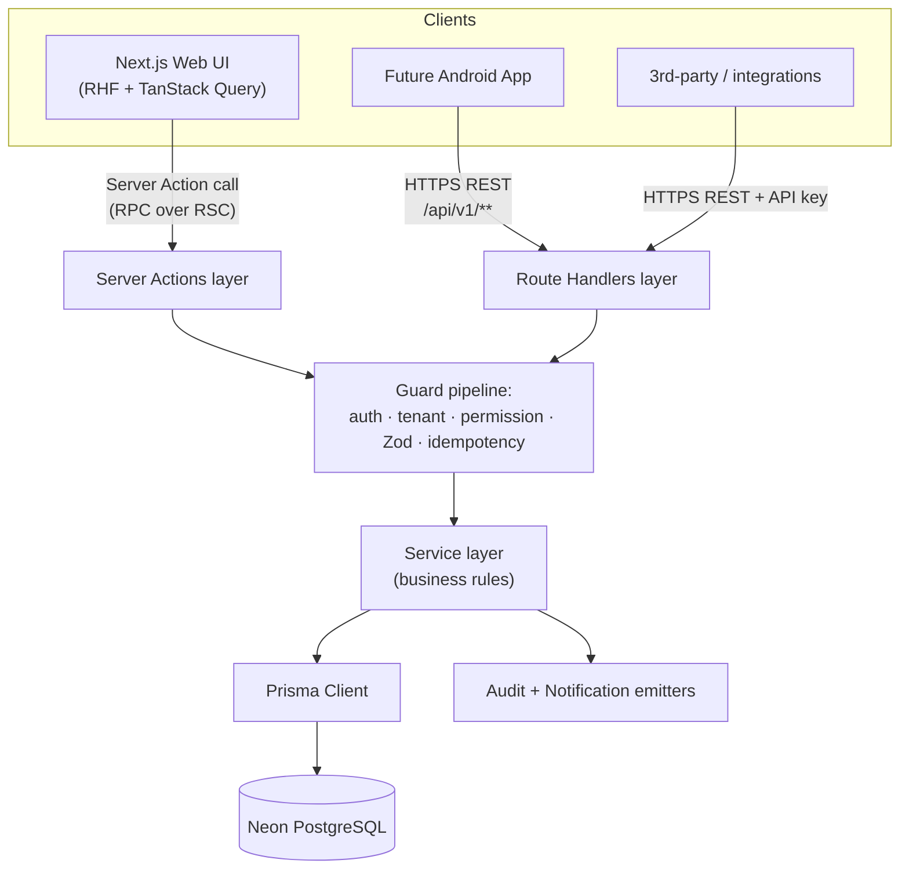
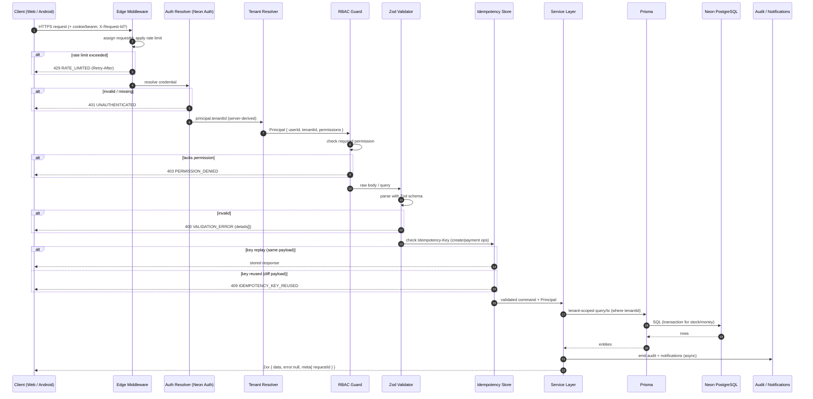

# 08 — Backend & API Specification

> **Product:** Jewellery ERP SaaS Platform — multi-tenant SaaS for Indian jewellery businesses
> **Phase:** 1 (Next.js web only; APIs designed for future Android consumption)
> **Status:** Approved for implementation
> **Owners:** Backend Guild
> **Related:** [Database Design](03-Database-Design.md) · [Non-Functional Requirements & Security](04-Non-Functional-Requirements.md) · [Authentication & RBAC](05-Authentication-RBAC.md) · [Billing Engine](09-Billing-Engine.md) · [GST & Compliance](11-GST-Compliance.md)

---

## 1. Executive Summary

This document is the authoritative contract for the backend and API surface of the Jewellery ERP SaaS platform. The backend is **not** a separate service: it lives inside the same Next.js App Router monorepo and is delivered as two complementary interfaces:

1. **Server Actions** — the primary path for mutations initiated from the platform's own web UI (React Hook Form submissions, optimistic updates via TanStack Query). They avoid a network round-trip through a hand-written REST client and give us end-to-end type safety.
2. **Route Handlers** (`/api/v1/**`) — versioned REST endpoints that expose the same business capabilities to **future Android clients**, third-party integrations, and server-to-server automation.

Both interfaces call the **same service layer**. The service layer is the only place that talks to Prisma. This guarantees that authentication, tenant scoping, RBAC permission checks, input validation (Zod), auditing, and idempotency are enforced identically no matter how a caller arrives. There is no code path that reaches the database without passing through those gates.

Key guarantees this spec establishes:

- **Multi-tenancy is server-derived.** `tenantId` is always resolved from the authenticated session/token on the server. It is **never** read from the request body, headers, or query string sent by a client.
- **RBAC is permission-based.** Every endpoint and every action declares a single required permission string (e.g. `invoice.create`). Roles are bundles of permissions; the check is always against the permission, never the role name.
- **Every response uses one envelope.** `{ data, error, meta }`. Clients (web + Android) parse exactly one shape.
- **Mutations that create money or stock movement are idempotent.** Create-invoice and record-payment accept an `Idempotency-Key`.

---

## 2. Scope

### 2.1 In Scope

- API design philosophy and the Server Action vs Route Handler decision rules.
- Global conventions: versioning, resource naming, HTTP methods, status codes, response envelope, error model, correlation IDs.
- Cross-cutting concerns: authN, authZ, tenant scoping, validation, idempotency, rate limiting hooks.
- Pagination, filtering, search, sorting conventions.
- The **full endpoint catalogue** across every Phase 1 module, with request/response JSON examples.
- Representative TypeScript implementations (one Server Action, one Route Handler).
- Sequence diagrams for the request lifecycle.
- Error handling, logging, observability, versioning & deprecation policy.
- Acceptance criteria, edge cases, future enhancements.

### 2.2 Out of Scope

- Database schema (see [Database Design](03-Database-Design.md)).
- Billing math / making-charge / GST computation internals (see [Billing Engine](09-Billing-Engine.md) and [GST & Compliance](11-GST-Compliance.md)).
- Infra, rate-limit backing store, and secrets (see [Non-Functional Requirements & Security](04-Non-Functional-Requirements.md)).
- Front-end component design.

---

## 3. Assumptions

| # | Assumption |
|---|-----------|
| A1 | Auth is provided by **Neon Auth**; sessions for web, bearer JWTs for Android/API clients. Both resolve to the same principal + tenant context. |
| A2 | The database is **Neon PostgreSQL** accessed exclusively through **Prisma**. |
| A3 | The app is deployed on **Vercel**; Route Handlers and Server Actions run in the Node.js runtime unless explicitly marked edge. |
| A4 | Binary assets (invoice PDFs, product images, logos) live in **Cloudflare R2**; the API issues signed upload/download URLs and never proxies large binaries through the function. |
| A5 | One Neon Auth user may belong to multiple tenants; the active tenant is bound to the session/token at login and cannot be switched by mutating a request field. |
| A6 | All timestamps are stored and returned as **UTC ISO-8601**; display localization (IST) is a client concern. |
| A7 | All monetary amounts are transported as **integer minor units are NOT used**; instead decimals are transported as strings with 2–3 dp to avoid float drift (e.g. `"1250.00"`, gram weights `"12.340"`). |
| A8 | The rate-limit and idempotency stores are backed by a Redis-compatible KV (see doc 04). |

---

## 4. API Design Philosophy

### 4.1 Two interfaces, one service layer



### 4.2 When to use which

| Use a **Server Action** when… | Use a **Route Handler** when… |
|---|---|
| The caller is the platform's own web UI submitting a form. | The caller is (or will be) Android, a partner integration, or a webhook consumer. |
| You want end-to-end TypeScript types without an OpenAPI client. | You need a stable, versioned, documented REST contract. |
| The operation is tied to a React component's mutation lifecycle. | The operation must be reachable via `curl`/HTTP from outside the browser. |
| Progressive enhancement / no-JS fallback is desirable. | You need fine-grained HTTP semantics (status codes, caching headers, content negotiation). |

**Non-negotiable:** both interfaces enforce the identical guard pipeline (auth → tenant → permission → validation → idempotency) by delegating to the same shared functions. A Server Action is never a shortcut around authorization.

### 4.3 Parity rule

Every capability exposed as a Server Action **must** have an equivalent Route Handler in `/api/v1` (or be explicitly listed as web-only) so that the Android client is never blocked. New mutations ship with both, or with a documented parity exception.

---

## 5. Global Conventions

### 5.1 Base path & versioning

- REST base path: **`/api/v1`**.
- The major version is in the path. Breaking changes bump to `/api/v2`; see [§18 Versioning & Deprecation](#18-versioning--deprecation-policy).
- Server Actions are internal and unversioned; their compatibility is guarded by TypeScript at build time.

### 5.2 Resource naming

| Rule | Example |
|------|---------|
| Plural, kebab-case collections | `/api/v1/customers`, `/api/v1/stock-movements` |
| Nested resources reflect ownership | `/api/v1/invoices/{invoiceId}/payments` |
| Actions that aren't pure CRUD use a sub-path verb | `/api/v1/invoices/{id}/cancel`, `/api/v1/invoices/{id}/pdf` |
| No tenant id in the path | tenant is from session, never `/tenants/{tid}/customers` for tenant-scoped calls |
| Super-admin platform routes are namespaced | `/api/v1/admin/tenants`, `/api/v1/admin/stats` |

### 5.3 HTTP methods

| Method | Semantics | Idempotent |
|--------|-----------|-----------|
| `GET` | Read a resource or collection. Never mutates. | Yes |
| `POST` | Create a resource, or invoke a non-CRUD action. | No (unless `Idempotency-Key` supplied) |
| `PATCH` | Partial update of an existing resource. | Yes (same payload → same state) |
| `PUT` | Full replace (used rarely; settings docs). | Yes |
| `DELETE` | Soft-delete / archive (hard-delete restricted to super-admin). | Yes |

### 5.4 HTTP status codes

| Code | Meaning | When we return it |
|------|---------|-------------------|
| `200 OK` | Success with body | Reads, successful updates, actions |
| `201 Created` | Resource created | Successful `POST` create |
| `202 Accepted` | Queued for async processing | PDF generation, bulk export |
| `204 No Content` | Success, no body | Soft-delete, some cancels |
| `400 Bad Request` | Malformed request / failed Zod validation | Invalid body, bad query param |
| `401 Unauthorized` | Missing/invalid credentials | No session, expired token |
| `403 Forbidden` | Authenticated but lacks permission or cross-tenant access | Permission check fail, tenant mismatch |
| `404 Not Found` | Resource does not exist **in caller's tenant** | Unknown id, or id in another tenant |
| `409 Conflict` | State conflict / uniqueness / idempotency replay mismatch | Duplicate SKU, invoice already cancelled |
| `422 Unprocessable Entity` | Semantically invalid business operation | Stock would go negative, GSTIN checksum fail |
| `429 Too Many Requests` | Rate limit exceeded | Per doc 04 limits |
| `500 Internal Server Error` | Unhandled server fault | Bugs; always logged with correlation id |
| `503 Service Unavailable` | Dependency down / maintenance | DB unreachable, R2 down |

### 5.5 Standard response envelope

Every JSON response — success or error — is exactly one of:

```json
{
  "data": { "id": "cus_01HZX...", "name": "Rajesh Traders" },
  "error": null,
  "meta": { "requestId": "req_01HZY2K...", "timestamp": "2026-07-01T09:12:44.120Z" }
}
```

```json
{
  "data": null,
  "error": {
    "code": "VALIDATION_ERROR",
    "message": "Request body failed validation.",
    "details": [
      { "path": "phone", "message": "Must be a 10-digit Indian mobile number." }
    ]
  },
  "meta": { "requestId": "req_01HZY2K...", "timestamp": "2026-07-01T09:12:44.120Z" }
}
```

For collections, `meta` also carries pagination:

```json
{
  "data": [ /* items */ ],
  "error": null,
  "meta": {
    "requestId": "req_01HZY...",
    "timestamp": "2026-07-01T09:12:44.120Z",
    "pagination": {
      "mode": "cursor",
      "nextCursor": "eyJpZCI6ImN1c18wMUha...",
      "prevCursor": null,
      "limit": 25,
      "hasMore": true
    }
  }
}
```

### 5.6 Error object shape & codes

```jsonc
{
  "code": "STRING_ENUM",          // machine-readable, stable
  "message": "Human-readable summary (safe to show).",
  "details": [ ... ],             // optional: field-level or contextual
  "retryable": false              // optional hint for clients
}
```

| Error code | HTTP | Meaning |
|-----------|------|---------|
| `VALIDATION_ERROR` | 400 | Zod validation failed; `details[]` lists field paths. |
| `MALFORMED_REQUEST` | 400 | Body isn't valid JSON / wrong content-type. |
| `UNAUTHENTICATED` | 401 | No valid session or bearer token. |
| `TOKEN_EXPIRED` | 401 | Token valid shape but expired; client should refresh. |
| `PERMISSION_DENIED` | 403 | Principal lacks the required permission. |
| `TENANT_MISMATCH` | 403 | Resource belongs to a different tenant. |
| `NOT_FOUND` | 404 | No such resource within the tenant. |
| `CONFLICT` | 409 | Uniqueness or state conflict. |
| `IDEMPOTENCY_KEY_REUSED` | 409 | Same key, different payload than the original request. |
| `UNPROCESSABLE` | 422 | Business rule violation (e.g. negative stock). |
| `INSUFFICIENT_STOCK` | 422 | Requested quantity exceeds available. |
| `INVALID_GSTIN` | 422 | GSTIN checksum/format invalid. |
| `SUBSCRIPTION_INACTIVE` | 403 | Tenant subscription expired/suspended. |
| `RATE_LIMITED` | 429 | Too many requests; see `Retry-After`. |
| `INTERNAL_ERROR` | 500 | Unhandled server error. |
| `DEPENDENCY_UNAVAILABLE` | 503 | DB/R2/downstream unavailable. |

### 5.7 Correlation / request id

- Every request is assigned a `requestId` (ULID) at the edge (middleware). If the client sends `X-Request-Id`, it is echoed and used; otherwise one is generated.
- `requestId` appears in: the `meta` block, the `X-Request-Id` response header, and every structured log line for that request.
- Clients should log and surface `requestId` for support escalations.

---

## 6. Cross-Cutting Concerns

### 6.1 Authentication

| Client | Mechanism |
|--------|-----------|
| Web UI (Server Actions) | Neon Auth session cookie, read server-side via the auth helper. |
| Web UI (Route Handlers) | Same session cookie (same-origin). |
| Android / integrations | `Authorization: Bearer <JWT>` issued by Neon Auth. |

The server resolves a **Principal** `{ userId, tenantId, roles, permissions }` from the credential. Absent/invalid → `401 UNAUTHENTICATED`.

### 6.2 Authorization (permission per endpoint)

- Each endpoint declares exactly one required permission (a few declare a set with OR semantics; noted inline).
- The guard checks `principal.permissions.includes(required)`. Failure → `403 PERMISSION_DENIED`.
- The permission catalogue and role→permission mapping live in [Authentication & RBAC](05-Authentication-RBAC.md). This doc references permissions by name only.

### 6.3 Tenant scoping

- `tenantId` comes only from the Principal.
- Every Prisma query in the service layer includes `where: { tenantId }` (enforced via a Prisma extension / repository wrapper).
- Fetching a resource whose `tenantId` differs from the Principal returns `404 NOT_FOUND` (not 403) to avoid leaking existence — except for explicit cross-tenant super-admin routes which return `403 TENANT_MISMATCH` when misused.

### 6.4 Input validation (Zod)

- Every request body and query object is parsed by a Zod schema **before** any business logic runs.
- Parse failure → `400 VALIDATION_ERROR` with `details[]` of `{ path, message }`.
- Schemas are colocated with the service and shared between the Server Action and Route Handler so both validate identically.

### 6.5 Idempotency

- Applies to money- or stock-affecting `POST`s: **create invoice**, **record payment**, **stock adjustment/transfer**, **create tenant** (billing side effects).
- Client sends `Idempotency-Key: <uuid>` header (or `idempotencyKey` field for Server Actions).
- Server stores `{ key, tenantId, requestHash, response }` for 24h.
  - Same key + same payload hash → returns the **stored** response (replay-safe).
  - Same key + different payload → `409 IDEMPOTENCY_KEY_REUSED`.
- Keys are scoped per tenant.

### 6.6 Rate limiting

- Enforced at middleware per doc 04. Tiers: per-IP (unauth), per-user, per-tenant, and per-endpoint-class (auth endpoints stricter).
- Exceeded → `429 RATE_LIMITED` with headers `Retry-After`, `X-RateLimit-Limit`, `X-RateLimit-Remaining`, `X-RateLimit-Reset`.
- See [Non-Functional Requirements & Security §Rate Limiting](04-Non-Functional-Requirements.md).

---

## 7. Pagination, Filtering, Search, Sorting

### 7.1 Pagination

Two modes are supported; **cursor is preferred** for large/append-heavy collections (invoices, stock movements, audit logs), while page/limit is offered for admin tables and small collections.

**Cursor mode**

| Param | Type | Default | Notes |
|-------|------|---------|-------|
| `cursor` | string | — | Opaque, base64. Omit for first page. |
| `limit` | int | 25 | Max 100. |
| `direction` | `forward`\|`backward` | `forward` | Pair with `nextCursor`/`prevCursor`. |

**Page/limit mode**

| Param | Type | Default | Notes |
|-------|------|---------|-------|
| `page` | int | 1 | 1-based. |
| `limit` | int | 25 | Max 100. |

Response `meta.pagination` reflects the active mode (`"mode": "cursor"` or `"mode": "offset"` with `page`, `totalItems`, `totalPages`).

### 7.2 Filtering

- `filter[field]=value` for equality; `filter[field][op]=value` for operators.
- Operators: `eq, ne, gt, gte, lt, lte, in, contains, between`.
- Examples:
  - `/api/v1/invoices?filter[status]=PAID`
  - `/api/v1/invoices?filter[total][gte]=10000`
  - `/api/v1/stock-movements?filter[type][in]=SALE,RETURN`
  - `/api/v1/invoices?filter[createdAt][between]=2026-06-01,2026-06-30`

### 7.3 Search

- `q=<term>` performs a module-defined fuzzy search (e.g. customers: name/phone/email; products: name/SKU/HSN).
- Search combines with filters (AND).

### 7.4 Sorting

- `sort=field` ascending; `sort=-field` descending; comma-separated for multi-key.
- Example: `/api/v1/customers?sort=-createdAt,name`.
- Only whitelisted sort fields per resource are honoured; others → `400 VALIDATION_ERROR`.

---

## 8. Endpoint Catalogue

> **Legend.** Every endpoint below enforces: authenticated Principal → tenant scope from session → the listed **Permission** → Zod validation. Tenant-scoped `404` semantics per §6.3. Monetary/weight fields are decimal strings per assumption A7.

### 8.1 Authentication & Session

#### `GET /api/v1/auth/me`
- **Purpose:** Return the current principal, active tenant, roles, permissions, and subscription status.
- **Permission:** _authenticated only_ (no specific permission).
- **Params:** none.
- **Success `200`:**
```json
{
  "data": {
    "user": { "id": "usr_01HZ...", "name": "Anita Shah", "email": "anita@shah-jewellers.in" },
    "tenant": { "id": "ten_01HA...", "name": "Shah Jewellers", "plan": "GROWTH", "status": "ACTIVE" },
    "roles": ["BUSINESS_OWNER"],
    "permissions": ["invoice.create", "invoice.read", "customer.write", "..."]
  },
  "error": null,
  "meta": { "requestId": "req_...", "timestamp": "2026-07-01T09:12:44.120Z" }
}
```
- **Errors:** `401 UNAUTHENTICATED`.
- **Notes:** Web UI hydrates its permission-aware navigation from this. Android calls it on launch.

#### `POST /api/v1/auth/session/refresh`
- **Purpose:** Exchange a refresh token for a new access token (Android/API clients).
- **Permission:** _valid refresh token_.
- **Request:**
```json
{ "refreshToken": "rt_01HZ..." }
```
- **Success `200`:** `{ "data": { "accessToken": "...", "expiresIn": 3600 }, "error": null, "meta": {...} }`
- **Errors:** `401 TOKEN_EXPIRED`.

#### `POST /api/v1/auth/logout`
- **Purpose:** Invalidate the current session/token.
- **Permission:** _authenticated_.
- **Success `204`.**

---

### 8.2 Super Admin — Platform

> All routes under `/api/v1/admin/**` require the caller to be a **Super Admin** (platform-level principal, not tenant-scoped). Tenant scoping is inverted here: the super admin operates *across* tenants.

#### `GET /api/v1/admin/tenants`
- **Purpose:** List all tenants (businesses) on the platform.
- **Permission:** `platform.tenant.read`.
- **Query:** pagination, `filter[status]`, `filter[plan]`, `q` (name/GSTIN).
- **Success `200`:**
```json
{
  "data": [
    { "id": "ten_01HA...", "name": "Shah Jewellers", "plan": "GROWTH",
      "status": "ACTIVE", "ownerEmail": "anita@shah-jewellers.in",
      "usersCount": 6, "createdAt": "2026-01-14T06:00:00Z" }
  ],
  "error": null,
  "meta": { "requestId": "req_...", "timestamp": "...",
    "pagination": { "mode": "offset", "page": 1, "limit": 25, "totalItems": 214, "totalPages": 9 } }
}
```

#### `POST /api/v1/admin/tenants`
- **Purpose:** Provision a new tenant (business) + its owner + default settings + trial subscription.
- **Permission:** `platform.tenant.create`.
- **Headers:** `Idempotency-Key` (recommended — has billing side effects).
- **Request:**
```json
{
  "businessName": "Verma Gold House",
  "gstin": "27ABCDE1234F1Z5",
  "owner": { "name": "Suresh Verma", "email": "suresh@vermagold.in", "phone": "9876543210" },
  "plan": "STARTER",
  "trialDays": 14
}
```
- **Success `201`:**
```json
{
  "data": {
    "tenant": { "id": "ten_01HB...", "name": "Verma Gold House", "status": "TRIAL" },
    "owner": { "id": "usr_01HB...", "inviteSent": true },
    "subscription": { "id": "sub_01HB...", "plan": "STARTER", "trialEndsAt": "2026-07-15T00:00:00Z" }
  },
  "error": null,
  "meta": {...}
}
```
- **Errors:** `409 CONFLICT` (GSTIN already onboarded), `422 INVALID_GSTIN`.

#### `GET /api/v1/admin/tenants/{tenantId}`
- **Purpose:** Full tenant detail (plan, usage, owner, health).
- **Permission:** `platform.tenant.read`.
- **Success `200`:** tenant object with `usage`, `limits`, `subscription`.

#### `PATCH /api/v1/admin/tenants/{tenantId}`
- **Purpose:** Update tenant status/plan/limits (suspend, reactivate, change plan).
- **Permission:** `platform.tenant.update`.
- **Request:**
```json
{ "status": "SUSPENDED", "reason": "Payment failure" }
```
- **Success `200`.** **Errors:** `422 UNPROCESSABLE` (invalid state transition).

#### `DELETE /api/v1/admin/tenants/{tenantId}`
- **Purpose:** Soft-delete (archive) a tenant. Hard purge is a separate, guarded async job.
- **Permission:** `platform.tenant.delete`.
- **Success `204`.**

#### `GET /api/v1/admin/subscriptions`
- **Purpose:** List/manage subscriptions across tenants.
- **Permission:** `platform.subscription.read`.
- **Query:** `filter[status]` (`TRIAL|ACTIVE|PAST_DUE|CANCELLED`), `filter[plan]`.

#### `PATCH /api/v1/admin/subscriptions/{subscriptionId}`
- **Purpose:** Change plan, extend trial, mark paid, cancel.
- **Permission:** `platform.subscription.update`.
- **Request:**
```json
{ "action": "CHANGE_PLAN", "plan": "GROWTH", "effectiveAt": "2026-08-01T00:00:00Z" }
```
- **Success `200`.**

#### `GET /api/v1/admin/stats`
- **Purpose:** Platform-wide KPIs (MRR, active tenants, churn, invoices/day).
- **Permission:** `platform.stats.read`.
- **Success `200`:**
```json
{
  "data": {
    "tenants": { "total": 214, "active": 189, "trial": 18, "suspended": 7 },
    "mrr": "742500.00", "arpu": "3928.00",
    "churnRate30d": "1.8",
    "invoicesLast24h": 5120, "signupsLast30d": 27
  },
  "error": null, "meta": {...}
}
```

---

### 8.3 Users, Roles & Permissions (tenant-scoped)

#### `GET /api/v1/users`
- **Purpose:** List users within the current tenant.
- **Permission:** `user.read`.
- **Query:** pagination, `filter[role]`, `filter[status]`, `q`.
- **Success `200`:** array of `{ id, name, email, roles, status, lastActiveAt }`.

#### `POST /api/v1/users`
- **Purpose:** Invite a new user to the tenant with role(s).
- **Permission:** `user.create`.
- **Request:**
```json
{ "name": "Kiran Rao", "email": "kiran@shah-jewellers.in", "roles": ["CASHIER"] }
```
- **Success `201`:** `{ "data": { "id": "usr_...", "status": "INVITED", "inviteSent": true }, ... }`
- **Errors:** `409 CONFLICT` (email already in tenant), `403 SUBSCRIPTION_INACTIVE` (seat limit / plan).

#### `GET /api/v1/users/{userId}`
- **Purpose:** Get a single user.
- **Permission:** `user.read`.

#### `PATCH /api/v1/users/{userId}`
- **Purpose:** Update name/roles/status (activate, deactivate).
- **Permission:** `user.update`.
- **Request:** `{ "roles": ["MANAGER"], "status": "ACTIVE" }`
- **Notes:** A user cannot remove their own last `BUSINESS_OWNER` role → `422 UNPROCESSABLE`.

#### `DELETE /api/v1/users/{userId}`
- **Purpose:** Deactivate/remove a user from the tenant (soft).
- **Permission:** `user.delete`.
- **Success `204`.**

#### `GET /api/v1/roles`
- **Purpose:** List roles available in the tenant with their permission sets.
- **Permission:** `role.read`.
- **Success `200`:**
```json
{ "data": [
  { "key": "CASHIER", "name": "Cashier", "system": true,
    "permissions": ["invoice.create","invoice.read","customer.read","payment.create"] }
], "error": null, "meta": {...} }
```

#### `POST /api/v1/roles`
- **Purpose:** Create a custom role (available on higher plans).
- **Permission:** `role.create`.
- **Request:** `{ "name": "Floor Supervisor", "permissions": ["invoice.read","inventory.read"] }`
- **Errors:** `403 SUBSCRIPTION_INACTIVE` (custom roles gated by plan).

#### `PATCH /api/v1/roles/{roleKey}` — update a custom role's permissions. **Permission:** `role.update`. System roles are immutable → `422`.
#### `DELETE /api/v1/roles/{roleKey}` — delete a custom role (must be unassigned). **Permission:** `role.delete`.

#### `GET /api/v1/permissions`
- **Purpose:** Return the full permission catalogue (for role-editor UI).
- **Permission:** `role.read`.
- **Success `200`:** grouped list `{ group: "Invoice", permissions: [{ key:"invoice.create", label:"Create invoices" }, ...] }`.

---

### 8.4 Business Settings

#### `GET /api/v1/settings`
- **Purpose:** Fetch the tenant's business profile & operational settings.
- **Permission:** `settings.read`.
- **Success `200`:**
```json
{
  "data": {
    "business": { "name": "Shah Jewellers", "gstin": "27ABCDE1234F1Z5",
      "address": { "line1":"12 Zaveri Bazaar", "city":"Mumbai", "state":"Maharashtra", "pincode":"400002" },
      "phone": "02223423423", "email": "hello@shah-jewellers.in", "logoUrl": "https://cdn.r2.../logo.png" },
    "preferences": { "baseCurrency": "INR", "financialYearStart": "04-01",
      "defaultMakingChargeType": "PERCENT", "roundingMode": "NEAREST_RUPEE" },
    "invoiceDefaults": { "templateId": "tmpl_classic", "termsText": "Goods once sold...", "prefix": "SJ" }
  },
  "error": null, "meta": {...}
}
```

#### `PUT /api/v1/settings`
- **Purpose:** Replace/update business settings.
- **Permission:** `settings.update`.
- **Request:** partial or full settings object (validated by Zod).
- **Errors:** `422 INVALID_GSTIN`.

#### `GET /api/v1/settings/metal-rate-config` / `PATCH` — configure auto-rate source, spread, purities. **Permission:** `settings.read` / `settings.update`.

---

### 8.5 Customers

#### `GET /api/v1/customers`
- **Purpose:** List/search customers.
- **Permission:** `customer.read`.
- **Query:** pagination, `q` (name/phone/email), `filter[state]`, `sort`.
- **Success `200`:**
```json
{ "data": [
  { "id":"cus_01HZ...", "name":"Rajesh Traders", "phone":"9812345678",
    "email":null, "gstin":"27AAECR...", "type":"BUSINESS",
    "outstandingBalance":"12500.00", "createdAt":"2026-03-02T10:00:00Z" }
], "error": null,
  "meta": { "requestId":"req_...", "timestamp":"...",
    "pagination": { "mode":"cursor", "nextCursor":"eyJ...", "limit":25, "hasMore":true } } }
```

#### `POST /api/v1/customers`
- **Purpose:** Create a customer.
- **Permission:** `customer.create`.
- **Request:**
```json
{
  "name": "Rajesh Traders", "phone": "9812345678", "email": "rajesh@traders.in",
  "type": "BUSINESS", "gstin": "27AAECR1234K1Z2",
  "address": { "line1":"5 MG Road", "city":"Pune", "state":"Maharashtra", "pincode":"411001" },
  "openingBalance": "0.00"
}
```
- **Success `201`:** created customer object.
- **Errors:** `409 CONFLICT` (duplicate phone within tenant), `422 INVALID_GSTIN`.

#### `GET /api/v1/customers/{customerId}`
- **Purpose:** Customer detail incl. ledger summary & recent invoices.
- **Permission:** `customer.read`.

#### `PATCH /api/v1/customers/{customerId}` — update. **Permission:** `customer.update`.
#### `DELETE /api/v1/customers/{customerId}` — soft-delete (blocked if outstanding balance ≠ 0 → `422 UNPROCESSABLE`). **Permission:** `customer.delete`.

#### `GET /api/v1/customers/{customerId}/ledger`
- **Purpose:** Paginated transaction ledger (invoices, payments, adjustments).
- **Permission:** `customer.read`.
- **Query:** `filter[from]`, `filter[to]`, pagination.

---

### 8.6 Suppliers

#### `GET /api/v1/suppliers` — list/search. **Permission:** `supplier.read`.
#### `POST /api/v1/suppliers` — create. **Permission:** `supplier.create`.
```json
{ "name":"Kundan Bullion", "phone":"9900112233", "gstin":"24AAACK...",
  "type":"BULLION", "address":{ "city":"Ahmedabad","state":"Gujarat","pincode":"380001" } }
```
- **Success `201`.** **Errors:** `409 CONFLICT`, `422 INVALID_GSTIN`.

#### `GET /api/v1/suppliers/{supplierId}` — detail incl. payables. **Permission:** `supplier.read`.
#### `PATCH /api/v1/suppliers/{supplierId}` — update. **Permission:** `supplier.update`.
#### `DELETE /api/v1/suppliers/{supplierId}` — soft-delete (blocked if payable ≠ 0). **Permission:** `supplier.delete`.
#### `GET /api/v1/suppliers/{supplierId}/ledger` — payables ledger. **Permission:** `supplier.read`.

---

### 8.7 Product Categories

#### `GET /api/v1/categories` — list category tree. **Permission:** `inventory.read`.
#### `POST /api/v1/categories` — create. **Permission:** `inventory.category.create`.
```json
{ "name": "Necklaces", "parentId": null, "metalType": "GOLD", "hsnCode": "7113" }
```
- **Success `201`.**
#### `PATCH /api/v1/categories/{categoryId}` — rename/re-parent. **Permission:** `inventory.category.update`.
#### `DELETE /api/v1/categories/{categoryId}` — delete (must be empty). **Permission:** `inventory.category.delete`. Non-empty → `422 UNPROCESSABLE`.

---

### 8.8 Products / Inventory Items

#### `GET /api/v1/products`
- **Purpose:** List/search inventory items.
- **Permission:** `inventory.read`.
- **Query:** pagination, `q` (name/SKU/HSN), `filter[categoryId]`, `filter[metalType]`, `filter[purity]`, `filter[inStock]`, `sort`.
- **Success `200`:**
```json
{ "data": [
  { "id":"prd_01HZ...", "sku":"SJ-NK-0231", "name":"Antique Kundan Necklace",
    "categoryId":"cat_01H...", "metalType":"GOLD", "purity":"22K",
    "grossWeight":"45.600", "netWeight":"42.100", "stoneWeight":"3.500",
    "makingChargeType":"PERCENT", "makingChargeValue":"12.00",
    "hsnCode":"7113", "quantity":1, "status":"IN_STOCK",
    "images":["https://cdn.r2.../231-a.jpg"] }
], "error": null, "meta": {...} }
```

#### `POST /api/v1/products`
- **Purpose:** Create an inventory item.
- **Permission:** `inventory.create`.
- **Request:**
```json
{
  "sku": "SJ-NK-0231", "name": "Antique Kundan Necklace",
  "categoryId": "cat_01H...", "metalType": "GOLD", "purity": "22K",
  "grossWeight": "45.600", "netWeight": "42.100", "stoneWeight": "3.500",
  "makingChargeType": "PERCENT", "makingChargeValue": "12.00",
  "hsnCode": "7113", "openingQuantity": 1, "costPrice": "310000.00",
  "supplierId": "sup_01H...", "images": ["img_key_231a"]
}
```
- **Success `201`.** **Errors:** `409 CONFLICT` (duplicate SKU), `422 UNPROCESSABLE` (net > gross).

#### `GET /api/v1/products/{productId}` — detail incl. current stock & valuation. **Permission:** `inventory.read`.
#### `PATCH /api/v1/products/{productId}` — update attributes/making charge. **Permission:** `inventory.update`.
#### `DELETE /api/v1/products/{productId}` — soft-delete (blocked if stock > 0 unless force flag by `inventory.manage`). **Permission:** `inventory.delete`.

---

### 8.9 Stock Movements, Adjustments & Transfers

#### `GET /api/v1/stock-movements`
- **Purpose:** Immutable ledger of all stock changes.
- **Permission:** `inventory.read`.
- **Query:** pagination (cursor), `filter[productId]`, `filter[type][in]=SALE,PURCHASE,ADJUSTMENT,TRANSFER,RETURN`, `filter[from]`, `filter[to]`.
- **Success `200`:**
```json
{ "data": [
  { "id":"stk_01HZ...", "productId":"prd_01H...", "type":"SALE",
    "quantityDelta":-1, "weightDelta":"-42.100", "reason":"Invoice SJ-INV-1204",
    "refType":"INVOICE", "refId":"inv_01H...", "createdBy":"usr_01H...",
    "createdAt":"2026-06-30T11:20:00Z" }
], "error": null, "meta": {...} }
```

#### `POST /api/v1/stock-adjustments`
- **Purpose:** Manual stock correction (damage, count correction, gain).
- **Permission:** `inventory.adjust`.
- **Headers:** `Idempotency-Key`.
- **Request:**
```json
{ "productId":"prd_01H...", "quantityDelta":-1, "weightDelta":"-42.100",
  "reason":"Stolen — police FIR #221", "adjustmentType":"LOSS" }
```
- **Success `201`:** created movement.
- **Errors:** `422 INSUFFICIENT_STOCK` (would drive negative without allowNegative).

#### `POST /api/v1/stock-transfers`
- **Purpose:** Transfer stock between locations/branches (multi-location tenants).
- **Permission:** `inventory.transfer`.
- **Headers:** `Idempotency-Key`.
- **Request:**
```json
{ "productId":"prd_01H...", "fromLocationId":"loc_A", "toLocationId":"loc_B", "quantity":1 }
```
- **Success `201`.** **Errors:** `422 INSUFFICIENT_STOCK`.

---

### 8.10 Metal Rates

#### `GET /api/v1/metal-rates/current`
- **Purpose:** Current effective rates for the tenant (per metal + purity, per gram).
- **Permission:** `inventory.read` (or `billing.read`).
- **Success `200`:**
```json
{ "data": {
  "asOf":"2026-07-01T09:00:00Z", "source":"MANUAL",
  "rates":[
    { "metalType":"GOLD", "purity":"24K", "ratePerGram":"7325.00" },
    { "metalType":"GOLD", "purity":"22K", "ratePerGram":"6714.00" },
    { "metalType":"SILVER", "purity":"999", "ratePerGram":"92.50" }
  ]
}, "error": null, "meta": {...} }
```

#### `POST /api/v1/metal-rates`
- **Purpose:** Set today's rate(s).
- **Permission:** `metal-rate.update`.
- **Request:**
```json
{ "effectiveAt":"2026-07-01T09:00:00Z",
  "rates":[ { "metalType":"GOLD","purity":"22K","ratePerGram":"6714.00" } ] }
```
- **Success `201`.** New rate becomes current; prior rates retained for historical invoice reproducibility.

#### `GET /api/v1/metal-rates/history` — rate history. **Permission:** `inventory.read`. Query: `filter[metalType]`, `filter[from]`, `filter[to]`.

---

### 8.11 Invoices

> The invoice engine supports multiple document types via one create endpoint with a `type` discriminator, plus type-specific validation. Computation of amounts (metal value + making + wastage + GST − discount) is delegated to the [Billing Engine](09-Billing-Engine.md); this API accepts line inputs and returns computed totals.

**Invoice types:** `SALES`, `PURCHASE`, `QUOTATION`, `ESTIMATE`, `RETURN`, `EXCHANGE`, `REPAIR`.

#### `POST /api/v1/invoices`
- **Purpose:** Create an invoice/document of the given type.
- **Permission:** `invoice.create`.
- **Headers:** `Idempotency-Key` (**required** for `SALES`, `PURCHASE`, `RETURN`, `EXCHANGE` — they move stock/money).
- **Request (SALES example):**
```json
{
  "type": "SALES",
  "customerId": "cus_01HZ...",
  "placeOfSupply": "27",
  "invoiceDate": "2026-07-01",
  "lines": [
    {
      "productId": "prd_01HZ...",
      "quantity": 1,
      "metalRatePerGram": "6714.00",
      "netWeight": "42.100",
      "makingChargeType": "PERCENT",
      "makingChargeValue": "12.00",
      "wastagePercent": "2.00",
      "stoneCharge": "8500.00",
      "hsnCode": "7113"
    }
  ],
  "discount": { "type": "FLAT", "value": "2000.00" },
  "roundOff": true,
  "payments": [
    { "mode": "UPI", "amount": "50000.00", "reference": "UPI/2026/xyz" }
  ],
  "notes": "Wedding purchase"
}
```
- **Success `201`:**
```json
{
  "data": {
    "id": "inv_01HZ...",
    "number": "SJ-INV-1205",
    "type": "SALES",
    "status": "PARTIALLY_PAID",
    "customerId": "cus_01HZ...",
    "invoiceDate": "2026-07-01",
    "lines": [
      { "productId":"prd_01HZ...", "metalValue":"282659.40", "makingCharge":"33919.13",
        "wastageValue":"5653.19", "stoneCharge":"8500.00", "taxableValue":"328731.72",
        "gst": { "rate":"3.00", "cgst":"4930.98", "sgst":"4930.98", "igst":"0.00" },
        "lineTotal":"338593.68" }
    ],
    "totals": {
      "subTotal":"330731.72", "discount":"2000.00", "taxableValue":"328731.72",
      "cgst":"4930.98", "sgst":"4930.98", "igst":"0.00",
      "roundOff":"0.32", "grandTotal":"338594.00",
      "amountPaid":"50000.00", "balanceDue":"288594.00"
    },
    "createdAt": "2026-07-01T09:14:00Z"
  },
  "error": null, "meta": {...}
}
```
- **Errors:**
  - `422 INSUFFICIENT_STOCK` — a line's product lacks stock (SALES).
  - `422 UNPROCESSABLE` — IGST/CGST mismatch vs place of supply; missing customer GSTIN for B2B where required.
  - `409 IDEMPOTENCY_KEY_REUSED`.
  - `403 SUBSCRIPTION_INACTIVE`.
- **Business rules:**
  - `SALES`/`RETURN`/`EXCHANGE` write immutable stock movements atomically with the invoice (single DB transaction).
  - `QUOTATION`/`ESTIMATE` do **not** move stock or affect ledgers; they can be converted to `SALES` later.
  - `PURCHASE` increases stock and creates a supplier payable.
  - `REPAIR` tracks inbound customer item + labour; optional metal addition.
  - Intra-state (place of supply == business state) → CGST+SGST; inter-state → IGST. Server computes; client-supplied tax is ignored.

#### `POST /api/v1/invoices/{invoiceId}/convert`
- **Purpose:** Convert a `QUOTATION`/`ESTIMATE` into a `SALES` invoice.
- **Permission:** `invoice.create`.
- **Headers:** `Idempotency-Key`.
- **Success `201`:** new SALES invoice referencing the source.

#### `GET /api/v1/invoices`
- **Purpose:** List/search invoices.
- **Permission:** `invoice.read`.
- **Query:** pagination (cursor), `filter[type]`, `filter[status]`, `filter[customerId]`, `filter[from]`, `filter[to]`, `filter[total][gte]`, `q` (number), `sort`.
- **Success `200`:** list of invoice summaries with totals.

#### `GET /api/v1/invoices/{invoiceId}`
- **Purpose:** Full invoice with lines, tax breakup, payments, audit refs.
- **Permission:** `invoice.read`.
- **Errors:** `404 NOT_FOUND`.

#### `POST /api/v1/invoices/{invoiceId}/cancel`
- **Purpose:** Cancel an invoice; reverses stock movements and ledger entries via compensating transactions (invoices are never hard-deleted for audit/GST).
- **Permission:** `invoice.cancel`.
- **Request:** `{ "reason": "Customer cancelled order" }`
- **Success `200`:** invoice with `status:"CANCELLED"` and reversal refs.
- **Errors:** `422 UNPROCESSABLE` (already cancelled, or GST return already filed for its period → cancellation requires credit note flow instead).

#### `POST /api/v1/invoices/{invoiceId}/pdf`
- **Purpose:** Generate (async) the PDF using the assigned template and return a signed R2 URL.
- **Permission:** `invoice.read`.
- **Success `202`:**
```json
{ "data": { "status":"GENERATING", "jobId":"job_01H...", "pollUrl":"/api/v1/jobs/job_01H..." },
  "error": null, "meta": {...} }
```
  or, if cached, `200` with `{ "data": { "url":"https://cdn.r2.../SJ-INV-1205.pdf?sig=...", "expiresAt":"..." } }`.

#### `GET /api/v1/invoices/{invoiceId}/print`
- **Purpose:** Return print-ready HTML/JSON payload for thermal/A4 rendering.
- **Permission:** `invoice.read`.

---

### 8.12 Payments

#### `GET /api/v1/invoices/{invoiceId}/payments` — list payments for an invoice. **Permission:** `invoice.read`.

#### `POST /api/v1/invoices/{invoiceId}/payments`
- **Purpose:** Record a payment against an invoice; updates balance & customer ledger.
- **Permission:** `payment.create`.
- **Headers:** `Idempotency-Key` (**required**).
- **Request:**
```json
{ "mode":"CASH", "amount":"100000.00", "receivedAt":"2026-07-01T15:00:00Z",
  "reference":null, "notes":"Second installment" }
```
- **Success `201`:**
```json
{ "data": { "id":"pay_01H...", "invoiceId":"inv_01H...", "amount":"100000.00",
  "mode":"CASH", "invoiceBalanceAfter":"188594.00", "invoiceStatus":"PARTIALLY_PAID" },
  "error": null, "meta": {...} }
```
- **Errors:** `422 UNPROCESSABLE` (amount exceeds balance unless overpayment allowed → creates customer credit), `409 IDEMPOTENCY_KEY_REUSED`.

#### `DELETE /api/v1/payments/{paymentId}`
- **Purpose:** Void a wrongly-recorded payment (compensating entry; not physical delete).
- **Permission:** `payment.void`.
- **Success `200`.**

#### `POST /api/v1/supplier-payments`
- **Purpose:** Record a payment to a supplier against purchase invoices.
- **Permission:** `payment.create`.
- **Headers:** `Idempotency-Key`.
- **Request:** `{ "supplierId":"sup_01H...", "amount":"250000.00", "mode":"BANK", "allocations":[{"invoiceId":"inv_01H...","amount":"250000.00"}] }`
- **Success `201`.**

---

### 8.13 GST Reports

#### `GET /api/v1/gst/gstr1`
- **Purpose:** GSTR-1 outward supplies summary for a period.
- **Permission:** `gst.read`.
- **Query:** `filter[from]` & `filter[to]` (or `period=2026-06`), `format=json|csv`.
- **Success `200`:**
```json
{ "data": {
  "period":"2026-06",
  "b2b":[ { "gstin":"27AAECR...","invoices":4,"taxableValue":"1200000.00",
            "igst":"0.00","cgst":"18000.00","sgst":"18000.00" } ],
  "b2c":{ "taxableValue":"850000.00","cgst":"12750.00","sgst":"12750.00" },
  "hsnSummary":[ { "hsn":"7113","qty":42,"taxableValue":"1900000.00","rate":"3.00" } ]
}, "error": null, "meta": {...} }
```

#### `GET /api/v1/gst/gstr3b` — GSTR-3B summary (outward tax, ITC). **Permission:** `gst.read`.
#### `GET /api/v1/gst/hsn-summary` — HSN-wise summary. **Permission:** `gst.read`.
#### `POST /api/v1/gst/export`
- **Purpose:** Generate a filing-ready export (JSON/Excel) to R2.
- **Permission:** `gst.export`.
- **Success `202`:** job + poll URL. See [GST & Compliance](11-GST-Compliance.md) for schema mapping.

---

### 8.14 Reports

All report endpoints: **Permission** as listed, support `filter[from]`/`filter[to]`, `format=json|csv`, and return `202` + job for large exports.

| Endpoint | Purpose | Permission |
|----------|---------|-----------|
| `GET /api/v1/reports/sales` | Sales summary by day/product/category/user | `report.sales.read` |
| `GET /api/v1/reports/inventory` | Stock valuation, ageing, dead stock | `report.inventory.read` |
| `GET /api/v1/reports/customers` | Top customers, outstanding, purchase frequency | `report.customer.read` |
| `GET /api/v1/reports/tax` | Tax collected/payable breakdown | `report.tax.read` |
| `GET /api/v1/reports/profit` | Gross margin (sale − cost − making) | `report.profit.read` |

**Example — `GET /api/v1/reports/sales?filter[from]=2026-06-01&filter[to]=2026-06-30&groupBy=category`:**
```json
{ "data": {
  "range": { "from":"2026-06-01","to":"2026-06-30" },
  "totals": { "invoices":312, "grossSales":"18250000.00", "tax":"547500.00", "netSales":"17702500.00" },
  "groups": [
    { "key":"Necklaces","invoices":88,"grossSales":"9200000.00","weightSoldGrams":"4820.500" },
    { "key":"Rings","invoices":140,"grossSales":"4100000.00","weightSoldGrams":"1210.000" }
  ]
}, "error": null, "meta": {...} }
```

---

### 8.15 Notifications

#### `GET /api/v1/notifications` — list current user's notifications. **Permission:** _authenticated_. Query: `filter[read]`, pagination.
#### `PATCH /api/v1/notifications/{id}` — mark read/unread. **Permission:** _authenticated_ (own notifications only).
#### `POST /api/v1/notifications/mark-all-read` — bulk mark read. **Permission:** _authenticated_.
#### `GET /api/v1/notifications/preferences` / `PATCH` — channel prefs (email/SMS/in-app). **Permission:** `settings.read` / `settings.update`.

**List success `200`:**
```json
{ "data":[
  { "id":"ntf_01H...","type":"LOW_STOCK","title":"Low stock: SJ-NK-0231",
    "body":"Quantity fell to 0.","read":false,"createdAt":"2026-06-30T18:00:00Z",
    "ref":{ "type":"PRODUCT","id":"prd_01H..." } }
], "error": null, "meta": {...} }
```

---

### 8.16 Audit Logs (read-only)

#### `GET /api/v1/audit-logs`
- **Purpose:** Immutable audit trail of security- and data-relevant actions within the tenant.
- **Permission:** `audit.read`.
- **Query:** pagination (cursor), `filter[actorId]`, `filter[action]`, `filter[entityType]`, `filter[entityId]`, `filter[from]`, `filter[to]`.
- **Success `200`:**
```json
{ "data":[
  { "id":"aud_01H...","actorId":"usr_01H...","actorName":"Anita Shah",
    "action":"invoice.cancel","entityType":"INVOICE","entityId":"inv_01H...",
    "before":{ "status":"PAID" },"after":{ "status":"CANCELLED" },
    "ip":"103.5.12.9","requestId":"req_01H...","createdAt":"2026-06-30T12:00:00Z" }
], "error": null, "meta": {...} }
```
- **Notes:** Audit logs are write-only from the service layer; there is **no** create/update/delete endpoint. Retention per doc 04.

#### `GET /api/v1/audit-logs/{id}` — single entry. **Permission:** `audit.read`.

---

### 8.17 Dashboard Analytics

#### `GET /api/v1/dashboard/summary`
- **Purpose:** Home dashboard KPIs for the tenant, role-aware.
- **Permission:** `dashboard.read`.
- **Query:** `range=today|7d|30d|mtd|fytd`.
- **Success `200`:**
```json
{ "data": {
  "range":"30d",
  "sales": { "amount":"18250000.00","invoices":312,"trendPct":"8.4" },
  "collections": { "amount":"16100000.00","outstanding":"2150000.00" },
  "inventory": { "valuation":"52400000.00","lowStockItems":6,"deadStockItems":11 },
  "topProducts":[ { "name":"Antique Kundan Necklace","soldQty":22 } ],
  "goldRate": { "22K":"6714.00","24K":"7325.00","asOf":"2026-07-01T09:00:00Z" }
}, "error": null, "meta": {...} }
```

#### `GET /api/v1/dashboard/charts/{metric}` — timeseries for a metric (`sales|collections|inventory-valuation`). **Permission:** `dashboard.read`. Query: `range`, `interval=day|week|month`.

---

### 8.18 File Upload (Cloudflare R2)

#### `POST /api/v1/uploads/sign`
- **Purpose:** Obtain a pre-signed R2 URL for a direct client→R2 upload (product images, logos, attachments). The API never proxies the binary.
- **Permission:** context-dependent (`inventory.create` for product images, `settings.update` for logo, etc.); the `purpose` field selects the required permission.
- **Request:**
```json
{ "purpose":"PRODUCT_IMAGE", "fileName":"necklace-231.jpg",
  "contentType":"image/jpeg", "sizeBytes":842100 }
```
- **Success `200`:**
```json
{ "data": {
  "uploadUrl":"https://<bucket>.r2.cloudflarestorage.com/...&X-Amz-Signature=...",
  "method":"PUT",
  "objectKey":"tenants/ten_01HA/products/img_01HZ.jpg",
  "publicUrl":"https://cdn.shah-jewellers.example/img_01HZ.jpg",
  "expiresAt":"2026-07-01T09:25:00Z",
  "maxSizeBytes":5242880
}, "error": null, "meta": {...} }
```
- **Errors:** `422 UNPROCESSABLE` (disallowed content type / over size), `403 PERMISSION_DENIED`.
- **Notes:** Object keys are always prefixed with `tenants/{tenantId}/…` server-side. The client then `PUT`s the file to `uploadUrl` and references `objectKey`/`publicUrl` when creating the parent resource.

#### `POST /api/v1/uploads/sign-download`
- **Purpose:** Get a short-lived signed GET URL for a private object (e.g. a generated invoice PDF).
- **Permission:** resource-dependent; ownership + tenant checked.
- **Success `200`:** `{ "data": { "url":"...", "expiresAt":"..." }, ... }`.

---

## 9. Representative Server Action (TypeScript)

```typescript
// app/(app)/customers/actions.ts
"use server";

import { z } from "zod";
import { getPrincipal } from "@/server/auth";           // resolves { userId, tenantId, permissions }
import { assertPermission } from "@/server/rbac";
import { withTenant } from "@/server/db";                // tenant-scoped Prisma wrapper
import { audit } from "@/server/audit";
import { toEnvelope, fromZodError, ActionResult } from "@/server/http";

const CreateCustomerSchema = z.object({
  name: z.string().min(1).max(120),
  phone: z.string().regex(/^[6-9]\d{9}$/, "Must be a 10-digit Indian mobile number."),
  email: z.string().email().optional().nullable(),
  type: z.enum(["INDIVIDUAL", "BUSINESS"]),
  gstin: z.string().regex(/^\d{2}[A-Z]{5}\d{4}[A-Z]{1}[A-Z\d]{1}Z[A-Z\d]{1}$/).optional().nullable(),
  address: z.object({
    line1: z.string().min(1),
    city: z.string().min(1),
    state: z.string().min(1),
    pincode: z.string().regex(/^\d{6}$/),
  }),
  openingBalance: z.string().regex(/^-?\d+(\.\d{2})?$/).default("0.00"),
});

export async function createCustomer(input: unknown): Promise<ActionResult> {
  // 1. Auth — resolves Principal from Neon Auth session (never from input)
  const principal = await getPrincipal();
  if (!principal) return toEnvelope(null, { code: "UNAUTHENTICATED", message: "Sign in required." });

  // 2. Permission
  const denied = assertPermission(principal, "customer.create");
  if (denied) return denied; // -> PERMISSION_DENIED envelope

  // 3. Validation
  const parsed = CreateCustomerSchema.safeParse(input);
  if (!parsed.success) return fromZodError(parsed.error);

  // 4. Service + Prisma (tenant scope injected; client cannot set tenantId)
  const db = withTenant(principal.tenantId);
  const existing = await db.customer.findFirst({ where: { phone: parsed.data.phone } });
  if (existing) {
    return toEnvelope(null, { code: "CONFLICT", message: "A customer with this phone already exists." });
  }

  const customer = await db.customer.create({
    data: { ...parsed.data, tenantId: principal.tenantId, createdById: principal.userId },
  });

  // 5. Audit
  await audit(principal, { action: "customer.create", entityType: "CUSTOMER", entityId: customer.id, after: customer });

  return toEnvelope(customer);
}
```

---

## 10. Representative Route Handler (TypeScript)

```typescript
// app/api/v1/customers/route.ts
import { NextRequest } from "next/server";
import { z } from "zod";
import { authenticateRequest } from "@/server/auth";      // session cookie OR bearer JWT
import { assertPermission } from "@/server/rbac";
import { withTenant } from "@/server/db";
import { idempotent } from "@/server/idempotency";
import { audit } from "@/server/audit";
import { json, jsonError, fromZodError, listMeta } from "@/server/http";

const CreateCustomerSchema = z.object({ /* identical schema, shared module */ });

export async function POST(req: NextRequest) {
  const requestId = req.headers.get("x-request-id") ?? crypto.randomUUID();

  // 1. Auth
  const principal = await authenticateRequest(req);
  if (!principal) return jsonError(401, "UNAUTHENTICATED", "Authentication required.", requestId);

  // 2. Permission
  if (!principal.permissions.includes("customer.create")) {
    return jsonError(403, "PERMISSION_DENIED", "You lack customer.create.", requestId);
  }

  // 3. Parse + validate
  let body: unknown;
  try { body = await req.json(); }
  catch { return jsonError(400, "MALFORMED_REQUEST", "Body is not valid JSON.", requestId); }

  const parsed = CreateCustomerSchema.safeParse(body);
  if (!parsed.success) return fromZodError(parsed.error, requestId);

  // 4. Idempotency (optional here; required for invoices/payments)
  const key = req.headers.get("idempotency-key");
  return idempotent({ key, tenantId: principal.tenantId, payload: parsed.data }, async () => {
    // 5. Service + Prisma with tenant scope
    const db = withTenant(principal.tenantId);
    const dupe = await db.customer.findFirst({ where: { phone: parsed.data.phone } });
    if (dupe) return jsonError(409, "CONFLICT", "Customer phone already exists.", requestId);

    const customer = await db.customer.create({
      data: { ...parsed.data, tenantId: principal.tenantId, createdById: principal.userId },
    });

    await audit(principal, { action: "customer.create", entityType: "CUSTOMER", entityId: customer.id, requestId });

    // 6. Envelope response
    return json(201, customer, requestId);
  });
}

export async function GET(req: NextRequest) {
  const requestId = req.headers.get("x-request-id") ?? crypto.randomUUID();
  const principal = await authenticateRequest(req);
  if (!principal) return jsonError(401, "UNAUTHENTICATED", "Authentication required.", requestId);
  if (!principal.permissions.includes("customer.read")) {
    return jsonError(403, "PERMISSION_DENIED", "You lack customer.read.", requestId);
  }

  const url = new URL(req.url);
  const limit = Math.min(Number(url.searchParams.get("limit") ?? 25), 100);
  const cursor = url.searchParams.get("cursor") ?? undefined;
  const q = url.searchParams.get("q") ?? undefined;

  const db = withTenant(principal.tenantId);
  const rows = await db.customer.findMany({
    where: q ? { OR: [{ name: { contains: q, mode: "insensitive" } }, { phone: { contains: q } }] } : {},
    take: limit + 1,
    ...(cursor ? { cursor: { id: cursor }, skip: 1 } : {}),
    orderBy: { createdAt: "desc" },
  });

  const hasMore = rows.length > limit;
  const items = hasMore ? rows.slice(0, limit) : rows;
  return json(200, items, requestId, listMeta({ mode: "cursor", limit, hasMore, nextCursor: hasMore ? items.at(-1)!.id : null }));
}
```

---

## 11. Request Lifecycle — Sequence Diagram



---

## 12. Error Handling Strategy

- **Single funnel.** Both Server Actions and Route Handlers pass all thrown errors through one `handleError()` that maps known error classes → `{ httpStatus, code, message }` and unknown errors → `500 INTERNAL_ERROR`.
- **No leakage.** `message` for `500`/`503` is generic (`"An unexpected error occurred."`); full stack + `requestId` go to logs only.
- **Typed domain errors.** The service layer throws typed errors (`InsufficientStockError`, `TenantMismatchError`, `SubscriptionInactiveError`, …) carrying the target `code`; the funnel never guesses.
- **Validation details.** `VALIDATION_ERROR` always includes `details[]` of `{ path, message }` derived from Zod's `flatten()`.
- **Transactions.** Any operation touching stock or money runs inside a Prisma `$transaction`; a thrown error rolls the whole thing back — partial invoices are impossible.
- **Idempotency + errors.** Failed requests do **not** persist an idempotency record, so a retry re-attempts cleanly.

---

## 13. Logging & Observability

| Concern | Approach |
|--------|----------|
| Structured logs | JSON lines with `requestId`, `tenantId`, `userId`, `route`, `permission`, `status`, `durationMs`. No PII bodies. |
| Correlation | `requestId` threads middleware → service → Prisma log → audit. Returned in `X-Request-Id`. |
| Metrics | Per-route latency (p50/p95/p99), error rate by `code`, throughput per tenant, DB time. Exported to the platform metrics sink (doc 04). |
| Tracing | OpenTelemetry spans around auth, validation, service, Prisma. Trace id == `requestId`. |
| Audit vs logs | Audit logs are a **business** record (queryable via API, retained long-term); app logs are operational (shorter retention). |
| Alerts | Elevated `5xx`, `429` spikes, DB saturation, idempotency-store errors page on-call. |
| Slow query watch | Prisma query events over threshold logged with `requestId` for correlation. |

---

## 14. Multi-Tenancy & Security Recap

- `tenantId` is derived from the Principal on every request. There is **no** endpoint that accepts a tenant id from the client for tenant-scoped operations (admin cross-tenant routes are the sole, explicitly-guarded exception).
- Prisma access is wrapped so every query is tenant-filtered; a repository unit test asserts no query escapes the tenant filter.
- Cross-tenant reads return `404` (existence hiding); cross-tenant writes are impossible because writes always stamp the Principal's `tenantId`.
- Signed-URL object keys are always server-prefixed with `tenants/{tenantId}/`.
- See [Non-Functional Requirements & Security](04-Non-Functional-Requirements.md) and [Authentication & RBAC](05-Authentication-RBAC.md).

---

## 15. Acceptance Criteria

1. Every listed endpoint enforces, in order: authentication → tenant scoping → the declared permission → Zod validation, and returns the standard envelope.
2. No response — success or error — is emitted outside the `{ data, error, meta }` shape; `meta.requestId` is always present.
3. `tenantId` never appears in a tenant-scoped request body/query/header and cannot influence which tenant's data is read or written (verified by test).
4. Creating an invoice or recording a payment twice with the same `Idempotency-Key` and payload yields exactly one persisted record and identical responses; differing payloads yield `409 IDEMPOTENCY_KEY_REUSED`.
5. A `SALES` invoice and its stock movements commit atomically; forcing a mid-transaction failure leaves zero partial state.
6. Cross-tenant resource access returns `404` (reads) and is impossible (writes).
7. Validation failures return `400 VALIDATION_ERROR` with field-level `details[]`.
8. Rate-limited requests return `429` with `Retry-After` and `X-RateLimit-*` headers.
9. Every mutating endpoint writes a corresponding audit log entry containing `actorId`, `action`, `entityId`, and `requestId`.
10. Both a Server Action and an equivalent `/api/v1` Route Handler exist for each non-web-only mutation and enforce identical guards (shared Zod schema + shared service).
11. Cursor and page/limit pagination both return correct `meta.pagination` and are capped at `limit ≤ 100`.
12. Intra-state invoices produce CGST+SGST and inter-state produce IGST regardless of any client-supplied tax fields.

---

## 16. Edge Cases

| Case | Expected behaviour |
|------|-------------------|
| Deleting a customer with outstanding balance | `422 UNPROCESSABLE`; must settle/adjust first. |
| Cancelling an invoice whose GST period is already filed | `422 UNPROCESSABLE`; route to credit-note flow. |
| Payment exceeding invoice balance | Rejected unless overpayment allowed → creates customer credit balance. |
| Stock adjustment driving quantity below zero | `422 INSUFFICIENT_STOCK` unless `allowNegative` + `inventory.manage`. |
| Duplicate SKU / duplicate customer phone within a tenant | `409 CONFLICT`. |
| Same phone/SKU across different tenants | Allowed — uniqueness is per tenant. |
| Concurrent invoices consuming the last unit of stock | Row-level lock in the transaction; the loser gets `422 INSUFFICIENT_STOCK`. |
| Expired/suspended subscription attempting a write | `403 SUBSCRIPTION_INACTIVE`; reads may be allowed per grace policy. |
| Uploading a file over the size/type limit | `422 UNPROCESSABLE` at `POST /uploads/sign`. |
| Bearer token expired mid-session (Android) | `401 TOKEN_EXPIRED`; client refreshes via `/auth/session/refresh`. |
| B2B sale missing customer GSTIN where required | `422 UNPROCESSABLE`. |
| Retried request after a `500` | No idempotency record persisted → clean retry. |
| Quotation converted twice | Second conversion is idempotent or returns the existing SALES invoice. |

---

## 17. Future Enhancements

- **Outbound webhooks:** tenant-configurable subscriptions to events (`invoice.created`, `payment.recorded`, `stock.low`) with HMAC-signed payloads and retry/backoff.
- **Public API keys:** scoped, revocable API keys (per-permission scopes, per-key rate limits) for third-party integrations, distinct from user bearer tokens.
- **GraphQL/BFF layer** for the future Android app to reduce round-trips on composite screens.
- **Bulk import/export endpoints** (customers, products) via async jobs with progress polling.
- **OpenAPI 3.1 spec generation** from the shared Zod schemas (`zod-to-openapi`) to auto-produce the Android client SDK.
- **E-invoicing / IRN integration** with the GST IRP once tenant turnover thresholds apply.
- **Field-level response shaping** (`fields=` sparse fieldsets) for low-bandwidth mobile.
- **Read replicas / caching** for heavy report endpoints.

---

## 18. Versioning & Deprecation Policy

- **Path-based major versioning:** `/api/v1`. Additive, backward-compatible changes (new optional fields, new endpoints) ship within `v1`.
- **Breaking changes** (removing/renaming fields, changing types or semantics) require `/api/v2`. `v1` and `v2` run in parallel during migration.
- **Deprecation signalling:** deprecated endpoints/fields return a `Deprecation: true` header and a `Sunset: <date>` header; the change is documented in the changelog and announced ≥ 90 days ahead.
- **Android backward compatibility:** because store-approval and user upgrade cycles lag, a superseded major version is supported for **≥ 12 months** after its successor GA, or longer if meaningful install base remains. Server telemetry tracks per-version, per-`App-Version` traffic to gate sunset.
- **Client version header:** Android sends `X-Client-Version`; the server can serve compatibility shims and warn on unsupported minimums.
- Server Actions are internal and version-free; their contract is enforced by the compiler and never consumed by Android.

---

## 19. References

- [03 — Database Design](03-Database-Design.md)
- [04 — Non-Functional Requirements & Security](04-Non-Functional-Requirements.md)
- [05 — Authentication & RBAC](05-Authentication-RBAC.md)
- [09 — Billing Engine](09-Billing-Engine.md)
- [10 — Invoice Templates](10-Invoice-Templates.md)
- [11 — GST & Compliance](11-GST-Compliance.md)
- External: Next.js App Router (Route Handlers & Server Actions), Prisma, Zod, Neon Auth, Cloudflare R2 (S3-compatible pre-signed URLs), TanStack Query, React Hook Form.
