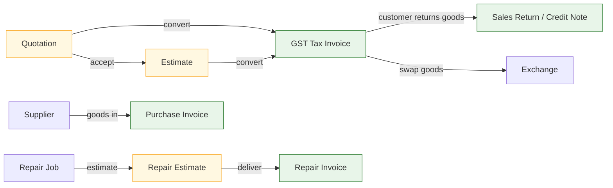
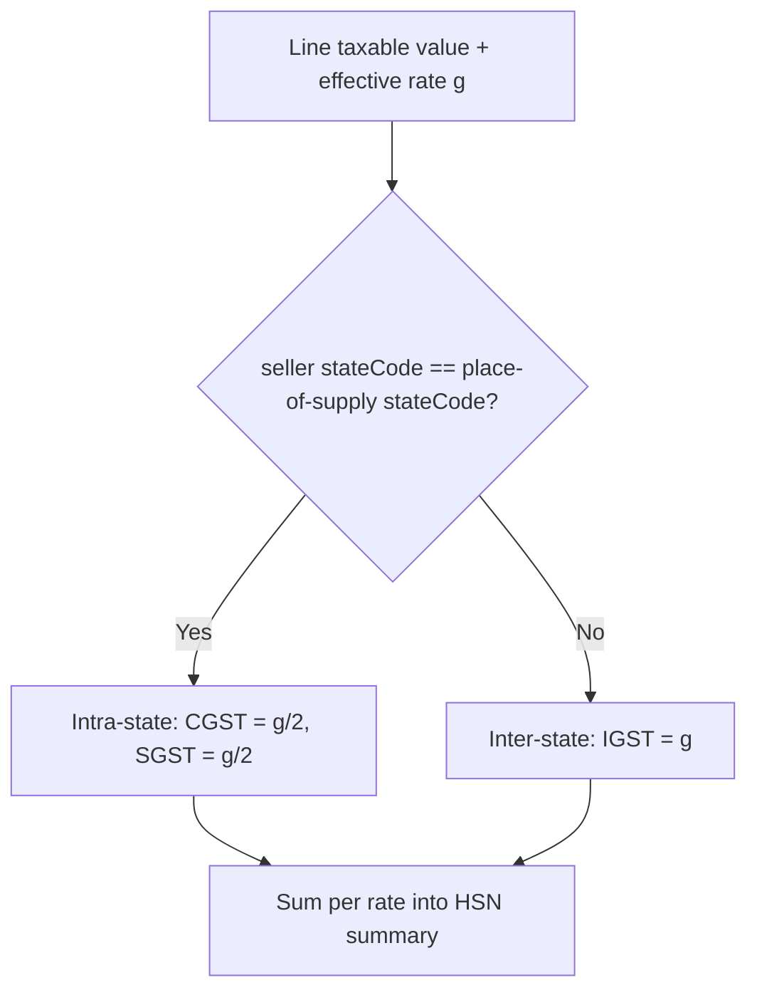
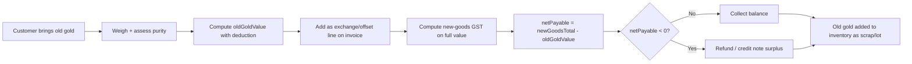
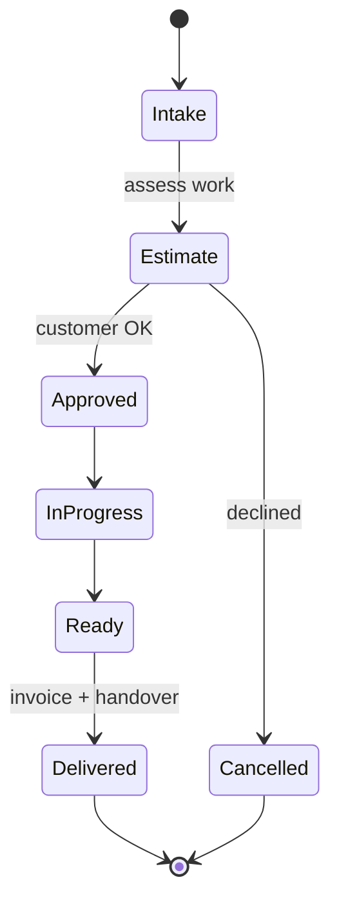
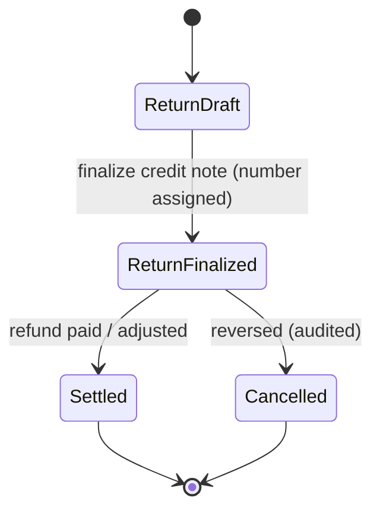
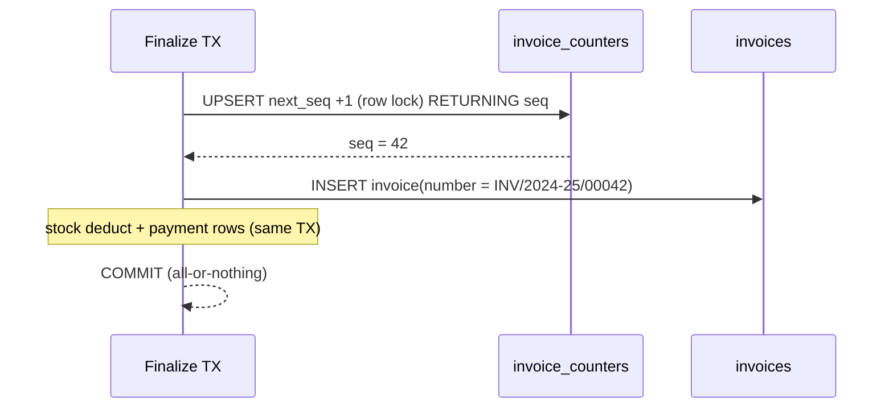
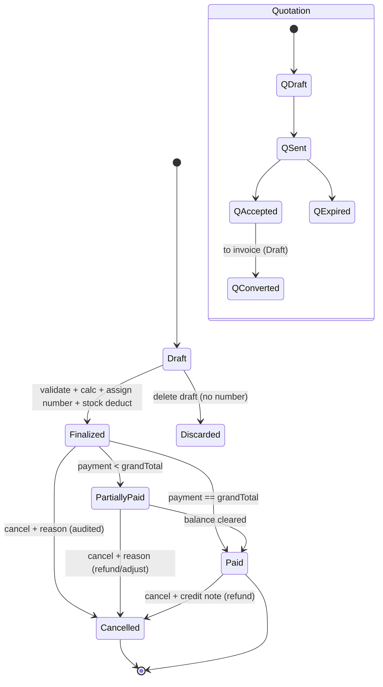
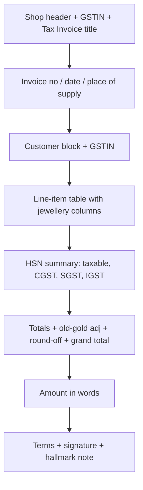
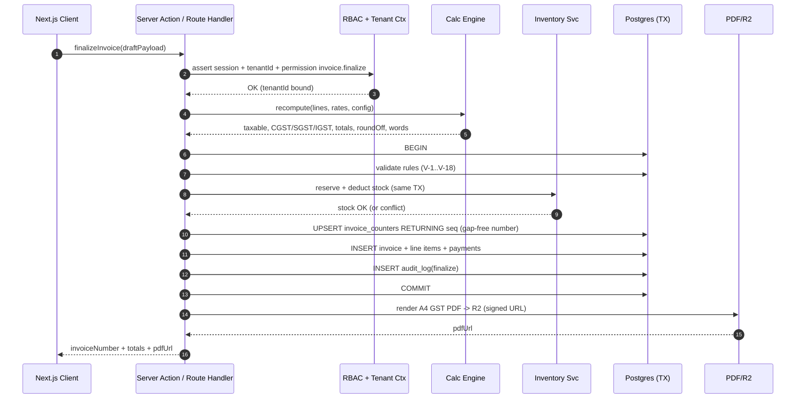

# 09 — Billing Engine

> **Product:** Jewellery ERP SaaS Platform — cloud-native, multi-tenant SaaS for Indian jewellery businesses.
> **Phase:** 1 (Next.js web only).
> **Stack:** Next.js (App Router) + TypeScript · Route Handlers + Server Actions · Prisma ORM · Neon PostgreSQL · Neon Auth · Vercel · Cloudflare R2 · Recharts. Printing = server-side PDF generation (thermal printer support is a future enhancement).
> **Document status:** Production spec · Version 1.0 · Last updated 2026-07-01.
> **Owners:** Billing & Commerce Engineering.

**Sibling documents**
- [01 — Product Requirements](./01-Product-Requirements-Document.md)
- [02 — System Architecture](./02-System-Architecture.md)
- [03 — Database Design](./03-Database-Design.md)
- [04 — Authentication & Security](./04-Authentication-Security.md)
- [05 — Multi-Tenancy](./05-Multi-Tenancy.md)
- [06 — RBAC & Permissions](./06-RBAC-Permissions.md)
- **09 — Billing Engine** *(this document)*
- [10 — Inventory Management](./10-Inventory-Management.md) *(planned)*
- [11 — Invoice Templates & Printing](./11-Invoice-Templates.md) *(planned)*

> **Cross-reference note.** This document references the canonical data model in [03 — Database Design](./03-Database-Design.md), permission checks in [06 — RBAC & Permissions](./06-RBAC-Permissions.md), tenant context in [05 — Multi-Tenancy](./05-Multi-Tenancy.md), stock reservation/deduction semantics in [10 — Inventory Management](./10-Inventory-Management.md), and print layouts in [11 — Invoice Templates & Printing](./11-Invoice-Templates.md). Where a sibling file is marked *(planned)*, the relative path is stable and reserved.

---

## 1. Executive Summary

The Billing Engine is the commercial heart of the platform. It converts a jewellery counter transaction — a 22K gold ring with a solitaire diamond, an old-gold exchange, a repair job, a wholesale purchase — into a **legally compliant, GST-correct, precisely calculated, immutable financial document**. It is the module that a jeweller touches hundreds of times a day, and the one where a rounding error, a wrong CGST/SGST split, or a duplicated invoice number is not a cosmetic bug but a **statutory and financial liability**.

Indian jewellery billing is materially different from generic retail billing. Price is **not** a fixed MRP; it is *computed* at the moment of sale from a **daily metal rate**, adjusted for **purity/fineness** (916 for 22K, 750 for 18K), plus **making charges** (labour) that may be quoted per gram, as a percentage of metal value, or as a flat amount, plus **wastage** (a traditional weight/labour allowance), plus **stone and diamond charges** priced by carat or per piece, plus **hallmarking** and other charges, minus discounts. GST then applies at jewellery-specific rates on HSN **7113**, split into CGST+SGST for intra-state supply or IGST for inter-state supply, determined by comparing the seller's state code with the **place of supply**. Old gold brought in by the customer reduces the net payable and carries its own tax nuances.

This engine encodes those workflows as **deterministic, auditable, testable formulas**. Every monetary value is a fixed-scale `Decimal` (never a float); every weight is `Decimal(12,3)` grams (milligram precision); every rate is `Decimal(14,4)`. Invoice numbers are **gap-free, per-tenant, per-financial-year, per-series, concurrency-safe** sequences generated inside a database transaction. Finalized invoices are **immutable** — corrections happen through cancellation + credit notes, never in-place edits. The engine is configuration-driven so that GST rates, rounding policy, wastage convention, numbering format, and making-charge conventions are **per-tenant settings**, not hard-coded assumptions.

This specification is written to be *implemented directly*: it contains exact formulas, fully worked numeric examples (including a complete 22K-gold-ring-plus-diamond invoice), state machines, validation tables, the create-and-finalize sequence, data-model touchpoints, acceptance criteria, and an extensive edge-case catalogue.

---

## 2. Scope

### 2.1 In Scope
- Supported document types: GST tax invoice, (non-GST) sales invoice / cash memo, purchase invoice, quotation, estimate, sales return / credit note, exchange, and repair billing. Lifecycle, fields, numbering, and print for each.
- Multi-material support: Gold, Silver, Platinum, Diamond, and coloured Gemstones, with a per-material pricing model.
- The **calculation engine**: metal value, wastage (two conventions), making-charge variants, stone/diamond value, hallmark and other charges, line and invoice discounts, taxable value, GST split, rounding, invoice totals, round-off, and amount-in-words (Indian format).
- GST specifics for jewellery: HSN codes, rate configuration (3% goods, making-service nuance), CGST/SGST/IGST determination, GSTIN handling, composition, reverse charge, and TCS (configurable/future).
- Old-gold exchange / purchase from customer and its effect on net payable and tax.
- Invoice numbering strategy (per-tenant, per-FY, per-series, gap-free, concurrency-safe).
- Billing lifecycle state machine, validation rules, cancellation/amendment rules.
- Payments model (modes, partial, advance, balance).
- Printing requirements (A4 GST PDF layout; thermal future) and data model touchpoints.

### 2.2 Out of Scope (covered elsewhere)
- Physical schema, column types, indexes, and Prisma models → [03 — Database Design](./03-Database-Design.md).
- Permission definitions and role→permission matrix → [06 — RBAC & Permissions](./06-RBAC-Permissions.md).
- Tenant resolution / isolation enforcement → [05 — Multi-Tenancy](./05-Multi-Tenancy.md).
- Inventory stock ledger, reservation, and deduction mechanics → [10 — Inventory Management](./10-Inventory-Management.md).
- PDF/HTML template design, branding, and thermal ESC/POS layout → [11 — Invoice Templates & Printing](./11-Invoice-Templates.md).
- **Payment gateway integration** (Razorpay/UPI collect, webhooks, reconciliation) — the engine records payment *rows* but does not initiate online collection in Phase 1.

---

## 3. Assumptions

| # | Assumption |
|---|-----------|
| A1 | Currency is **INR**. All money columns are `Decimal(14,2)`; rates `Decimal(14,4)`; weights `Decimal(12,3)` grams; purity `Decimal(6,3)`. No floating-point arithmetic is ever used for money. |
| A2 | Each tenant is a single **GST-registered (or unregistered) jewellery business** with one primary place of business in Phase 1. Multi-branch / multiple GSTINs is a future enhancement. |
| A3 | The **default jewellery GST model** is **3% (1.5% CGST + 1.5% SGST intra-state, or 3% IGST inter-state)** on the *composite supply* of jewellery under HSN 7113, applied to the full taxable value **including making charges**. The alternative treatment (making charges as a separate 5% service, SAC 9988) is **configurable per tenant** — see §8. The platform ships with the 3%-composite default and flags the setting prominently. This is a business/tax configuration, not a legal opinion; tenants must confirm with their CA. |
| A4 | **Place of supply** for over-the-counter jewellery sale is the **location of the shop** (seller's state), per the GST rule that supply of goods to a walk-in customer is taxed at the point of sale. For delivery/shipping to another state, place of supply is the **delivery state**. Both are supported; the counter default is seller-state. |
| A5 | Financial year is the **Indian FY: 1 April – 31 March**. Invoice series reset at FY boundary. |
| A6 | Rounding for tax and totals follows a **configurable rounding policy** (default: half-up to 2 decimals for component math; final invoice total rounded to the nearest rupee with the delta captured as `round_off`). |
| A7 | All billing operations run **server-side** (Route Handlers / Server Actions) under a verified session and an enforced `tenantId`. The browser never computes the authoritative total; the client preview is advisory and the server recomputes. See [05](./05-Multi-Tenancy.md). |
| A8 | **Neon Auth** provides identity; **RBAC permissions** (`invoice.create`, `invoice.finalize`, `invoice.cancel`, `rate.manage`, etc.) gate every action. See [06](./06-RBAC-Permissions.md). |
| A9 | Metal rates are maintained per tenant per metal per purity per day (`MetalRate`), effective-dated. A finalized invoice **snapshots** the rate used; later rate changes never alter historical invoices. |
| A10 | Weighing is to **3 decimal grams** (milligram). Carat for stones is `Decimal(8,3)`; 1 carat = 0.2 g (used only when converting, never silently). |

---

## 4. Purpose, Features & Business Rules

### 4.1 Purpose
Provide a single, correct, auditable pipeline that turns a jewellery transaction into a finalized financial document with correct pricing, correct tax, immutable numbering, linked payments, inventory effects, and a printable PDF.

### 4.2 Core Features
1. Multi-document-type creation (invoice, quotation, estimate, return, exchange, repair, purchase).
2. Weight-and-rate-based line-item calculation for five material classes.
3. Configurable making-charge, wastage, and GST conventions per tenant.
4. Deterministic calculation engine with server-authoritative recomputation.
5. Old-gold exchange handling with net-payable adjustment.
6. Gap-free, concurrency-safe, per-FY invoice numbering.
7. Immutable finalization with cancellation + credit-note correction path.
8. Partial payments, advances, and multi-mode settlement.
9. A4 GST-compliant PDF with HSN summary and amount-in-words.
10. Full audit trail on every state transition.

### 4.3 Business Rules (normative)
| # | Rule |
|---|---|
| BR-1 | An invoice number is assigned **only at finalization**, never at draft creation. |
| BR-2 | Invoice numbers are **gap-free** within a (tenant, series, FY) sequence. A cancelled invoice retains its number (the gap-free property is about *allocation*, not *voiding*). |
| BR-3 | A **finalized** invoice is immutable. No line item, weight, rate, or total may change. Corrections are made via **cancellation + credit note** or a fresh invoice. |
| BR-4 | The server **recomputes** all totals at finalization from stored inputs and the snapshotted rate; the client-supplied total is never trusted. |
| BR-5 | `net_weight ≤ gross_weight` and `stone_weight ≤ gross_weight` must hold for every line. All weights `> 0` except stone/other weights which may be `0`. |
| BR-6 | A metal line requires an effective `MetalRate` for its (metal, purity) on the invoice date; absence blocks finalization. |
| BR-7 | GST split (CGST+SGST vs IGST) is derived from seller state code vs place-of-supply state code — never entered manually. |
| BR-8 | Stock is **reserved** at finalize-intent and **deducted** on successful finalize, atomically within the same DB transaction as number assignment. See [10](./10-Inventory-Management.md). |
| BR-9 | Old-gold value can reduce net payable but **cannot** make the customer-owed subtotal negative on the new-goods GST base (tax is computed on new goods before the exchange offset). See §9. |
| BR-10 | Every state transition writes an `audit_log` row with actor, tenant, before/after, and reason (reason mandatory for cancellation). |

---

## 5. Supported Document Types

### 5.1 Overview


### 5.2 Per-type detail

**GST Tax Invoice** — the primary sales document for a GST-registered tenant.
- *Purpose:* Legally compliant sale of jewellery/goods with tax.
- *Key fields:* invoice no, date, place of supply, customer (name, GSTIN optional, address, state code), line items (full jewellery fields), taxable value, CGST/SGST/IGST, round-off, grand total, amount in words, payments, HSN summary, shop details + GSTIN.
- *Lifecycle:* draft → finalized → (partially_paid → paid) / cancelled.
- *Numbering:* `<PREFIX>/<FY>/<SEQ>` e.g. `INV/2024-25/00001`.
- *Print:* A4 GST PDF (§14).

**Sales Invoice / Cash Memo (non-GST)** — for unregistered tenants or B2C below-threshold retail without tax breakup.
- *Purpose:* Simple retail bill without CGST/SGST breakup (tax-inclusive or exempt display).
- *Fields:* as above minus tax breakup; may show "inclusive of taxes".
- *Lifecycle / numbering / print:* same machine; series prefix e.g. `CM`.

**Purchase Invoice** — records goods received from a supplier/karigar (wholesale/manufacturing).
- *Purpose:* Inward stock + payable to supplier; input GST capture.
- *Fields:* supplier (name, GSTIN, state), inward line items, supplier GST, our payable, payment terms.
- *Lifecycle:* draft → recorded → paid/partially_paid → cancelled.
- *Numbering:* internal ref `PUR/2024-25/00001` (supplier's own invoice no also stored).
- *Print:* internal voucher / GRN.

**Quotation** — a price offer, non-binding, no tax liability, no inventory effect.
- *Purpose:* Give a customer a price before committing.
- *Fields:* same line-item structure; validity date; no invoice number.
- *Lifecycle:* draft → sent → accepted/expired/rejected → converted (to invoice).
- *Numbering:* `QTN/2024-25/00001` (separate series).
- *Print:* "Quotation — not a tax invoice" PDF.

**Estimate** — near-identical to quotation; often the accepted/refined version used on the shop floor.
- *Purpose:* Working price sheet, e.g. for approval-basis goods sent to customer.
- *Fields:* as quotation; may reference goods-on-approval.
- *Lifecycle:* draft → issued → converted/void.
- *Numbering:* `EST/2024-25/00001`.
- *Print:* "Estimate — not valid for tax" PDF.

**Sales Return / Credit Note** — customer returns previously sold goods.
- *Purpose:* Reverse (fully/partially) a finalized invoice; issue credit / refund.
- *Fields:* reference invoice no, returned lines, reason, credit amount, tax reversal.
- *Lifecycle:* draft → finalized (credit note) → settled (refund/adjustment).
- *Numbering:* `CN/2024-25/00001`.
- *Print:* Credit Note PDF (GST-compliant, references original invoice).

**Exchange** — customer swaps goods (return old item + buy new), commonly with old-gold.
- *Purpose:* Combine a return/old-gold-in with a new sale in one settlement.
- *Fields:* old-item/old-gold valuation lines, new-goods lines, net payable/refund.
- *Lifecycle:* draft → finalized (as invoice + linked credit) → paid.
- *Numbering:* uses invoice series `INV/...` plus linked credit `CN/...`.
- *Print:* GST invoice showing exchange adjustment.

**Repair Billing** — service job on customer's own jewellery.
- *Purpose:* Charge labour + materials for repair/polish/resize.
- *Fields:* job intake (item description, received weight, customer), materials used, labour, estimate → final.
- *Lifecycle:* intake → estimate → in_progress → ready → delivered/invoiced.
- *Numbering:* job `JOB/2024-25/00001`; invoice `RINV/2024-25/00001`.
- *Print:* job card + repair invoice.

### 5.3 Comparison table

| Attribute | GST Invoice | Sales/Cash Memo | Purchase Invoice | Quotation | Estimate | Return / Credit Note | Exchange | Repair Invoice |
|---|---|---|---|---|---|---|---|---|
| Direction | Outward | Outward | Inward | Pre-sale | Pre-sale | Reverse-outward | Outward+reverse | Outward (service) |
| Legally binding | Yes | Yes | Yes | No | No | Yes | Yes | Yes |
| Carries GST | Yes | Inclusive/exempt | Yes (input) | No | No | Yes (reversal) | Yes | Yes |
| Affects inventory | Deduct | Deduct | Add | None | None | Add back | Both | Materials deduct |
| Affects ledger/AR-AP | AR | AR | AP | None | None | AR (credit) | AR net | AR |
| Number series | `INV` | `CM` | `PUR` | `QTN` | `EST` | `CN` | `INV`+`CN` | `RINV`/`JOB` |
| Number assigned at | Finalize | Finalize | Record | Create | Create | Finalize | Finalize | Deliver/finalize |
| Immutable after | Finalize | Finalize | Record | No | No | Finalize | Finalize | Finalize |
| Convertible to | — | — | — | Invoice | Invoice | — | — | — |
| Default print | A4 GST | A4/thermal | Voucher | Quote PDF | Estimate PDF | Credit Note | A4 GST | Job card + invoice |

---

## 6. Metal & Material Support

The engine supports five material classes. Each line item declares a `materialType`, which selects the pricing model.

| Material | Priced by | Rate source | Purity model | Notes |
|---|---|---|---|---|
| **Gold** | Weight × rate-per-gram at purity | Daily `MetalRate` per purity (995/916/750/585…) | Fineness (916=22K, 750=18K, 585=14K, 995=24K) | Making + wastage typical; HSN 7113. |
| **Silver** | Weight × rate-per-gram (per kg quoted, normalized to /g) | Daily `MetalRate` (e.g. 999, 925 sterling) | Fineness (999, 925) | Often lower making; HSN 7113/7114. |
| **Platinum** | Weight × rate-per-gram at purity | Daily `MetalRate` (950 Pt) | Fineness (950, 900) | HSN 7113; PGI hallmark. |
| **Diamond** | Carat × rate-per-carat, or per-piece | `StoneRate` by clarity/colour/size, or manual | 4C (carat, cut, colour, clarity) descriptor | Certification (IGI/GIA) reference stored; HSN 7102 loose / part of 7113 set. |
| **Gemstone (coloured)** | Carat × rate-per-carat, or per-piece | Manual / `StoneRate` | Type + carat | Emerald/ruby/sapphire etc.; HSN 7103. |

### 6.1 Per-material pricing model
- **Metals (Gold/Silver/Platinum):** value derives from **weight adjusted for wastage × purity-specific per-gram rate**, plus making, plus hallmark. Purity is intrinsic to the rate: the tenant maintains a **22K rate**, **18K rate**, etc., OR maintains a **24K/995 fine rate** and the engine derives the purity rate as `fineRate × (purity ÷ 1000)`. Both modes are supported (§7.1) and configurable; the default is **explicit per-purity rates** (matches shop-board pricing).
- **Diamond & Gemstone:** value derives from **carat × per-carat rate** (size/quality dependent) or **flat per-piece** for small melee. Stones are *not* charged metal rate or wastage; they sit as `stone_charges` on the line. A single line item (e.g. a diamond ring) carries **both** a metal component (the gold) and a stone component (the diamond), each priced by its own model, summed into the line total.

---

## 7. Jewellery Line-Item Fields

Each `InvoiceLineItem` (see [03 — Database Design](./03-Database-Design.md)) carries the following jewellery-specific fields. Meaning and role in calculation are given.

| Field | Type | Meaning / role |
|---|---|---|
| `itemName` | text | Descriptive name ("22K Gold Ring with Solitaire"). |
| `hsnCode` | text | HSN for tax + invoice HSN summary (e.g. 7113). |
| `materialType` | enum | GOLD/SILVER/PLATINUM/DIAMOND/GEMSTONE — selects pricing model. |
| `grossWeight` | Decimal(12,3) g | Total weight of the piece including stones. Upper bound for net/stone. |
| `stoneWeight` | Decimal(12,3) g | Weight of stones set in the piece (deducted from gross to get net metal). |
| `netWeight` | Decimal(12,3) g | Chargeable metal weight = `grossWeight − stoneWeight` (before wastage). |
| `purity` | Decimal(6,3) | Fineness in parts-per-thousand: 916 (22K), 750 (18K), 995 (24K). |
| `karat` | text/derived | Human label (22K/18K); derived from purity, shown on print. |
| `metalRatePerGram` | Decimal(14,4) | Snapshotted rate for (metal, purity) on invoice date. |
| `makingChargeType` | enum | PER_GRAM / PERCENT / FLAT — how making is quoted. |
| `makingChargeValue` | Decimal(14,4) | The per-gram amount, percentage, or flat rupee value. |
| `wastageType` | enum | PERCENT_WEIGHT / GRAMS / PERCENT_MAKING / NONE — wastage convention. |
| `wastageValue` | Decimal(14,4) | Wastage percentage or grams. |
| `stoneChargeType` | enum | PER_CARAT / PER_PIECE / FLAT / NONE. |
| `stoneCarat` | Decimal(8,3) | Total carat weight of stones (for per-carat pricing). |
| `stonePieces` | int | Count of stones (for per-piece pricing). |
| `stoneRate` | Decimal(14,4) | Per-carat or per-piece rate. |
| `stoneCharges` | Decimal(14,2) | Computed/entered total stone value for the line. |
| `hallmarkCharges` | Decimal(14,2) | HUID/BIS hallmarking charge (typically flat per piece). |
| `otherCharges` | Decimal(14,2) | Certification, packaging, engraving, etc. |
| `lineDiscountType` | enum | AMOUNT / PERCENT / NONE. |
| `lineDiscountValue` | Decimal(14,4) | Line-level discount input. |
| `taxableValue` | Decimal(14,2) | Line taxable value after discount, before GST (computed). |
| `gstRatePercent` | Decimal(6,3) | Effective GST rate for the line (e.g. 3.000). |
| `cgst` / `sgst` / `igst` | Decimal(14,2) | Computed tax components. |
| `lineTotal` | Decimal(14,2) | Taxable value + line GST (computed). |
| `quantity` | int | Number of identical pieces (weights are per the whole line unless `quantity`-multiplied — default 1). |

> **Invoice-level fields** additionally include: invoice-level discount (`invoiceDiscountType`/`Value`), `roundOff`, `grandTotal`, `amountInWords`, `placeOfSupplyStateCode`, old-gold adjustment total, advance/paid totals, and balance.

---

## 8. Calculation Engine (in depth)

All arithmetic uses fixed-scale `Decimal`. The pipeline is deterministic and applied **per line**, then aggregated. Symbols:

- `NW` = net weight (g), `GW` = gross weight (g), `SW` = stone weight (g)
- `R` = metal rate per gram at purity, `P` = purity (ppt)
- `MC` = making charges, `WV` = wastage value component
- `SC` = stone charges, `HC` = hallmark, `OC` = other charges
- `Dl` = line discount, `Di` = invoice discount (apportioned)

### 8.1 Step 1 — Net metal weight
```
NW = GW − SW
```
Rule: `SW ≥ 0`, `NW > 0`, `NW ≤ GW`.

### 8.2 Step 2 — Purity-adjusted metal rate (two rate modes)
- **Mode A — Explicit per-purity rate (DEFAULT):** `R` is taken directly from the `MetalRate` row for `(metal, purity)`. Example: 22K rate = ₹6,700/g.
- **Mode B — Fine-rate derivation:** tenant stores a 24K/995 fine rate `R_fine`; engine derives `R = R_fine × (P ÷ 1000)`. Example: `R_fine = ₹7,315/g` (995) → 22K(916) `R = 7315 × 916/1000 = ₹6,700.54/g`.

The chosen mode is a tenant setting. The snapshotted `metalRatePerGram` stored on the line is the *resolved* `R`, so downstream math is identical.

### 8.3 Step 3 — Wastage (two conventions — both supported, default = ADD-TO-WEIGHT)

Wastage is a traditional allowance for metal lost in manufacturing / labour. Two industry conventions exist; the engine supports both via `wastageType`, and the **default is Convention 1 (adds to chargeable weight)** because it is the most common retail practice and matches shop tags ("VA 8%").

**Convention 1 — Wastage adds to chargeable weight (default).**
```
chargeableWeight = NW × (1 + wastagePct/100)        # PERCENT_WEIGHT
   or  chargeableWeight = NW + wastageGrams           # GRAMS
metalValue = chargeableWeight × R
wastageValueComponent (WV) = (chargeableWeight − NW) × R   # reported separately for transparency
```
Here `metalValue` already *includes* the wastage-weight's rupee value; `WV` is broken out only for display. To avoid double counting, when Convention 1 is used, the **line total uses `metalValue` (which includes wastage) and does NOT add `WV` again.**

**Convention 2 — Wastage as a percentage on making (labour).**
```
metalValue = NW × R
WV = 0 (no weight uplift)
# wastage instead inflates making, handled in Step 4 via PERCENT_MAKING
```

> **Anti-double-count guard.** The engine's line-total formula (§8.7) adds `metalValue + makingCharges + stoneCharges + hallmark + other`. Wastage is *never* added as an independent term — it is folded into either `metalValue` (Convention 1) or `makingCharges` (Convention 2). This is enforced in code and asserted in tests (§16).

### 8.4 Step 4 — Making charges (three variants)
```
PER_GRAM : MC = chargeableWeightForMaking × makingRatePerGram
           (chargeableWeightForMaking = NW by default; tenant may configure to use
            Convention-1 chargeableWeight — default is NW to avoid compounding)
PERCENT  : MC = metalValue × (makingPct / 100)
FLAT     : MC = makingFlatAmount
```
If `wastageType = PERCENT_MAKING` (Convention 2), apply after base making:
```
MC = MC_base × (1 + wastageOnMakingPct/100)
```

### 8.5 Step 5 — Stone / diamond value
```
PER_CARAT : SC = stoneCarat  × stoneRate
PER_PIECE : SC = stonePieces × stoneRate
FLAT      : SC = stoneChargesFlat
NONE      : SC = 0
```
Stones do not receive metal rate, wastage, or (typically) making. Certification/other stone costs go to `otherCharges`.

### 8.6 Step 6 — Hallmark & other charges
```
HC = hallmarkCharges     # usually flat per piece (e.g. ₹45 HUID)
OC = otherCharges        # certification, packaging, engraving
```

### 8.7 Step 7 — Line gross, discount, taxable value
```
lineGross = metalValue + MC + SC + HC + OC
lineDiscount (Dl):
   AMOUNT  : Dl = lineDiscountValue
   PERCENT : Dl = lineGross × (lineDiscountPct / 100)
   NONE    : Dl = 0
lineTaxable_preInvoiceDisc = lineGross − Dl
```
Invoice-level discount `Di` (if any) is apportioned across lines pro-rata to `lineTaxable_preInvoiceDisc`:
```
Di_line = Di_total × (lineTaxable_preInvoiceDisc / Σ lineTaxable_preInvoiceDisc)
taxableValue (line) = lineTaxable_preInvoiceDisc − Di_line
```

### 8.8 Step 8 — GST computation & split
Determine supply type from state codes:
```
if sellerStateCode == placeOfSupplyStateCode  → INTRA-STATE (CGST + SGST)
else                                          → INTER-STATE (IGST)
```
Apply the line's effective GST rate `g` (default 3.000% for HSN 7113, per A3):
```
lineTax = round2( taxableValue × g/100 )
INTRA : cgst = round2(taxableValue × (g/2)/100); sgst = same; igst = 0
INTER : igst = lineTax; cgst = sgst = 0
lineTotal = taxableValue + lineTax
```
Rounding: each component rounded **half-up to 2 decimals** at the line level, then summed (line-level rounding, not invoice-level, to match GST portal expectations of per-rate tax totals).

### 8.9 Step 9 — Invoice totals, round-off, amount in words
```
subTotalTaxable = Σ taxableValue(line)
totalCGST = Σ cgst ; totalSGST = Σ sgst ; totalIGST = Σ igst
totalTax  = totalCGST + totalSGST + totalIGST
oldGoldAdjustment = Σ oldGoldValue        # see §9 (reduces payable, not the tax base)
grandTotalBeforeRound = subTotalTaxable + totalTax − oldGoldAdjustment
roundOff = round0(grandTotalBeforeRound) − grandTotalBeforeRound   # to nearest rupee
grandTotal = grandTotalBeforeRound + roundOff
balanceDue = grandTotal − advance − paid
amountInWords = toIndianWords(grandTotal)   # e.g. "Rupees Two Lakh Thirty-Four Thousand ... Only"
```

`toIndianWords` uses the **Indian numbering system** (thousand, lakh, crore) and appends "Only"; paise are rendered as "and NN paise" when non-zero.

### 8.10 Worked Example — 22K Gold Ring with Diamond (full invoice)

**Inputs**
- Seller state: Maharashtra (code **27**). Customer walk-in, place of supply **27** → **intra-state (CGST+SGST)**.
- GST config: 3% composite on HSN 7113 (A3 default).
- Metal rate mode: explicit per-purity. 22K (916) rate = **₹6,700.0000/g**.
- Wastage convention: Convention 1 (adds to weight), default.
- Line 1 — 22K Gold Ring with solitaire diamond:
  - Gross weight = **8.500 g**, stone (diamond) weight = **0.500 g** → net = **8.000 g**
  - Purity = 916, karat = 22K
  - Wastage = **8%** (PERCENT_WEIGHT)
  - Making = **₹600/g** (PER_GRAM, on net weight)
  - Diamond = **0.90 ct** @ **₹55,000/ct** (PER_CARAT)
  - Hallmark = **₹45** (flat), Other (certification) = **₹500**
  - Line discount = **₹1,000** (AMOUNT)
- Invoice-level discount = **₹0**.

**Step-by-step (Line 1)**

| Step | Formula | Value |
|---|---|---|
| Net weight | `8.500 − 0.500` | **8.000 g** |
| Chargeable wt (wastage) | `8.000 × (1 + 8/100)` | **8.640 g** |
| Metal value | `8.640 × 6,700.0000` | **₹57,888.00** |
| Wastage value (shown only) | `(8.640 − 8.000) × 6,700` = `0.640 × 6700` | ₹4,288.00 *(already inside metal value)* |
| Making charges | `8.000 × 600` | **₹4,800.00** |
| Stone (diamond) value | `0.90 × 55,000` | **₹49,500.00** |
| Hallmark | flat | **₹45.00** |
| Other (certification) | flat | **₹500.00** |
| Line gross | `57,888.00 + 4,800.00 + 49,500.00 + 45.00 + 500.00` | **₹1,12,733.00** |
| Line discount | AMOUNT | **−₹1,000.00** |
| Taxable value | `1,12,733.00 − 1,000.00` | **₹1,11,733.00** |
| GST @ 3% | `1,11,733.00 × 0.03` | **₹3,351.99** |
| CGST @ 1.5% | `1,11,733.00 × 0.015` | **₹1,675.995 → ₹1,676.00** |
| SGST @ 1.5% | `1,11,733.00 × 0.015` | **₹1,675.995 → ₹1,676.00** |
| Line total | `1,11,733.00 + 1,676.00 + 1,676.00` | **₹1,15,085.00** |

**Invoice totals**

| Item | Value |
|---|---|
| Sub-total (taxable) | ₹1,11,733.00 |
| CGST (1.5%) | ₹1,676.00 |
| SGST (1.5%) | ₹1,676.00 |
| IGST | ₹0.00 |
| Total tax | ₹3,352.00 |
| Old-gold adjustment | ₹0.00 |
| Grand total before round | ₹1,15,085.00 |
| Round off | ₹0.00 |
| **Grand total** | **₹1,15,085.00** |
| Amount in words | *Rupees One Lakh Fifteen Thousand Eighty-Five Only* |

> **Rounding note.** CGST and SGST each computed as `1,111,733 × 0.015 = 1,675.995`, half-up rounds to `1,676.00` each. Because CGST and SGST are computed independently and rounded, their sum (₹3,352.00) is used; the 3%-on-taxable check (`3,351.99`) differs by ₹0.01 due to per-component rounding — the **per-component totals govern** (matches GSTR-1 expectations). This behaviour is a documented, tested invariant (§16).

### 8.11 Second worked example — old-gold exchange (see §9 for numbers)
Cross-referenced in §9.4 to keep exchange math together.

---

## 9. GST Specifics for Jewellery

### 9.1 HSN codes (common)
| HSN | Description | Typical GST |
|---|---|---|
| **7113** | Articles of jewellery of precious metal (gold/silver/platinum) | 3% |
| 7114 | Articles of goldsmiths'/silversmiths' wares | 3% |
| 7108 | Gold (incl. plated), unwrought/semi-manufactured | 3% |
| 7106 | Silver, unwrought/semi-manufactured | 3% |
| 7102 | Diamonds (non-industrial), loose | 0.25% (loose) / part of set 3% |
| 7103 | Precious/semi-precious stones (coloured), loose | 0.25%–3% (config) |
| 9988 (SAC) | Manufacturing services on physical inputs (job work / making) | 5% (service treatment) |
| 9987 (SAC) | Maintenance/repair services | 18% (config; repair labour) |

> The engine stores HSN per line and produces an **HSN summary** on the invoice (grouped by HSN with taxable value and tax). Rates above are **defaults/config**; tenants set effective rates per HSN via `TaxRate` ([03](./03-Database-Design.md)).

### 9.2 Rate model & the making-charge nuance (configurable)
Two treatments exist in practice; the platform makes this a **per-tenant configuration**:
1. **Composite supply (DEFAULT, A3):** jewellery + making is one composite supply; **3%** applies to the entire taxable value (metal + making + wastage + stones + charges). Simple, common at retail.
2. **Split treatment:** metal goods @ **3%** (HSN 7113) and making charges @ **5%** as job-work/manufacturing service (SAC 9988). Used by some businesses/CAs.

The tenant selects the model in Billing Settings. When split is enabled, the engine emits **two tax buckets per line** (goods 3% + making 5%) and the HSN summary reflects both. Default ships as composite-3%. **This is a configuration choice, not tax advice — tenants must confirm with their accountant.**

### 9.3 CGST/SGST/IGST determination

State codes are the 2-digit GST state codes (27=MH, 07=DL, 29=KA, …). Seller state derives from the tenant's registered GSTIN (first two digits); place of supply defaults to seller state for counter sales (A4), or the delivery state for shipped orders.

### 9.4 Old-gold exchange & GST (see also §10)
See §10 for the full workflow; tax summary here: the common retail practice is that **GST is charged on the value of the new goods sold**, and the old-gold taken from an unregistered individual customer is a **purchase of second-hand goods** on which the shop does **not** collect output GST from the customer (it reduces the amount the customer pays). The **taxable value of the new sale is NOT reduced by the old-gold value** — tax is computed on the full new-goods value, then old-gold value is subtracted to arrive at net payable. This is the platform default (BR-9) and is documented as an assumption; margin-scheme / registered-supplier variations are out of scope and future-configurable.

### 9.5 GSTIN handling
- Tenant GSTIN validated by format (15 chars: 2 state + 10 PAN + 1 entity + Z + 1 checksum) and checksum; state code extracted from positions 1–2.
- Customer GSTIN optional (B2C) / captured for B2B (input-credit invoices). Format-validated; when present, printed on invoice.
- Unregistered tenant → non-GST cash memo mode (no tax breakup).

### 9.6 Composition, Reverse Charge, TCS
| Concept | Treatment |
|---|---|
| **Composition scheme** | If tenant is under composition, invoices are **"Bill of Supply"**, no tax collected/shown, note "composition taxable person, not eligible to collect tax". Config flag `taxScheme = COMPOSITION`. |
| **Reverse charge (RCM)** | Flag `reverseCharge` on line/invoice; when set, tax is payable by recipient — invoice marks "Tax payable under RCM", output tax not collected. Applies to specified inward supplies (e.g. old gold from unregistered dealer scenarios per notification — **configurable/off by default**). |
| **TCS** | Tax Collected at Source for high-value cash sales, if applicable, is **configurable and defaulted OFF** (future); when enabled, a `tcsPercent` line is added to the total and reported separately. |

---

## 10. Old Gold Exchange / Purchase from Customer

### 10.1 Purpose
Let a customer pay for new jewellery partly (or wholly) by handing over old gold, or sell old gold outright to the shop.

### 10.2 Valuation of old gold
```
oldGoldValue = oldNetWeight × oldPurityRate × (1 − deductionPct/100)
```
- `oldNetWeight` = weighed old-gold weight minus any stones/solder (g).
- `oldPurityRate` = per-gram rate for the assessed purity (via touchstone/karat-meter), typically at or below the fine rate.
- `deductionPct` = optional refining/melting deduction (e.g. 2–5%), configurable.

### 10.3 Net payable calculation
```
newGoodsTaxable = Σ taxableValue(new lines)
newGoodsTax     = Σ tax(new lines)          # GST on full new-goods value (§9.4)
newGoodsTotal   = newGoodsTaxable + newGoodsTax
netPayable      = newGoodsTotal − oldGoldValue     # may be < previously, but see BR-9
if netPayable < 0 → customer refund / credit note for the surplus old gold
```
GST is on `newGoodsTaxable` (full), never reduced by old gold (BR-9, §9.4).

### 10.4 Worked example — exchange
- New goods total (incl. GST) = **₹1,15,085.00** (from §8.10).
- Old gold: 12.000 g net, assessed 22K, rate ₹6,600/g, refining deduction 2%.
```
oldGoldValue = 12.000 × 6,600 × (1 − 0.02) = 12.000 × 6,600 × 0.98 = ₹77,616.00
netPayable   = 1,15,085.00 − 77,616.00 = ₹37,469.00
```
- Customer pays **₹37,469** (round-off ₹0). GST reported on the full **₹1,11,733** new-goods taxable value; old-gold value is a payment-offset line, not a tax reduction.

### 10.5 Flow

Old gold enters inventory as a scrap/melt lot — see [10 — Inventory Management](./10-Inventory-Management.md).

---

## 11. Repair Billing Workflow

### 11.1 Stages
1. **Intake:** record customer, item description, received gross weight, photos (R2), expected work, promised date → creates `JOB/...` with a **job card** print (weight acknowledgement protects both parties).
2. **Estimate:** materials (metal to be added at rate + making) + labour; customer approval captured.
3. **In progress → Ready:** status transitions; materials consumed from inventory when used.
4. **Delivery / Invoice:** produce **Repair Invoice** (`RINV/...`): labour (SAC 9987, config 18% or as set), plus any material added (metal @ 3%), plus charges; return weight reconciled against intake.

### 11.2 Billing composition
```
repairTotalTaxable = labourCharges + addedMaterialValue + addedMaking + otherCharges − discount
labour GST @ serviceRate (config, default 18% SAC 9987)
material GST @ 3% (HSN 7113)   # split buckets like §9.2 split mode
```
Repair uses the split-tax path by nature (service + optional goods). Weight-in vs weight-out is displayed for trust.

### 11.3 Flow


---

## 12. Returns & Exchange Lifecycle (inventory & accounting effects)

### 12.1 Sales return / credit note
- References an original finalized invoice; select lines/qty to return.
- Produces a **Credit Note** (`CN/...`) reversing taxable value + tax proportionally.
- **Inventory:** returned goods are added back (as original item or as re-sellable/scrap lot) → see [10](./10-Inventory-Management.md).
- **Accounting:** reduces AR / triggers refund; output tax reversed; feeds GSTR-1 credit-note reporting.

### 12.2 Exchange
- Combines an old-gold-in (or old-item return) with a new sale; nets to a single settlement (§10).
- **Inventory:** new goods deducted; old goods/scrap added.
- **Accounting:** new sale AR posted at full value; old-gold offset recorded as purchase/payment; net cash settled.

### 12.3 Lifecycle


---

## 13. Invoice Numbering Strategy

### 13.1 Requirements
- **Per-tenant** isolation (never share sequences across tenants).
- **Per financial year** (Indian FY Apr–Mar) reset.
- **Per series/type** (`INV`, `CM`, `QTN`, `EST`, `CN`, `PUR`, `RINV`, `JOB`).
- **Configurable prefix + format**, default `INV/2024-25/00001`.
- **Gap-free** allocation and **concurrency-safe** under parallel finalizations.

### 13.2 Format
```
<PREFIX>/<FY>/<PADDED_SEQ>
FY = "YYYY-YY" derived from invoice date (Apr–Mar). e.g. 2024-04-05 → "2024-25"
PADDED_SEQ = zero-padded to configured width (default 5): 00001
Example: INV/2024-25/00001
```
Format is a template string per series: `{prefix}/{fy}/{seq:05}` — tenants may customise separators and padding.

### 13.3 Concurrency-safe, gap-free generation
A dedicated counter row per `(tenantId, series, fy)` is incremented **inside the finalize transaction** using an atomic `UPDATE ... RETURNING` (row lock), guaranteeing no two concurrent transactions read the same value:

```sql
-- inside the SAME transaction that finalizes the invoice
INSERT INTO invoice_counters (tenant_id, series, fy, next_seq)
VALUES ($tenant, $series, $fy, 1)
ON CONFLICT (tenant_id, series, fy)
DO UPDATE SET next_seq = invoice_counters.next_seq + 1
RETURNING next_seq;   -- this value becomes the invoice sequence
```
Because the counter update and the invoice insert share one transaction, a rollback (e.g. stock deduction fails) rolls back the number too — but since the number is only *committed* on success, the **committed sequence is gap-free**. (An alternative Postgres `SEQUENCE` per tenant/FY is possible but sequences are non-transactional and can leave gaps on rollback; the counter-row approach is chosen precisely to be gap-free.)



### 13.4 Numbering rules table
| Rule | Detail |
|---|---|
| Assignment time | At finalize only (BR-1). |
| Uniqueness | Unique on `(tenantId, series, fy, seq)` and on full formatted `number`. |
| Reset | New FY starts at 1 for each series. |
| Cancellation | Number retained; invoice marked cancelled (no reuse). |
| Backdating | Restricted; invoice date within open FY; cannot predate an already-issued higher number in the same series (guard). |

---

## 14. Billing Lifecycle State Machine


- Quotation/Estimate convert into a fresh **Draft** invoice (data copied, recomputed, number assigned only at finalize).
- No transition returns from Finalized/Cancelled to Draft (immutability).

---

## 15. Validation Rules

| # | Field / rule | Constraint | When enforced |
|---|---|---|---|
| V-1 | grossWeight | `> 0` | create/finalize |
| V-2 | netWeight | `> 0` and `≤ grossWeight` | create/finalize |
| V-3 | stoneWeight | `≥ 0` and `≤ grossWeight`; `net = gross − stone` | create/finalize |
| V-4 | purity | in allowed set for metal (e.g. gold ∈ {995,916,750,585,375}) | create/finalize |
| V-5 | metalRatePerGram | required & `> 0`; effective rate exists for date | finalize |
| V-6 | makingChargeValue | `≥ 0`; PERCENT ≤ configurable cap; FLAT ≥ 0 | create/finalize |
| V-7 | wastageValue | `≥ 0`; PERCENT within `[0, cap]` | create/finalize |
| V-8 | stone fields | if stoneChargeType≠NONE then carat/pieces & rate required `> 0` | create/finalize |
| V-9 | discount | line/invoice discount cannot exceed pre-discount base (no negative taxable) | create/finalize |
| V-10 | gstRatePercent | matches configured HSN rate; ≥ 0 | finalize |
| V-11 | seller GSTIN | valid 15-char format + checksum when tenant is registered | settings/finalize |
| V-12 | customer GSTIN | valid format when provided | create/finalize |
| V-13 | placeOfSupplyStateCode | valid 2-digit GST state code | finalize |
| V-14 | quantity | integer `≥ 1` | create |
| V-15 | at least one line | invoice must have ≥ 1 line | finalize |
| V-16 | taxable value | `≥ 0` after all discounts | finalize |
| V-17 | payment sum | `≤ grandTotal` (overpay → advance/credit) | payment |
| V-18 | old-gold net weight | `> 0` and `≤` weighed old weight | exchange |

---

## 16. Cancellation, Amendment & Corrections

- **No in-place edit after finalize** (BR-3, immutability).
- **Cancellation** requires permission `invoice.cancel`, a mandatory **reason**, and writes an audit row (BR-10). If the invoice was paid, a **credit note** is issued for the refund/adjustment. If stock was deducted, cancellation **restores stock** (reverse the deduction) within the cancel transaction — see [10](./10-Inventory-Management.md).
- **Amendment approach:** correction = **cancel + reissue** or **credit note + fresh invoice**. GST amendments to a filed invoice are handled via credit/debit notes referencing the original, matching GSTR-1 mechanics.
- **Audit invariants (tested):** wastage never double-counted; per-component tax rounding governs; number gap-free; cancelled numbers not reused.

---

## 17. Payments

| Mode | Notes |
|---|---|
| Cash | Recorded with amount; cash-drawer reconciliation (future). |
| Card | Reference/last-4 stored; gateway out of scope. |
| UPI | VPA/reference stored; collect integration future. |
| Bank transfer | UTR/reference stored. |
| Old-gold adjustment | Non-cash settlement line (§10); reduces balance. |
| Cheque | Number + bank + clearing status (future clearing workflow). |

- **Partial payments:** multiple `Payment` rows per invoice; `balanceDue = grandTotal − Σ paid − advance`; status transitions Finalized → PartiallyPaid → Paid.
- **Advance:** taken before finalize (e.g. on quotation/order), stored against customer and applied on invoice creation.
- **Overpayment:** surplus becomes customer **advance/credit** for future use.
- **Payment gateway implementation is out of scope** (Phase 1 records rows only).

```mermaid
sequenceDiagram
  participant U as Cashier
  participant S as Server Action
  participant DB as Postgres
  U->>S: addPayment(invoiceId, mode, amount)
  S->>S: assert permission + tenant + invoice finalized
  S->>DB: INSERT payment; recompute balance
  DB-->>S: balanceDue
  S->>DB: UPDATE invoice.status (PartiallyPaid/Paid)
  S-->>U: updated invoice + receipt
```

---

## 18. Printing

### 18.1 A4 GST Invoice PDF — required fields
- **Header:** shop name, address, GSTIN, state + code, contact, logo; document title ("Tax Invoice").
- **Meta:** invoice number, date, place of supply, reverse-charge flag, payment terms.
- **Customer:** name, address, state+code, GSTIN (if any).
- **Line table:** #, item name, HSN, metal/karat, gross/net/stone weight, purity, rate/g, making, wastage, stone charges, hallmark, other, discount, taxable value, GST%, amount.
- **HSN summary table:** grouped by HSN — taxable value, CGST/SGST/IGST rate & amount.
- **Totals:** sub-total, CGST, SGST, IGST, old-gold adjustment, round-off, grand total.
- **Amount in words** (Indian format), signature block, terms & conditions, "E.&O.E.", BIS/hallmark note, jurisdiction.

### 18.2 Layout sketch


### 18.3 Template selection & thermal
- Template chosen per tenant/series; layout, branding, and columns are configurable — see [11 — Invoice Templates & Printing](./11-Invoice-Templates.md).
- **Thermal receipt (58/80mm ESC/POS)** is a **future enhancement**; the engine already separates *data* from *layout* so a thermal template can consume the same computed invoice.
- PDF generation is server-side; the file is stored on **Cloudflare R2** with a tenant-prefixed key and served via signed URL.

---

## 19. Create + Finalize Invoice — Sequence Diagram


Failure at any step before COMMIT rolls back the number, stock, and rows together (atomicity → gap-free numbering + no phantom stock movement).

---

## 20. Data Model Touchpoints

Canonical definitions live in [03 — Database Design](./03-Database-Design.md). The engine reads/writes:

| Entity | Role in billing |
|---|---|
| `Invoice` | Header: tenantId, type/series, number, dates, customer, place of supply, totals, tax totals, oldGoldAdjustment, roundOff, status, amountInWords. |
| `InvoiceLineItem` | Per-line jewellery fields (§7) + computed taxable/tax/lineTotal. |
| `Payment` | Mode, amount, reference, timestamp, linked invoice; drives balance/status. |
| `MetalRate` | Per tenant/metal/purity/date effective rate; snapshotted onto lines. |
| `StoneRate` | Optional per-carat/piece stone pricing reference. |
| `HsnCode` | HSN master + default rate mapping. |
| `TaxRate` | Effective GST rate per HSN per tenant (config; composite vs split). |
| `InvoiceCounter` | Per (tenant, series, fy) gap-free sequence. |
| `AuditLog` | Every state transition (finalize/cancel/payment). |
| `Customer` / `Supplier` | Party details, GSTIN, state code, advance/credit balance. |

---

## 21. Acceptance Criteria

**Calculation correctness**
- AC-1: For the §8.10 inputs, engine returns taxable **₹1,11,733.00**, CGST **₹1,676.00**, SGST **₹1,676.00**, grand total **₹1,15,085.00**, words "Rupees One Lakh Fifteen Thousand Eighty-Five Only".
- AC-2: Wastage (Convention 1) is included exactly once (metal value includes it; not re-added). Property test asserts `lineGross == metalValue + MC + SC + HC + OC`.
- AC-3: Intra-state yields CGST+SGST with IGST=0; inter-state yields IGST only; determined solely by state codes.
- AC-4: Per-component tax rounding governs; sum of rounded CGST+SGST equals reported total tax.
- AC-5: Old-gold exchange: GST computed on full new-goods taxable; netPayable = newGoodsTotal − oldGoldValue (§10.4 = ₹37,469.00).
- AC-6: Invoice number is gap-free per (tenant, series, FY) under 100 concurrent finalizations (no duplicates, no gaps).
- AC-7: 100% discount → taxable ₹0, tax ₹0, no negative values, valid finalize.
- AC-8: Finalized invoice is immutable; edit attempts rejected; correction only via credit note/cancel.
- AC-9: Rate absence for (metal, purity, date) blocks finalize with a clear error.
- AC-10: Round-off makes grand total an integer rupee; `|roundOff| < 1`.

**Behavioural**
- AC-11: Cancellation requires reason + permission, restores stock, writes audit.
- AC-12: Partial payments transition status correctly and compute balance exactly.
- AC-13: Composition tenant produces a Bill of Supply with no tax; unregistered tenant produces a cash memo.
- AC-14: Server recomputes and ignores client totals (tamper test: altered client total → server value wins).

---

## 22. Edge Cases

| # | Case | Expected behaviour |
|---|---|---|
| E-1 | Zero making charges | MC=0; line valid; metal + stone only. |
| E-2 | 100% line discount | taxable=0, tax=0; allowed (AC-7); guard prevents negative. |
| E-3 | Discount > base | Rejected (V-9). |
| E-4 | Inter-state B2B with customer GSTIN | IGST applied; customer GSTIN printed. |
| E-5 | Old gold value ≥ new goods total | netPayable ≤ 0 → refund/credit note for surplus; GST still on full new goods (BR-9). |
| E-6 | Rounding: CGST/SGST .995 halves | Half-up each to .00; per-component totals govern (§8.10 note). |
| E-7 | Concurrent finalize (same series) | Counter row lock serialises; gap-free unique numbers (AC-6). |
| E-8 | Cancel after stock deducted | Stock restored in cancel TX; audit reason mandatory. |
| E-9 | Cancel after payment | Credit note issued for refund; number retained. |
| E-10 | Net > gross (bad input) | Rejected (V-2). |
| E-11 | Stone weight = gross (all stone) | net=0 → rejected for a metal line (V-2) unless materialType is pure stone. |
| E-12 | Missing rate for purity on date | Finalize blocked (V-5, AC-9). |
| E-13 | Silver quoted per kg | Normalised to per-gram before calc. |
| E-14 | Fine-rate mode (Mode B) | Purity rate derived; snapshot resolved rate; math identical. |
| E-15 | Split GST mode | Two tax buckets (goods 3% + making 5%); HSN summary reflects both. |
| E-16 | FY boundary (invoice dated 31-Mar vs 01-Apr) | FY derived from date; sequence resets on 01-Apr. |
| E-17 | Backdated invoice | Allowed only within open FY and not below existing max seq (§13.4). |
| E-18 | Overpayment | Surplus recorded as customer advance/credit. |
| E-19 | Quotation expired then converted | Blocked unless re-validated; conversion recomputes at current rates. |
| E-20 | Multi-piece line (quantity>1) | Weights/values applied per configured semantics; totals scale correctly. |
| E-21 | Paise in amount-in-words | Rendered "… and NN paise" only when non-zero. |
| E-22 | Reverse charge invoice | Output tax not collected; "Tax payable under RCM" printed. |

---

## 23. Future Enhancements

- **Gold saving / scheme plans** (monthly instalment plans, chit-style schemes) with maturity redemption into invoices.
- **EMI / instalment sales** and finance-partner integrations.
- **e-Invoicing (IRN/QR)** via IRP for tenants above turnover threshold; auto-generate IRN + signed QR on finalize.
- **e-Way bill** generation for transported goods above value threshold.
- **Multi-branch / multi-GSTIN** per tenant with branch-scoped numbering.
- **Thermal ESC/POS** receipts and label/tag printing (barcode/QR HUID).
- **TCS automation** and TDS handling where applicable.
- **Margin-scheme** support for second-hand gold, and registered-supplier old-gold RCM automation.
- **Payment gateway** (UPI collect, cards) with reconciliation and auto status.
- **Rate feed integration** (live bullion/MCX feeds) for auto MetalRate updates.
- **Multi-currency** for export/NRI sales.

---

## 24. References

- **Internal:** [01 — Product Requirements](./01-Product-Requirements-Document.md) · [02 — System Architecture](./02-System-Architecture.md) · [03 — Database Design](./03-Database-Design.md) · [04 — Authentication & Security](./04-Authentication-Security.md) · [05 — Multi-Tenancy](./05-Multi-Tenancy.md) · [06 — RBAC & Permissions](./06-RBAC-Permissions.md) · [10 — Inventory Management](./10-Inventory-Management.md) *(planned)* · [11 — Invoice Templates & Printing](./11-Invoice-Templates.md) *(planned)*.
- **Statutory / domain (for tenant + CA confirmation, not tax advice):** CGST/SGST/IGST Acts & rules; GST rate notifications for HSN 7113 (jewellery, 3%) and SAC 9988/9987 (making/repair services); GSTIN structure (state code + PAN + checksum); Indian financial year (Apr–Mar); BIS Hallmarking / HUID requirements; GSTR-1 credit/debit note mechanics; e-Invoice (IRN/QR) and e-Way bill frameworks.
- **Engineering:** Prisma `Decimal` for money; Postgres transactional `UPSERT ... RETURNING` for gap-free counters; server-authoritative recomputation pattern.

> **Disclaimer.** GST rates, HSN mappings, RCM/TCS applicability, and old-gold tax treatment in this document are **configurable defaults** for engineering implementation and **must be confirmed by the tenant's chartered accountant**. The platform encodes the mechanism; the tenant owns the tax position.
