# 10 — Inventory Management

> **Product:** Jewellery ERP SaaS Platform — cloud-native, multi-tenant SaaS for Indian jewellery businesses.
> **Phase:** 1 (Next.js web only).
> **Stack:** Next.js (App Router) + TypeScript · Route Handlers + Server Actions · Prisma ORM · Neon PostgreSQL · Neon Auth · Vercel · Cloudflare R2 · Recharts.
> **Document status:** Production spec · Version 1.0 · Last updated 2026-07-01.

**Sibling documents**
- [01 — Product Requirements Document](./01-Product-Requirements-Document.md)
- [02 — System Architecture](./02-System-Architecture.md)
- [03 — Database Design](./03-Database-Design.md)
- [04 — Authentication & Security](./04-Authentication-Security.md)
- [05 — Multi-Tenancy](./05-Multi-Tenancy.md)
- [06 — RBAC & Permissions](./06-RBAC-Permissions.md)
- [07 — UI/UX Design](./07-UI-UX-Design.md)
- [08 — API Design](./08-API-Design.md)
- [09 — Billing, Purchase & Invoicing](./09-Billing-and-Invoicing.md)
- **10 — Inventory Management** *(this document)*
- [11 — Notifications](./11-Notifications.md)

---

## 1. Executive Summary

Inventory is the operational heart of a jewellery business. Unlike conventional retail — where a SKU maps to interchangeable, identical units — jewellery inventory is **weight-based, purity-graded, and frequently unique per physical piece**. A single ring design (a catalogue *product*) may exist as fifty physical pieces, each with a *different actual gross weight*, a *different stone configuration*, a *different HUID hallmark*, and therefore a *different valuation*. At the same time, a shop also stocks **bulk/counter items** — gold chains sold by the gram, silver coins, loose stones — that are tracked purely by aggregate weight and count, not as individually tagged pieces.

This document specifies a dual-model inventory engine that handles both realities:

1. **Catalogue Product** (`products`) — the design/SKU: a template describing category, metal, default purity, default making-charge policy, and imagery.
2. **Inventory Item** (`inventory_items`) — the individual **tagged** physical piece with its own tag/barcode, actual weights, HUID, cost, and a lifecycle state machine.
3. **Bulk (untagged) stock** — aggregate quantity + weight tracked against a product/variant without per-piece identity.

Every quantitative change to stock — purchase receipt, sale, return, adjustment, transfer, melting, old-gold intake — is recorded as an **immutable `stock_movements` ledger row** capturing type, quantity delta, weight delta, reference document, and before/after snapshots. This gives full forensic traceability: the current on-hand position of any item, product, branch, or metal/purity bucket is *derivable and reconcilable* from the movement ledger, and physical stock audits reconcile against it.

Design pillars:

| Pillar | Approach |
| --- | --- |
| Dual model | Catalogue `products` (design) vs `inventory_items` (physical piece); plus bulk-by-weight stock. |
| Weight-first | Every quantity is paired with a weight in grams (`Decimal(12,3)`, milligram precision) per metal + purity. |
| Immutable ledger | `stock_movements` append-only; on-hand = fold over movements; never mutate history. |
| Unique piece identity | Per-tenant unique tag number, barcode/QR, and HUID; scan-driven workflows. |
| Lifecycle integrity | State machine (`created → in_stock → reserved → sold / returned / melted / transferred`) with guarded transitions. |
| Concurrency-safe | Reservations + row locks + serializable movements prevent overselling and double-deduct. |
| Valuation | Cost-basis (weighted-average) for accounting; current-metal-rate for live valuation reports. |
| Multi-location | Stock positioned per branch/location within a tenant; transfers modelled as dispatch → in-transit → receive. |
| Auditability | Cycle-count audit sessions produce signed variance reports that post reconciling adjustments. |

---

## 2. Scope

**In scope**
- The dual inventory model: catalogue product vs individual physical inventory item; tagged (unique) vs untagged (bulk-by-weight) stock.
- Category / subcategory taxonomy, metal type, purity/karat, and collections.
- Full item attribute model including SKU/tag, barcode/QR, HUID, gross/net/stone weights, purity, making charges, stone details, imagery (Cloudflare R2), cost, and status.
- Barcode/QR & HUID generation, format, scanning, and label printing.
- Weight-based inventory accounting (piece count **and** total weight per metal/purity) and valuation.
- Product lifecycle state machine.
- Stock operations: purchase receipt, sale (reserve → deduct), return/exchange, adjustments, inter-branch transfers, old-gold intake.
- The `stock_movements` immutable ledger and movement-type catalogue.
- Physical stock verification / cycle-count audit workflow and variance reconciliation.
- Multi-location stock, reorder levels/low-stock alerts, and aging/dead-stock reporting.
- Valuation methods (weighted-average and current-rate) and their assumptions.
- Concurrency & overselling prevention.
- Brief UI, API, and DB requirements (details cross-linked).

**Out of scope (covered elsewhere)**
- Tax computation, invoice numbering, and the sell/purchase pricing algorithms → [09 — Billing, Purchase & Invoicing](./09-Billing-and-Invoicing.md).
- Physical database schema DDL, indexes, and Prisma migrations → [03 — Database Design](./03-Database-Design.md).
- REST/RPC contracts, pagination, and error envelopes → [08 — API Design](./08-API-Design.md).
- Screen layouts, component library, and interaction design → [07 — UI/UX Design](./07-UI-UX-Design.md).
- Permission definitions and role matrix → [06 — RBAC & Permissions](./06-RBAC-Permissions.md).
- Alert/notification delivery channels → [11 — Notifications](./11-Notifications.md).

---

## 3. Assumptions

1. A **Tenant == a Business** (jewellery firm). All inventory data is tenant-scoped via non-null `tenant_id`. See [05 — Multi-Tenancy](./05-Multi-Tenancy.md).
2. A tenant may operate **one or more branches/locations** (`locations`). Stock is always positioned at exactly one location (except while `in_transit` between locations).
3. **Weights** are stored as `Decimal(12,3)` grams (milligram precision). **Money** is `Decimal(14,2)` INR; **metal rates** are `Decimal(14,4)` INR per gram; **purity** is `Decimal(6,3)` (fractional fineness, e.g. `0.916` for 22K, or stored alongside karat).
4. **Karat ↔ fineness**: 24K = 0.999/1.000, 22K = 0.916, 18K = 0.750, 14K = 0.585, silver 92.5 = 0.925. The system stores both `karat` (display) and `purity_fineness` (compute).
5. **Gross weight = net (metal) weight + stone weight + other weight**. Net metal weight drives metal valuation; stones are valued separately.
6. **HUID** (Hallmark Unique ID) is the 6-character alphanumeric BIS identifier mandatory for hallmarked gold in India; it is unique per physical piece where present.
7. Images are stored in **Cloudflare R2**; the DB holds object keys/URLs only.
8. Current on-hand position is **derivable from the `stock_movements` ledger**; denormalised balances (`stock_balances`) are maintained transactionally as a performance cache and are always reconcilable to the ledger.
9. Sales **reserve** stock at invoice-draft time and **deduct** on finalize; cancellation of a draft releases the reservation. See [09](./09-Billing-and-Invoicing.md).
10. All timestamps are UTC `timestamptz`; display localisation is a presentation concern.
11. Negative on-hand (piece count or weight) is **never permitted** for tagged stock and is guarded for bulk stock.

---

## 4. Purpose & Goals

| Goal | Description |
| --- | --- |
| Accurate physical truth | Know exactly which pieces exist, where, and at what weight/purity at any instant. |
| Weight + count duality | Report stock both as piece count and as total grams per metal/purity, per location. |
| Traceability | Reconstruct the full life of any piece from creation to sale/melt/transfer via the ledger. |
| Loss prevention | Detect shrinkage, weight drift, and dead stock; enforce approvals on adjustments. |
| Billing integration | Provide reservation/deduction primitives that make overselling structurally impossible. |
| Valuation | Produce cost-basis and live-rate valuations for finance and insurance. |
| Compliance | Capture HUID/hallmark data and maintain audit trails for BIS and GST scrutiny. |

---

## 5. Feature Overview

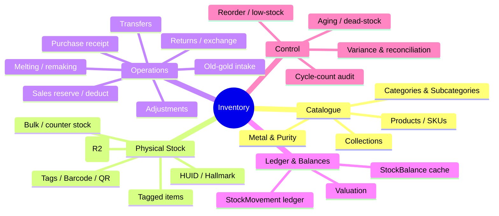

---

## 6. Business Rules

| # | Rule |
| --- | --- |
| BR-1 | Every tagged inventory item belongs to exactly one catalogue product and one location (unless `in_transit`). |
| BR-2 | Tag number, barcode value, and HUID (when present) are **unique per tenant**. |
| BR-3 | `gross_weight ≥ net_weight + stone_weight`; all weights `> 0` for a real piece. |
| BR-4 | A piece may leave `in_stock` only through a valid lifecycle transition (§11), each producing a movement row. |
| BR-5 | On-hand piece count and on-hand weight for any bucket must never go negative. |
| BR-6 | A reserved item cannot be reserved, sold, transferred, or adjusted by another actor until released. |
| BR-7 | Stock adjustments (loss/damage/correction/melt) require a **reason code** and, above configured thresholds, **approval**. |
| BR-8 | Transfers are two-phase: dispatch decrements source, receipt increments destination; in-transit stock belongs to neither location's sellable pool. |
| BR-9 | Melting converts one or more tagged pieces into **scrap weight** stock; the source pieces terminate in state `melted`. |
| BR-10 | Old-gold intake from a customer creates scrap/melting stock (untagged) and never enters the sellable catalogue directly. |
| BR-11 | Cost basis is recorded at receipt; sale valuation uses weighted-average cost; live valuation uses the current metal rate. |
| BR-12 | Every quantitative change writes an immutable `stock_movements` row; the ledger is append-only. |
| BR-13 | Denormalised `stock_balances` must reconcile to the ledger; discrepancies raise an integrity alert. |
| BR-14 | Hallmarked gold items sold at retail must carry a valid HUID (enforced as a warning/block per tenant policy). |

---

## 7. Product vs Inventory Item — the Dual Model

### 7.1 Conceptual distinction

- A **Catalogue Product** (`products`) is a *design template / SKU*. It answers "what kind of thing is this?": a 22K gold *Peacock Jhumka* design, category = Earrings, default purity = 22K, default making-charge policy = 12% of metal value. It carries reference imagery and a nominal/spec weight. It **does not** have its own on-hand weight — it is not a physical object.
- An **Inventory Item** (`inventory_items`) is a *single physical piece* manufactured to (or roughly to) that design. It answers "which exact object, weighing exactly how much?": tag `RNG-000482`, gross 8.412 g, net 7.980 g, stone 0.432 g, HUID `AZ4K9P`, cost ₹58,900, currently `in_stock` at Branch-MG-Road.

One product → many inventory items, each with its **own** actual weight and valuation. This is why jewellery cannot use a flat quantity-only inventory model.

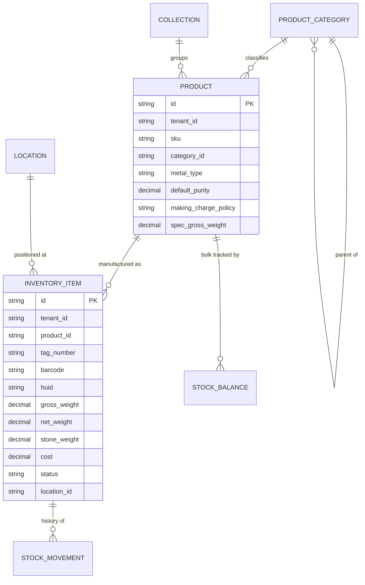

### 7.2 Tagged (unique) vs Untagged (bulk-by-weight) inventory

| Dimension | Tagged (unique piece) | Untagged (bulk / counter) |
| --- | --- | --- |
| Identity | Each piece is a distinct `inventory_items` row with tag/barcode/HUID. | No per-piece identity; tracked as `stock_balances` (qty + weight) against a product/variant + location. |
| Typical items | Rings, necklaces, high-value studded pieces, hallmarked gold. | Loose gold chain sold by gram, silver coins, small findings, low-value silver articles, scrap. |
| Weight | Actual measured weight per piece. | Aggregate weight for the bucket; individual weight not retained. |
| Valuation | Per-piece cost basis. | Weighted-average cost per gram for the bucket. |
| Sale | Scan tag → reserve → deduct one specific piece. | Enter grams sold → deduct from bucket weight (and derived count if applicable). |
| Audit | Scan every tag; compare piece-by-piece + weight. | Weigh the bucket; compare aggregate weight/count. |

Both models feed the **same `stock_movements` ledger**; the difference is whether the movement references a specific `inventory_item_id` (tagged) or a `product_id` + `location_id` bulk bucket (untagged).

---

## 8. Taxonomy — Categories, Metal, Purity, Collections

### 8.1 Category & subcategory tree

`product_categories` is a **self-referencing tree** (parent → children), tenant-scoped, supporting arbitrary depth (typically two levels).

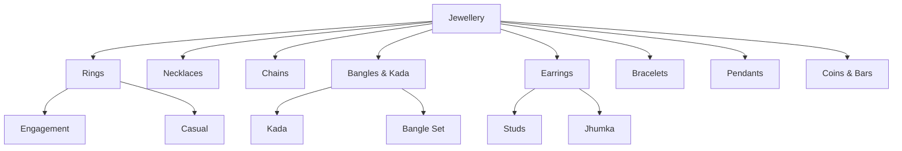

### 8.2 Metal type & purity

| Metal | Common karat/grade | Fineness (`purity_fineness`) |
| --- | --- | --- |
| Gold | 24K | 0.999 |
| Gold | 22K | 0.916 |
| Gold | 18K | 0.750 |
| Gold | 14K | 0.585 |
| Silver | 999 | 0.999 |
| Silver | 925 (Sterling) | 0.925 |
| Platinum | PT950 | 0.950 |
| Palladium | PD950 | 0.950 |

`metal_type` is an enum (`gold`, `silver`, `platinum`, `palladium`, `other`). Purity is stored both as human `karat` label and machine `purity_fineness` decimal for valuation math.

### 8.3 Collections

`collections` are marketing/merchandising groupings orthogonal to the category tree (e.g. "Bridal 2026", "Temple Jewellery", "Daily Wear"). A product may belong to zero or more collections (many-to-many).

---

## 9. Inventory Item Attributes

| Attribute | Type / precision | Notes |
| --- | --- | --- |
| `id` | CUID2 | Primary key. |
| `tenant_id` | CUID2 | Tenant scope (non-null). |
| `product_id` | CUID2 | Parent catalogue product/design. |
| `location_id` | CUID2 | Current location; null while `in_transit`. |
| `tag_number` | string | Human tag/SKU printed on label; **unique per tenant**. |
| `barcode` | string | Encoded value for 1D/2D barcode; **unique per tenant**. |
| `qr_payload` | string | Optional QR content (deep link / signed token). |
| `huid` | string(6) | BIS Hallmark Unique ID; unique per tenant when present. |
| `metal_type` | enum | Denormalised from product for query speed; must match product unless variant. |
| `karat` | string | Display purity (e.g. `22K`). |
| `purity_fineness` | Decimal(6,3) | Fractional fineness for valuation. |
| `gross_weight` | Decimal(12,3) g | Total measured weight. |
| `net_weight` | Decimal(12,3) g | Pure metal-bearing weight (drives metal value). |
| `stone_weight` | Decimal(12,3) g | Combined stone weight. |
| `other_weight` | Decimal(12,3) g | Wax/lac/thread/enamel weight where applicable. |
| `stone_details` | JSON | Array of {type, shape, count, carat, rate, value, certification}. |
| `making_charge_type` | enum | `per_gram` \| `percentage` \| `flat`. |
| `making_charge_value` | Decimal(14,2) | Default making charge (overridable at billing). |
| `wastage_pct` | Decimal(6,3) | Default wastage %, if applicable. |
| `cost` | Decimal(14,2) | Landed cost basis at receipt (metal + making + stones). |
| `supplier_id` | CUID2 | Source supplier (from purchase). |
| `purchase_ref` | CUID2 | Originating purchase document. |
| `hsn_code` | string | GST HSN classification (see [09](./09-Billing-and-Invoicing.md)). |
| `status` | enum | `created` \| `in_stock` \| `reserved` \| `sold` \| `returned` \| `melted` \| `transferred` \| `in_transit`. |
| `image_keys` | string[] | Cloudflare R2 object keys/URLs. |
| `certification` | JSON | Lab certificate refs (IGI/GIA) for studded pieces. |
| `created_at` / `updated_at` | timestamptz | Audit timestamps. |
| `deleted_at` | timestamptz? | Soft delete. |

> Weight invariant enforced at write time: `gross_weight ≥ net_weight + stone_weight + other_weight` (small tolerance configurable per tenant to absorb scale rounding).

---

## 10. Barcode / QR & HUID

### 10.1 Tag number & barcode format

- **Tag number** (human-readable): `<CAT>-<SEQ>` where `CAT` is a 2–3 letter category code and `SEQ` is a zero-padded per-tenant sequence, e.g. `RNG-000482`, `CHN-013900`. Optionally prefixed with a branch code (`MG-RNG-000482`).
- **Barcode value** (machine): a compact, collision-free string. Recommended encoding is a tenant-namespaced token: `<tenant_short>|<item_cuid_shard>` rendered as **Code128** (1D) for label guns, with a parallel **QR** for camera scans carrying a signed deep link (`/app/inventory/items/<id>?sig=…`).
- Barcodes are generated **server-side** at item creation and are immutable for the life of the piece; reprints reuse the same value.

### 10.2 HUID

- HUID is issued by the BIS hallmarking centre, **not generated by us** — we **capture and validate** it: 6-char alphanumeric, uppercase, `[A-Z0-9]{6}`.
- Stored on the item, unique per tenant, surfaced on invoices and labels. For hallmarked gold, tenant policy may block sale of an item lacking a valid HUID.

### 10.3 Scanning workflow

```mermaid
sequenceDiagram
    autonumber
    actor U as Staff
    participant SC as Scanner (kbd-wedge / camera)
    participant UI as Web UI
    participant API as Route Handler
    participant DB as Neon PostgreSQL

    U->>SC: Scan tag barcode / QR
    SC->>UI: Emit decoded value
    UI->>API: GET /inventory/items/resolve?code=...
    API->>DB: SELECT item WHERE tenant_id AND (barcode=? OR tag=? OR huid=?)
    alt found & in_stock
        DB-->>API: item row
        API-->>UI: item detail (+ live valuation)
        UI-->>U: Show piece; enable action (sell / transfer / audit)
    else not found / not sellable
        API-->>UI: 404 / status conflict
        UI-->>U: Error toast (unknown / reserved / sold)
    end
```

### 10.4 Label printing

- Labels are rendered as **print-ready layouts** (dumbbell/butterfly jewellery tags) containing: tag number, barcode (Code128), QR, metal+karat, gross/net weight, HUID, and price/making where policy allows.
- Batch printing supports selecting N items (e.g. a whole purchase receipt) and streaming a print sheet; label templates are tenant-configurable. UI details → [07](./07-UI-UX-Design.md).

---

## 11. Product Lifecycle State Machine

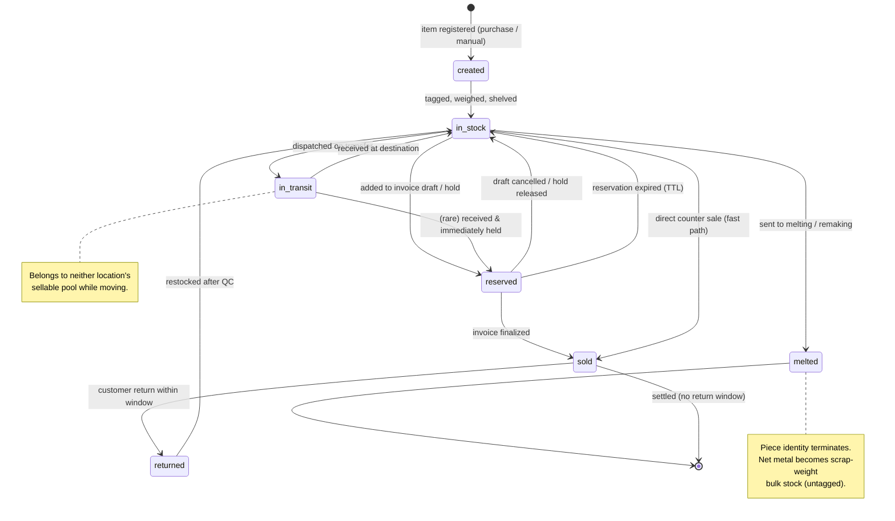

Transition guards (representative):

| From | To | Guard |
| --- | --- | --- |
| `created` | `in_stock` | Weights + tag + location present; passes weight invariant. |
| `in_stock` | `reserved` | No active reservation; actor holds `inventory:reserve`. |
| `reserved` | `sold` | Reservation owned by the finalizing invoice; not expired. |
| `reserved` | `in_stock` | Draft cancelled or TTL expired. |
| `in_stock` | `in_transit` | Transfer dispatched; destination ≠ source. |
| `in_transit` | `in_stock` | Received at destination; weight re-verified within tolerance. |
| `in_stock` | `melted` | Melt adjustment approved; reason recorded. |
| `sold` | `returned` | Within return window; original invoice referenced. |

---

## 12. Stock Operations

Each operation defines: **workflow**, **rules**, **effect on stock**, and **audit** (movement rows written).

### 12.1 Purchase (from supplier) — increases stock

- **Workflow:** Inventory Manager creates/receives a purchase against a supplier (from a purchase invoice, see [09](./09-Billing-and-Invoicing.md)). For each line, either tagged pieces are created (weighed, tag/HUID captured, cost basis set) or bulk weight is added to a bucket.
- **Rules:** received weight is verified against the purchase document within tolerance (BR-3); cost basis = metal value + making + stones; supplier and purchase-ref stamped on each item.
- **Effect:** tagged items enter `created → in_stock`; bulk buckets increment count + weight.
- **Audit:** one `purchase_in` movement per item/bucket with `weight_delta > 0`, `qty_delta > 0`, `ref_type = purchase`.

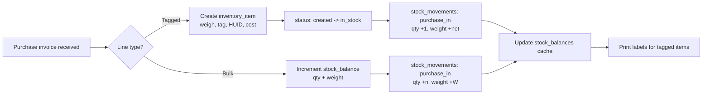

### 12.2 Sales — decreases stock (reserve → deduct)

- **Workflow:** Cashier scans/selects items into an **invoice draft**; each tagged item is **reserved** (soft hold). On **finalize**, reservations convert to deductions; on **cancel/expire**, reservations release.
- **Rules:** an item can be reserved by only one draft; reservations carry a TTL; finalize is transactional with the movement write; overselling is impossible because a specific piece is locked (§16).
- **Effect:** `in_stock → reserved → sold`. Bulk sales deduct grams from the bucket.
- **Audit:** `reservation` movement (advisory, weight neutral to on-hand-sellable), then `sale_out` on finalize with `qty_delta < 0`, `weight_delta < 0`, `ref_type = invoice`.

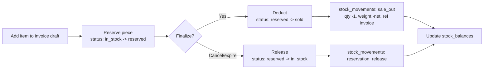

### 12.3 Returns / Exchange — restocks

- **Workflow:** against a finalized invoice, staff selects returned pieces; after QC, the piece is restocked (or routed to repair/melt if damaged). Exchange = return + new sale in one transaction.
- **Rules:** only items sold on the referenced invoice may be returned; within the return window; weight re-verified on intake.
- **Effect:** `sold → returned → in_stock` (or `→ melted` if scrapped). Bulk returns add grams back.
- **Audit:** `sale_return` movement with `qty_delta > 0`, `weight_delta > 0`, `ref_type = credit_note`.

### 12.4 Stock Adjustments — damage, loss, correction, melting/re-making

- **Workflow:** Inventory Manager raises a `stock_adjustments` record selecting item(s)/bucket(s), a **reason code**, and quantity/weight delta. Above thresholds it enters **pending approval** (Manager/Owner) before posting.
- **Reason codes:** `damage`, `loss_theft`, `count_correction`, `weight_correction`, `melt_remake`, `sample_display`, `write_off`.
- **Rules:** on-hand cannot go negative; melt/remake requires approval; every adjustment references supporting notes/images.
- **Effect:** decrements or corrects on-hand; melting terminates piece identity and creates scrap-weight bulk stock (§12.6-analog).
- **Audit:** `adjustment` movement carrying `reason_code`, `approver_id`, `qty_delta`, `weight_delta`.

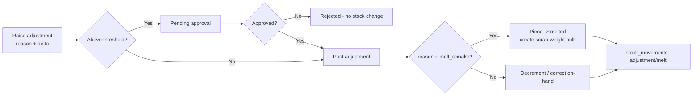

### 12.5 Stock Transfers between branches — dispatch → in-transit → receive

- **Workflow:** source branch creates a `stock_transfers` record listing items; on **dispatch**, source stock is decremented and items move to `in_transit`; a **receiving** actor at the destination scans items to **receive**, incrementing destination stock.
- **Rules:** in-transit stock is not sellable at either end; received weight is re-verified within tolerance; short/over receipts raise a variance requiring resolution.
- **Effect:** `in_stock@source → in_transit → in_stock@dest`.
- **Audit:** `transfer_out` (source, `qty/weight_delta < 0`) at dispatch and `transfer_in` (destination, `> 0`) at receipt, both referencing the transfer id.

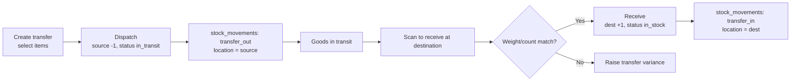

### 12.6 Old-gold intake from customer — scrap / melting stock

- **Workflow:** at exchange/buy-back, staff weighs the customer's old gold, tests/estimates purity, and records intake. This creates **untagged scrap stock** valued at net metal (adjusted for purity and deductions) — never entering the sellable catalogue.
- **Rules:** purity is assessed (touchstone/XRF) and recorded; the intake value feeds the sale/exchange in billing ([09](./09-Billing-and-Invoicing.md)); scrap accumulates in a dedicated melting bucket per metal/purity.
- **Effect:** increments scrap-weight bulk stock; may later be melted/refined and issued to karigars (manufacturing — future module).
- **Audit:** `old_gold_in` movement, `weight_delta > 0`, `ref_type = invoice/exchange`.

---

## 13. StockMovement Ledger

Every quantitative change is an **immutable, append-only** `stock_movements` row. On-hand is a fold over the ledger; the `stock_balances` table is a transactional cache validated against the ledger.

### 13.1 Movement row shape

| Field | Description |
| --- | --- |
| `id` | CUID2 PK. |
| `tenant_id` | Tenant scope. |
| `movement_type` | Enum (see §13.2). |
| `inventory_item_id` | For tagged movements (nullable for bulk). |
| `product_id` / `location_id` | Bulk bucket key / positioning. |
| `metal_type`, `purity_fineness` | Metal bucket for weight accounting. |
| `qty_delta` | Signed piece delta (±). |
| `weight_delta` | Signed grams delta (`Decimal(12,3)`). |
| `qty_before` / `qty_after` | Balance snapshot for the affected bucket. |
| `weight_before` / `weight_after` | Weight snapshot. |
| `unit_cost` | Cost basis applied (for valuation). |
| `ref_type` / `ref_id` | Source document (purchase, invoice, credit_note, transfer, adjustment, audit). |
| `reason_code` | For adjustments. |
| `actor_id` | User who caused the change. |
| `created_at` | UTC timestamp (no updates ever). |

### 13.2 Movement type catalogue

| `movement_type` | Sign | Trigger | Ref |
| --- | --- | --- | --- |
| `opening_balance` | + | Initial stock load / migration | migration |
| `purchase_in` | + | Supplier purchase receipt | purchase |
| `reservation` | 0* | Item held on invoice draft | invoice |
| `reservation_release` | 0* | Draft cancelled / TTL expired | invoice |
| `sale_out` | − | Invoice finalized | invoice |
| `sale_return` | + | Customer return / credit note | credit_note |
| `transfer_out` | − | Dispatch to another branch | transfer |
| `transfer_in` | + | Receipt at destination branch | transfer |
| `adjustment` | ± | Damage/loss/correction | adjustment |
| `melt_out` | − | Piece sent to melting | adjustment |
| `scrap_in` | + | Melt/remake yields scrap weight | adjustment |
| `old_gold_in` | + | Customer old-gold intake | invoice/exchange |
| `audit_correction` | ± | Cycle-count variance posting | audit |

\* Reservation movements adjust *sellable-available* accounting but not physical on-hand; they are recorded for traceability and TTL management.

### 13.3 Deriving on-hand

```
on_hand_qty(bucket)    = Σ qty_delta    over movements for bucket
on_hand_weight(bucket) = Σ weight_delta over movements for bucket
sellable_available     = on_hand_qty − active_reservations
```

`stock_balances` caches these per (tenant, location, product/metal-purity) and is updated inside the same transaction as each movement; a nightly job asserts `cache == fold(ledger)` and alerts on drift (BR-13).

---

## 14. Physical Stock Verification (Cycle Count Audit)

### 14.1 Workflow

1. Manager opens a `stock_audit_sessions` for a scope (location, category, or full).
2. System **snapshots** the expected set (items + weights) at session start.
3. Staff **scan** each physical piece and **weigh** it (or weigh bulk buckets).
4. System compares **system vs physical** on count and weight, flagging: *missing* (expected, not scanned), *unexpected* (scanned, not expected), *weight variance* (beyond tolerance).
5. A **variance report** is produced; Manager/Owner approves posting.
6. Approved variances post `audit_correction` movements to reconcile.

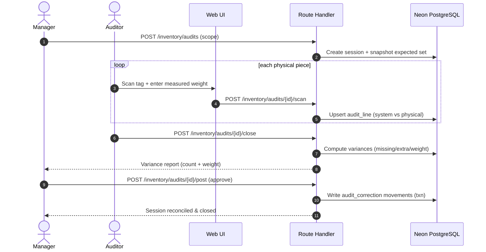

### 14.2 Variance report columns

| Column | Meaning |
| --- | --- |
| Tag / bucket | Item or bulk bucket identifier. |
| System qty / weight | Expected per snapshot. |
| Physical qty / weight | Scanned/weighed. |
| Qty variance | Physical − System (pieces). |
| Weight variance (g) | Physical − System (grams). |
| Within tolerance? | Weight variance ≤ configured tolerance. |
| Disposition | `match` \| `short` \| `excess` \| `weight_drift` \| `resolved`. |

---

## 15. Multi-Location, Reorder & Reporting

### 15.1 Multi-location stock

- Each tenant has one or more `locations` (branches, safes, counters, exhibition stalls). Stock is positioned per location; balances and valuations roll up per location and per tenant.
- `in_transit` stock is tracked against the transfer, not a location's sellable pool.

### 15.2 Reorder levels & low-stock alerts

- Reorder thresholds are configured per **product** (or per category × location) as a **minimum piece count and/or minimum weight**. When on-hand drops below threshold, a low-stock event fires to [11 — Notifications](./11-Notifications.md) for the Inventory Manager/Owner.
- Because jewellery is often unique-piece, thresholds are frequently expressed by **category weight** ("keep ≥ 500 g of 22K chains at MG-Road") rather than per-SKU counts.

### 15.3 Aging & dead-stock report

- Age = `now − in_stock_since`. Buckets: 0–30, 31–90, 91–180, 181–365, 365+ days.
- **Dead stock** = pieces beyond a configurable age with zero sales activity; surfaced with tied-up capital (current-rate valuation) to drive markdowns/melt/rework decisions. Charts via Recharts ([07](./07-UI-UX-Design.md)).

---

## 16. Valuation

### 16.1 Methods

| Method | Use | Formula (per bucket) |
| --- | --- | --- |
| **Weighted-average cost** | Accounting / COGS on sale | `avg_cost = Σ(receipt_cost) / Σ(receipt_weight)`; COGS = `net_weight × avg_cost_per_g + making + stones`. |
| **Current-rate (live)** | Live valuation, insurance, dead-stock capital | `value = net_weight × current_metal_rate(metal,purity) + stone_value + making`. |

### 16.2 Assumptions

- Metal rates are sourced from the **daily metal-rate service** (see [09](./09-Billing-and-Invoicing.md)); current-rate valuation uses the latest effective rate per metal/purity.
- Stones are valued at recorded stone value (from `stone_details`), not re-marked to spot.
- Making charges are included in cost basis but not re-valued at spot.
- Weighted-average is maintained per (tenant, metal, purity) bucket and recomputed on each `purchase_in`/`scrap_in`.
- FIFO/specific-identity valuation is a future option (§18); Phase 1 standardises on weighted-average for accounting and current-rate for live reports.

---

## 17. Concurrency & Overselling Prevention

The core risk is two cashiers selling the **same physical piece**, or a sale racing a transfer/adjustment. Mitigations:

1. **Reservation as a hard hold** — adding a tagged item to a draft transitions it to `reserved`; a second draft attempting the same item fails a uniqueness/status check.
2. **Row-level locking** — finalize/dispatch/adjust selects the item `FOR UPDATE` (via a transactional Prisma `$transaction` with appropriate isolation) so concurrent mutators serialize.
3. **Conditional state transition** — updates are guarded by `WHERE status = <expected>`; a zero-row update means someone else won the race → retry/abort with a clear conflict error.
4. **Movement + balance in one transaction** — the `stock_movements` insert and `stock_balances` update commit atomically; partial deduction is impossible.
5. **Non-negative constraints** — DB check constraints on `qty_after ≥ 0` and `weight_after ≥ 0` are the last line of defence (BR-5).
6. **Reservation TTL** — expired holds auto-release via a scheduled job, preventing indefinite lockup.

```mermaid
sequenceDiagram
    autonumber
    participant C1 as Cashier A (finalize)
    participant C2 as Cashier B (finalize)
    participant DB as Neon (txn)

    C1->>DB: BEGIN; SELECT item FOR UPDATE (reserved by A)
    C2->>DB: BEGIN; SELECT item FOR UPDATE  (blocks)
    C1->>DB: UPDATE ... WHERE status='reserved' AND reserved_by=A
    C1->>DB: INSERT sale_out; UPDATE balance; COMMIT
    DB-->>C2: lock released; row now status='sold'
    C2->>DB: UPDATE ... WHERE status='reserved' -> 0 rows
    C2->>DB: ROLLBACK
    DB-->>C2: Conflict: item already sold
```

---

## 18. UI Requirements (brief)

Details in [07 — UI/UX Design](./07-UI-UX-Design.md).

| Screen | Purpose |
| --- | --- |
| Product catalogue | CRUD designs/SKUs, categories, collections, imagery. |
| Item list / grid | Filter by category, metal, purity, location, status, age; bulk label print. |
| Item detail | Attributes, weights, stones, HUID, image gallery, movement history timeline. |
| Scan console | Fast scan → resolve → act (sell/transfer/audit). |
| Purchase receive | Weigh, tag, set cost, generate labels. |
| Transfer | Create, dispatch, receive with scan + weight verify. |
| Adjustment | Raise with reason code; approval queue. |
| Audit session | Snapshot, scan, variance report, post. |
| Reports | Valuation, aging/dead-stock, low-stock, movement ledger (Recharts). |

---

## 19. API Requirements (brief)

Contracts in [08 — API Design](./08-API-Design.md). Representative endpoints (all tenant-scoped, permission-guarded per [06](./06-RBAC-Permissions.md)):

| Method & path | Purpose |
| --- | --- |
| `GET /inventory/products` · `POST /inventory/products` | Catalogue CRUD. |
| `GET /inventory/items` · `POST /inventory/items` | List / create physical pieces. |
| `GET /inventory/items/resolve?code=` | Scan resolution by tag/barcode/HUID. |
| `POST /inventory/items/{id}/reserve` · `/release` | Reservation lifecycle. |
| `POST /inventory/purchases/{id}/receive` | Purchase receipt → stock in. |
| `POST /inventory/transfers` · `/{id}/dispatch` · `/{id}/receive` | Transfer lifecycle. |
| `POST /inventory/adjustments` · `/{id}/approve` | Adjustments + approval. |
| `POST /inventory/old-gold` | Old-gold intake. |
| `POST /inventory/audits` · `/{id}/scan` · `/{id}/post` | Cycle-count audit. |
| `GET /inventory/valuation` · `/aging` · `/movements` | Reports. |

---

## 20. DB Requirements (brief)

Physical schema, indexes, and constraints in [03 — Database Design](./03-Database-Design.md). Core entities owned by this module:

| Entity | Role |
| --- | --- |
| `products` | Catalogue design/SKU. |
| `product_categories` | Self-referencing category tree. |
| `collections` / `product_collections` | Merchandising groupings (M:N). |
| `inventory_items` | Individual physical tagged pieces + lifecycle status. |
| `stock_balances` | Denormalised on-hand cache per bucket/location. |
| `stock_movements` | Immutable append-only ledger. |
| `stock_adjustments` | Adjustment headers + reason + approval. |
| `stock_transfers` / `stock_transfer_lines` | Inter-branch transfer with two-phase state. |
| `stock_audit_sessions` / `stock_audit_lines` | Cycle-count sessions and variances. |
| `locations` | Branches/counters within a tenant. |

Key constraints: per-tenant uniqueness of `tag_number`, `barcode`, `huid`; check constraints on non-negative balances and the weight invariant; composite indexes leading with `tenant_id` then `(location_id, status)` and `(product_id)`.

---

## 21. Key End-to-End Flows

### 21.1 Receive purchase

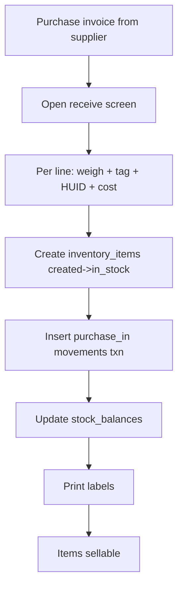

### 21.2 Sell item

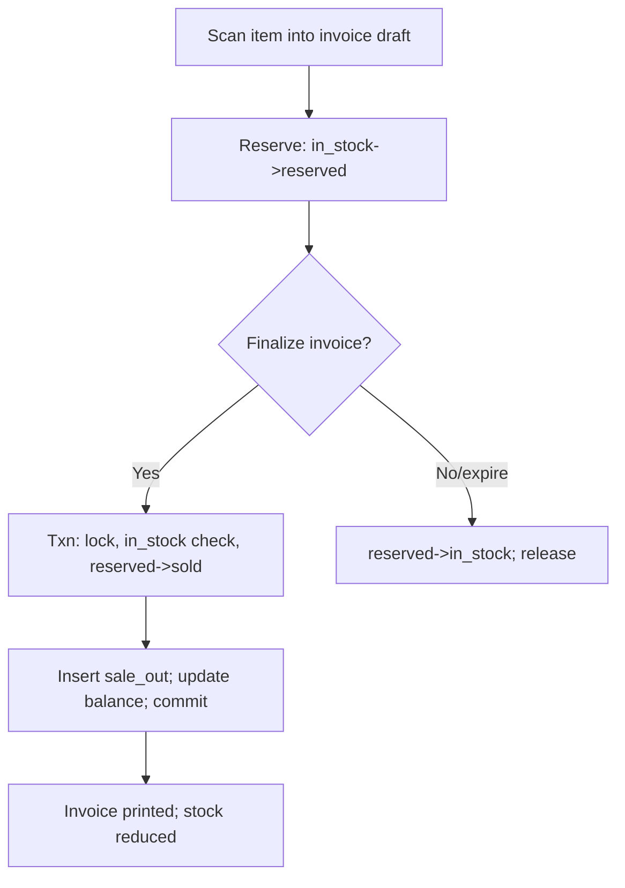

### 21.3 Transfer

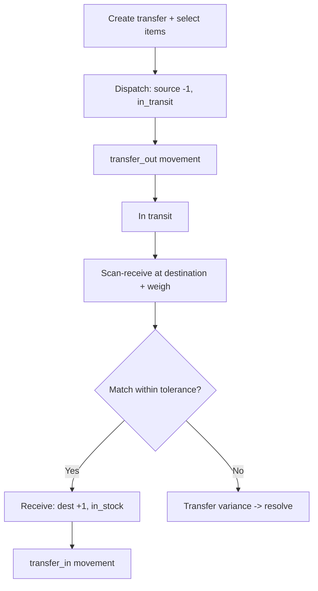

### 21.4 Audit

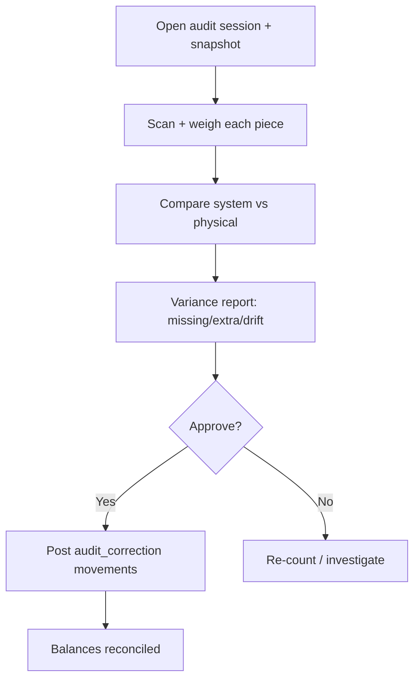

---

## 22. Acceptance Criteria

| # | Criterion |
| --- | --- |
| AC-1 | Creating a product does not create stock; creating an inventory item under it does and writes a `purchase_in`/`opening_balance` movement. |
| AC-2 | Tag number, barcode, and HUID are rejected if they collide with an existing value in the same tenant. |
| AC-3 | Weight invariant (`gross ≥ net + stone + other`) is enforced on create/update within configured tolerance. |
| AC-4 | Adding an item to an invoice draft transitions it to `reserved`; a second draft cannot reserve the same item. |
| AC-5 | Finalizing an invoice deducts exactly the reserved pieces and writes `sale_out` movements atomically with balance updates. |
| AC-6 | Cancelling/expiring a draft returns reserved items to `in_stock` and writes `reservation_release`. |
| AC-7 | On-hand piece count and weight can never be driven negative; the attempt fails with a conflict error. |
| AC-8 | A transfer decrements source on dispatch, marks items `in_transit`, and increments destination only on scan-receive. |
| AC-9 | Melting an item terminates it in `melted` and creates scrap-weight bulk stock equal to net metal (less configured loss). |
| AC-10 | An audit session produces a variance report and, on approval, posts `audit_correction` movements that reconcile balances to physical. |
| AC-11 | `stock_balances` always equals the fold of `stock_movements`; nightly reconciliation detects and alerts on any drift. |
| AC-12 | Low-stock thresholds (count and/or weight) fire a notification when breached. |
| AC-13 | Valuation reports produce both weighted-average cost and current-rate values per location and metal/purity. |
| AC-14 | Every stock-changing operation is attributable to an actor and reference document in the ledger. |

---

## 23. Edge Cases

| # | Case | Expected handling |
| --- | --- | --- |
| E-1 | **Weight mismatch on receive** (measured ≠ purchase doc). | Block if beyond tolerance; require supervisor override with note; record actual measured weight, not the doc weight. |
| E-2 | **Transfer lost in transit** (never received). | Stays `in_transit`; after SLA, flagged as transfer exception; resolved via loss adjustment (`loss_theft`) on the source, not silently restocked. |
| E-3 | **Negative stock attempt** (bulk over-deduct). | Transaction rejected by check constraint; user sees "insufficient stock (X g available)". |
| E-4 | **Reserved item cancellation.** | Draft cancel/expire releases reservation → `in_stock`; no phantom hold remains. |
| E-5 | **Melting converts pieces to scrap.** | Source pieces `→ melted` (identity gone); scrap-weight bulk created; configured melt loss deducted and logged. |
| E-6 | **Duplicate scan** of same tag into one invoice. | Idempotent — second scan is a no-op/warning; cannot reserve an already-reserved-by-self item twice. |
| E-7 | **HUID missing on hallmarked gold sale.** | Per tenant policy: warn or hard-block finalize until HUID captured. |
| E-8 | **Return of an item already re-melted.** | Reject restock of a `melted` piece; process as value-only credit per policy. |
| E-9 | **Concurrent transfer + sale of same piece.** | Row lock serializes; the loser sees a conflict and retries; only one succeeds. |
| E-10 | **Audit finds unexpected (extra) piece.** | Recorded as `excess`; on approval posts positive `audit_correction`; requires reason (untagged found stock). |
| E-11 | **Weight drift within tolerance.** | Not flagged as variance (absorbs scale/rounding); beyond tolerance → `weight_drift` disposition. |
| E-12 | **Bulk bucket rounding** across many small gram sales. | Milligram precision retained; periodic reconciliation catches cumulative drift. |
| E-13 | **Image upload fails to R2.** | Item still created; image marked pending; retryable — DB never blocks on media. |
| E-14 | **Reservation TTL expires mid-checkout.** | Finalize re-validates status; if released, re-reserve or fail with clear message; no double-sell. |
| E-15 | **Soft-deleted product with live items.** | Block product delete while any non-terminal items reference it; require items resolved first. |

---

## 24. Future Enhancements

| Theme | Enhancement |
| --- | --- |
| RFID | RFID-tagged pieces for bulk, hands-free counting and instant tray audits. |
| IoT weighing scale | Direct weight capture from Bluetooth/serial jewellery scales into the receive/audit screens. |
| Image-based search | Visual similarity search ("find pieces like this photo") over R2 imagery via embeddings. |
| Karigar / manufacturing | Issue scrap/metal to karigars, track work-in-progress and yield/wastage back into stock. |
| FIFO / specific-identity valuation | Optional lot-based valuation alongside weighted-average. |
| Barcode-less NFC tags | Tap-to-identify pieces at counter. |
| Demand forecasting | Predict reorder by design/collection using sales velocity. |
| Multi-currency valuation | For export/duty-free branches. |
| Blockchain provenance | Immutable provenance/certification trail for high-value studded pieces. |

---

## 25. References

**Internal**
- [01 — Product Requirements Document](./01-Product-Requirements-Document.md)
- [02 — System Architecture](./02-System-Architecture.md)
- [03 — Database Design](./03-Database-Design.md) — physical schema for inventory entities.
- [06 — RBAC & Permissions](./06-RBAC-Permissions.md) — inventory permission set.
- [07 — UI/UX Design](./07-UI-UX-Design.md) — inventory screens & label printing.
- [08 — API Design](./08-API-Design.md) — inventory endpoints & contracts.
- [09 — Billing, Purchase & Invoicing](./09-Billing-and-Invoicing.md) — reservation/deduction, purchase invoices, metal rates, GST.
- [11 — Notifications](./11-Notifications.md) — low-stock & exception alerts.

**External**
- Bureau of Indian Standards (BIS) — Hallmarking & HUID scheme.
- GST HSN classification for gems & jewellery (Chapter 71).
- Prisma ORM — transactions & `$transaction` isolation.
- Neon PostgreSQL — serverless Postgres, connection pooling.
- Cloudflare R2 — object storage for media.
- Code128 / QR Code symbology specifications (ISO/IEC 15417, ISO/IEC 18004).

---

*End of document — 10 Inventory Management.*
