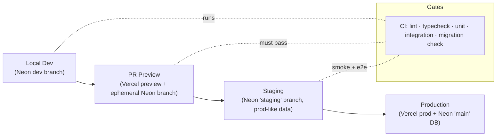
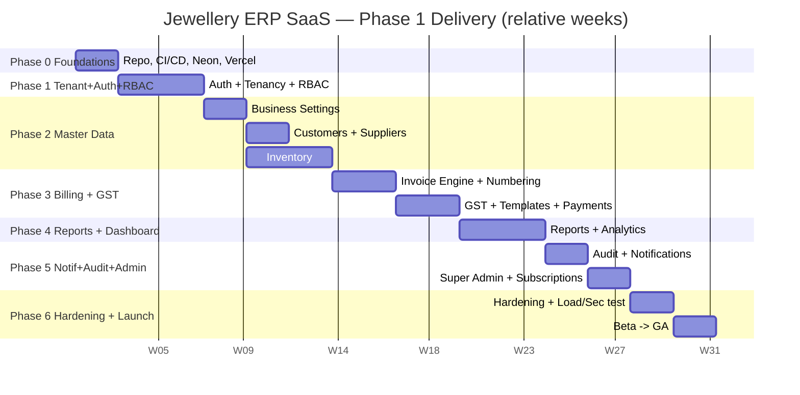
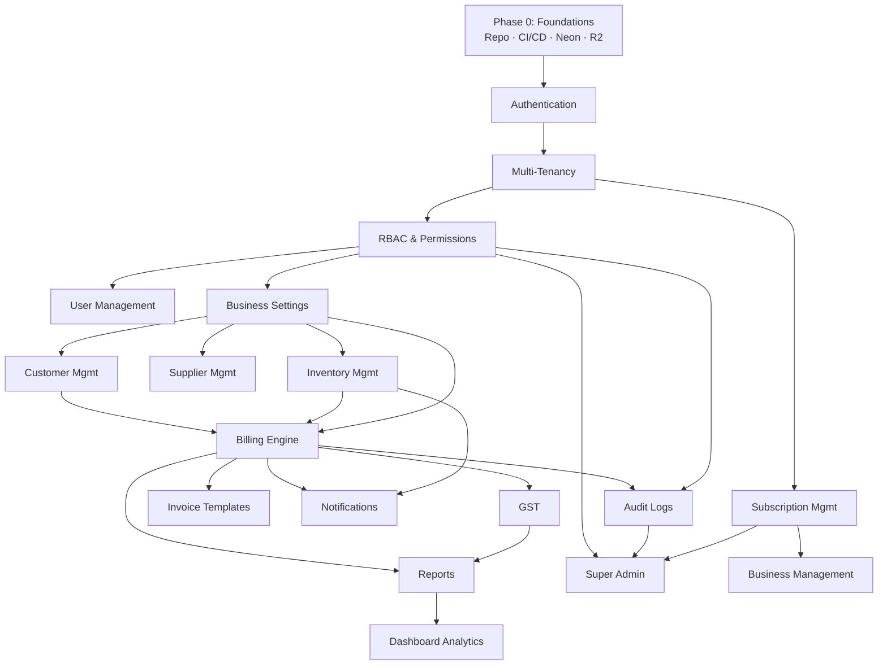
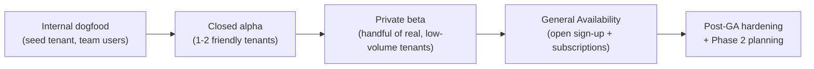

# 11 — Development Roadmap

> **Document status:** Production spec · **Phase:** 1 (Next.js web only) · **Owner:** Engineering Lead / Delivery Management
> **Related docs:** [`01-Product-Requirements-Document.md`](./01-Product-Requirements-Document.md) · [`02-System-Architecture.md`](./02-System-Architecture.md) · [`03-Database-Design.md`](./03-Database-Design.md) · [`04-Authentication-Security.md`](./04-Authentication-Security.md) · [`05-Multi-Tenancy.md`](./05-Multi-Tenancy.md) · [`06-RBAC-Permissions.md`](./06-RBAC-Permissions.md)

---

## 1. Executive Summary

This document is the **delivery plan of record** for building the Jewellery ERP SaaS platform — a multi-tenant SaaS for Indian jewellery businesses, delivered Phase 1 as a **Next.js (App Router) web application** with APIs designed to serve a future Android client.

The roadmap converts the module catalogue defined across the sibling specification documents into an **executable, sequenced, and estimable plan**: phases, milestones, an epic/story backlog, dependency ordering, a risk register, and a launch runbook. It is deliberately opinionated about **sequence**:

1. **Foundations first.** Repo, CI/CD, Neon branches, Prisma baseline, and environment topology are built before any feature, because everything downstream depends on them.
2. **Multi-tenancy and auth are the bedrock.** Tenant isolation ([`05-Multi-Tenancy.md`](./05-Multi-Tenancy.md)), authentication ([`04-Authentication-Security.md`](./04-Authentication-Security.md)), and RBAC ([`06-RBAC-Permissions.md`](./06-RBAC-Permissions.md)) are delivered as the **first vertical slice** and are never retrofitted. A tenant-leak bug found after billing exists is catastrophic; found before, it is cheap.
3. **Ship billing early.** The Billing Engine + GST is the platform's **core value proposition** for a jewellery business. It is sequenced immediately after the master data it consumes (customers, suppliers, inventory), not deferred to the end.
4. **Everything is a thin vertical slice.** Each increment cuts through UI → Server Action / Route Handler → Prisma → DB → tests, gated by tenant scope and RBAC, and is demo-able at sprint review.

The plan spans **seven phases (Phase 0 → Phase 6)** over an assumed **~26-week Phase 1 build**, delivered in **2-week sprints** by a small cross-functional team, targeting a **private beta → GA** rollout. Phase 2+ (Android app, AI, Tally, payment gateway, manufacturing) is explicitly **out of scope for Phase 1** and captured as a forward-looking roadmap in §17.

---

## 2. Scope

**In scope (this document)**

- Guiding delivery principles and the vertical-slice philosophy.
- Delivery methodology: agile cadence, Definition of Ready (DoR), Definition of Done (DoD), and environment topology (dev / preview / staging via Neon branches → prod on Vercel).
- A **phased roadmap** (Phase 0–6) with goals, module scope, deliverables, dependencies, exit criteria, and rough duration per phase, each mapped to sibling specs.
- A **milestone table** (M0–M8) with target outcomes and demo-able increments.
- A **detailed epic/story backlog** per core module with MoSCoW priority, acceptance-criteria pointers, and dependencies.
- A **Mermaid Gantt** chart of phases and a **Mermaid dependency flowchart** of module build order.
- A **risk register** with likelihood, impact, and mitigation.
- Team/role suggestions, estimation approach, and tracking metrics (velocity, DORA).
- Testing & QA milestones, a launch/GA checklist, and the beta → GA rollout plan.
- The **Phase 2+ forward roadmap**.

**Out of scope (covered elsewhere or later)**

- Functional specifications of each module — owned by the respective sibling docs (see §18 References).
- Data model DDL and migration detail → [`03-Database-Design.md`](./03-Database-Design.md).
- Auth/session/RBAC mechanics → [`04-Authentication-Security.md`](./04-Authentication-Security.md), [`06-RBAC-Permissions.md`](./06-RBAC-Permissions.md).
- Phase 2 platforms (Android implementation), AI, Tally integration, payment-gateway implementation, manufacturing — **future** (§17).

---

## 3. Assumptions

1. **Single repository, single deployable.** Web UI and backend (Route Handlers + Server Actions) live in one Next.js repo deployed to Vercel; there is no separate API service in Phase 1.
2. **Multi-tenant from day one.** Every table carries a tenant discriminator and every query is tenant-scoped from the first feature commit, per [`05-Multi-Tenancy.md`](./05-Multi-Tenancy.md).
3. **Stack is fixed.** Next.js App Router + TypeScript, Tailwind, shadcn/ui, React Hook Form, TanStack Query, Zod on the frontend; Prisma over Neon PostgreSQL; Neon Auth for identity; Cloudflare R2 for object storage; Recharts for charts.
4. **Neon branching is the environment primitive.** Preview and staging databases are Neon branches of production; ephemeral preview branches are created per PR.
5. **Team size is small and stable** (see §14) for the whole of Phase 1; estimates assume this steady-state capacity.
6. **No real calendar dates are committed here.** Durations are relative (sprint counts / weeks). A notional start of **Week 1** is assumed for the Gantt.
7. **GST rules target the current Indian regime** for gold/silver jewellery (making charges, HSN 7113, etc.) as specified in the Billing/GST spec; rule changes are treated as configuration, not code.
8. **Beta tenants are real but low-volume**, recruited before GA, with a documented data-reset expectation.

---

## 4. Guiding Principles

| # | Principle | What it means in practice |
|---|---|---|
| P1 | **Thin vertical slices** | Every story delivers UI → action/handler → Prisma → DB → test, not a horizontal layer. "Done" means demo-able. |
| P2 | **Foundation before features** | Tenancy + Auth + RBAC + CI/CD land first; no feature merges until the guard rails exist. |
| P3 | **Ship the core value early** | Billing + GST is sequenced right after its data dependencies, not at the end. |
| P4 | **Deny-by-default, tenant-scoped always** | No endpoint ships without an `authorize()` check and tenant scoping (see [`06-RBAC-Permissions.md`](./06-RBAC-Permissions.md)). |
| P5 | **APIs first, UI second within a slice** | Route Handlers / Server Actions are contract-tested so a future Android client can reuse them. |
| P6 | **Migrations are forward-only and reviewed** | Prisma migrations are code-reviewed, run on a Neon preview branch in CI before prod. |
| P7 | **Small batches, trunk-based** | Short-lived branches, frequent merges to `main`, preview deploy per PR; avoid long-lived divergence. |
| P8 | **Observability & audit from the start** | Structured logs and audit records are added with each mutating feature, not bolted on later. |
| P9 | **Automate the boring, gate the risky** | Lint, typecheck, unit/integration tests, and migration checks are CI gates; releases to prod are deliberate. |

---

## 5. Delivery Methodology

### 5.1 Cadence

- **Framework:** Scrum-flavoured agile, **2-week sprints**.
- **Ceremonies:** Sprint Planning (start), Daily Standup (async-friendly), Backlog Refinement (mid-sprint), Sprint Review/Demo (end), Retrospective (end).
- **Board columns:** `Backlog → Ready → In Progress → In Review → In QA → Done`.
- **Planning unit:** story points via relative sizing (Fibonacci: 1, 2, 3, 5, 8, 13). Stories > 8 points are split.

### 5.2 Definition of Ready (DoR)

A story may enter a sprint only when **all** hold:

1. User story is written as *As a `<role>` I want `<capability>` so that `<value>`*.
2. Acceptance criteria are enumerated and testable (Given/When/Then).
3. The owning module spec exists and is linked; data model impact is known.
4. Tenant-scoping and required RBAC permission(s) are identified.
5. UI/UX reference (wireframe or shadcn pattern) is attached where UI is involved.
6. Dependencies are resolved or explicitly stubbed; the story is independently demo-able.
7. Estimated (pointed) by the team.

### 5.3 Definition of Done (DoD)

A story is Done only when **all** hold:

1. Code merged to `main` behind the appropriate feature/plan flag where relevant.
2. Tenant scope enforced **and** `authorize(permission)` present on every new mutation/sensitive read.
3. Zod validation on all external inputs; typed end-to-end (no `any` escapes).
4. Unit + integration tests written and green in CI; coverage does not regress.
5. Prisma migration reviewed and applied cleanly on a Neon preview branch in CI.
6. Audit + structured logging added for mutations.
7. Accessibility pass on new UI (keyboard, labels, contrast).
8. Demo-able on the PR's preview deployment; product owner accepts at review.
9. Docs/README/spec cross-links updated; no new lint/type errors.

### 5.4 Environments & Promotion

| Environment | Compute | Database | Purpose | Promotion gate |
|---|---|---|---|---|
| **Dev** | Local `next dev` | Neon **dev** branch (per engineer) | Feature development | Local tests + typecheck |
| **Preview** | Vercel preview (per PR) | Ephemeral Neon branch (per PR) | Review & stakeholder demo | Green CI + 1 approval |
| **Staging** | Vercel (staging alias) | Neon **staging** branch | Integration, e2e, UAT, migration dry-run | Smoke + e2e + product sign-off |
| **Production** | Vercel production | Neon **main** DB (pooled) | Live tenants | Release checklist (§15) |

**Neon connection discipline:** all runtime queries go through a **pooled** connection string; migrations use a direct (unpooled) connection. Serverless connection limits are respected via Prisma's pooled adapter and PgBouncer-style pooling (see risk R4, §12).

---

## 6. Phased Roadmap

Seven phases. Durations are **relative** (sprints of 2 weeks). Each phase ends with a demo-able increment and explicit exit criteria.

### Phase 0 — Foundations *(≈1 sprint / 2 weeks)*

| Attribute | Detail |
|---|---|
| **Goals** | Stand up the repo, toolchain, environments, and CI/CD so features can be built safely. |
| **Module scope** | None (platform plumbing). |
| **Key deliverables** | Next.js + TS + Tailwind + shadcn/ui scaffold; ESLint/Prettier/Husky; Prisma init + Neon connection (pooled + direct); Neon branch strategy (dev/staging/main); Vercel projects + preview deploys; CI pipeline (lint, typecheck, test, migrate-check); base layout, error boundaries, env-var management; secret handling; Cloudflare R2 bucket + signed-URL helper stub. |
| **Dependencies** | None. |
| **Exit criteria** | A hello-world tenant-agnostic page deploys through preview → staging; CI blocks a bad migration; `prisma migrate` runs on a Neon branch in CI. |
| **Maps to** | [`02-System-Architecture.md`](./02-System-Architecture.md), [`03-Database-Design.md`](./03-Database-Design.md) |

### Phase 1 — Core Tenant + Auth + RBAC *(≈2 sprints / 4 weeks)*

| Attribute | Detail |
|---|---|
| **Goals** | The security bedrock: a user can sign in, a tenant is resolved, and access is permission-gated. |
| **Module scope** | Authentication, Multi-Tenancy foundation, User Management (invite/assign roles), RBAC engine. |
| **Key deliverables** | Neon Auth integration (sign-up/in/out, session); tenant model + resolver middleware; `authorize(permission)` guard + `<Can>` UI gate; default roles + permission seed; user invite & role assignment; tenant-scoped Prisma client wrapper; base app shell (nav, tenant switcher). |
| **Dependencies** | Phase 0. |
| **Exit criteria** | Two tenants coexist with **zero data bleed** (verified by isolation tests); every route is deny-by-default; owner can invite a user and assign a role that is enforced server-side. |
| **Maps to** | [`04-Authentication-Security.md`](./04-Authentication-Security.md), [`05-Multi-Tenancy.md`](./05-Multi-Tenancy.md), [`06-RBAC-Permissions.md`](./06-RBAC-Permissions.md) |

### Phase 2 — Master Data: Customers / Suppliers / Inventory *(≈3 sprints / 6 weeks)*

| Attribute | Detail |
|---|---|
| **Goals** | Populate the entities billing will consume; establish Business Settings. |
| **Module scope** | Business Settings, Customer Management, Supplier Management, Inventory Management. |
| **Key deliverables** | Business profile & settings (GSTIN, address, branches, metal rate config); Customer CRUD + search + KYC fields; Supplier CRUD + purchase records; Inventory items (metal type, purity, HSN, weight, making-charge config), stock in/out, image upload to R2; list/filter/pagination patterns reused across modules. |
| **Dependencies** | Phase 1 (tenancy + RBAC gate every CRUD). |
| **Exit criteria** | A tenant can configure its business, add customers, suppliers, and inventory items with images; all lists are tenant-scoped and permission-gated; data is ready to be referenced by an invoice. |
| **Maps to** | [`03-Database-Design.md`](./03-Database-Design.md), Business/Customer/Supplier/Inventory specs (07–10 series) |

### Phase 3 — Billing Engine + GST *(≈3 sprints / 6 weeks)* — **Core value**

| Attribute | Detail |
|---|---|
| **Goals** | Create GST-correct invoices from inventory/customers — the platform's primary value. |
| **Module scope** | Billing Engine, GST, Invoice Templates. |
| **Key deliverables** | Invoice builder (line items from inventory, making charges, weight-based pricing, metal rate snapshot); **concurrency-safe invoice numbering** (per-tenant sequence, transactional); GST computation (CGST/SGST/IGST, HSN, making-charge tax treatment); payment capture (cash/adjustment records, no gateway); PDF invoice via templates + R2 storage; invoice list, view, cancel/return flow with audit. |
| **Dependencies** | Phase 2 (customers, inventory, business settings). |
| **Exit criteria** | A cashier creates a GST-correct invoice end-to-end; invoice numbers are gap-free and unique under concurrent creation (load-tested); PDF renders and is retrievable via signed URL. |
| **Maps to** | Billing Engine spec, GST spec, Invoice Templates spec |

### Phase 4 — Reports + Dashboard Analytics *(≈2 sprints / 4 weeks)*

| Attribute | Detail |
|---|---|
| **Goals** | Turn transactional data into operational and financial insight. |
| **Module scope** | Reports, Dashboard Analytics. |
| **Key deliverables** | Sales/GST/inventory/customer reports with date-range + branch filters; CSV/PDF export; dashboard KPIs (today's sales, top items, low stock, GST liability) via Recharts; server-side aggregation queries tuned with indexes. |
| **Dependencies** | Phase 3 (transactional data exists). |
| **Exit criteria** | Owner sees an accurate dashboard and can export a GST-period report reconciling to invoices; all analytics are tenant-scoped and permission-gated. |
| **Maps to** | Reports spec, Dashboard Analytics spec |

### Phase 5 — Notifications + Audit + Super Admin *(≈2 sprints / 4 weeks)*

| Attribute | Detail |
|---|---|
| **Goals** | Platform operations layer: cross-tenant administration, immutable audit, user notifications. |
| **Module scope** | Notifications, Audit Logs, Super Admin Dashboard, Business Management, Subscription Management. |
| **Key deliverables** | Audit log surfacing/search per tenant; Super Admin console (tenant list, plan/subscription state, suspend/activate, **audited impersonation**); Business & Subscription management (plans, feature flags, entitlements); notification framework (in-app + email hooks) for invoices, low-stock, subscription events. |
| **Dependencies** | Phases 1–4 (audit/notification touchpoints exist to instrument). |
| **Exit criteria** | Super Admin manages tenants and subscriptions without reading tenant business data unless impersonating (audited); audit records are immutable and searchable; a low-stock notification fires. |
| **Maps to** | Audit Logs spec, Notifications spec, Super Admin / Business / Subscription specs |

### Phase 6 — Hardening & Launch *(≈2 sprints / 4 weeks)*

| Attribute | Detail |
|---|---|
| **Goals** | Make it production-grade and take it live to beta then GA. |
| **Module scope** | Cross-cutting (security, performance, reliability, docs). |
| **Key deliverables** | Security review (tenant-isolation fuzzing, authz tests, secret audit); performance/load testing (billing concurrency, report queries, Neon connection ceilings); e2e regression suite; error tracking + uptime monitoring; backup/restore drill on Neon; onboarding flow polish; docs & runbooks; beta onboarding then GA. |
| **Dependencies** | All prior phases. |
| **Exit criteria** | GA checklist (§15) fully green; beta tenants live with no P1 defects for 2 weeks; rollback rehearsed. |
| **Maps to** | All specs; launch runbook (this doc §15–16) |

---

## 7. Milestone Table

| Milestone | Name | Phase(s) | Target outcome | Demo-able increment |
|---|---|---|---|---|
| **M0** | Platform baseline | 0 | CI/CD, Neon branches, Vercel deploys live | Hello-world page promoted dev→preview→staging; CI blocks bad migration |
| **M1** | Secure multi-tenant shell | 1 | Auth + tenant resolution + RBAC enforced | Two tenants sign in; owner invites user; access denied without permission |
| **M2** | Business configured | 2a | Business Settings + branches + metal rates | Tenant completes business profile & settings |
| **M3** | Master data complete | 2b | Customers, Suppliers, Inventory usable | Add customer, supplier, and inventory item with image |
| **M4** | First GST invoice | 3a | Invoice builder + GST calc + numbering | Cashier issues a GST-correct invoice; number is unique under load |
| **M5** | Invoice delivery | 3b | PDF templates + payment capture + returns | Download invoice PDF; record payment; process a return |
| **M6** | Insight layer | 4 | Reports + dashboard KPIs | Owner views dashboard and exports a GST-period report |
| **M7** | Ops & admin layer | 5 | Super Admin, Subscriptions, Audit, Notifications | Super Admin suspends a tenant; audit + low-stock notification fire |
| **M8** | GA-ready | 6 | Hardened, load-tested, monitored | GA checklist green; beta tenants live |

---

## 8. Epic / Story Backlog by Module

Priority uses **MoSCoW**: **M**ust, **S**hould, **C**ould, **W**on't-now (Phase 2+). Acceptance criteria (AC) are owned by the linked module spec; the pointer names the spec section to consult.

### 8.1 Authentication

| Epic | Key user stories | Priority | AC pointer | Dependencies |
|---|---|---|---|---|
| Identity & session | Sign up business owner; sign in/out; session refresh; password reset | M | [`04-Authentication-Security.md`](./04-Authentication-Security.md) §Sessions | Phase 0 |
| Account security | Email verification; MFA (TOTP); lockout on brute force | S | 04 §Security controls | Identity |

### 8.2 Multi-Tenancy

| Epic | Key user stories | Priority | AC pointer | Dependencies |
|---|---|---|---|---|
| Tenant resolution | Resolve tenant per request; tenant switcher for multi-tenant users | M | [`05-Multi-Tenancy.md`](./05-Multi-Tenancy.md) §Resolver | Auth |
| Isolation guarantees | All queries tenant-scoped; isolation test harness | M | 05 §Row isolation | Tenant resolution |

### 8.3 User Management

| Epic | Key user stories | Priority | AC pointer | Dependencies |
|---|---|---|---|---|
| User lifecycle | Invite user; accept invite; deactivate/reactivate | M | User Mgmt spec | RBAC, Tenancy |
| Role assignment | Assign/revoke roles; last-owner protection | M | [`06-RBAC-Permissions.md`](./06-RBAC-Permissions.md) §Assignment | RBAC |

### 8.4 RBAC & Permissions

| Epic | Key user stories | Priority | AC pointer | Dependencies |
|---|---|---|---|---|
| Permission engine | `authorize()` guard; `<Can>` UI gate; deny-by-default | M | [`06-RBAC-Permissions.md`](./06-RBAC-Permissions.md) §15 | Tenancy |
| Roles & seed | Seed default roles/permissions; custom tenant roles | M | 06 §Custom roles | Permission engine |

### 8.5 Business Settings

| Epic | Key user stories | Priority | AC pointer | Dependencies |
|---|---|---|---|---|
| Business profile | Set GSTIN, address, logo; manage branches | M | Business Settings spec | Tenancy, RBAC |
| Rate & pricing config | Configure metal rates, making-charge defaults, invoice number format | M | Business Settings spec | Business profile |

### 8.6 Customer Management

| Epic | Key user stories | Priority | AC pointer | Dependencies |
|---|---|---|---|---|
| Customer CRUD | Create/edit/search customers; KYC fields; ledger view | M | Customer spec | Tenancy, RBAC |
| Customer insight | Purchase history; outstanding balance | S | Customer spec | Billing |

### 8.7 Supplier Management

| Epic | Key user stories | Priority | AC pointer | Dependencies |
|---|---|---|---|---|
| Supplier CRUD | Create/edit/search suppliers; contact & GSTIN | M | Supplier spec | Tenancy, RBAC |
| Purchases | Record purchase; link to inventory stock-in | S | Supplier / Inventory spec | Inventory |

### 8.8 Inventory Management

| Epic | Key user stories | Priority | AC pointer | Dependencies |
|---|---|---|---|---|
| Item catalogue | CRUD items (metal, purity, HSN, weight, making charge); images to R2 | M | Inventory spec | Tenancy, RBAC, R2 |
| Stock control | Stock-in/out; adjustments; low-stock threshold | M | Inventory spec | Item catalogue |
| Barcode/label | Generate item labels/barcodes | C | Inventory spec | Item catalogue |

### 8.9 Billing Engine

| Epic | Key user stories | Priority | AC pointer | Dependencies |
|---|---|---|---|---|
| Invoice builder | Add inventory lines; weight/rate pricing; making charges; discounts | M | Billing spec | Inventory, Customer, Settings |
| Numbering | Concurrency-safe per-tenant invoice sequence | M | Billing spec §Numbering | Business Settings |
| Payments & returns | Capture payment (cash/adjustment); cancel/return with audit | M | Billing spec | Invoice builder, Audit |

### 8.10 GST

| Epic | Key user stories | Priority | AC pointer | Dependencies |
|---|---|---|---|---|
| Tax computation | CGST/SGST/IGST by place of supply; HSN 7113; making-charge treatment | M | GST spec | Invoice builder |
| GST reporting | GSTR-ready period summaries; export | S | GST / Reports spec | Reports |

### 8.11 Invoice Templates

| Epic | Key user stories | Priority | AC pointer | Dependencies |
|---|---|---|---|---|
| PDF rendering | Render invoice PDF from template; store to R2; signed-URL retrieval | M | Invoice Templates spec | Billing, R2 |
| Template config | Select/customize template per tenant (logo, terms) | S | Invoice Templates spec | Business Settings |

### 8.12 Reports

| Epic | Key user stories | Priority | AC pointer | Dependencies |
|---|---|---|---|---|
| Operational reports | Sales, inventory, customer, supplier reports with filters | M | Reports spec | Billing, Master data |
| Financial reports | GST liability, day-book, profit summary; CSV/PDF export | M | Reports spec | GST |

### 8.13 Dashboard Analytics

| Epic | Key user stories | Priority | AC pointer | Dependencies |
|---|---|---|---|---|
| KPI dashboard | Today's sales, top items, low stock, GST liability (Recharts) | M | Dashboard spec | Reports |
| Trend analytics | Period-over-period trends | S | Dashboard spec | KPI dashboard |

### 8.14 Notifications

| Epic | Key user stories | Priority | AC pointer | Dependencies |
|---|---|---|---|---|
| Notification framework | In-app + email hooks; per-event dispatch | M | Notifications spec | Auth, Billing, Inventory |
| Event coverage | Invoice created, low-stock, subscription/renewal alerts | S | Notifications spec | Framework |

### 8.15 Audit Logs

| Epic | Key user stories | Priority | AC pointer | Dependencies |
|---|---|---|---|---|
| Audit capture | Immutable audit record per mutation (actor, tenant, action, target) | M | Audit spec | RBAC, all mutations |
| Audit surfacing | Search/filter audit trail per tenant | S | Audit spec | Audit capture |

### 8.16 Super Admin, Business & Subscription Management

| Epic | Key user stories | Priority | AC pointer | Dependencies |
|---|---|---|---|---|
| Tenant administration | List/suspend/activate tenants; audited impersonation | M | Super Admin spec | RBAC, Audit |
| Subscription/plans | Manage plans, entitlements, feature flags; plan-gating enforcement | M | Subscription spec | Tenancy, RBAC |
| Business management | Provision/onboard tenant; lifecycle states | M | Business Mgmt spec | Subscription |

---

## 9. Phase Gantt (Mermaid)

Durations are relative, assuming a Week-1 start. Weeks are approximate; dates are illustrative anchors only.

---

## 10. Module Dependency Graph (Mermaid)

Build order flows top-to-bottom; an arrow means "must exist before".

---

## 11. Estimation Approach

- **Relative sizing, not hours.** Stories are pointed in Fibonacci points during refinement; a shared "reference story" (e.g. Customer CRUD = 5) anchors the scale.
- **Capacity-based sprint commitment.** Commit ≈ rolling 3-sprint average velocity, minus a **20% buffer** for unknowns, support, and reviews.
- **Split rule.** Anything > 8 points is decomposed until each child is ≤ 8 and independently demo-able.
- **Spikes are time-boxed.** Research (e.g. invoice-numbering concurrency, GST edge cases) is a fixed-duration spike producing a decision, not open-ended.
- **Estimates are ranges early, tightened late.** Phase durations in §6 are ±1 sprint until the preceding phase closes.

---

## 12. Risk Register

Likelihood/Impact scale: **L**ow / **M**edium / **H**igh.

| ID | Risk | Likelihood | Impact | Mitigation |
|---|---|---|---|---|
| R1 | **Multi-tenant data leakage** (one tenant reads/writes another's data) | M | H | Tenant-scoped Prisma wrapper enforced centrally; deny-by-default; automated isolation test suite in CI; security fuzzing in Phase 6; code review checklist item. See [`05-Multi-Tenancy.md`](./05-Multi-Tenancy.md). |
| R2 | **GST calculation incorrectness** (wrong CGST/SGST/IGST, making-charge tax) | M | H | GST rules as configurable data; golden-file test suite of worked examples reviewed by a domain/CA advisor; place-of-supply matrix tests; reconcile reports to invoices. |
| R3 | **Invoice numbering race under concurrency** (duplicate/gapped numbers) | M | H | Per-tenant sequence generated inside a DB transaction with row-lock/`SELECT … FOR UPDATE` or a dedicated sequence table; load test in Phase 3 exit criteria; uniqueness constraint as backstop. |
| R4 | **Neon serverless connection limits exhausted** | M | H | Use Neon **pooled** connection string at runtime; Prisma pooled adapter; keep queries short; migrations via direct connection only; load-test connection ceiling in Phase 6. |
| R5 | **Scope creep** (Phase 2+ features pulled into Phase 1) | H | M | MoSCoW discipline; Phase 2+ explicitly future (§17); change-control at backlog refinement; product owner guards the sprint goal. |
| R6 | **Auth/tenancy rework late** because foundations were rushed | L | H | Foundations gated by Phase 1 exit criteria; isolation + authz tests before any feature merges. |
| R7 | **Prisma migration breaks prod** | M | M | Forward-only reviewed migrations; dry-run on Neon staging branch; migration check as CI gate; backup/restore drill (Phase 6). |
| R8 | **R2 file handling / signed-URL leakage** | L | M | Short-lived signed URLs; per-tenant key prefixes; access checked against RBAC before URL issuance. |
| R9 | **Small-team key-person dependency** | M | M | Pairing, shared ownership, documented runbooks; no single-owner critical path. |
| R10 | **Third-party (Neon Auth / Vercel / R2) outage or limit change** | L | M | Abstraction seams around auth/storage; monitoring + alerting; documented degradation behaviour. |
| R11 | **Performance regression on reports/dashboard** at data scale | M | M | Indexed aggregation queries; pagination; load test representative volumes; cache hot KPIs. |
| R12 | **Beta data-loss expectations mismanaged** | L | M | Written beta agreement on data-reset; backups; clear GA cut-over comms. |

---

## 13. Testing & QA Milestones

| QA milestone | Aligned phase | Focus | Gate |
|---|---|---|---|
| QA-0: Test harness up | 0 | Unit + integration runners in CI; test DB via Neon branch | CI green required to merge |
| QA-1: Isolation & authz suite | 1 | Tenant-isolation and deny-by-default tests | Blocks feature work if red |
| QA-2: Master-data e2e | 2 | CRUD flows, validation, image upload | Phase 2 exit |
| QA-3: Billing correctness | 3 | GST golden files; numbering concurrency load test; PDF snapshot | Phase 3 exit |
| QA-4: Reporting accuracy | 4 | Report ↔ invoice reconciliation; export integrity | Phase 4 exit |
| QA-5: Admin/audit/notify | 5 | Impersonation audit; immutable audit; notification dispatch | Phase 5 exit |
| QA-6: Regression + NFR | 6 | Full e2e regression; load/perf; security review; a11y | GA gate |

**Test pyramid:** many unit tests (Zod schemas, pricing/GST calculators, guards), a solid band of integration tests (Server Actions + Prisma against a Neon branch), and a focused set of e2e tests (Playwright) on critical journeys (sign-in, create invoice, export report).

---

## 14. Team, Roles & Tracking Metrics

### 14.1 Suggested team (Phase 1 steady state)

| Role | Count | Primary responsibility |
|---|---|---|
| Engineering Lead / Architect | 1 | Architecture, foundations, review, unblock |
| Full-stack Engineer (Next.js/Prisma) | 2–3 | Feature slices across UI + backend |
| Product Owner | 1 | Backlog, priority, acceptance, domain (jewellery/GST) |
| UI/UX Designer (part-time) | 0.5 | Wireframes, shadcn patterns, a11y |
| QA Engineer | 1 | Test strategy, e2e, release gating |
| DevOps (part-time/shared) | 0.5 | CI/CD, Neon/Vercel, monitoring, backups |
| Domain/GST Advisor (consultant) | ad-hoc | GST correctness sign-off |

### 14.2 Tracking metrics

| Metric | Type | Purpose |
|---|---|---|
| **Velocity** | Agile | Points completed/sprint; trend for forecasting (not a target to game) |
| **Sprint goal hit rate** | Agile | % sprints meeting the committed goal |
| **Deployment Frequency** | DORA | How often we ship to prod |
| **Lead Time for Changes** | DORA | Commit → prod duration |
| **Change Failure Rate** | DORA | % deploys causing a defect/rollback |
| **Mean Time to Restore** | DORA | Time to recover from a failed change |
| **Escaped defects** | Quality | Bugs found post-Done, by module |
| **Test coverage trend** | Quality | Must not regress on merge |
| **Tenant-isolation test pass rate** | Security | Must be 100% at all times |

---

## 15. Launch / GA Checklist

- [ ] All Phase 0–6 exit criteria met; M8 reached.
- [ ] Tenant-isolation suite 100% green; independent security review passed.
- [ ] Billing: invoice numbering load-tested (no dup/gap); GST golden files green; PDF verified.
- [ ] Neon: pooled connections in prod; connection-ceiling load test passed; backup **and restore** rehearsed.
- [ ] Migrations: forward-only, all applied cleanly on staging; rollback/hotfix path documented.
- [ ] Monitoring: error tracking, uptime checks, and log aggregation live with alerts.
- [ ] RBAC: default roles/permissions seeded; plan-gating enforced; Super Admin cannot read tenant data without audited impersonation.
- [ ] Notifications & audit verified end-to-end.
- [ ] Accessibility pass on core journeys; performance budgets met.
- [ ] Onboarding flow tested with a fresh tenant; docs & support runbooks published.
- [ ] Beta tenants ran ≥ 2 weeks with **no open P1** defects.
- [ ] Data-reset / cut-over comms sent to beta tenants; DPA/ToS in place.
- [ ] Go/No-Go sign-off recorded (Eng Lead + Product Owner).

---

## 16. Rollout Plan (Beta → GA)

| Stage | Audience | Entry gate | Success signal | Exit to next |
|---|---|---|---|---|
| Internal dogfood | Team | Phase 3 done | Team creates real invoices without help | Alpha |
| Closed alpha | 1–2 friendly tenants | Phase 4 done | Core journeys usable; feedback captured | Beta |
| Private beta | Few real tenants | Phase 5 done + monitoring | 2 weeks, no P1; positive NPS | GA |
| GA | Open sign-up | §15 checklist green | Self-serve onboarding + billing works | Post-GA |

**Rollout controls:** feature flags and plan-gating allow dark-launching modules; per-tenant enablement lets beta tenants receive features ahead of GA; rollback is a Vercel redeploy of the last good build plus a forward migration hotfix if schema is involved.

---

## 17. Post-Launch / Phase 2+ Roadmap (Future)

> **Explicitly out of scope for Phase 1.** Listed to show the platform's trajectory; the Phase 1 API-first discipline (P5) exists to make these cheaper.

| Theme | Description | Enabled by (Phase 1) |
|---|---|---|
| **Android application** | Native Android client reusing the existing Route Handlers / Server Action-backed APIs | API-first contracts, tenant + RBAC already server-enforced |
| **AI features** | Smart pricing suggestions, demand forecasting, natural-language reports, image-based catalogue tagging | Clean tenant-scoped data model, R2 image store |
| **Tally integration** | Two-way sync of vouchers/ledgers with Tally | Stable accounting/audit data model |
| **Payment gateway** | Online payments (UPI/cards) and reconciliation | Payment capture abstraction in Billing |
| **Manufacturing / karigar module** | Job-work, wastage, order-to-finished-goods tracking | Inventory + supplier foundations |
| **Advanced multi-branch & franchise** | Cross-branch stock transfer, consolidated reporting | Branch-aware settings & reports |
| **E-invoicing / e-way bill** | Government e-invoice (IRN) and e-way bill generation | GST engine + HSN data |

---

## 18. Acceptance Criteria (for this Roadmap Document)

1. **Phase completeness:** every phase (0–6) defines goals, module scope, deliverables, dependencies, exit criteria, and a rough duration, and maps to at least one sibling spec.
2. **Module coverage:** every core module from the shared context appears in the §8 backlog with an epic, key stories, MoSCoW priority, an AC pointer, and dependencies.
3. **Sequencing correctness:** the dependency graph (§10) and Gantt (§9) place tenancy+auth+RBAC before features and billing after its master-data dependencies; billing is not deferred to the end.
4. **Milestones are demo-able:** each M0–M8 names a concrete, demo-able increment.
5. **Risks are actionable:** the risk register covers tenant leakage, GST correctness, invoice-numbering concurrency, and Neon connection limits, each with a mitigation.
6. **Diagrams render:** all Mermaid blocks (Gantt, two flowcharts, environment flow, rollout flow) are syntactically valid.
7. **Methodology defined:** DoR, DoD, sprint cadence, and the dev/preview/staging(Neon branch)→prod(Vercel) topology are specified.
8. **Metrics defined:** velocity and the four DORA metrics are named with their purpose.
9. **Launch readiness:** a GA checklist and a beta→GA rollout plan exist.
10. **Future clarity:** Phase 2+ items (Android, AI, Tally, payment gateway, manufacturing) are present and clearly marked future/out-of-scope.
11. **Cross-linking:** sibling docs are referenced by relative path.

---

## 19. Future Enhancements (to this Roadmap Practice)

| Theme | Description |
|---|---|
| **Automated release notes** | Generate per-sprint changelog from merged PRs/labels. |
| **Progressive delivery** | Canary/percentage rollouts per tenant beyond simple feature flags. |
| **Capacity forecasting** | Data-driven forecast from historical velocity to project GA date ranges. |
| **SLOs & error budgets** | Define availability/latency SLOs post-GA and gate releases on error budget. |
| **Roadmap-as-data** | Keep the backlog/roadmap in the tracker and generate this doc's tables automatically. |

---

## 20. References

- [`01-Product-Requirements-Document.md`](./01-Product-Requirements-Document.md) — product scope, personas, module requirements.
- [`02-System-Architecture.md`](./02-System-Architecture.md) — system topology, single-repo Next.js + Route Handlers/Server Actions, Vercel/Neon/R2.
- [`03-Database-Design.md`](./03-Database-Design.md) — Prisma schema, tenant discriminator, migrations.
- [`04-Authentication-Security.md`](./04-Authentication-Security.md) — Neon Auth, sessions, security controls.
- [`05-Multi-Tenancy.md`](./05-Multi-Tenancy.md) — tenant resolution, row isolation, plan entitlements.
- [`06-RBAC-Permissions.md`](./06-RBAC-Permissions.md) — permission model, `authorize()` guard, seed roles.
- Downstream module specs (Business, Customer, Supplier, Inventory, Billing, GST, Invoice Templates, Reports, Dashboard, Notifications, Audit, Super Admin, Subscription) — owners of per-module acceptance criteria referenced in §8.
- Scrum Guide — sprint cadence, roles, ceremonies.
- DORA / *Accelerate* — Deployment Frequency, Lead Time, Change Failure Rate, MTTR.
- Neon documentation — database branching, connection pooling, serverless limits.
- Vercel documentation — preview deployments, environment promotion.
